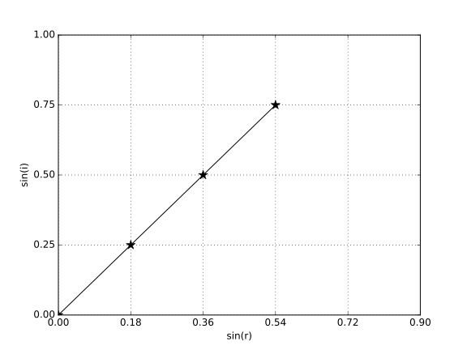

# Problemes Unitat 1: Imatges

## Velocitat de la llum

1. La matinada del 24 de febrer de 1987, l'astrònom canadenc lan Shelton va descobrir en el Gran Núvol de Magallanes —una galàxia satèl·lit de la nostra— el primer estel supernova visible sense ajut òptic des de l'època de Kepler. Era a 170000 anys llum de nosaltres. Expressa aquesta distància en quilòmetres. Quant ha tardat a arribar fins a nosaltres la llum d’aquesta supernova?
 <a href="sol/prob101.pdf">Solució</a> 

2. Els mòduls espacials que van posar-se damunt la superfície de Mart van enviar les imatges per mitjà de les ones electromagnètiques. Quin hagués estat el temps mínim de reacció del robot que es desplaçava sobre la superfície de Mart, si el seu control s'hagués fet des de la Terra que es trobava a 250 milions de km?
     <a href="sol/prob102.pdf">Solució</a> 

    ## Reflexió i refracció de la llum

3. Calcula la velocitat de la llum vermella a l'interior d'un prisma òptic, sabent que l'índex de refracció per a aquest color és d'1,44. Calcula l'índex de refracció del color violeta del mateix prisma, sabent que la seva llum viatja en el prisma a 188.800 km/s.
 <a href="sol/prob103.pdf">Solució</a> 

4. Un raig de llum que prové de l'aire penetra en un medi amb un angle d'incidència de $$45^{\circ}$$. El raig refractat forma amb la normal un angle de $$30^{\circ}$$. Quin és l'index de refracció d'aquest medi? Amb quina velocitat s'hi propaga la llum en aquest medi? Dada: $$c=3\times10^{8}\,\mathrm{m/s}$$.
 <a href="sol/prob104.pdf">Solució</a> 

5. En una experiència de laboratori fem incidir un raig de llum vermella amb diferents angles d’incidència, i, sobre una làmina de vidre; mesurem els corresponents angles de refracció, r, i n’obtenim la gràfica adjunta. Quant val l’índex de refracció del vidre per a la llum vermella? A quina velocitat es propaga la llum vermella en aquest vidre? Dada: velocitat de la llum en l'aire $$c=3\times10^{8}\,\mathrm{m/s}$$.
    
     <a href="sol/prob105.pdf">Solució</a> 

6. L'índex de refracció de l'aigua respecte al buit es de 4/3.
    1. Quina és la velocitat de la llum en l'aigua?
    2. Quin és l'angle límit per a l'aigua?
     <a href="sol/prob106.pdf">Solució</a> 

7. Els índexs de refracció de l'aigua i d'un vidre són 1,33 i 1,54 respectivament. Calcula l'angle límit entre el vidre i l'aigua.
 <a href="sol/prob107.pdf">Solució</a> 

8. Un raig de llum viatja des d’un medi d’índex de refracció 1,2 a un altre d’índex de refracció 1,6. El raig incident fa un angle de 37° amb la direcció perpendicular a la superfície de separació dels dos medis. Quant val l’angle de refracció? Hi ha algun angle d’incidència a partir del qual es produeixi el fenomen de la reflexió total?
    
    
     <a href="sol/prob108.pdf">Solució</a> 

9. Un raig de llum incideix sobre la superfície d’un material hipotètic d’índex de refracció 2,4; aquest plàstic té les seves superfícies completament paral·leles i separades una distància de 1,8 cm. Si un raig incident forma un angle de $$20^{\circ}$$ amb la normal a les superfícies de la placa, calculeu: 
    1. L’angle de refracció. 
    2. L’angle amb què surt el raig refractat una vegada ha travessat tota la placa. 
    3. L’angle límit quan el raig passa del material a l’aire. 
     *Resposta: A. 8,19°; B. 20°; C. 24,62°*
     <a href="sol/prob109.pdf">Solució</a> 

10. El dipòsit d'aigua de la figura està ple d'aigua ($$n=1,33$$). Un raig de llum incideix rasant a la paret lateral del dipòsit i es refracta com es veu a la figura. Determineu el valor de l'angle d'incidència del raig.
    
    
     <a href="sol/prob110.pdf">Solució</a> 

11. Tenim una peça de vidre, la secció de la qual és la que s'indica a la figura. Si l'índex de refracció del vidre té un valor de $$\sqrt{2}$$, quin és el valor de l'angle límit per a aquest material? Dibuixa la trajectòria que seguirà el raig de llum, r, a l'interior de la peça de vidre. Es produirà una reflexió total a la cara BC?
    
    
     <a href="sol/prob111.pdf">Solució</a> 

12. Un raig de llum de color groc de 580 nm es propaga per l’aire a una velocitat de $$3,0\times10^{8}\,\mathrm{m/s}$$ i incideix sobre un vidre que té un índex de refracció d’1,55 per a aquesta llum. Calculeu: 
    1. La freqüència de la llum groga en l’aire i la seva velocitat de propagació en el vidre. 
    2. La freqüència i la longitud d’ona de la llum groga en el vidre. 
     <a href="sol/prob112.pdf">Solució</a> 

13. Un raig de llum groga es propaga per un vidre i incideix a la superfície que separa el vidre de l’aire amb un angle de 30,0° respecte a la direcció normal a la superfície. L’índex de refracció del vidre per a la llum groga és 1,60 i l’índex de refracció de l’aire és 1. Trieu la resposta que considereu correcta.
    1. L’angle que forma el raig refractat respecte a la direcció normal a la superfície de separació d’ambdós medis val: 
        1. 60,0º. 
        2. 18,2º. 
        3. 53,1º
    2. L’angle d’incidència màxim perquè el raig de llum groga passi a l’aire val: 
        1. 45,0º. 
        2. 38,7º
        3. En aquest cas no pot haver-hi reflexió total. Passen a l’aire tots els raigs incidents amb independència de l’angle amb què incideixen. 
    3. En passar del vidre a l’aire, la velocitat de propagació de la llum groga: 
        1. Augmenta.
        2. Disminueix.
        3. No canvia.
    
    ## Miralls

14. Considereu un mirall esfèric convex. Dibuixeu el diagrama de raigs necessari per localitzar la imatge d’un objecte petit en forma de fletxa situat davant del mirall, sobre el seu eix. Indiqueu si la imatge és virtual o real, dreta o invertida, reduïda o ampliada. 
 <a href="sol/prob114.pdf">Solució</a> 

15. Tres raigs 1, 2 i 3, incideixen en els miralls de la figura. Dibuixa els corresponents raigs reflectits.
    
    
     <a href="sol/prob115.pdf">Solució</a> 
    
16. Dibuixa la imatge de l'objecte indicat per la fletxa a la figura i digues quines són les característiques de la imatge.
    1. En el cas del mirall còncau.
        

    2. En el cas del mirall convex.
        
     <a href="sol/prob116.pdf">Solució</a> 

17. Enumereu les propietats (real o virtual, dreta o invertida, major o menor) de la imatge que ens retorna una cullera per la part còncava. Per a demostrar-les, dibuixeu la marxa dels raigs i la imatge que s’obté de la fletxa en el mirall esfèric còncau de la figura. El punt C és el centre de curvatura del mirall.

    

18. Enumereu les propietats (real o virtual, dreta o invertida, major o menor) de la imatge que ens retorna una cullera per la part convexa. Per demostrar-les, dibuixeu la marxa dels raigs i la imatge que s’obté de la fletxa en el mirall esfèric convex de la figura. El punt C és el centre de curvatura del mirall. 
    

19. Deduïu a quina distància aproximada d’un mirall còncau hem de situar un objecte per tal que la imatge formada sigui virtual i d’altura doble a la de l’objecte. Feu-ho considerant que el mirall té un radi de 45 cm i que l’objecte té una alçària de 15 cm. Determineu també la posició de la imatge.
    *R: imatge: 22,5 m; objecte: 11 cm*
     <a href="sol/prob119.pdf">Solució</a> 

    ## Lents

20. Disposem d’una lent convergent de distància focal f, amb la qual visualitzem un objecte situat a l’esquerra de la lent. Trieu la resposta que considereu correcta. 
    1. Per obtenir una imatge de l’objecte que sigui real, invertida i el doble de gran, hem de situar l’objecte: 
        1. Entre el focus i la lent.
        2. Entre el focus i el doble de la distància focal. 
        3. Més enllà del doble de la distància focal. 
    2. Per obtenir una imatge de l’objecte que sigui virtual, dreta i el doble de gran, hem de situar l’objecte: 
        1. Entre el focus i la lent.
        2. Entre el focus i el doble de la distància focal. 
        3. Més enllà del doble de la distància focal. 

21. Un objecte de 8 cm d'altura està situat sobre l'eix principal d'una lent convergent, la distància focal de la qual és de 20 cm. L'objecte està a 10 cm de la lent.
    1. Calcula la potència de la lent.
    2. Dibuixa la marxa dels raigs i la imatge formada por la lent. Quines són la seva mida i la seva posició?
     <a href="sol/prob121.pdf">Solució</a> 

22. Troba la imatge d'un objecte d'1,4 cm d'altura situat a 30 cm a l'esquerra del focus principal d'una lent divergent de $$-5\,\mathrm{D}$$ de potència. Quin és l'augment lateral d'aquesta imatge? Fes la marxa dels raigs.
 <a href="sol/prob122.pdf">Solució</a> 

23. Una lupa és un instrument òptic que permet ampliar la mida dels objectes i consisteix en una lent convergent que té una distància focal petita. Si una lupa té una distància focal de 3 cm, a quina distància hem de situar un objecte de 0,5 cm si volem obtenir-ne una imatge virtual i 4 vegades més gran? En aquest cas, on està situada la imatge? Què passaria si col·loquéssim l’objecte a una distància de 5 cm de la lupa? *Resposta:* $$2,3\mathrm{cm}; 9,1\,\mathrm{cm}; 7,4\,\mathrm{cm}; 0,75\,\mathrm{cm}$$.
 <a href="sol/prob123.pdf">Solució</a> 

24. De quantes diòptries ha de ser una lent biconvexa per tal que la mida de la imatge sigui el doble que la mida de l'objecte, si aquest es troba a 25 cm de la lent? *Resposta: 2D*
 <a href="sol/prob124.pdf">Solució</a> 
