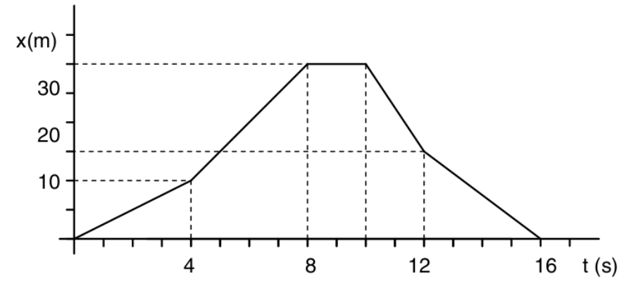
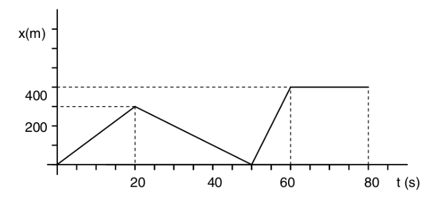
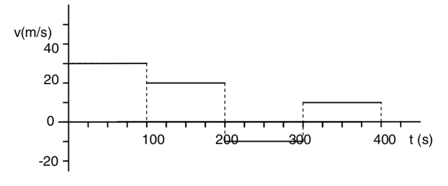
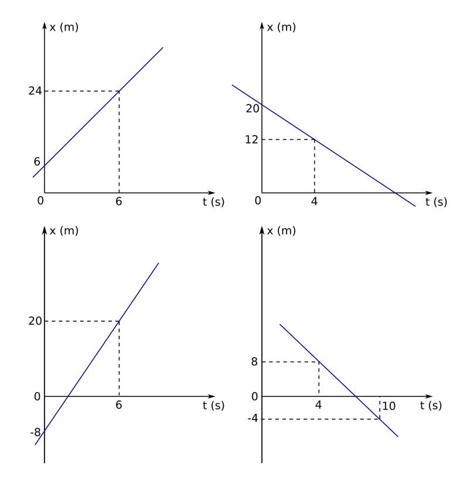
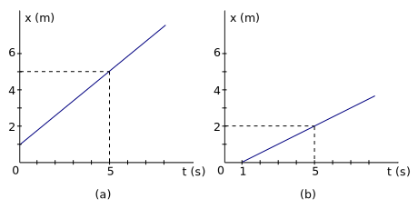
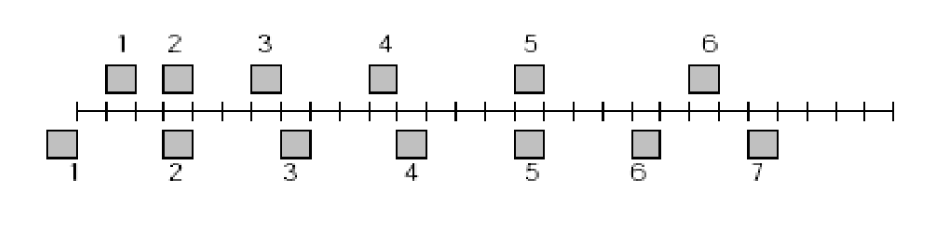
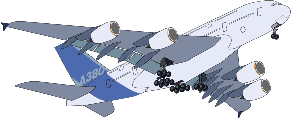
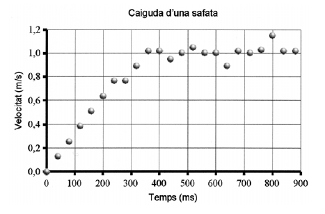
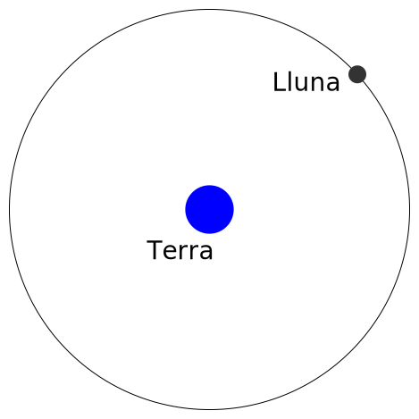
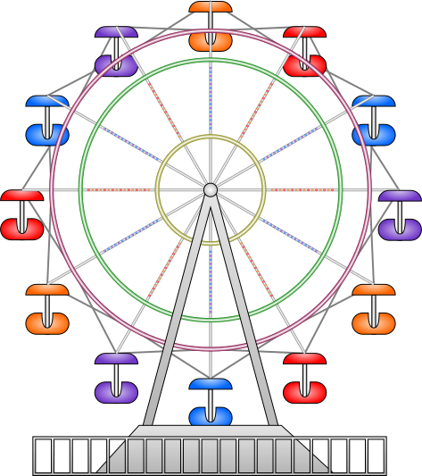

# Problemes Unitat 2: Moviment

## Moviment rectilini uniforme (MRU)

<ol>
<li>Observeu la representació gràfica del moviment d'un cotxe:
    

    
    

    <ol>
        <li>Descriviu verbalment el moviment del cotxe en els diferents trams del recorregut. </li>
        <li>Calculeu la velocitat de cada interval. </li>
        <li>Representeu la corresponent gràfica v-t. </li>
        <li>Calculeu la velocitat mitjana de tot el recorregut.</li>
    </ol>
    Resposta: 2,5 m/s 5 m/s 0 m/s - 7,5 m/s -3,75 m/s
</li>
 
<li> Un ciclista que viatja seguint una trajectòria rectilínia recorre la meitat del seu camí a 30 km/h, i l'altre meitat a 20 km/h. Menyspreant el temps empleat en variar la velocitat: 
    <ol>
        <li> Fes una estimació dels valors entre el quals estarà la velocitat mitjana. </li>
        <li> Traça les gràfiques qualitatives de posició i velocitat en funció del temps. </li>
        <li> Calcula el valor de la velocitat mitjana. Ajuda: $v_{m}\neq\frac{v_{1}+v_{2}}{2}$ </li> 
    </ol>
</li>
  
<li>El moviment d’un cotxe ve representat per la següent gràfica posició-temps.
    

    
    

    <ol>
        <li>Expliqueu quin moviment fa aquest automòbil. </li>
        <li>Calculeu la velocitat en cada tram. </li>
        <li>Feu la gràfica v-t que li correspon. </li>
        <li>En quins instants el cotxe està en la posició 200 m?</li>
        <li>Trobeu la velocitat mitjana del moviment. </li>
        <li>Quina és la velocitat mitjana fins als 50 segons?</li>
    </ol>
    Resposta: 15 m/s - 10m/s 40m/s 5 m/s 13,3 s 30 s i 55 s 5 m/s i 6,6 m/s
</li>
 
<li>Un cotxe fa un trajecte segons la següent gràfica v-t. Sabem que en l’instant inicial la seva posició és zero.
    

    
    

    <ol>
        <li>Descriviu verbalment el moviment. </li>
        <li>Calculeu la posició d’aquest cotxe al final de cada interval de temps (sempre respecte l’origen). </li>
        <li>Feu la gràfica posició-temps corresponent. </li>
        <li>Quin ha estat el seu desplaçament? </li>
        <li>Quina velocitat mitjana ha mantingut?</li>
    </ol>
    Resposta: 3.000 m - 5.000 m - 4.000 m - 5.000 m - 125 m/s
</li>
 
<li>Els següents diagrames corresponen a diferents mòbils, tots ells fent un moviment rectilinis. 
    

    
    

    <ol>
        <li>Trobeu els instants en que passaran (o van passar) per la posició presa com a origen de coordenades. </li>
        <li>Trobeu l'equació de moviment x(t) per a cada moviment.</li>
    </ol>
</li>
 
<li>En un punt d’una carretera s’han creuat dos vehicles que marxen en sentits contraris. El primer porta una velocitat de 54 km/h i el segon de 36 km/h. 
    <ol>
        <li>Quina serà la distància que els separarà als 45 minuts? </li>
        <li>Representeu les gràfiques v-t i x-t dels dos moviments. </li>
        <li>Comproveu el resultat de la primera pregunta en la gràfica posició-temps.</li>
    </ol>
</li>
 
<li>Dos cotxes estan separats 1000 m en una recta de l’autopista. Els dos es mouen amb velocitats constants de 126 km/h i 72 km/h amb sentits contraris fins a trobar-se.
    <ol>
        <li>Quant temps tardaran en trobar-se? </li>
        <li>En quina posició tindrà lloc l’encontre? </li>
        <li>Dibuixeu les gràfiques $v-t$ i $x-t$. </li>
    </ol>
    Podeu repetir l’exercici però suposant que tots dos porten el mateix sentit, 
    <ol start="4">
        <li>Quant tardarà el que va més de pressa a atrapar el cotxe més lent? </li>
        <li>En quina posició l’atraparà? </li>
        <li>Representeu les gràfiques dels moviments.</li>
    </ol>
</li>
 
<li>L’intrèpid viatger Phileas Fogg, protagonista de "La volta al món en 80 dies" de Jules Verne, ha arribat tard al port. El vaixell on havia de continuar el viatge fa dues hores que ha sortit i va a 40 km/h. Però Fogg no es dóna per vençut. Contracta els serveis d’una petita motora i surt en persecució del vaixell a 50 km/h. 
    <ol>
        <li>A quants quilòmetres de la costa l’atraparà? </li>
        <li>Quant temps tardarà en atrapar-lo? </li>
        <li>Trobeu la solució numèrica i gràficament.</li>
    </ol>
</li>
 
<li>Bob Esponja va en el seu monocicle d'aigua, amb velocitat constant de 14 km/h, sobre un carrer rectilini, seguint en Patricio, que va corrent en el mateix sentit a 5 km/h, també a velocitat constant. Si inicialment es trobaven separats 100 m: 
    <ol>
        <li>Trobeu en quin instant es trobaran. </li>
        <li>Trobeu quina distància ha recorregut cadascun.</li>
        <li>Traçeu una gràfica velocitat-temps i una posició-temps per a tot dos.</li>
    </ol>
    

        
    

</li>
 
<li>Una colla de treballadors de Renfe viatja damunt d'una vagoneta per una via rectilínia. En un moment donat, per la mateixa via i a 180 m per darrera veuen venir un tren de rodalies que viatja amb una velocitat constant de 36 km/h. 
    <ol>
        <li>A quina velocitat mínima i constant hauria d'anar la vagoneta per poder arribar a un desviament que està a 120 m per davant de la vagoneta, per tal d'evitar el xoc? </li>
        <li>Feu una gràfica de velocitat en funció del temps per a tots dos mòbils.</li> 
        <li>Feu una gràfica de posició en funció del temps per a tots dos mòbils. </li>
    </ol>
</li>
 
<li>Dos participants d'una cursa de regularitat van traçar cadascú la gràfica de posició en funció del temps dels seus vehicles, des dels seus propis sistemes de referència (gràfiques a i b) per a un tram recte del recorregut.

    

Escriu les equacions de moviment de cada vehicle, des del sistema triat per a cada participant.
    <ol>
        <li>Es pot dir quin d'ells s'ha mogut amb més velocitat?</li>
        <li>Trobeu la velocitat de cada vehicle a $t_{a}=t_{b}=15\,\mathrm{minuts}$. Es pot afirmar que estan junts en aquell instant? Per què?</li>
    </ol>
</li>
 
<li>L'Andreu va en bicicleta, amb velocitat constant de 14 km/h, sobre un carrer rectilini, seguint a la Karina, que va corrent en el mateix sentit a 5 km/h, també a velocitat constant. Si inicialment es trobaven separats 100 m: 
    <ol>
        <li>Trobeu en quin instant es trobaran. </li>
        <li>Trobeu quina distància ha recorregut cadascun.</li>
        <li>Traçeu una gràfica velocitat-temps i una posició-temps per a tot dos.</li>
    </ol>
</li>
 

<li>La casa d'en Miquel es troba a 900 m de la casa de la Paula. Caminant amb velocitat constant, en Miquel triga 10 minuts en recórrer aquesta distància, mentre que la Paula la recorre en 15 minuts. Cert dia surten tots dos a les 15 hores, cadascun des de la seva casa dirigint-se a la casa de l'altre. 
    <ol>
        <li>Determina a quina hora es troben.</li>
        <li>Calcula a quina distància de la casa de la Paula es troben.</li> 
        <li>Traça la gràfica de velocitat-temps per a tots dos i la de posició-temps per a tots dos.</li>
    </ol>
</li>
 
<li>A les 9 hores del matí passa per una benzinera un vehicle robat amb una velocitat constant de 90 km/h. Als deu minuts passa pel mateix punt un cotxe de la policia perseguint al primer amb una velocitat de 126 km/h. 
    <ol>
        <li>A quina hora la policia detindrà als lladres?</li>
        <li>A quina distància de la benzinera tindrà lloc la detenció? </li>
        <li>Fes les gràfiques v-t i x-t dels dos cotxes (fent servir els mateixos eixos de coordenades pels dos cotxes en cada tipus de gràfica).</li>
    </ol>
</li>
</ol>

## Moviment Rectilini Uniformement Accelerat (MRUA)

<ol start="15">
<li>La gràfica de la figura representa la velocitat segons el temps d'un mòbil que surt de l'origen de coordenades i segueix un moviment rectilini. 
    

    
    

    Determineu: 
    <ol>
        <li>L'acceleració en l'instant $t=20\,\mathrm{s}$. </li>
        <li>La distància recorreguda durant la frenada. </li>
    </ol>
</li>
 
<li>La figura representa les posicions de dos blocs a intervals de temps successius de 0,3 s; els blocs es mouen cap a la dreta. Els dos blocs tenen la mateixa celeritat (mòdul de la velocitat):
    

    
    

    <ol>
        <li>Només a l’instant 2. </li>
        <li>Només a l’instant 5. </li>
        <li>En els instants 2 i 5. </li>
        <li>En algun moment entre els instants 3 i 4. </li>
    </ol>
</li>
 
<li>Analitzar la gràfica de la figura, que correspon a un moviment rectilini en varies etapes. Suposant que per a $t=0$ és $x=0$:
    

    
    

    <ol>
        <li>Traça les gràfiques d'acceleració en funció del temps i de posició en funció del temps, determinant els valor corresponents als temps indicats.</li> 
        <li>Escriu les equacions de moviment per a cada etapa. </li>
        <li>Calcula la velocitat mitjana del mòbil entre 0 i 25 s. </li>
    </ol>
</li>
 
<li>Un avió Boeing 727 necessita una velocitat de pista de 360 km/h per enlairar-se; si partint del repòs tarda 25 s en enlairar-se: 
    

    
    

    <ol>
        <li>Quina acceleració constant li proporcionen els motors? </li>
        <li>Quina longitud de pista ha de recórrer? </li>
        <li>Representeu les gràfiques v-t i x-t. </li>
    </ol>
</li>
 
<li>La figura esquematitza el diagrama posició-temps, per a dos mòbils (A i B) que es desplacen per una mateixa trajectòria rectilínia. 
    

    
    

    <ol>
        <li>Quin tipus de moviment té cadascun dels mòbils (justifica la teva resposta) </li>
        <li>Determina l'equació de posició com a funció del temps per al mòbil A. </li>
        <li>Es troba el mòbil A amb el B? En cas afirmatiu, determineu la posició de B en aquest instant. </li>
    </ol>
</li>
 
<li>S'anomena temps de reacció al que transcorre des que un conductor observa un obstacle fins que prem el pedal del fre. Normalment és d'algunes dècimes de segon. Suposa que la velocitat que porta és de 90 km/h, el temps de reacció és de 0,4 segons i que l'acceleració de frenada és de $-3\,\mathrm{m/s^{2}}$.
    <ol>
        <li>Calcula l'espai necessari per quedar aturat des del moment que el conductor veu l'obstacle. </li>
        <li>Representa les gràfiques $a-t$, $v-t$ i $x-t$ del moviment. </li>
    </ol>
    Resultat: 114,1 m 
</li>
 
<li>En Joan llança verticalment cap amunt una pedra, amb una velocitat de partida de 10 m/s, y simultàniament en Pere, que es troba 40 m per damunt d'en Joan, llança una altre pedra cap avall, també amb velocitat de 10 m/s. [Considereu $\left|g\right|=10\,\mathrm{m/s^{2}}$]
    <ol>
        <li>En quin instant es troben ambdues pedres? </li>
        <li>A quina distància respecte d'en Pere es troben les pedres? </li>
        <li>Feu les gràfiques $v(t)$ i $x(t)$ per a ambdues pedres. </li>
    </ol>
</li>
 
<li>Un globus es troba a 80 m d'altura. Quant temps tardarà en arribar a terra un objecte que deixem anar des del globus si: 
    <ol>
        <li>el globus està parat, </li>
        <li>el globus baixa a 2 m/s, </li>
        <li>el globus puja a 2 m/s.
    </ol>
Considereu negligible el fregament amb l'aire. 
Resultat: 4 s 3,80 s 4,20 s 
    </li>
     
<li>Un vianant corre amb la màxima velocitat possible a 6 m/s per agafar una autobús que està aturat en un semàfor. Quan està a 25 metres el semàfor es posa verd i l'autobús accelera uniformement a raó d'$1\,\mathrm{m/s^{2}}$. 
    <ol>
        <li>Calcula el temps que tardarà en atrapar l'autobús, si és que no se li escapa. </li>
        <li>Fes les gràfiques $a-t$, $v-t$ i $x-t$ dels moviments. </li>
    </ol>
</li>
 
<li>Un cotxe i un camió parteixen del repòs al mateix instant, amb el cotxe darrere el camió una certa distància. El camió té una acceleració constant d’$1,20\,\mathrm{m/s^{2}}$ i, el cotxe, una acceleració d’$1,80\,\mathrm{m/s^{2}}$. El cotxe passa al camió després d’haver recorregut 45 m. Trobeu: 
    <ol>
        <li>El temps que ha trigat el cotxe en avançar al camió. </li>
        <li>La distància que es trobava inicialment el cotxe al darrere del camió.</li>
        <li>Dibuixa les gràfiques de velocitat-temps i posició-temps per ambdós mòbils. (Tot dos mòbils a la mateixa gràfica). </li>
    </ol>
    </li>
     
<li>Un tren de rodalies parteix del repòs des d’una estació i accelera durant 10 s amb una acceleració constant d’$1,20\,\mathrm{m/s^{2}}$. Després marxa a velocitat constant durant 30 s i desaccelera amb una acceleració constant de mòdul $2,40\,\mathrm{m/s^{2}}$ fins que s’atura a l’estació següent. 
    <ol>
        <li>Feu les gràfiques d'acceleració i velocitat en funció del temps. </li>
        <li>Calculeu la distància total recorreguda. </li>
        <li>Calculeu la velocitat mitjana i l'acceleració mitjana del tren. </li>
    </ol>
    </li>
     
<li>Des d'una altura de 200 m sobre el terra llancem, verticalment i cap amunt, un cos amb una velocitat inicial de 30 m/s. 
    <ol>
        <li>Feu un dibuix aproximat de la gràfica velocitat-temps corresponent al moviment d'aquest cos des de l'instant de llançament fin que arriba a terra (indiqueu en el gràfic els valors de v i t corresponents als instants inicial i final). Considereu $g=10\,\mathrm{m/s^{2}}$.</li> 
        <li>Quant temps tarda a recórrer els darrers 50 m? </li>
        <li>Quina serà la seva posició respecte al terra a l'instant en què el cos baixa amb una velocitat de mòdul igual a 40 m/s? </li>
    </ol>
    </li>
     
<li>Al laboratori, la manera més fàcil de simular la caiguda d’un paracaigudista és deixar caure una safata de paper de la grandària d’un CD, aproximadament. Se n’ha estudiat el moviment de caiguda, i el resultat es representa en la gràfica següent. Descriviu el moviment de manera qualitativa i quantitativa.
    

    
    

    </li>
     
<li>Les dades següents corresponen a un moviment uniformement accelerat. Completa les dades que falten a la taula.
<table style="width:80%">
    <tr>
        <td> $t\,\mathrm{(s)}$ </td>
        <td> 0 </td>
        <td> 1 </td>
        <td>   </td>
        <td> 5 </td>
        <td>   </td>    
    </tr>
    <tr>
        <td> $v\,\mathrm{(m/s)}$ </td>
        <td> 20 </td>
        <td>  </td>
        <td> 24</td>
        <td>   </td>
        <td>   </td>    
    </tr>
    <tr>
        <td> $x\,\mathrm{(m)}$ </td>
        <td> 0  </td>
        <td> 21 </td>
        <td>    </td>
        <td>    </td>
        <td> 300</td>    
    </tr>
</table>
</li>
 
<li>Un cotxe i un camió parteixen del repòs al mateix instant, amb el cotxe darrere el camió una certa distància. El camió té una acceleració constant d’$1,20\,\mathrm{m/s^{2}}$ i, el cotxe, una acceleració d’$1,80\,\mathrm{m/s^{2}}$. El cotxe passa al camió després d’haver recorregut 45 m. Trobeu:
    <ol>
        <li>El temps que ha trigat el cotxe en avançar al camió. </li>
        <li>La distància que es trobava inicialment el cotxe al darrere del camió. </li>
        <li>Dibuixa les gràfiques de velocitat-temps i posició-temps per ambdós mòbils. (Tot dos mòbils a la mateixa gràfica). </li>
    </ol>
    </li>
<li>Un cotxe que té una fuita d'oli arrenca des del repós amb una acceleració constant. A la figura es poden veure les taques d'oli amb la seva posició. 
    

    
    

    Sabent que les taques es produeixen cada 2 s, determineu:
    <ol>
        <li>L'acceleració del cotxe.</li>
        <li>La velocitat que té el cotxe quan es produeix l'última taca de la figura.</li>
    </ol>
    </li>
     
<li>Una pilota de 5 kg de massa es llença des del terra verticalment cap amunt amb una velocitat inicial de 10 m/s. Si el vent comunica a la pilota una velocitat horitzontal constant de 15 km/h, trobeu:
    <ol>
        <li>L'alçada màxima a la qual arribarà la pilota i el temps que trigarà a assolir-la.</li>
        <li>La distància entre el punt de llançament i el punt d’impacte amb el terra. </li>
    </ol>
    </li>
     
</ol>

## Moviment relatiu en una dimensió
<ol start="32">
<li>A les instal·lacions d'uns grans magatzems hi ha una cinta transportadora que puja els clients des de la primera a la segona planta a una velocitat de 2 m/s. Una senyora que està parada a la primera planta observa el moviment d'un senyor que camina sobre la cinta (veure figura).
     
    

    
    

     
    <ol>
        <li>A quina velocitat veu pujar el senyor, si aquest camina sobre la cinta a una velocitat de 9 km/h respecte d'ella?</li>
        <li>Si el senyor intentés baixar de la segona a la primera planta, per la cinta, caminant a la mateixa velocitat que en l'apartat anterior, amb quina velocitat el veuria baixar la senyora?</li>
    </ol>
</li>
 
<li>Considereu una cinta transportadora en moviment d'una cadena de muntatge, i una joguina mecànica que es mou damunt la cinta . 
    <ol>
        <li>Amb quina velocitat es mou la cinta, si una persona veu moure's la joguina a una velocitat de 5 m/s, quan la joguina es mou amb la mateixa direcció i el mateix sentit que la cinta, i a una velocitat de 2 m/s quan la veu moure's en la mateixa direcció però en sentit contrari? </li>
        <li>Quina velocitat desenvolupa la joguina?</li>
    </ol>
    Resultat: $v_{0}=1,5\,\mathrm{m/s,\,}v^{,}=3,5\,\mathrm{m/s}$
</li>

## Moviment bidimensional

### Moviment relatiu

<ol start="34">
<li>Un vaixell que desenvolupa una velocitat de 40 km/h s'utilitza per travessar un riu de 500 m d'amplada. Si la velocitat del riu és d'1,5 m/s i el vaixell (línia proa-popa) sempre es manté perpendicular als marges del riu, 
    <ol>
        <li>(a) Quina serà la velocitat del vaixell respecte d'un observador situat als marges del riu? </li>
        <li>A quin punt de l'altre marge arribarà? </li>
        <li>Quina serà l'equació de la trajectòria del vaixell? </li>
    </ol>
    Resultat: 11,21 m/s | 67,5 m | $\vec{r} = (1,5\, \hat{i} + 11,11\, \hat{j})t$
</li>
 
<li>Una barcassa, que pot anar a una velocitat màxima de 14,4 km/h, transborda cotxes d'una riba a l'altra d'un riu que fa 80 metres d'amplada. El corrent del riu és de 3 m/s. 
    <ol>
        <li>Si la barcassa s'orienta perpendicularment al riu, quina serà la seva velocitat real (mòdul i direcció)? Recorda: fes un esquema clar!</li> 
        <li>En aquest cas, quant tardaria en travessar el riu i a quina posició de l'altra riba atracaria? </li>
        <li>Si la barcassa vol seguir una trajectòria perpendicular al riu, amb quina direcció l'ha d'orientar el capità? Torna a recordar: has de fer un nou esquema!!! </li>
        <li>En aquest cas, quina seria la seva velocitat real? Quant temps tardaria en travessar el corrent d'aigua? </li>
    </ol>
    Resultat: 5 m/s | 36,8 graus | 20 s 60 m | 48,5grados | 2,64 m/s 30,23 s
</li>
 
<li>Una cinta transportadora d’un aeroport es mou amb una velocitat de 5 km/h. Sobre la cinta camina una senyora que porta un cotxet de bebè a una velocitat de 3 km/h en respecte a la cinta. En un moment donat, el bebè llança el seu xumet amb una velocitat de 10 km/h en la direcció perpendicular al moviment de la cinta. 
    <ol>
        <li>A quina velocitat és llançat el xumet respecte d’un observador en repòs fora de la cinta? </li>
        <li>I respecte d’un observador en repòs sobre la cinta? </li>
        <li>I respecte d’un senyor que està sobre una altra cinta que avança en sentit contrari a 5 km/h? </li>
    </ol>
    Resposta: 3,5 m/s; 2,9 m/s; 4,5 m/s
</li>
 
<li>Un vaixell manté rumb cap a N durant 1 h, però es troba que durant aquest temps s’ha desviat 5 km cap a l’est recorrent un total de 30 km. Calculeu: 
    <ol>
        <li>La velocitat del vaixell que observa un home des de dalt d’una muntanya. </li>
        <li>La velocitat a què creu que va el pilot. </li>
        <li>La velocitat del corrent marí. </li>
    </ol>
    Resposta: 30 km/h; 29,58 km/h; 5 km/h.
</li>

## Moviment parabòlic
<ol start="38">
<li>Digueu quines d'aquestes afirmacions són veritables o falses en el cas d'un tir parabòlic, tot justificant cada resposta: 
    <ol>
        <li>Quan s'arriba a l'altura màxima la velocitat és nul·la. </li>
        <li>La component horitzontal de la velocitat roman constant durant tot el moviment. </li>
        <li>L'acceleració és constant. </li>
        <li>L'altura màxima no depèn de l'angle de llançament. </li>
    </ol>
</li>
 
<li>Des d'un pont que es troba a una altura h sobre el nivell d'un riu es llença una pedra en forma horitzontal amb velocitat de mòdul 5 m/s. La pedra tarda 4 segons en fer impacte sobre l'aigua (Considera $|g|=10\,\mathrm{m/s^{2}}$). 
    <ol>
        <li>Trobeu l'altura h del pont. </li>
        <li>A quina distància respecte del peu del pont la pedra impacta amb l'aigua?</li>
        <li>Quin és el mòdul de la velocitat al moment de l'impacte? </li>
    </ol>
</li>
 
<li>Llancem un cos obliquament cap amunt amb una velocitat de 30 m/s i amb un angle de 30º respecte de l’horitzontal. Calculeu: 
    <ol>
        <li>La distància des del punt de partida on caurà a terra si el terreny és horitzontal. (79,6 m)</li>
        <li>La seva velocitat 2 s després de llançar-lo. (26,4 m/s)</li>
        <li>L’alçada màxima que assolirà. (811,48 m)</li>
    </ol>
</li>
 
<li>De dalt d'un cingle de 300 m d'altura llancem horitzontalment un objecte amb una velocitat de 40 m/s. 
    <ol>
    <li>Quan tarda en arribar al terra? </li>
    <li>A quina distància de la base del cingle hi arriba? </li>
    </ol>
</li>
 
<li>Llanço una pilota amb una velocitat de 16 m/s i fent un angle de 60 graus amb el terra. A 20 metres hi ha un arbre de 4 metres d'altura. 
    <ol>
        <li>Passarà la pilota per sobre d'aquest arbre? </li>
        <li>Si passa, a quina posició xocarà la pilota amb el terra? </li>
        <li>Si no passa, a quina alçada xocarà amb l'arbre? </li>
    </ol>
</li>
<li>En el videojoc Angry Birds uns ocellets són llançats amb un tirador per a fer un tir parabòlic caient sobre els porquets per a eliminar-los. A la figura es pot veure una instantània de la pantalla del joc. Les distàncies es mesuren en píxels (px) i l'acceleració és vertical cap avall i val $50\,\mathrm{px/s^{2}}$. Si l'ocellet surt des de l'origen de coordenades amb un angle de $37^{\circ}$ i els porquets es troben sobre l'eix horitzontal a les posicions 200, 250 i 300 px respectivament, trobeu:
    <ol>
        <li>La velocitat a la que ha de sortir l'ocellet per a caure sobre el porquet del mig.</li>
        <li>L'altura màxima a la que arriba l'ocell. </li>
    </ol>
    

    
    

</li>
 
<li>Una pilota de 5 kg de massa es llença des del terra verticalment cap amunt amb una velocitat inicial de 10 m/s. Si el vent comunica a la pilota una velocitat horitzontal constant de 15 km/h, trobeu: 
    <ol>
        <li>L'alçada màxima a la qual arribarà la pilota i el temps que trigarà a assolir-la. </li>
        <li>La distància entre el punt de llançament i el punt d’impacte amb el terra. </li>
    </ol>
</li>

### Moviment circular
<ol start="45">
<li>Una roda que inicialment està aturada comença a girar i dóna 8 voltes fins que arriba a girar amb velocitat angular constant al cap de 8 segons. Quin és el valor d'aquesta velocitat? (RTA: 12,56 rad/s)
</li>
 
<li>Un motor d'un cotxe gira, al ralentí, a 1.000 rpm. 
    <ol>
        <li>Calcula el període, la freqüència i la velocitat angular del cigonyal. </li>
        <li>Quina serà la seva acceleració si triplica aquesta velocitat angular en 8 segons? </li>
        <li>Quantes voltes haurà girat en aquest espai de temps? </li>
    </ol>
    Resultat: 104,7 rad/s 0,06 s i 16,6 Hz 26,17 rad/s2 266 voltes
</li>
 
<li>Una centrifugadora de 12 cm de radi que està inicialment en repòs accelera uniformement durant 20 segons. En aquest interval de temps, $\alpha=100\,\mathrm{rad/s^{2}}$. Després manté la velocitat adquirida. 
    <ol>
        <li>Amb quina velocitat gira la centrifugadora quan fa 20 segons que funciona? Expressa el resultat en revolucions per minut.</li>
        <li>Quantes voltes ha fet la centrifugadora després de funcionar durant 20 segons? I després de funcionar 50 segons? </li>
        <li>Calcula les acceleracions tangencial i normal que com a màxim tenen els objectes a l'interior de la centrifugadora quan aquesta fa un minut que gira.</li>
    </ol>
    Resultat: 19.099 rpm 3.183 voltes i 12.732 voltes 0 i 4,8.105 m/s/s
</li>
 
<li>Tres ciclistes, A, B i C, descriuen una corba circular de 20 metres de radi. Calcula l'acceleració total de cada ciclista en un instant en què el mòdul de la seva velocitat és de 10 m/s, sabent que: 
    <ol>
        <li>El ciclista A conserva una velocitat de mòdul constant. </li>
        <li>El ciclista B accelera uniformement i la seva velocitat passa de 9,5 m/s a 10,5 m/s en 0,5 segons. </li>
        <li>El ciclista C frena uniformement d'11 m/s a 9 m/s en un temps de 0,5 segons.</li>
    </ol>
    Resultat: 5 m/s/s 5,38 m/s/s 6,40 m/s/s
</li>
 
<li>El motor d'un cotxe gira a 3.000 rpm. Reduïm una velocitat i per tant el motor augmenta de revolucions passant a 5.000 rpm en només 4 s. 
    <ol>
        <li>Calcula quina acceleració angular ha experimentat el motor? </li>
        <li>Quina acceleració tangencial i normal té un punt de la perifèria del motor situat a 25 cm de l'eix de gir en el moment de començar a reduir? </li>
        <li>I quins seran aquests valors al cap d’1 segon? </li>
    </ol>
    Resultat: 52,4 rad/s/s 13,1 i 24.674 m/s/s 13,1 i 33.599 m/s/s
</li>
 
<li>Un mòbil que surt del repòs realitza un moviment circular accelerat uniformement. Raoneu si cadascuna de les afirmacions següents és vertadera o falsa: 
    <ol>
        <li>El valor de l'acceleració normal del mòbil augmenta amb el temps. </li>
        <li>El valor de l'acceleració tangencial del mòbil no varia amb el temps.</li>
    </ol>
</li>
<li>El mòdul de la velocitat d'un punt material que descriu una trajectòria circular ve donat per l'equació (en unitats del SI) $v=6+10t$. Si el radi de la trajectòria és de 100 m, quina serà l’acceleració normal en l'instant $t=8\,\mathrm{s}$? I l’acceleració tangencial?
Resultat: 74 m/s/s i 10 m/s/s
</li>
 
<li>Una rentadora centrifuga a 900 rpm i quan està aturada tarda 20 segons en aconseguir aquesta velocitat de rotació. El radi del cilindre és de 30 cm. 
    <ol>
        <li>Quina és la velocitat de la roba quan centrífuga? </li>
        <li>Quan tarda en donar una volta? </li>
        <li>Des que s'engega fins que arriba a la màxima velocitat, quantes voltes dóna la roba? </li>
        <li>Quina és l'acceleració tangencial? </li>
        <li>Al cap de 2 segons d'engegar quin és el valor de l'acceleració normal? </li>
        <li>Quin és, en aquest instant, el valor global de l'acceleració? </li>
        <li>Calcula també els valors d'aquestes acceleracions als 10 segons d'haver-se engegat el programa del centrifugat. </li>
    </ol>
    Resultat: 28,2 m/s 0,066 s 150 voltes 1,41 m/s/s 26,64 m/s/s 26,68 m/s/s 1,41 m/s/s, 666,1 m/s/s i 666,1 m/s/s 
</li>
 
<li>Un disc es posa a girar des del repòs. En els primers 40 s augmenta la seva velocitat angular de manera uniforme i gira 10 voltes senceres. Calculeu les components intrínseques (normal i tangencial) del vector acceleració per a un punt del disc situat a 15 cm del seu centre, quan fa 15 s que s’ha iniciat el moviment. 
</li>
 
<li>La Lluna descriu una òrbita al voltant de la Terra que correspon pràcticament a un moviment circular i uniforme, de període T=27,4\,\mathrm{dies}. La llum procedent de la Lluna triga 1,28 s a arribar a la Terra. Calculeu: 
    <ol>
        <li>La velocitat angular.</li>
        <li>L’acceleració de la Lluna. </li>
    </ol>
    Dada: velocitat de la llum: $c=3\times10^{8}\,\mathrm{m/s}$.
    

    
    

</li>
 
<li>Una partícula de massa 0,1 kg, lligada a l’extrem d’un fil, descriu un moviment circular en un pla vertical. Quan el fil es troba en posició horitzontal, la seva tensió és 10 N. Calculeu per a aquesta posició:
    <ol>
        <li>L’acceleració centrípeta de la partícula.</li>
        <li>L’acceleració tangencial de la partícula. </li>
    </ol>
</li>
 
<li>Són les dotze en punt. Tant l’agulla horària com l’agulla minutera del rellotge apunten cap amunt. En quin instant tornaran a coincidir, per primer cop, les dues agulles del rellotge? 
</li>
 
<li>Una sínia (veure figura) de 20 metres de diàmetre gira amb un període d'un minut. 
    <ol>
        <li>Calculeu la velocitat lineal de les persones que estan donant voltes. </li>
        <li>Estan accelerant? Si ho fan, amb quina acceleració? </li>
        <li>Quan la sínia s'atura tarda dos minuts en fer-ho, quantes voltes donaran durant la frenada?</li>
     
    

    
    

