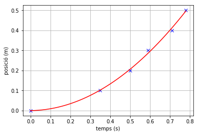

# Determinació de l'acceleració de la gravetat

En aquesta pràctica de laboratori intentarem mesurar la acceleració de la gravetat a la Terra. Per fer-ho utilitzarem un cronòmetre de precisió, el dels nostres mòbils de la manera que s'explica al vídeo següent

<iframe width="560" height="315" src="https://www.youtube.com/embed/zRGh9_a1J7s" frameborder="0" allow="accelerometer; autoplay; clipboard-write; encrypted-media; gyroscope; picture-in-picture" allowfullscreen></iframe>

## Materials

Necessitarem els següents materials:

* Suport amb anella regulable.
* Globus.
* Telèfon mòbil amb l'app PhyPhox instal·lada.
* cinta mètrica.
* Agulla.
* Objecte per deixar caure.

## Realització

L'experiment el farem deixant caure des de diferents altures conegudes (les mesurarem amb la cinta mètrica) un objecte. Cada cop mesurarem el temps de caiguda amb el cronòmetre acústic (Acoustic Stopwatch) de l'aplicació PhyPhox, tal com s'ensenya al vídeo. Apuntarem en una taula els valors mesurats de temps (en segons) i d'altura (en metres). Les dues magnituds mesurades estan relacionades a través de la relació següent:

$$h = \frac{1}{2}gt^2$$

Per tant, els punts hauran de ser part de una paràbola com la següent:

$$h = at^2+bt+c$$

on els paràmetres haurien de prendre els valors $$a=0,5g$$, $$b=0$$ i $$c=0$$. Existeix un mètode anomenat **mètode de quadrats mínims** que ens permet trobar la paràbola que més a prop passa per tos els punts. D'aquesta manera obtindrem els valors dels paràmetres i el valor de l'acceleració de la gravetat el tindrem multiplicant $a$ per 2.

## Exemple: trobem la gravetat a la Lluna

Per il·lustrar el mètode farem un exemple amb el que trobarem l'acceleració de la gravetat a la Lluna a partir de les dades experiemntals que apareixen a la taula de sota.

<table>
<tr>
<th>Distància (m)</th><td>0.00</td><td>0.10</td><td>0.20</td><td>0.30</td><td>0.40</td><td>0.50</td>
</tr>
<tr>
<th>Temps (s)</th><td>0.00</td><td>0.35</td><td>0.50</td><td>0.59</td><td>0.71</td><td>0.78</td>
</tr>
</table>


Per fer els càlculs utilitzarem **Jupyter Notebook** que ve amb el paquet informàtic **Anaconda** que heu de tenir instal·lat a l'ordinador.

A continuació els càlculs:

Primer hem d'importar totes les funcions que necessitarem i que venen en el mòdul `pylab` 


```python
from pylab import *
```

El següent és crear els `array`, amb els valor experimentals, un pel temps i l'altre per les altures.


```python
t = array([0,0.35,0.50,0.59,0.71, 0.78])
t
```


    array([0.  , 0.35, 0.5 , 0.59, 0.71, 0.78])


```python
x = array([0, 0.10, 0.20, 0.30, 0.40, 0.5])
x
```


    array([0. , 0.1, 0.2, 0.3, 0.4, 0.5])


A continuació utilitzarem la funció `polyfit` per obtenir els paràmetres a,b i c de la paràbola que millor ajusta les dades. La funció `polyfit` rep com arguments els arrays a ajustar i el 2 indica que volem ajustar a un polinomi de segon grau.


```python
a,b,c = polyfit(t,x,2)
a,b,c
```


    (0.8007361692533395, 0.012003596902281543, -0.000500001796996848)


Amb el valor d'a podem obtenir el de l'acceleració de la gravetat a la Lluna:


```python
g = 2 * a
g
```


    1.601472338506679


Que ens dona un valor d'$1,6 \, \mathrm{m/s^2}$ per aquesta acceleració.

Podem fer la gràfica de la paràbola amb els paràmetres trobats. Per fer-ho primer crearem els valors per a després graficar-los. Pels valors de temps utilitzarem un conjunt més grans de valors de temps perquè la paràbola es vegi com una corba suau, i després calculem els valors de la paràbola utilitzant els paràmetres trobats.


```python
t1 = arange(0,0.8,0.02)        # valors de temps des de 0 a 0.8 s amb un pas de 0.02 s
x1 = a * t1**2 + b * t1 + c    # càlcul dels valors de posició pels valor de temps anteriors
```


```python
# Gràfica de posició versus temps
# Els valors experimentals estan indicats amb creus
# La corba correspon a la paràbola obtinguda per quadrats mínims

xlabel("temps (s)")
ylabel("posició (m)")
plot(t,x,color='blue', linestyle='none', marker='x')
plot(t1,x1,color='red', linestyle='-')
grid(True)

# Si volem obtenir una gràfica en format png al nostre ordinador hem de descomenta la línia següent
#savefig("regressio.png", dpi=300)
```





## Conclusió

Hem obtingut, a partir de valors experimentals de posició i temps el valor de l'acceleració a la Lluna utilitzant el mètode de quadrats mínims. El valor obtingut és de 

$$g = 1,60 \, \mathrm{m/s^2}$$
