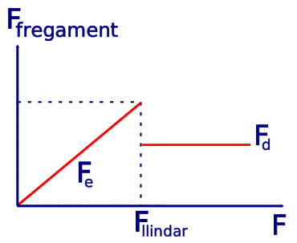

# L'univers mecànic

Al segle XIX els científics pensaven que l'univers funcionava com un rellotge, que tot estava determinat per les condicions inicials de moviment i que, si poguéssim conèixer la posició i velocitat de cada partícula de l'univers ens seria possible conèixer de manera completa el futur. L'única limitació estava en la manca de coneixement i la potència de càlcul necessària per tan magnífica empresa. Aquesta visió de l'univers es coneix com determinisme i uns dels seus grans postulants va ser el científic francès Pierre-Simon Laplace (veure el [dimoni de Laplace](https://ca.wikipedia.org/wiki/Dimoni_de_Laplace)). No és casual que els científics tinguessin aquesta visió de l'univers, l'èxit collit per la mecànica de Newton (també coneguda ara com mecànica clàssica) en predir el moviment planetari i el moviment en general va ser incontestable. 

Ara sabem que aquesta visió no és correcta, que la mecànica quàntica, que és la teoria que descriu la realitat d'una manera més acurada, ens assegura que la realitat no és determinista, que l'atzar juga un paper important. És a nivell microscòpic on es posa de manifest d'una manera més dramàtica aquest comportament, no obstant això, a escala macroscòpica la visió mecanicista de Newton continua essent vàlida, fins al punt que les trajectòries dels planetes i dels viatges espacials es calculen utilitzant la mecànica de Newton.

En aquesta unitat ens endinsarem en l'estudi de les causes del moviment, que són les interaccions entre els cossos i els agents amb els que representem aquestes interaccions en la mecànica clàssica, que són les forces.

## Les lleis de Newton

L'any 1687 [Isaac Newton](https://ca.wikipedia.org/wiki/Isaac_Newton) publica el llibre *Philosophiae Naturalis Principia Mathematica*, el llibre més important de la història de la física. En aquest llibre enuncia tres lleis que serveixen de principis per a desenvolupar tot el que avui coneixem com mecànica clàssica. 

### Primera llei de Newton: principi d'inèrcia

**Si un cos no interactua amb cap altre el seu estat serà el repòs o, si ja s'estava movent, el moviment rectilini uniforme.**

La forma que tenim per a modelitzar les interaccions entre cossos és a través d'una magnitud anomenada **força**. El concepte de força ens resulta intuïtiu, ja que alguna vegada hem rebut alguna empenta, la qual cosa ens acaba canviant el nostre estat de moviment.

El principi d'inèrcia es pot generalitzar pel cas en que el cos interactua amb altres, però la suma de totes les forces aplicades al cos resulta nul·la. En aquest cas tenim la mateixa situació que si no hi hagués cap força aplicada. 

Un exemple on podem visualitzar aquest principi podria ser el cas d'una persona que està a sobre d'un autobús en repòs i, de sobte, l'autobús comença a moure's. Aquesta situació, que la podem observar a la figura inferior, segur que l'hem viscut alguna vegada. Si l'autobús arrenca des del repòs i sobre nosaltres no hi ha cap força aplicada que ens faci moure amb l'autobús, nosaltres ens quedarem en repòs mentre l'autobús avança, com a conseqüència ens anirem cap el fons de l'autobús i probablement acabarem caient.

<figure>
  
  <figcaption> <strong>Aplicació del principi d'inèrcia. El bus arrenca i, si no ens agafem per tenir una força que ens faci moure junt amb l'autobús, ens quedarem a la nostra posició original (repòs) i acabarem caient.</strong> </figcaption>
</figure>

Una altra situació d'aplicació resulta quan l'autobús viatja a velocitat constant i de sobte frena, en aquest cas nosaltres continuarem viatjant a velocitat constant i ens anirem cap a la part davantera de l'autobús si no ens agafem per frenar-nos, com es pot observar a la figura inferior.

<figure>
  
  <figcaption> <strong>Aplicació del principi d'inèrcia. El bus frena i, si no ens agafem per tenir una força que ens faci frenar a nosaltres també, continuarem amb velocitat constant i acabarem esclafats contra el vidre del davant de l'autobús.</strong> </figcaption>
</figure>

### Segona llei de Newton: principi fonamental de la dinàmica

La segona llei de Newton estableix una relació de causa i efecte entre les interaccions i la generació del moviment i diu que **l'acceleració que experimenta un cos és directament proporcional a la força neta aplicada**. Aquesta llei es pot escriure amb l'expressió matemàtica:

$$\vec{F}=m\vec{a}$$

on la constant de proporcionalitat entre la força i l'acceleració és la massa del cos. És important destacar que la força que apareix a la 2a llei de Newton és la força resultant de la suma de totes les forces aplicades sobre el cos, a la que anomenarem força neta.

Podem veure d'aquesta llei que una mateixa força pot produir diferents acceleracions si s'apliquen a cossos de diferents masses. Un cos molt massiu tindrà una acceleració petita, mentre que un cos amb poca massa s'accelerarà molt. Podem dir que la massa és una mesura del que costa canviar l'estat de moviment d'un cos, és a dir, de la inèrcia del cos. La massa és una propietat intrínseca del cos, es dir, només depèn del cos i no d'agents externs. 

En el Sistema Internacional d'unitats, la unitat de massa és el kilogram (kg) i és una unitat fonamental. Tenint en compte que l'acceleració es mesura en $$\mathrm{m/s^{2}}$$, la unitat de força ha de ser $$\mathrm{kg.m/s^{2}}$$. Per ser la força una magnitud prou important aquesta unitat porta el nom de newton i es designa amb la lletra N.

Per calcular la força neta aplicada sobre un cos hem de fer la suma vectorial de totes les forces aplicades.

### Tercera llei de Newton: principi d'acció i reacció

La tercera llei de Newton ens diu que sempre que un cos exerceix una força sobre un altre, aquest segon cos exerceix una força igual i de sentit contrari sobre el primer.

Amb aquest principi queda establert que totes les forces venen per parelles, per això anomenem interaccions a l'aplicació de forces sobre algun cos, perquè la força ha d'estar produïda per algun agent extern que alhora rep una força contraria, es com dir que no podem tocar sense ser tocats.

Una conseqüència important d'aquest principi és que el parell de forces corresponents a la interacció sempre estan aplicades sobre objectes diferents, es a dir, si dos objectes interactuen un objecte aplica una força sobr el segon i el segon exerceix una igual i contraria en sentit sobre el primer, aquestes **dues forces que formen un parell d'interacció sempre estan aplicades sobre cossos diferents**. A la figura inferior es poden veure dues pilotes que xoquen i es fan forces oposades com a resultat de la interacció, però ambdues forces estan aplicades a cossos diferents. A la figura inferior es poden veure dues pilotes de bàsquet que xoquen i canvien les seves trajectòries com a resultat de les forces d'interacció. Veiem com les dues forces estan aplicades sobre cossos diferents.

<figure>
  
  <figcaption> <strong>Principi d'acció i reacció. Quan dos cossos interactuen exerceixen forces l'un sobre l'altre i aquestes forces sempre són d'igual intensitat i sentit oposat.</strong> </figcaption>
</figure>

## La força pes
Si sostenim un objecte amb la mà sentim una força que el cos ens fa sobre la mà i que apunta cap avall, podríem dir que estem “sentint el seu pes”, però què es en realitat aquesta força? qui l'origina? A la natura hi ha només 4 forces fonamentals i qualsevol tipus d'interacció es pot entendre com a causada per alguna d'aquestes forces. Una d'aquestes forces fonamentals és la força gravitatòria. Es tracta d'una força que es produeix sempre entre cossos que tinguin una propietat de la natura anomenada massa. Tots els cossos materials tenen aquesta propietat, per tant entre ells hi haurà una força gravitatòria que sempre serà atractiva. De les forces fonamentals aquesta és la que coneixem millor encara que sigui la més feble de les quatre, això és perquè l'atracció gravitatòria que produeix la Terra sobre els cossos al nostre voltant resulta prou intensa per a que sigui notable. I això és possible per la immensa massa que té la Terra. De fet l'atracció gravitatòria es produeix entre tots els cossos amb massa però com la massa dels cossos normals es petita aquesta força no la notem. Intentarem ara veure com podem determinar el pes d'un objecte.

La força pes és la força d'atracció que produeix el planeta sobre tots els cossos. Per entendre aquesta força podem fer el llegendari experiment que va en Galileu enfilant-se a la torre de Pisa i deixant caure dos objectes de pesos diferents. En aquest experiment Galileu va demostrar que els dos cossos queien amb la mateixa acceleració, que prop de la superfície de la Terra és de $$9,81\,\mathrm{m/s^{2}}$$.

<figure>
  
  <figcaption> <strong>Experiment de Galileo Galilei a la torre inclinada de Pisa. Tots els objectes cauen amb la mateixa acceleració si el fregament que l'aire fa sobre ells és el mateix.</strong> </figcaption>
</figure>

Aleshores, si tenim un cos d'1 kg de massa i el deixem caure, sabem que caurà a $$9,81\,\mathrm{m/s^{2}}$$, per tant, si fem servir la segona llei de Newton tenim 

$$P=mg=1\,\mathrm{kg\times9,81\,m/s^{2}=9,81\,N}$$

que el seu pes és de 9,81 N. Aquesta serà la força que exerceix la Terra sobre aquest cos. Quan jo l'agafo amb la mà per a que no caigui en realitat estaré aplicant sobre el cos una força igual al seu pes per a equilibrar les forces i que el objecte estigui en repòs. I la força que sento jo? Doncs, aquesta força serà la reacció que el cos fa sobre mi pel principi d'acció i reacció a la força que jo estic exercint. Per tant no és el pes del cos el que jo estic sentint (encara que tingui la mateixa intensitat) sinó la reacció a la força que jo hi faig.

<figure>
  
  <figcaption> <strong>La mà que sosté la pilota ha de fer una força F sobre la pilota. Alhora la pilota fa una força igual i de sentit contrari sobre la mà. El pes P és exercit per la Terra (atracció gravitatòria) i el seu parell d'interacció està aplicat a la Terra i apunta cap a la pilota (aquesta força no està representada a la figura).</strong> </figcaption>
</figure>

## Restriccions al moviment

Ja hem vist una força, la força pes, que no necessita el contacte per actuar, actua a distància. Hi ha altres forces que imposen restriccions al moviment, com poden ser les forces de contacte amb el terra o parets que imposen que la superfície de la paret o el terra no es pugui travessar. Aquestes forces són perpendiculars a les superfícies de contacte i per aquest motiu són conegudes com **forces normals** (normal és un sinònim de perpendicular) i moltes vegades les simbolitzem amb la lletra $$\vec{N}$$.

Estudiem un cas a mode d'exemple. Suposem que tenim un cos de massa $$m=2\,\mathrm{kg}$$ sobre una superfície plana horitzontal i sense fregament i apliquem una força $$F=30\,\mathrm{N}$$ formant un angle de $$37^{\circ}$$ amb la superfície horitzontal. Volem determinar la força de contacte que farà el terra sobre el cos i l'acceleració amb la que es mourà el cos.

Per tenir més clara fem un esquema de la situació a la figura inferior.

<figure>
  
  <figcaption> <strong>Exemple d'aplicació de la força de contacte normal. El terra imposa una restricció al moviment. El moviment no pot travessar la superfície del terra.</strong> </figcaption>
</figure>

Per resoldre aquesta situació hem de seguir els següents passos:

<ol>
<li><strong>Adopció d'un sistema de referència</strong>
Com les forces i les acceleracions són magnituds vectorials, les hem de poder representar en l'espai o, com en aquest cas, en el pla. Per aquest motiu hem d'adoptar un marc de referència sobre el pla a través de l'elecció un parell d'eixos ortogonals $$x-y$$. L'elecció de las direccions dels eixos en principi és arbitrària però, depenent de la nostra elecció, la resolució es pot fer més senzilla o més complicada. Per aquest motiu convé triar la direcció de un dels eixos coincidint amb la direcció de l'acceleració del cos (si resulta que la podem saber a priori). En aquest cas hi ha el cos no pot baixar degut a la restricció del moviment que fa el terra. Per tant es pot moure en direcció horitzontal o, si la força $$\vec{F}$$ resulta prou elevada podria pujar. En tot cas sembla raonable triar els eixos en les direccions horitzontal i vertical.
</li>

<li><strong>Diagrama de forces o diagrama de cos lliure</strong>

El següent pas consisteix en aïllar el cos de tot el que l'envolta i representar totes les interaccions en les que intervé a través de forces aplicades sobre el cos. Aquest tipus de diagrama es coneix com diagrama de forces o de cos lliure. Podem veure a sota la representació del diagrama de forces pel cos en qüestió, on el cos ha estat reemplaçat per un punt.

<figure>
  
  <figcaption> <strong>Diagrama de forces o de cos lliure.</strong> </figcaption>
</figure>

</li>

<li><strong>Descompondre les forces en les direccions dels eixos ortogonals</strong>

Podem observar que la direcció de la força $$\vec{F}$$ no coincideix amb la direcció de cap dels eixos, per tant el que farem serà descompondre la força en les seves dues components ortogonals que coincideixen amb els eixos de coordenades. En aquest cas la força $$\vec{F}$$ queda expressada amb dos components:

$$F_{x}=F\cos(37^{\circ})$$

$$F_{y}=F\sin(37^{\circ})$$
</li>
<li><strong>Escriure les equacions de Newton</strong>

Un cop coneixem totes les interaccions que té el nostre sistema, podem escriure l'equació vectorial de la segona llei de Newton o les equacions escalars corresponents a cada coordenada del nostre espai vectorial. En aquest cas queda el sistema d'equacions:

$$F_{x}=ma_{x}F_{y}+N-mg=ma_{y}$$

Ara es tracta de resoldre el sistema d'equacions per trobar el valor de l'acceleració i la força de contacte amb el terra. Podem destacar que el sistema que tenim està format per dues equacions i que en principi tenim 3 incògnites $$(a_{x},\,a_{y}\,\mathrm{i}\,N)$$. Per a poder resoldre el sistema s'hauria d'aportar una altra equació. Aquí es planteja una qüestió interessant, que té a veure amb la restricció al moviment que imposa la superfície de contacte, es poden donar dues situacions:
<ul>
<li>Si el component vertical de la força $$F$$, es a dir, $$F_{y}$$ supera el valor del pes, $$mg$$, aleshores el cos s'eleva i deixa d'estar en contacte amb el terra, per tant, en aquest cas $$N=0$$. I aquesta és l'equació que ens faltava per resoldre el sistema.</li>

<li>Si el component vertical de la força $$F$$, no supera el valor del pes, aleshores el cos roman sempre en contacte amb el terra i, com no hi ha moviment en la direcció vertical, no hi ha acceleració vertical i s'ha de verificar que $$a_{y}=0$$. En aquest cas aquesta és l'equació addicional que necessitàvem.</li>
</ul>
</li>

<li><strong>Resoldre les equacions de Newton</strong>

Un cop definit el sistema d'equacions el que queda és resoldre'l i trobar les incògnites, i això és només àlgebra.
</li>
</ol>
Per saber més sobre les forces de contacte podeu consultar [Khan Academy: Fuerza normal y fuerza de contacto](https://es.khanacademy.org/science/physics/forces-newtons-laws/normal-contact-force/v/normal-force-and-contact-force){:target="_blank"}.

## Forces de fregament

Quan vam enunciar la primera llei de Newton o principi d'inèrcia, vam dir que si un cos no està sotmès a cap força el seu moviment continua amb velocitat constant. Però la nostra experiència ens diu que si fem anar una pilota o un cotxet de joguina a rodar sobre el terra, acabarà aturant-se tard o d'hora. Això no es deu a que el principi d'inèrcia no sigui vàlid, sinó a que aquests cossos en realitat no estan lliures de forces que són les causes de que s'acabin aturant. Analitzem què passa amb un cos quan el fem lliscar sobre una superfície horitzontal. Tal com es veu en el diagrama de forces de la figura inferior, si el cos està en repòs sobre la superfície horitzontal, les úniques forces a les que estarà sotmès, com ja sabem, seran la força pes, amb direcció vertical cap avall, i la força de reacció del terra (força normal), vertical cap amunt. Aquestes dues forces són iguals en mòdul i direcció, i oposades en sentit, la qual cosa fa que la força resultant sigui nul·la i justifica l'estat de repòs.

<figure>
  
  <figcaption> <strong>Forces aplicades sobre un cos que es troba en repòs sobre una superfície horitzontal.</strong> </figcaption>
</figure>

Si ara llancem el cos cap a la dreta lliscant sobre la superfície i el deixem sol, veurem que la seva velocitat anirà minvant fins que al cap d'una estona es detindrà per complet. ¿Perquè ha passat això? Degut al principi d'inèrcia hem de concloure que si s'ha parat és perquè ha aparegut una força en sentit contrari al moviment i que, com conseqüència de l'acció d'aquesta força el mòbil s'ha detingut. ¿Passarà el mateix si fem moure el mòbil sobre altra superfície? ¿Què passarà si el llancem sobre una superfície de gel?Si fem l'experiment observarem que el mòbil també s'acabarà parant, però a diferència del cas anterior, després d'haver lliscat una distància més llarga. A aquesta força que s'oposa al lliscament l'anomenem força de fregament o força de fricció.

En la figura següent podem observar el diagrama de forces del mateix cos quan s'està movent sobre una superfície amb fregament.

<figure>
  
  <figcaption> <strong>Diagrama de forces d'un cos amb fregament.</strong> </figcaption>
</figure>

¿Com podem fer per a modelitzar aquesta força? Per fer-ho primer hauríem de enumerar tots els fets coneguts d'aquesta força a partir de l'observació experimental. Estudiant aquesta força per a diferents tipus de cossos i diferents superfícies, podem dir que s'observa:

1. Si l'objecte es deixa en repòs sobre una superfície horitzontal, la força de fricció no apareix.
2. Si intentem moure l'objecte aplicant una força horitzontal suficientment petita, l'objecte no es mou. Això vol dir que apareix una força de fregament igual i contraria a la que apliquem nosaltres per aconseguir l'equilibri.
3. Si augmentem la força aplicada una mica més, el cos encara no es mou. Això vol dir que la força de fregament té mòdul variable i s'ajusta a la força que fem nosaltres.
4. Hi ha un valor de força aplicada a partir de la qual el cos comença a moure's. Anomenarem valor llindar al valor que pren aquesta força.
5. Un cop el cos comença a moure's, la força mínima que hem de fer per mantenir el moviment és menor que el valor llindar i la força de fricció es manté constant independentment de la velocitat a la que es mogui el cos.
6. Si canviem el cos observem que la força de fregament depèn de la superfície de contacte entre el cos i la superfície, quan més rugosa sigui la superfície més alta serà la força de fregament.
7. La força de fregament és directament proporcional a la força de contacte entre les dues superfícies.

Atenent els resultats experimentals observats, el comportament de la força de fregament que rep un cos com a resultat de fregar contra una superfície es pot modelitzar amb un comportament com el que mostra la gràfica següent.

<figure>
  
  <figcaption> <strong>Gràfica on s'observa la força de fregament que apareix sobre un cos en funció de la força externa aplicada.</strong> </figcaption>
</figure>

La gràfica mostra que quan la força aplicada, F, és més petita que la força llindar, la força de fregament és igual a la força aplicada i el cos roman en repòs. En aquest cas diem que tenim fregament estàtic, força que és variable i igual a la força aplicada. Aquesta força pot assolir un valor màxim a partir del qual el cos comença a moure's si s'aplica una força major. La força màxima que assoleix el fregament estàtic es pot escriure com

$$F_{e_{max}}=\mu_{e}N$$

on $$N$$ és la força de contacte entre el cos i la superfície (força normal) i $$\mu_{e}$$ és un coeficient adimensional de proporcionalitat que depèn de les superfícies en contacte i anomenem coeficient de fregament estàtic.

En general tindrem que 

$$F_{e}\leq\mu_{e}N$$

Quan el cos comença a moure's, la força de fregament disminueix i passa a ser constant, a aquesta força li diem força de fregament dinàmic (o cinètic). Podem modelitzar aquesta força amb l'expressió

$$F_{d}=\mu_{d}N$$

on $$N$$ és la força normal i $$\mu_{d}$$ és el coeficient de fregament dinàmic (adimensional). 

## Força elàstica

Ja hem vist que com a resultat de l'aplicació d'una força sobre un cos, el cos es pot accelerar. Ara veurem un altre efecte possible a partir de l'aplicació d'una força sobre un cos, com ser la deformació del cos. Anomenem **elasticitat** a la capacitat que té un cos per a recuperar la seva forma després que la força hagi deixat d'actuar. Podem interpretar la elasticitat com deguda a les forces produïdes per las partícules que formen part del cos, que al ser deformat canvien les seves posicions relatives i això fa aparèixer forces que intenten tornar a posar les partícules a les seves posicions d'equilibri originals, aquesta força recuperadora és la que fa que el cos torni a la seva forma original quan la força que produeix la deformació deixa d'actuar.

Els materials presenten diferents graus d'elasticitat depenent de les seves propietats microscòpiques, el cautxú és força elàstic mentre que el vidre no. El cas més típic de cos elàstic és el d'una molla o ressort helicoidal. La força elàstica o força recuperadora apareix quan la molla de longitud lliure $$x_{0}$$ és apartada i pren una longitud $$x$$ diferent. 

### Llei de Hooke

Considerem el cas d'una molla que està unida a una paret en el seu costat esquerre i a un cos en l'altre extrem (veure figura inferior). En el cas (a) es veu que si la molla té la seva longitud natural o longitud lliure, no hi ha cap força horitzontal i les úniques forces a les que està sotmès el cos són el seu pes i la reacció del terra que l'equilibra per obtenir una força neta nul·la. El cos està en repòs en aquestes condicions. En la situació de la figura (b), estirem la molla des de la seva posició d'equilibri $$x_{0}$$ fins a una nova posició $$x$$. En aquest cas apareix una força cap a l'esquerra que intenta tornar el cos a la seva posició d'equilibri. Si comprimim la molla cap a la esquerra des de la seva posició d'equilibri (cas (c))apareix una força cap a la dreta que intenta tornar el cos cap a la posició d'equilibri.

<figure>
  
  <figcaption> <strong>Força restauradora en una molla. La força elàstica sempre intenta recuperar l'equilibri que es troba quan la molla té la seva longitud lliure.</strong> </figcaption>
</figure>

Resulta un fet experimental que si l'estirament o compressió de la molla són prou petits, la força elàstica resulta proporcional a la variació de la longitud de la molla respecte a la seva longitud lliure. 

$$F=-k(x-x_{0})=-k\Delta x$$

on la constant de proporcionalitat $$k$$ es coneix com **constant elàstica** o **constant recuperadora** i $$\Delta x$$ és l'**elongació** de la molla. Les unitats de $$k$$ són $$\mathrm{N/m}$$ (newton/metre). Degut a que la força sempre s'oposa a la variació de la longitud apareix el signe "$$-$$" a l'equació.

A la figura inferior es pot veure la gràfica de la força elàstica en funció de l'elongació en el cas d'una molla de constant elàstica igual a 50 N/m. La constant elàstica és el pendent de la recta.

<figure>
  
  <figcaption> <strong>Gràfica de la força elàstica en funció de l'elongació. En aquest cas no s'ha considerat el signe negatiu i s'ha representat el mòdul de la força. La constant elàstica correspon al pendent de la recta, que en aquest cas particular val $$50\,\mathrm{N/m}$$.</strong> </figcaption>
</figure>

En general els materials tenen un límit d'elasticitat, si aquest límit se supera l'elongació ja no resulta proporcional a la força, en aquest cas diem que hem entrar en la zona de **deformació plàstica**. Quan el cos passa a aquesta regió el cos ja no recupera la seva forma original quan es deixa d'aplicar la força que produïa la deformació.

