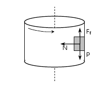

# Problemes Unitat 3: L'univers mecànic

## Dinàmica

1. És possible que la velocitat d'un cos estigui dirigida cap a l'est i la força que actua sobre ell cap a l'oest? Raona la resposta.
    
<a href="sol/prob301.pdf">Solució</a>

2. Un home que s'està pesant a sobre d'un ascensor observa que el pes que marca la bàscula és major que el seu pes real. Aleshores: 
    1. L'ascensor es mou cap amunt amb velocitat decreixent.
    2. L'ascensor es mou cap avall amb velocitat decreixent.
    3. L'ascensor es mou cap amunt amb velocitat creixent.
    4. L'ascensor es mou cap avall amb velocitat constant.
    
<a href="sol/prob302.pdf">Solució</a>

 
3. La massa del cos dibuixat és de 3 kg. Sobre ell actuen les forces indicades.
    

    1. Dibuixa totes les forces que actuen sobre cada cos.
    2. Digues on es troben aplicats els parells d'interacció de cada força. 
    
<a href="sol/prob303.pdf">Solució</a>

4. Un cotxe de 400 kg porta una velocitat de 72 km/h.
    1. Determineu la força que han de fer els frens per aturar-lo en 20 segons.
    2. Quina força han de fer els frens si el cotxe ja té una fricció de 100 N?
    
<a href="sol/prob304.pdf">Solució</a>

5. Imagineu una col·lisió frontal entre el bloc lleuger de massa $$m_{2}$$ i el gran bloc de massa $$m_{1}\gg m_{2}$$. Durant la col·lisió:
    

    1. El bloc gran exerceix una força sobre el bloc lleuger, més gran que la força que el bloc lleuger exerceix sobre el bloc gran.
    2. El bloc lleuger exerceix una força sobre el bloc gran, més gran que la força que el bloc gran exerceix sobre el bloc lleuger.
    3. El bloc gran exerceix una força sobre $$m_{2}$$, el bloc lleuger, però aquest no exerceix cap força sobre el bloc gran.
    4. El bloc gran exerceix una força sobre el bloc lleuger, igual que la força que el bloc lleuger exerceix sobre el bloc gran.
    
<a href="sol/prob305.pdf">Solució</a>

6. Una persona de 80 kg de massa està conduint un cotxe. Si en un determinat instant nota que el respatller del seu seient l’empeny endavant amb una força d’uns 40 N, quina de les següents situacions no pot produir l’esmentat efecte?
    1. El cotxe circula costa amunt per una carretera inclinada 0,05 radians, a una celeritat (mòdul de la velocitat) constant de 30 m/s.
    2. El cotxe circula costa avall, pel pendent anterior, augmentant la seva celeritat a un ritme d’$$1,0\,\mathrm{m/s^{2}}$$.
    3. El cotxe està frenant, a raó de $$0,5\,\mathrm{m/s^{2}}$$, amb l’objectiu d’acabar una maniobra (en terreny pla) de marxa enrere.
    4. El cotxe accelera endarrere en terreny pla augmentant la seva celeritat a raó de $$0,5\,\mathrm{m/s^{2}}$$.
    
<a href="sol/prob306.pdf">Solució</a>

7. Dos patinadors, un de 40 kg i l'altre de 80 kg de massa, es troben un davant de l'altre. Estan sobre una superfície sense fricció i el primer empeny al segon amb una força de 25 N.
    1. Calculeu l'acceleració que tindrà cadascun d'ells.
    2. Calculeu-la també en el cas que el que empenti sigui el segon al primer però ho fa amb la mateixa força.
    
<a href="sol/prob307.pdf">Solució</a>

8. Un cos de 75 kg ha realitzat els següents moviments:
    

    Calcula la força neta a què ha estat sotmès en cada cas.
    
<a href="sol/prob308.pdf">Solució</a>

9. Responeu VERITAT o FALS justificant les respostes (poseu un exemple sempre que sigui possible):
    1. Si un cos té aplicada una força cap a baix, aleshores només pot moure's cap a baix.
    2. L'expressió de la segona llei de Newton és vàlida només quan és la força neta.
    3. Quan un autobús frena, una força ens impulsa cap endavant.
    4. En un cos sobre un un pla horitzontal, la força pes i la força que el pla fa sobre el cos són parells d'interacció.
    
<a href="sol/prob309.pdf">Solució</a>

10. Una persona de 70 kg de massa es pesa a una bàscula a dintre d'un ascensor que puja a una acceleració constant de $$2\,\mathrm{m/s^{2}}$$. Aleshores, la lectura de la bàscula és: 
    1. 0
    2. 140 N
    3. 700 N
    4. 840 N
    5. 1400 N
    6. Cap de les anteriors.
    
<a href="sol/prob310.pdf">Solució</a>

    ## Fregament

11. El coeficient cinètic de fricció entre el terra i el bloc de la figura és 0,4.
    

    Calculeu l’acceleració en cadascun dels casos següents si el bloc té una massa
de 100 kg.
    
<a href="sol/prob311.pdf">Solució</a>

12. Els coeficients estàtic i cinètic de fricció entre un cos i el terra són 0,4 i 0,3
respectivament. La massa de l’objecte és de 60 kg.
    1. Calcula si amb una força de 300 N podríem moure’l.
    2. En cas de fer-ho, quina seria l’acceleració del moviment?
    
<a href="sol/prob312.pdf">Solució</a>

    ## Sistemes de cossos vinculats

13. Estirem el sistema de la figura amb una força de 38 N. Calcula l’acceleració del
sistema i la tensió de les cordes en els següents casos:
    

    1. No hi ha friccions.
    2. El coeficient de fricció entre els blocs i el terra és de 0,1.
    
<a href="sol/prob313.pdf">Solució</a>

14. La massa $$m_1$$ del sistema de la figura val 40 kg, i la massa $$m_2$$ és
variable. Els coeficients de fricció estàtic i cinètic entre $$m_1$$ i la taula són iguals i valen $$\mu = 0,2$$.
    

    Si el sistema està inicialment en repòs,
    1. Amb quina acceleració es mourà el sistema si $$m_2 = 10 \mathrm{kg}$$?
    2. Quin és el valor màxim de $$m_2$$ per al qual el sistema romandrà en repòs?
    3. Si $$m_2 = 6 \mathrm{kg}$$, quina serà la força de fregament entre el cos i la taula? i la tensió de la corda?
    
<a href="sol/prob314.pdf">Solució</a>

    ## Dinàmica del moviment circular

15. Una partícula de massa 0,1 kg, lligada a l'extrem d un fil, descriu un moviment circular en un pla vertical. Quan el fil es troba en posició horitzontal, la seva tensió és 10 N. Calculeu per a aquesta posició: 
    1. L'acceleració centrípeta de la partícula.
    2. L'acceleració tangencial de la partícula.
    
<a href="sol/prob315.pdf">Solució</a>

16. Un ciclista fa un ris de la mort sobre una pista circular vertical de 10 metres de radi. Si parteix del repòs des de la part inferior de la pista amb un moviment circular uniformement accelerat, calculeu: 
    1. La velocitat mínima que ha de tenir en el punt més alt de la seva trajectòria per tal de fer la circumferència sense caure.
    2. La força que fa la pista sobre la bicicleta en el punt més alt de la trajectòria quan el mòbil té la velocitat calculada en el apartat anterior si el conjunt bicicleta-ciclista té una massa de 120 kg.
    3. L'acceleració angular que ha de tenir per assolir la velocitat mínima calculada en el primer apartat.
    

17. En la pel·lícula dels Simpson, Homer intenta fer el ris de la mort dintre d'una esfera de metall amb una moto (veure imatges). Després de dos intents fallits ho aconsegueix accelerant a la tercera oportunitat. Si l'esfera té un diàmetre de 6 metres i Homer parteix del repòs amb un moviment circular uniformement accelerat, calculeu: 
    1. La velocitat mínima que ha de tenir en el punt més alt de la seva trajectòria per tal de fer la circumferència sense caure.
    2. La força que fa l'esfera sobre la moto en el punt més alt de la trajectòria quan el mòbil té la velocitat calculada en el apartat (a), sabent que el conjunt moto-Homer té una massa de 400 kg.
    3. L'acceleració angular que ha de tenir per assolir la velocitat mínima calculada en el primer apartat.
    
<a href="sol/prob317.pdf">Solució</a>

    

        

18. Una cabina cilíndrica gira respecte el seu eix amb una velocitat de 5 rad/s. En contacte amb la paret interior hi ha un cos que gira solidàriament amb la cabina. El coeficient de fregament estàtic entre la paret i el cos val 0,2. Quin és el radi de la cabina?</li>
    

    
<a href="sol/prob318.pdf">Solució</a>

    ## Força elàstica

19. La constant elàstica $$k$$ d'una molla de longitud 12,7 cm ha estat mesurada penjant-hi dues masses de 50 g i 100 g, respectivament; les longituds que ha assolit la molla han estat 14,8 cm i 16,9 cm, respactivament.
    1. Quin és el valor de $$k$$ en unitats de l'SI?
    2. Quin és l'allargament que experimenta la molla quan hi pengem un cos de 60 g?
    3. Si hi pengem un cos i la molla s'allarga una longitud de 3,9 cm, quina és la massa del cos?
    
Resposta: 23,3 N/m; 2,5 cm; 93g. <a href="sol/prob319.pdf">Solució</a>

20. La longitud d'una molla és de 20 cm quan l'estirem amb una força de 40 N, i de 25 cm quan la força és de 60 N. Calculeu:
    1. La longitud de la molla quan no hi actuacap força.
    2. La constant elàstica.
    
Resposta: 10 cm i 400 N/m. <a href="sol/prob320.pdf">Solució</a>

21. Una molla de constant recuperadora $$k=50\,\mathrm{N/m}$$ i longitud natural $$l=2\,\mathrm{m}$$ està lligada al sostre d'un ascensor. Si pengem de l'extrem lliure de la molla un cos de massa $$m=3\,\mathrm{kg}$$, quina serà la longitud de la molla quan:
    1. L'ascensor pugi amb una acceleració igual $$a=2\,\mathrm{m/s^2}$$ en el sentit del moviment?
    2. L'ascensor pugi a una velocitat constant?
    
R: 2,71 m i 2,59 m. <a href="sol/prob321.pdf">Solució</a>

    ## Quantitat de moviment

22. Una persona, la massa de la qual és de 60 kg, es troba en mig d'un llac glaçat, sense fricció. Aquesta persona té, en les seves mans, una capsa de 5 kg de massa. Si llença la capsa horitzontalment, la persona adquireix una velocitat de 0,5 m/s en sentit contrari. Aleshores, arriba a la conclusió de que la capsa ha estat llençada amb una velocitat de:
    1. 6 m/s
    2. 0,5 m/s
    3. 60 m/s
    4. 10 m/s
    2. 2 m/s
    
<a href="sol/prob322.pdf">Solució</a>

23. Un cos de massa $$m=6\,\mathrm{kg}$$ es mou amb una velocitat $$v_{0}=2\,\mathrm{m/s}$$ quan comença a rebre una força $$F$$ variable en el temps segons la gràfica que s'observa a continuació.
    

    Tenint en compte la informació proporcionada determineu:
    1. L'impuls total proporcionat al cos per la força $$F$$.
    2. La velocitat del cos quan $$t=3\,\mathrm{s}$$.
    3. La velocitat del cos quan $$t=6\,\mathrm{s}$$.
    
<a href="sol/prob323.pdf">Solució</a>

24. En un joc de fira disparem un petit balí de plom de 8 g de massa amb una escopeta d’aire comprimit de 3,5 kg de massa. El balí surt amb una velocitat de 68 m/s, i sabem que la força impulsora ha actuat durant un temps de 0,085 s. 
    1. Quina força mitjana s’ha efectuat sobre el balí?
    2. Quina és la velocitat de retrocés del fusell?
    

    
<a href="sol/prob324.pdf">Solució</a>

