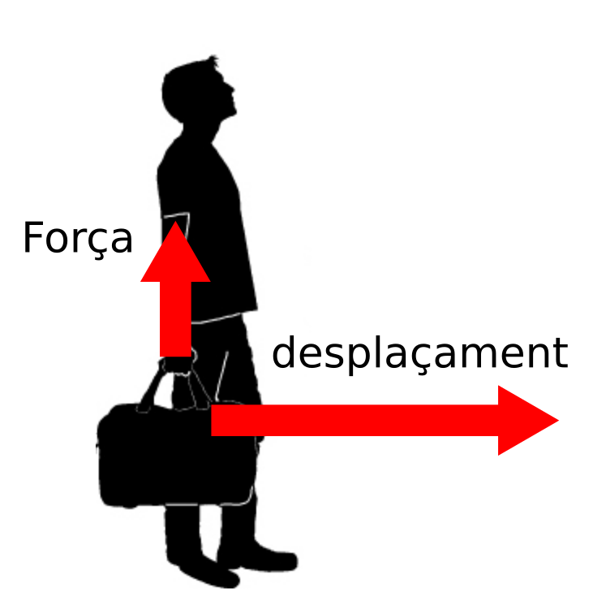
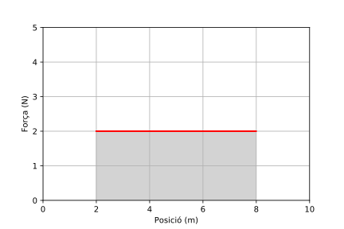
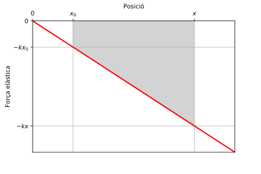

# Energia

Probablement el d'energia sigui el concepte més important de la ciència. Tot l'univers està format només d'energia, el que passa és que es manifesta de diferents maneres. Quan parlem de matèria també estem parlant d'energia, avui sabem que la matèria és energia encapsulada i, gràcies a la famosa equació d'Einstein, $E=mc^{2}$, coneixem la seva equivalència. L'energia es manifesta en moltes altres formes, però que són més intangibles que la matèria, com ser el moviment, la compressió d'una molla, les ones electromagnètiques, la energia associada a l'atracció gravitatòria, etc.

Per aquest motiu el concepte d'energia resulta més abstracte i difícil d'entendre, ja que l'energia no només pot ser una cosa, sinó també un procés, com si fos un substantiu i un verb alhora. Les coses tenen energia però on nosaltres no la veiem i només ens adonem de la seva existència quan aquesta es transforma o es transfereix. Quan ens freguem les mans, aquest moviment és una forma d'energia, i nosaltres sentim com les nostres mans comencen a escalfar-se. Aquest és un exemple de transformació de l'energia, on l'energia del moviment de les nostres mans es transforma en energia tèrmica que fa pujar la temperatura de les nostres mans. Els processos de transformació es troben a tot arreu a la natura, nosaltres, per exemple, obtenim l'energia per viure a través de la digestió dels aliments. En aquesta unitat estudiarem aquest concepte, sobre tot, limitat a l'estudi del moviment. Per començar definirem un concepte relacionat amb l'energia, el concepte de treball.

## Treball

Veurem com el concepte d'energia està relacionat amb el concepte de treball d'una força. Abans de veure aquesta relació però, haurem de definir el treball. Si considerem el cas d'una força constant, $\vec{F}$, que actua sobre un cos, i aquest es desplaça produint un vector desplaçament, $\Delta\vec{r}$, direm que el treball, W, produït per la força sobre el cos resulta igual al producte escalar del vector força per el vector desplaçament

$$W=\vec{F}·\Delta\vec{r}$$

Com ho diu el seu nom el resultat d'aquest producte escalar és una magnitud escalar, i les seves unitats de mesura són newton $\times$ metre, que rep el nom de joule $(1\mathrm{Nm=1J})$ en el Sistema Internacional.

Per a fer el càlcul del treball utilitzarem la definició de producte escalar, que resulta igual a la multiplicació dels mòduls dels vectors multiplicats pel cosinus de l'angle format entre ells, així, 

$$W=\left|\vec{F}\right|\left|\Delta\vec{r}\right|\cos\alpha$$

És important destacar que aquesta definició de treball serveix per a una força constant. En la figura següent es veu una situació on la força forma un angle $\alpha$ amb el desplaçament.

<figure>
  
  <figcaption> <strong>Cas en que la força aplicada a un cos i el seu desplaçament no són paral·lels. L'angle format entre ells és $\alpha$.</strong> </figcaption>
</figure>

És important destacar que una força no realitza treball si la seva direcció és perpendicular al desplaçament, ja que en aquest cas l'angle és $\alpha=90^{\circ}$ i $\cos(90^{\circ})=0$.

A la figura inferior es veu un home que porta una maleta a la ma, si es desplaça a velocitat constant, l'única força que ha de fer és la necessària per a equilibrar el pes de la maleta, per tant, essent la força perpendicular al desplaçament, l'home no fa treball en el sentit que li dona la física a aquest concepte, però, això no vol dir que no hagi de fer un esforç físic per desplaçar la maleta. En aquest exemple es veu com moltes vegades, els conceptes físics no coincideixen amb la utilització popular dels termes. Amb el concepte d'energia també hi ha molts malentesos. 

<figure>
  
  <figcaption> <strong>L'home de la imatge porta una maleta a la ma i camina a velocitat constant. La força que ha de fer per portar la maleta és perpendicular a la direcció del desplaçament, per tant, no fa treball.</strong> </figcaption>
</figure>

Considerem una força constant, de mòdul $F$, que produeix un desplaçament, de mòdul $\Delta x$, en la mateixa direcció i sentit que la força. En aquest cas el treball resulta igual a 

$$W=F\Delta x$$

ja que l'angle format entre la força i el vector desplaçament es zero i, el seu cosinus és igual a 1. A la gràfica de la figura de sota tenim un exemple en el qual hi ha una força de 2 N paral·lela a la direcció del desplaçament que actua sobre un cos i produeix un moviment que fa que el cos passi de la posició $x=2\,\mathrm{m}$ a la posició $x=8\,\mathrm{m}$, produint un desplaçament $\Delta x=6\,\mathrm{m}$.

<figure>
  
  <figcaption> <strong>El treball d'una força constant, $F=2\,\mathrm{N}$, que actua entre les posicions $x_{0}=2\,\mathrm{m}$ i $x=8\,\mathrm{m}$, és igual a l'àrea ombrejada, es a dir, $12\,\mathrm{J}$. </strong> </figcaption>
</figure>

El treball resulta igual a $W=12\,\mathrm{J}$. El valor del treball resulta igual a l'àrea que hi ha sota la gràfica de la força. Aquesta interpretació del treball com l'àrea sota la gràfica de força-posició resulta completament general i la podem utilitzar per fer el càlcul de treball de forces que no siguin constants.

## Energia cinètica

Considerem un cos que està sotmès a una força total constant, en aquest cas el cos experimenta un moviment rectilini uniformement accelerat i resulta vàlida la següent relació, 

$$v^{2}-v_{0}^{2}=2a\Delta x$$

Si multipliquem ambdues bandes de la relació anterior per la massa del cos i dividim per 2 ens queda:

$$\frac{1}{2}mv^{2}-\frac{1}{2}mv_{0}^{2}=ma\Delta x$$

Per la segona llei de Newton sabem que $F=ma$, per tant, a la banda de la dreta de l'equació tenim el treball de la força neta aplicada sobre el cos i a la banda esquerra hi ha la diferència d'una expressió, $\frac{1}{2}mv^{2}$, relacionada amb l'estat de moviment del cos entre l'estat final i inicial. Anomenarem a aquesta expressió energia cinètica, $E_{c}$:

$$E_{c}=\frac{1}{2}mv^{2}$$

De manera que el **treball total** efectuat sobre el cos resulta igual a la diferència d'energia cinètica entre l'estat final i inicial,

$$W_{T}=E_{c}(\mathrm{final})-E_{c}(\mathrm{inicial})$$

$$W_{T}=\Delta E_{c}$$

Aquesta igualtat es coneix com el **teorema del treball i l'energia cinètica**.

> És important notar que pel treball es compleix el principi de superposició, es a dir, el treball de la suma de forces aplicades sobre un cos resulta igual a la suma dels treballs individuals de totes les forces aplicades.
>

## Energia potencial

Hi ha interaccions que permeten als objectes emmagatzemar energia degut a la seva posició respecte a altre objecte. Aquesta energia emmagatzemada es diu energia potencial, degut a que l'objecte que la conté té el potencial de realitzar treball a càrrec de la seva energia potencial. 

### Energia potencial gravitatòria

Un exemple d'energia potencial és la gravitatòria, un objecte elevat (separat de la Terra) té el potencial de realitzar treball, ja que si deixem lliure l'objecte, comença a apropar-se a la terra degut a la seva força pes, realitzant treball.

Calculem el treball realitzat per la força pes sobre un cos de massa m en dos supòsits, en el primer cas baixant amb caiguda lliure, des d'una altura $h_{0}$ fins a arribar a una altura $h_{f}$, el treball resulta igual a:

$$W=\vec{P}.\Delta\vec{r}=-mg\Delta h=-\left[mgh_{f}-mgh_{0}\right]$$

on $g$ correspon al mòdul de l'acceleració de la gravetat. El treball resulta positiu, ja que $h_{f}<h_{0}$.

A la figura inferior es pot veure el primer cas a l'esquerra i a la dreta tenim el segon cas, on el cos baixa per un pla inclinat d'angle $\beta$. El treball el podem calcular com,

$$W=\vec{P}.\Delta\vec{r}=mg\left|\Delta\vec{r}\right|\cos(\alpha)=mg\left|\Delta h\right|=-mg\Delta h=-\left[mgh_{f}-mgh_{0}\right]$$

on hem utilitzat que $|\Delta \vec{r}| \cos(\alpha) = |\Delta h|$. 

<figure>
  
  <figcaption> <strong>El treball de la força pes no depèn del camí, tant si baixa verticalment, com si baixa pel pla inclinat el treball de la força pes només depèn de l'altura $\Delta h=h_{f}-h_{0}$.</strong> </figcaption>
</figure>

Podem confirmar que el resultat és coincident en ambdós casos i generalitzar que el treball de la força pes no depèn del camí sinó només de la diferència d'altura. Quan el treball d'una força no depèn del camí sinó només de les posicions inicial i final podem definir una funció anomenada energia potencial, la diferència de la qual avaluada entre la posició inicial i final, ens dona el treball realitzat per la força.

D'aquesta manera definim **energia potencial gravitatòria** o **energia potencial gravitacional** com

$$U_{g}=mgh$$

de manera que el treball de la força pes resulta

$$W=-\left(U_{g}(\text{final})-U_{g}(\text{inicial})\right)=-\Delta U_{g}$$

Dir que el treball de la força pes no depèn del camí és equivalent a dir que el treball de la força pes al llarg d'un camí tancat és igual a zero. Això es pot veure a la figura inferior, si el cos va pel camí 1 el treball de la força pes resulta

$$W_{AB}=U_{A}-U_{B}$$

i si ara torna pel camí 2 tenim que el treball resulta

$$W_{BA}=U_{B}-U_{A}$$

El treball anant pel camí 1 i tornant pel camí 2 (camí tancat) aleshores resulta nul

$$W_{ABA}=W_{AB}+W_{BA}=U_{A}-U_{B}+U_{B}-U_{A}=0$$

<figure>
  
  <figcaption> <strong>Si el treball no depèn del camí, aleshores el treball al llarg d'un camí tancat és nul, ja que al tenir els mateixos punts de partida i final, l'energia potencial inicial i final són iguals i la seva diferència dona zero.</strong> </figcaption>
</figure>

### Energia potencial elàstica

L'energia potencial gravitatòria no és pas l'única interacció per a la qual podem definir una energia potencial. La força elàstica també té la característica de que el treball que realitza només depèn de les posicions inicial i final. A la figura següent podem veure com varia la força elàstica en funció de la posició. Considerem el cas d'un cos lligat a una molla i volem calcular el treball fet per la força elàstica sobre el cos quan el cos es mou des de la posició $x_{0}$ fins a la posició $x$. La força elàstica segueix la llei d'Hooke $(F_{e}=-kx)$, es a dir, resulta proporcional a l'apartament respecte de la posició d'equilibri que s'obté quan la molla es troba amb la seva longitud lliure. 

<figure>
  
  <figcaption> <strong>El treball de la força elàstica sobre un cos que es mou des de la posició $x_{0}$ fins a la posició x equival a l'àrea indicada a la figura.</strong> </figcaption>
</figure>

El treball de la força elàstica es pot obtenir calculant l'àrea indicada a la gràfica de la figura següent. Per fer el càlcul podem calcular l'àrea del triangle amb vèrtexs $(0,x,-kx)$ i restar-li la del triangle de vèrtexs $(0,x_{0},-kx_{0})$:

$$W=\left(\frac{-kx.x}{2}\right)-\left(\frac{-kx_{0}.x_{0}}{2}\right)=-\left(\frac{1}{2}kx^{2}-\frac{1}{2}kx_{0}^{2}\right)$$

Queda palès que el treball de la força elàstica només depèn de la posició inicial i final. Seguint el mateix raonament que per a la força gravitatòria podem definir una energia potencial elàstica com

$$U_{e}=\frac{1}{2}kx^{2}$$

Amb aquesta definició resulta que el treball de la força elàstica és igual a

$$W=-\left(U_{e}(\text{final})-U_{e}(inicial)\right)=-\Delta U_{e}$$

## La conservació de l'energia

Hem vist que hi ha algunes interaccions per a les quals es poden definir unes funcions anomenades energies potencials. L'hem vist pel cas de la interacció gravitatòria i de l'elàstica, n'hi ha d'altres i les veurem més endavant. Aquest tipus d'interaccions tenen una gran importància i es coneixen com interaccions conservatives o forces conservatives i a continuació investigarem el perquè d'aquesta denominació.

Dividirem les forces en dos conjunts, el conjunt de les forces per a les que el treball no depèn del camí i per a les quals podem definir una energia potencial, que anomenarem forces conservatives, i la resta, que anomenarem forces no conservatives o forces dissipatives.

Més amunt hem deduït el teorema del treball i l'energia cinètica, que deia que el treball de la suma de totes les forces és igual a l'increment de l'energia cinètica:

$$W(\text{totes})=\Delta E_{c}$$

Ara també podem establir que el treball de les forces conservatives és igual a l'increment de l'energia potencial canviat de signe:

$$W(\text{conservatives})=-\Delta U$$

Si restem membre a membre ambdues equacions tenim:

$$W(\text{no conservatives})=W(\text{totes})-W(\text{conservatives})=\Delta E_{c}+\Delta U$$

Si definim energia mecànica com la suma d'energia potencial més energia potencial, tenim:

$$E_{M}=E_{c}+U=\frac{1}{2}mv^{2}+U$$

on l'energia potencial correspon a la suma de totes les energies potencials que corresponguin. Amb aquesta definició arribem al teorema de conservació de l'energia mecànica, ja que si totes les forces que atuen sobre un sistema són conservatives, el treball de les forces no conservatives és nul i així també la variació de l'energia mecànica. Per tant, si les forces que actuen són totes conservatives (o si hi ha de no conservatives, no fan treball perquè són perpendiculars al desplaçament com la forces de contatcte, per exemple), l'energia mecànica és una constant de moviment, es conserva: 

$$\Delta E_{M}=0$$

Quan parlem de forces no conservatives o dissipatives volem dir que són forces que no conserven l'energia mecànica però això no vol dir que si comptabilitzem totes les altres formes possibles d'energia l'energia no es conservi. Per exemple, si considerem el moviment d'un cos sobre el terra, veurem que després de recórrer una certa distància acaba aturant-se. Això passa perquè sobre el cos actua una força dissipativa, la força de fregament, que fa que l'energia mecànica no es conservi. On ha anat a parar aquesta energia? Va desaparèixer? En realitat no, el que passa en aquest cas és que l'energia mecànica que es perd, en realitat es transforma en energia tèrmica que es transfereix al medi i al mateix cos. Aquesta energia térmica el que fa és agitar més violentament les molècules que formen part del cos i el medi al seu voltant que acaben movent-se amb més velocitat, per tant, a nivell microscòpic l'energia tèrmica és l'energia cinètica de les partícules que formen la matèria. Per tant, si comptabilitzem totes les formes d'energia podem dir que l'energia sempre es conserva.

## Forces dissipatives

Quan vam trobar les forces conservatives, vam veure que una característica fonamental d'aquestes forces és que el treball que fan quan recórren un camí tancat resulta nul. Podem veure que el treball que fa la força de fregament quan recórre un camí tancat resulta no nul. Considerem un cos que es mou cap a la dreta fregant amb el terra, la força de fregament s'oposarà al lliscament de superfícies i per tant tindrà sentit contrari al desplaçament i el treball resultant serà negatiu. Si ara fem que el cos desfaci el seu camí tornant enrrere, el desplaçament canviarà de sentit però també ho farà la força, de manera que el treball tornarà a ser negatiu i el resultat al cap de fer un camí tancat no resultarà nul.
