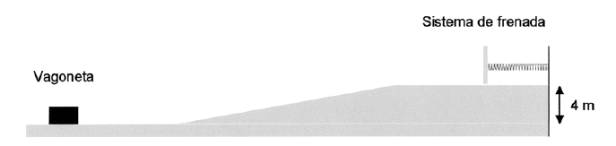

# Problemes Unitat 3: Principis de conservació

## Quantitat de moviment

1. Una persona, la massa de la qual és de 60 kg, es troba en mig d'un llac glaçat, sense fricció. Aquesta persona té, en les seves mans, una capsa de 5 kg de massa. Si llença la capsa horitzontalment, la persona adquireix una velocitat de 0,5 m/s en sentit contrari. Aleshores, arriba a la conclusió de que la capsa ha estat llençada amb una velocitat de:
    1. 6 m/s
    2. 0,5 m/s
    3. 60 m/s
    4. 10 m/s
    2. 2 m/s
    
<a href="sol/prob322.pdf">Solució</a>

2. Un cos de massa $$m=6\,\mathrm{kg}$$ es mou amb una velocitat $$v_{0}=2\,\mathrm{m/s}$$ quan comença a rebre una força $$F$$ variable en el temps segons la gràfica que s'observa a continuació.
    

    Tenint en compte la informació proporcionada determineu:
    1. L'impuls total proporcionat al cos per la força $$F$$.
    2. La velocitat del cos quan $$t=3\,\mathrm{s}$$.
    3. La velocitat del cos quan $$t=6\,\mathrm{s}$$.
    
<a href="sol/prob323.pdf">Solució</a>

3. En un joc de fira disparem un petit balí de plom de 8 g de massa amb una escopeta d’aire comprimit de 3,5 kg de massa. El balí surt amb una velocitat de 68 m/s, i sabem que la força impulsora ha actuat durant un temps de 0,085 s. 
    1. Quina força mitjana s’ha efectuat sobre el balí?
    2. Quina és la velocitat de retrocés del fusell?
    

    
<a href="sol/prob324.pdf">Solució</a>

    ## Treball i energia

4. Un cos de 2 kg, inicialment en repòs, baixa per un pla inclinat 42º respecte de l'horitzontal. Després de recórrer una distància de 3 m sobre el pla inclinat, arriba a un terra horitzontal i, finalment, puja per un altre pla inclinat 30º respecte de l'horitzontal (observa el dibuix). 
	

    Suposant que els efectes del fregament són negligibles, calcula: 
    1. El temps que triga a arribar al peu del primer pla inclinat i la velocitat del cos en aquest moment.
    2. La màxima longitud recorreguda pel cos en la pujada pel pla inclinat de la dreta. 
    3. Si el coeficient de fregament entre el cos i el primer pla inclinat fos $$\mu=0,4$$; quanta energia s'alliberaria en forma de calor des de l'instant inicial fins a arribar al peu del primer pla inclinat?
    
<a href="sol/prob401.pdf">Solució</a>

5. La figura representa la vessant d'una muntanya, sobre la qual llisca amb fregament menyspreable un esquiador de 80 kg. Sabem que passa pel punt A amb una velocitat de 5 m/s, i que passa pel punt C amb una velocitat de 10 m/s.
    1. Determineu l'energia potencial gravitatòria, l'energia cinètica i l'energia mecànica de l'esquiador en els punts indicats.
    2. Determineu la velocitat en els punts B, D, E i F.
    3. Trobeu la distància que necessitarà per aturar-se si, a partir del punt F actua una força de fregament constant de 500 N.
    

    
<a href="sol/prob402.pdf">Solució</a>

6. Des de la part superior d’un pla inclinat, d’angle 37° amb el pla horitzontal i longitud 5 m, deixem caure una partícula de massa 10 kg. La partícula arriba a la part inferior del pla inclinat amb una velocitat de 6 m/s.
    1. Quant val el treball que la força pes ha fet sobre la partícula en aquest trajecte?
    2. Quant val el treball fet per la força de fregament?
    
<a href="sol/prob403.pdf">Solució</a>

7. En la gràfica següent es mostra com varia l’acceleració d’un cos de massa 10 kg que es mou en línia recta. Quin treball s’ha efectuat sobre el cos per a moure’l des de $$x=0$$ fins a $$x=8\,\mathrm{m}$$?
    

    
<a href="sol/prob404.pdf">Solució</a> 

8. Un bloc de massa 20 kg cau lliscant per un pla inclinat, salvant un desnivell de 25 m. Si parteix del repòs i assoleix una velocitat final de 15 m/s, determineu l’energia perduda per fricció. 
    
<a href="sol/prob405.pdf">Solució</a>

9. Deixem anar un cos d’1 kg de massa des del punt A, situat sobre una pista constituïda per un quadrant de circumferència de radi $$R=1,5\,\mathrm{m}$$ i en la qual es considera negligible el fregament, tal com es veu a la figura de sota. Quan el cos arriba a la part inferior del quadrant (punt C), llisca sobre una superfície horitzontal fins que queda aturat a una distància de $$2,7\,\mathrm{m}$$ del punt C. Trobeu: 
    1. La velocitat del cos en el punt C.
    2. El coeficient de fregament cinètic entre la pista i el cos a la part horitzontal.
    3. La força que fa el cos sobre la pista quan passa pel punt B.
    

    
<a href="sol/prob406.pdf">Solució</a>

10. La gràfica representa la força que cal fer per a estirar una molla en funció de l’allargament. Quina és la constant recuperadora de la molla? Quin treball cal fer per a estirar la molla 30 cm a partir de la seva longitud natural?
    

    
<a href="sol/prob407.pdf">Solució</a>

11. Una vagoneta de fira de massa 100 kg es troba damunt d’una pista sense fregament. El tram inicial de la pista és horitzontal. A mig camí, la pista fa pujada fins a un segon tram horitzontal, al final del qual hi ha un sistema de frenada consistent en una molla de constant elàstica $$k=10000\,\mathrm{N/m}$$. La diferència d’altura entre els dos trams horitzontals és de 4 m.
    

    Si el sistema de frenada es comprimeix 1,5 m, calculeu: 
    1. La velocitat de la vagoneta just abans de començar a comprimir el sistema de frenada.
    2. La velocitat de la vagoneta just abans de començar a pujar la rampa.
    3. L’energia mecànica total de la vagoneta en el primer tram horitzontal.
    
<a href="sol/prob408.pdf">Solució</a>

12. Una vagoneta que pesa 500 N es troba inicialment en repòs al capdamunt d’una rampa de 20 m de llargada, 30° d’inclinació amb l’horitzontal i coeficient de fricció $$\mu=0,2$$. La vagoneta es deixa lliure i al final de la rampa continua el seu moviment sobre un pla horitzontal sense fricció, on topa amb una molla de constant recuperadora $$k=7\times10^{4}\,\mathrm{N/m}$$.
    Calculeu:
    1. La velocitat amb què la vagoneta arriba al final de la rampa.
    2. El temps que la vagoneta triga a arribar al final de la rampa.
    3. La deformació màxima que es produeix en la molla, si no s’ha perdut energia mecànica en la col·lisió.
    Considereu $$g=10\,\mathrm{m/s^{2}}$$.
    

    
<a href="sol/prob409.pdf">Solució</a>

13. En una atracció de fira, una vagoneta de massa $$M=300\,\mathrm{kg}$$ arrenca del repòs en el punt A i arriba al punt B amb una velocitat de $$10\,\mathrm{m\cdot s^{-1}}$$, després de recórrer el circuit representat en la figura. Preneu $$g=10\,\mathrm{m\cdot s^{-2}}$$ i calculeu: 
    1. El treball fet pel pes de la vagoneta des del punt A fins al punt B.
    2. La quantitat de calor alliberada, com a conseqüència del fregament, en el descens de A a B.
    3. El valor de la força de contacte entre la vagoneta i el punt B de la pista, si tenim en compte que el punt B és el punt més baix d’un arc de circumferència de 6 m de radi.
    

    
<a href="sol/prob410.pdf">Solució</a>

14. Una vagoneta d'unes muntanyes russes amb els seus passatgers té una massa total de 400 kg. Quan es troba en un punt de la seva trajectòria a 6 m d'alçada sobre el terra, la seva velocitat és de 12 m/s. 
	

	Si no perdés energia per fregament: 
	1. Quina seria la seva velocitat en el punt situat a 10 m d'alçada?
    2. Quina velocitat tindrà a nivell del terra?
    3. Quina és l'alçada màxima que podria assolir?
    
<a href="sol/prob411.pdf">Solució</a>

	## Xocs

15. Un cos de 8 kg de massa té una velocitat de 10 m/s i xoca frontalment amb un objecte de 12 kg que es troba aturat. Si el xoc és totalment inelàstic, calcula:
	1. La quantitat de moviment del sistema abans i després del xoc.
    2. La velocitat del sistema després del xoc.
    3. La pèrdua d'energia en el procés.
	
<a href="sol/prob412.pdf">Solució</a>

16. Un vagó de massa 1.000 kg es desplaça a una velocitat constant de 5 m/s per una via horitzontal sense fricció. En un moment determinat xoca amb un altre vagó de massa 2.000 kg que estava aturat, de manera que després de la col·lisió queden units. Calculeu: 
	1. La velocitat que tindrà el conjunt després del xoc.
	2. L’energia mecànica perduda en el xoc.
	
<a href="sol/prob413.pdf">Solució</a>

17. Una massa $$m_{1}=200\,\mathrm{g}$$ es troba en repòs sobre una superfície horitzontal, sense fricció apreciable, unida a l’extrem d’una molla de massa negligible que per l’altre extrem està unida a una paret i inicialment no està ni comprimida ni estirada. Una segona massa $$m_{2}=600\,\mathrm{g}$$ es desplaça sobre la mateixa superfície amb una velocitat $$v=4\,\mathrm{m/s}$$ en el sentit indicat en la figura i experimenta un xoc frontal, perfectament inelàstic, amb $$m_{1}$$. La constant recuperadora de la molla val $$k=500\,\mathrm{N/m}$$.
	

    Calculeu:
	1. L’energia mecànica perduda en el xoc.
    2. La compressió màxima de la molla.
	3. La velocitat del sistema quan el desplaçament, mesurat des del punt on es produeix el xoc, és de 6 cm.
	

