# Les ones i el so
Els fenòmens ondulatoris s’han demostrat com una forma fonamental del comportament de la natura. Abans es creia que la natura estava constituïda per matèria i que els fenòmens ondulatoris eren una de les possibles manifestacions de la matèria. Actualment sabem que la natura està constituïda per ones i que la matèria és una de les seves manifestacions. Podem dir que els fenòmens ondulatoris constitueixen una característica fonamental de la natura.

#### Continguts

* [Fenòmens periòdics i oscil·lacions](#1)
    * [Període i freqüència](#1.1)
* [Moviment harmònic simple (MHS)](#2)
    * [L'Equació del moviment harmònic simple](#2.1)
    * [Velocitat i acceleració](#2.2)
    * [Oscil·lació d'una molla](#2.3)
    * [El pèndol senzill](#2.4)
    * [L'energia del moviment harmònic simple](#2.5)
* [Moviment ondulatori](#3)
    * [La matèria no és pas l'única cosa que es desplaça per l'espai](#3.1)
    * [Característiques del moviment ondulatori](#3.2)
    * [Classificació de les ones](#3.3)
* [Tractament matemàtic de les ones](#4) 
    * [Les ones harmòniques](#4.1)
* [Fenòmens ondulatoris](#5)
    * [Principi de Huygens](#5.1)
    * [Reflexió](#5.2)
    * [Refracció](#5.3)
    * [Difracció](#5.4)
    * [Interferència](#5.5)
        * [L'experiment de Young](#5.5.1)
    * [Ones estacionàries](#5.6)
    * [Efecte Doppler](#5.7)
    * [Intensitat d'una ona](#5.8)
* [El so](#6)
    * [Nivell d'intensitat sonora](#6.1)
    * [Ones estacionàries en instruments musicals](#6.2)
        * [Modes normals de vibració en cordes](#6.2.1)
        * [Modes normals de vibració en tubs oberts per un extrem i tancats per l’altre](#6.2.2)
        * [Modes normals de vibració en tubs oberts pels dos extrems](#6.2.3)
* [Formació d'imatges](#7)
    * [Llei de la reflexió](#7.1)
    * [Refracció de la llum](#7.2)
        * [Índex de refracció](7.2.1)
        * [Reflexió total interna](#7.2.2)
        * [Miralls esfèrics](#7.3)
    * [Lents](#7.4)
    * [La visió i l'ull](#7.5)
    

## Fenòmens periòdics i oscil·lacions 

Els fenòmens periòdics són aquells que es repeteixen en el temps, sempre de la mateixa manera. El moviment de la Terra al voltant del Sol o el de la Lluna al voltant de la Terra són exemples de moviments periòdics.<a href="#fn1" id="ref1">1</a>

Aquests tipus de moviments són molt abundants a la natura. Gràcies als fenòmens periòdics podem mesurar el temps.

Hi ha fenòmens periòdics que es poden propagar en l'espai als que anomenem ones periòdiques. Els nostres sentits més utilitzats, la vista i la oïda, estan adaptats per a detectar aquests tipus de fenòmens periòdics, la llum i el so.

Les ones no només transmeten informació sinó també energia, gairebé tota la energia que fem servir prové, directa o indirectament, del Sol en forma d'ones.

<figure>
  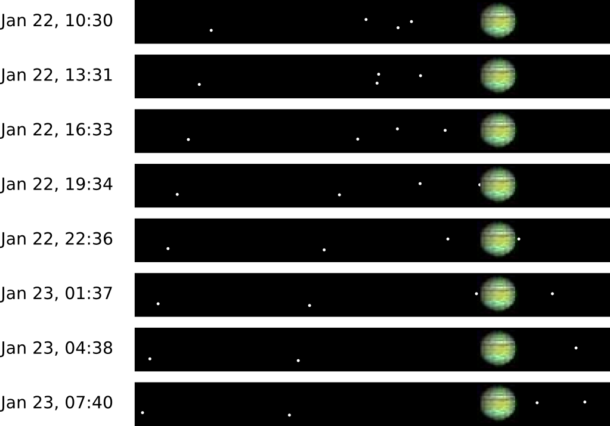
  <figcaption> En la seqüència es pot observar el moviment dels satèl·lits jovians al voltant de planeta. </figcaption>
</figure>

### Període i freqüència 

En els moviments periòdics hi ha magnituds que varien amb els temps, tot i això arriba un moment en que aquestes magnituds tornen a prendre el valor inicial i, a partir d'aquell moment, repeteixen els mateixos valors. Diem aleshores que s'ha completat un cicle.

En els moviments periòdics s'anomena període, T, al temps que dura un cicle. Si mesurem el temps $$\Delta t$$ que tarda un sistema en fer $$n$$ cicles podem obtenir el valor del període com

$$T=\frac{\Delta t}{n}$$
 
Una magnitud relacionada amb el període és la freqüència, $$\nu$$, que correspon al nombre de cicles que es fan per unitat de temps i es mesura en $$\mathrm{s^{-1}}$$ o hertz (Hz): 

$$\nu=\frac{n}{\Delta t}$$

i que està relacionada amb el període a través de la relació

$$\nu=\frac{1}{T}\;\;\;\;\;\;(1)$$

## Moviment harmònic simple (MHS) 

Entre els moviments oscil·latoris el més senzill de descriure matemàticament és el moviment harmònic simple. El físic i matemàtic francès [Jean Baptiste Fourier](http://ca.wikipedia.org/wiki/Jean_Baptiste_Joseph_Fourier) va demostrar que qualsevol moviment oscil·latori es pot descompondre en una suma de moviments harmònics simples, això fa que el seu estudi sigui fonamental per a la comprensió de qualsevol moviment oscil·latori.

Definim el MHS com la projecció d'un moviment circular uniforme sobre la recta continguda en el pla de la seva trajectòria. En la figura següent podem veure las posicions que adopta un mòbil amb MHS per a diferents instants de temps. Si tenim en compte que cada punt està separat del següent per un interval de temps sempre igual ens podem adonar que el MHS té velocitat més gran en la part central que en els extrems.

<figure>
  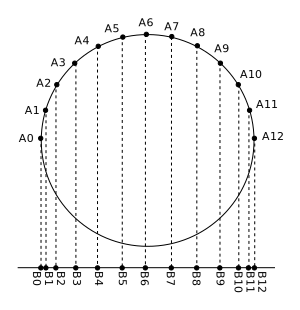
  <figcaption> En la figura es poden veure posicions successives (A0, A1, A2, ...) d'un mòbil amb moviment circular a intervals iguals de temps . La seva projecció sobre la recta (B0, B1, B2, ...) descriu un MHS. La freqüència angular del MHS coincideix amb la velocitat angular del moviment circular. </figcaption>
</figure>

### L'equació del moviment harmònic simple 

Si tenim en compte la definició de MHS com la projecció d'un moviment circular uniforme podem deduir l'equació de moviment del MHS. Considerem un moviment circular de radi A amb velocitat angular $$\omega$$, l'angle girat durant un temps $$t$$ serà $$\varphi=\omega t$$ i la projecció sobre la recta serà 

$$x=A\sin(\varphi)=A\sin(\omega t)\;\;\;\;\;\;(2)$$

Direm que $$\varphi$$ és la fase del MHS i, com veiem, és una funció del temps. El moviment està limitat a moure's dintre del rang [-A, A]. La posició del mòbil es coneix com elongació i anomenarem amplitud de l'oscil·lació a la quantitat A, 
que correspon a l'elongació màxima. La freqüència angular, $$\omega$$, del MHS coincideix amb la velocitat angular del MCU generatriu. De l'equació (2) veiem que l'elongació corresponent a l'instant inicial $$(t=0)$$ és igual a zero i això pot ser diferent si el moviment comença des d'una altra posició. Per aquest motiu no podem considerar l'equació (1) com a una equació general per a descriure un MHS. Per a poder tenir una descripció general del MHS hem de donar a l'equació la llibertat de prende qualsevol valor inicial entre -A i A. Això ho podem aconseguir afegint una constant de fase o fase inicial, $$\varphi_{0}$$, a la fase $$\varphi$$ de l'equació (2). D'aquesta manera ens queda:

$$x=A\sin(\omega t+\varphi_{0})\;\;\;\;\;\;(3)$$

on $$A$$, $$\omega$$ i $$\varphi_{0}$$ són paràmetres constants. Un cop determinats aquests paràmetres el MHS queda completament determinat. 

El moviment es torna a repetir quan ha passat un temps $$T$$ al que anomenem període de manera que s'ha de complir que $$\omega T=2\pi$$ expressió que relaciona el període amb la freqüència angular. Tenim, doncs

$$T=\frac{2\pi}{\omega}$$

Utilitzant la relació (1) també podem escriure 

$$\omega=2\pi\nu$$

### Velocitat i acceleració 

Un cop tenim l'equació de moviment (3) que ens dóna la posició del mòbil com a funció del temps, podem deduir l'equació de la velocitat perquè sabem que la derivada de la posició ens dóna la velocitat. Si prenem la derivada de l'equació (3) obtenim

$$v=\frac{dx}{dt}=A\omega\cos(\omega t+\varphi_{0})$$
 

Veiem que la velocitat també varia periòdicament amb el temps i prenent com a valor màxim

$$v_{\mathrm{max}}=A\omega\;\;\;\;\;\;(4)$$

Si ara prenem la derivada de la velocitat obtindrem l'acceleració com a funció del temps

$$a=\frac{dv}{dt}=-A\omega^{2}\sin(\omega t+\varphi_{0})\;\;\;\;\;\;(5)$$

En aquest cas obtenim que l'acceleració es comporta de manera contraria a l'elongació, quan l'elongació pren el seu valor màxim positiu, l'acceleració pren el valor màxim però negatiu. L'acceleració pren el seu valor màxim

$$a_{\mathrm{max}}=A\omega^{2}$$

quan $$\sin(\omega t+\varphi_{0})=-1$$.

### Oscil·lació d'una molla 

Si comparem l'equació (3) amb l'equació (5) veiem que l'acceleració està relacionada amb l'elongació a través de l'expressió <a href="#fn2" id="ref2">2</a>

$$a=-\omega^{2}x\;\;\;\;\;\;(6)$$  

Si multipliquem l'acceleració per la massa del cos que es mou seguint un MHS i apliquem la segona llei de Newton obtenim la força que actua sobre la massa

$$F=ma=-m\omega^{2}x\;\;\;\;\;\;(7)$$  
 
Veiem de l'expressió (7) que la força és proporcional a l'elongació. Però nosaltres ja coneixem un sistema per al qual la força resulta proporcional a l'elongació, es tracta de la molla, que segueix la llei de Hooke:

$$F=-kx\;\;\;\;\;\;(8)$$  

on $$k$$ és la constant elàstica. Veiem que si apartem una molla de la seva posició d'equilibri i la deixem anar, aquesta descriurà un MHS. Si igualem l'equació (7) amb l'equació (8) obtenim que 

$$k=m\omega^{2}\;\;\;\;\;\;(9)$$  

que relaciona els valors de la constant elàstica de la molla i la massa unida a ella amb la freqüència angular amb la que oscil·larà la molla. Reagrupant els factors podem obtenir la freqüència angular d'oscil·lació

$$\omega=\sqrt{\frac{k}{m}}\;\;\;\;\;\;(10)$$ 

<figure>
  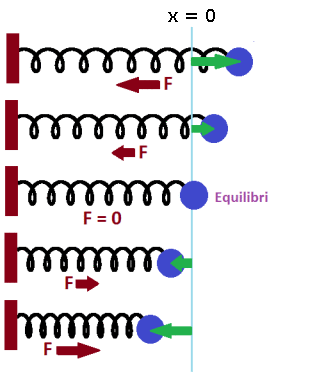
  <figcaption> Oscil·lació d'una molla. La força resulta proporcional a l'elongació i intenta restaurar l'equilibri. El moviment resultant és un MHS, la freqüència angular del qual està relacionada amb la constant elàstica, k, de la molla i de la massa, m, unida a ella a través de l'equació (10).</figcaption>
</figure>

### El pèndol simple 

Anomenarem pèndol simple a un cos petit (que considerarem puntual) que penja d'un fil inextensible i de massa negligible. Si enganxem l'extrem lliure del fil del sostre i el deixem penjar amb la massa en l'altre extrem, el fil tindrà una posició vertical. Si apartem el fil una mica d'aquesta posició vertical i el deixem lliure començarà a moure's fent un moviment oscil·latori. Demostrarem aquí que, sota determinades condicions, aquest moviment serà un MHS.

El pèndol de la figura té una longitud L. Per a veure quin tipus de moviment tindrà el pèndol mirarem a quines forces està sotmès. Les úniques interaccions a les que està sotmès són el pes de la massa m i la tensió del fil. Si descomposem la força pes en les direcció radial i tangencial veiem que la força que produeix el moviment és la component tangencial (la component radial del pes i la tensió del fil es resten, donat coma resultat la força centrípeta que produeix la curvatura de la trajectòria). Per tant, la força motriu serà:

$$F=ma_{t}=-mg\sin(\varphi)$$

on $$g$$ correspon al mòdul de l'acceleració de la gravetat. El signe negatiu apareix per a indicar que la força té el signe contrari a l'angle, que és positiu en el sentit contrari al de les manetes del rellotge.

Per tant, l'acceleració serà

$$a_{t}=-g\sin(\varphi)\;\;\;\;\;\;(11)$$ 
 
 
<figure>
  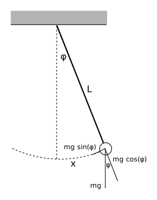
  <figcaption> Pèndol simple de longitud L.</figcaption>
</figure>
 

Si considerem oscil·lacions petites podem fer la següent aproximació

$$\sin(\varphi)\simeq\varphi$$
 

Hauríem d'aclarir què volem dir amb oscil·lacions petites. Farem una taula amb els valors de $$\varphi$$ i de $$\sin(\varphi)$$:

|$$\varphi$$ (graus)|$$\varphi$$ (rad)|$$\sin(\varphi)$$|
|-----------------|---------------|---------------|
|0                |0              |0              |
|1	              |0,017453	      |0,017452       |
|5	              |0,087266	      |0,087155       |
|10	              |0,174532	      |0,173648       |
|20	              |0,349066	      |0,342020       |
|30	              |0,523598	      |0,500000       |

Podem considerar oscil·lacions d'amplituds petites les que tenen un apartament de la vertical més petit que $$10^{\circ}$$, ja que la diferència entre l'angle i el seu sinus està en el quart decimal. Com sempre tot depèn de la precisió amb la que volem mesurar l'elongació però, per a angles per sota dels 10 graus l'aproximació resulta prou bona. Fent l'aproximació, l'equació (11) es transforma en

$$a_{t}=-g\varphi$$

Si tenim en compte la definició d'angle mesurat en radiants com el quocient de l'arc respecte del radi

$$\varphi=\frac{x}{L}$$

Podem escriure l'acceleració com

$$a_{t}=-g\frac{x}{L}$$

Agrupant les constants ens queda

$$a_{t}=-\frac{g}{L}x$$

una relació on l'acceleració es proporcional a l'elongació i de signe contrari. Ja havíem vist que aquest tipus de relació segueix un MHS (veure equació (6). Si igualem ambdues equacions obtenim que el moviment té una freqüència angular: 

$$\omega=\sqrt{\frac{g}{L}}$$

o, equivalentment un període

$$T=\frac{2\pi}{\omega}=2\pi\sqrt{\frac{L}{g}}$$

El període del pèndol per a oscil·lacions petites depèn només de la longitud del fil i de l'acceleració de la gravetat del lloc on es troba.

### L'energia del moviment harmònic simple 

Veurem ara com escriure l'energia associada a un MHS. Estudiarem el cas duna massa m
  unida a una molla que es mou sobre una superfície horitzontal com es veu a la figura de sota. Per a poder escriure els termes d'energia primer hem de mirar quin tipus d'interaccions suporta la massa. Podem apreciar a la figura que sobre la massa hi ha aplicades tres forces: el pes, la reacció normal de la superfície i la força elàstica. El pes i la reacció normal s'anul·len entre elles<a href="#fn3" id="ref3">3</a>, donant com a resultant que l'única força sobre la massa és la força elàstica.

<figure>
  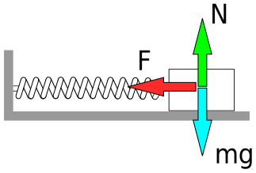
  <figcaption> Forces aplicades sobre una massa unida a una molla i en moviment sobre una superfície horitzontal.</figcaption>
</figure>

Ja sabem que la força elàstica és una força conservativa que té una energia potencial associada que podem expressar

$$U=\frac{1}{2}kx^{2}$$

on $$x$$ correspon a l'elongació i $$k$$ és la constant elàstica de la molla. Per tant l'energia mecànica del sistema es podrà escriure

$$E_{M}=E_{C}+U=\frac{1}{2}mv^{2}+\frac{1}{2}kx^{2}$$

on el primer terme correspon a l'energia cinètica i el segon a l'energia potencial.

Podem estudiar alguns casos particulars:

* Quan l'elongació és màxima tenim que $$v=0$$ i $$x=A$$, en aquest cas l'expressió de l'energia mecànica ens dóna 

$$E_{M}=\frac{1}{2}kA^{2}\;\;\;\;\;\;(12)$$ 

* Quan la massa passa pel punt d'equilibri (part central), la velocitat pren el seu valor màxim donat per l'equació (4) i l'elongació és nul·la, per tant, només tindrem energia cinètica

$$E_{M}=E_{C}=\frac{1}{2}mv_{\mathrm{max}}^{2}=\frac{1}{2}m(A\omega)^{2}\;\;\;\;\;\;(13)$$ 

Podem veure que si igualem les expressions de les energies mecàniques dels dos casos anteriors arribem a la igualtat

$$k=m\omega^{2}$$

expressió a la que ja hi havíem arribat en l'equació (9), la qual cosa demostra que les dues energies mecàniques són iguals i que és una constant de moviment. Per altra banda el fet de comptar amb una expressió per a l'energia potencial elàstica fa que aquesta sigui conservativa i, per tant, l'energia mecànica s'ha de conservar. Tant l'expressió (12), com la (13) ens serveixen per a calcular l'energia mecànica en qualsevol punt de la trajectòria degut a la seva constància i això ens serà de gran utilitat a l'hora de resoldre problemes.

## Moviment ondulatori 

Ja hem vist que el moviment oscil·latori és un moviment d'anada i tornada en el temps, un moviment de vaivé. Quan aquest moviment de vaivé es propaga per l'espai tenim el que anomenarem un moviment ondulatori. Podem dir, doncs, que el moviment ondulatori es un moviment de vaivé que es produeix tant en el temps com a l'espai. 

<figure>
  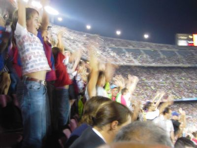
  <figcaption> L'onada a l'estadi Camp Nou.</figcaption>
</figure>

### La matèria no és pas l'única cosa que es desplaça per l'espai. 

Quan observem als estadis de futbol que els aficionats fan l'onada podem constatar que els aficionats no canvien de lloc, continuen en els seus seients. Però podem observar un gran moviment que travessa l'estadi, aquí tenim un exemple de transmissió de moviment per l'espai sense transferència de massa, ja que la gent s'aixeca i torna a seure-hi però no canvia de lloc. Les ones produeixen transport d'energia i no de massa.

<figure>
  
  <figcaption> Moviment de la gent quan fa l'onada als estadis. La gent no canvia de lloc, el moviment que genera no té transport de massa, només d'energia.</figcaption>
</figure>

### Característiques del moviment ondulatori 

Entre les característiques del moviment ondulatori destaquem:

* **Superposició**: Les ones verifiquen el principi de superposició, es a dir si tenim dues ones que es troben en la mateixa regió de l'espai, l'ona resultant serà la suma algebraica de les dues ones.

* **El medi no es transporta amb l'ona**: tal com ja hem dit, les ones no transporten matèria sinó energia (o informació).

* **La velocitat d'una ona depèn del medi de propagació**: Quan parlem d'una ona mecànica, la velocitat amb la que es propaga l'ona només depèn del medi. En el cas del so a l'aire dependrà de la densitat de l'aire, en cas d'ones en una corda, dependrà de la rigidesa de la corda, del seu gruix i la seva densitat. En el cas de la llum que també es pot propagar en el buit, també la seva velocitat depèn del medi.

### Classificació de les ones 

Segons les dimension en que es propaguen les podem classificar en:

**Ones unidimensionals** són les que es propaguen en una única direcció, com és el cas d'una ona en una corda.

**Ones_bidimensionals** són les que es propaguen sobre una superfície, com és el cas de les ones d'un líquid on la superfície del liquid defineix el pla de propagació.

**Ones_tridimensionals** són les que es propaguen per l'espai, com el so o la llum per l'aire.

Segons la direcció de la pertorbació respecte a la de propagació les ones es poden classificar en:

**Ones transversals**: Quan les ones es propaguen en una direcció perpendicular a la seva direcció de vibració diem que són ones transversals. Exemples d'ones transversals són les vibracions d'una corda o les ones electromagnètiques.

**Ones longitudinals**: Les ones longitudinals són pertorbacions que es propaguen en la mateixa direcció de la vibració. Un exemple típic d'aquest tipus d'ona és el so.

<figure>
  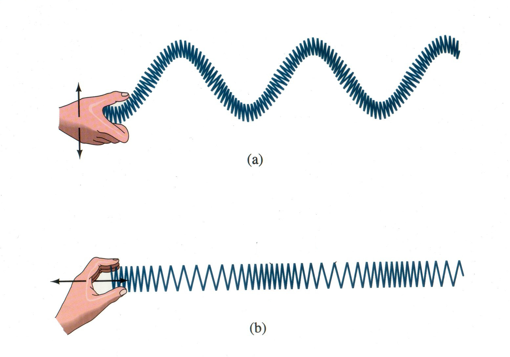
  <figcaption> Ones transversals (a) i longitudinals (b).</figcaption>
</figure>

Segons el medi de propagació podem classificar-les en:

**Ones_mecàniques**: Són aquelles que necessiten d'un medi per a propagar-se. Exemple d'aquest tipus d'ones són les ones de so, les ones del mar, etc. 

**Ones_electromagnètiques**: Són ones que no necessiten d'un medi per a propagar-se. La llum visibles és un exemple, però també els raigs X, els raigs infrarojos i les microones. 

Segons el temps de durada de la pertorbació que l'origina les podem classificar en:

**Polsos**: Un pols és una pertorbació de curta durada.

**Trens d'ones**: Els trens d'ones són pertorbacions que dura un interval de temps més o menys llarg. En aquest cas l'energia es proporciona de manera continuada i es genera una successió de polsos o tren d'ones. 

## Tractament matemàtic de les ones 

### Les ones harmòniques 

Ja hem vist com descriure matemàticament un moviment oscil·latori harmònic. Si ara considerem que aquest moviment harmònic es pot propagar per l'espai a una velocitat de propagació<a href="#fn4" id="ref4">4</a> $$v$$, volem obtenir una expressió matemàtica que pugui descriure la pertorbació tant en els temps com a l'espai.

Considerarem el moviment oscil·latori de l'extrem d'una corda. Aquest extrem es troba en la posició $$x=0$$, i en l'instant $$t=0$$ suposarem que es troba amb l'elongació màxima $$y=2\,\mathrm{m}$$.

Si, per exemple, pensem que la freqüència angular és de $$\pi/3$$, el moviment oscil·latori de l'extrem de la corda ens dona la gràfica de la figura.

<figure>
  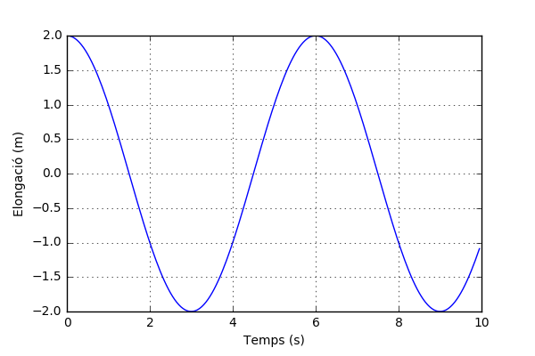
  <figcaption> Moviment vibratori de l'extrem d'una corda d'amplitud 2 m i període T = 6 s amb elongació màxima en l'instant inicial.</figcaption>
</figure>

Suposarem que l'ona generada per aquest moviment harmònic es propaga amb una velocitat $$v=0,5\,\mathrm{m/s}$$. Aleshores el màxim que tenim a la posició $$x=0$$ es trobarà a la posició $$x=1,5\,\mathrm{m}$$ al cap de 3 segons (veure Figura). Per tant per a descriure el comportament de l'ona en la posició $$x=1,5\,\mathrm{m}$$ hem de tenir un retràs de fase, ja que el moviment porta un retràs igual al temps que ha tardat la pertorbació a arribar a la posició $$x=1,5\,\mathrm{m}$$. El temps es pot calcular com 

$$t=\frac{x}{v}=\frac{1,5\,\mathrm{m}}{0,5\,\mathrm{m/s}}=3\mathrm{\,s}$$

<figure>
  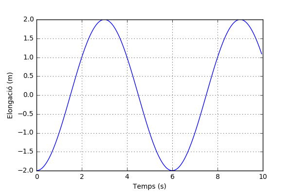
  <figcaption> Variació de l'elongació en el temps en un punt ubicat en la posició x = 1,5 m. Veiem com el màxim que es trobava en l'instant inicial en l'extrem de la corda (x = 0), ara el tenim en l'instant t = 3 s en la posició x = 1,5 m com a resultat de que la pertorbació va tardar 3 s en recórrer aquella distància a una velocitat de 0,5 m/s. </figcaption>
</figure>

Fent servir aquest raonament per a qualsevol posició genèrica $$x$$ podem obtenir l'equació d'ona

$$y=A\sin\big(\omega\big(t-\frac{x}{v}\big)+\varphi_{0}\big)$$

per a qualsevol parell de valors $$t$$ i $$x$$. 

Si distribuïm $$\omega$$ obtenim

$$y=A\sin\big(\omega t-\frac{\omega}{v}x+\varphi_{0}\big)$$

Anomenarem **nombre d'ona**, $$k$$, a la quantitat 

$$k=\frac{\omega}{v}$$

que té unitats de rad/m i, per tant, en queda l'equació d'ones

$$y(x,t)=A\sin\big(\omega t-kx+\varphi_{0}\big)\;\;\;\;\;\;(14)$$ 

Veiem que el moviment ondulatori és un moviment periòdic tant en els temps com a l'espai. Quant al temps sabem que el període d'oscil·lació està relacionat amb la freqüència angular o pulsació a través de l'expressió

$$\omega T=2\pi$$

De la mateixa manera podem establir una relació entre el nombre d'ona i la distància a la que el moviment torna a estar en el mateix estat de vibració. Aquesta distància l'anomenem **longitud d'ona** i la denotem amb la lletra grega lambda, $$\lambda$$. Fent una analogia amb el cas temporal tenim que

$$k\lambda=2\pi$$

per tant, tenim que 

$$\lambda=\frac{2\pi}{k}$$

La longitud d'ona té unitats de longitud i en l'SI es mesura en metres.

Hem vista que quan una ona es propaga en la direcció positiva de l'eix $$x$$, l'equació corresponent és la (14). Si l'ona es propaga en el sentit negatiu de l'eix $$x$$, l'equació serà

$$y(x,t)=A\sin\big(\omega t+kx+\varphi_{0}\big)$$

## Fenòmens ondulatoris 

### Principi de Huygens 

Per entendre molts fenòmens ondulatoris resulta molt útil fer un anàlisi qualitatiu fent servir un raonament basat en el que s'anomena la construcció o principi de [Huygens](https://ca.wikipedia.org/wiki/Christiaan_Huygens) que va proposar l'any 1678. Es tracta d'un model geomètric que permet entendre alguns fenòmens ondulatoris de manera qualitativa sense necessitat de fer servir l'equació d'ona.

Huygens va proposar que cada punt d'una pertorbació ondulatòria es transforma ell mateix en una font d'ones esfèriques. La suma d'aquestes ones secundàries (les ones generades per aquesta pertorbació) determina la forma de la nova ona. A la Figura es pot observar com funciona la construcció de Huygens per a explicar els fronts d'ona plans i esfèrics on la suma dels fronts d'ona secundàries acaben formant el front d'ona resultant. Amb aquest tipus de raonament ha pogut explicar fenòmens com la reflexió i la refracció. Posteriorment, l'any 1816, el físic francès [Augustin_Jean_Fresnel](https://ca.wikipedia.org/wiki/Augustin_Jean_Fresnel) va poder explicar el fenomen de la difracció fent servir aquest mateix raonament, així com el fenomen de la difracció. A la figura següent es pot veure com cada punt d'un front d'ona pla es pot considerar com a generador de ones esfèriques que, en superposar-se, acaben formant el front d'ona pla següent. El mateix es pot veure en el cas de fronts d'ona esfèrics.

<figure>
  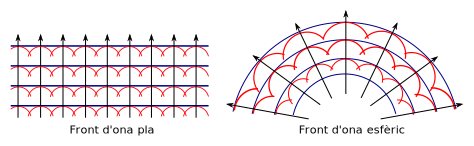
  <figcaption> El principi de Huygens permet explicar d'una forma qualitativa molts fenòmens ondulatoris. </figcaption>
</figure>

### Reflexió 

Fent servir la construcció de Huygens podem veure com es produeix la reflexió sobre una superfície a la figura següent de manera que s'obté la llei de la reflexió on l'angle d'incidència es igual a l'angle de reflexió

$$\alpha_{i}=\alpha_{r}$$

<figure>
  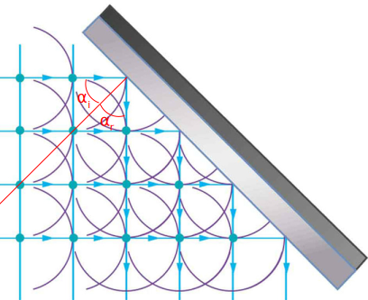
  <figcaption> Explicació de la reflexió a partir del principi de Huygens. </figcaption>
</figure>

### Refracció 

El fenomen de refracció és el canvi en la direcció de propagació de les ones quan travessen una superfície de separació entre dos medis on l'ona es propaga a una velocitat diferent. A la figura següent es pot observar com es pot explicar aquest canvi de direcció a partir de la construcció de Huygens. Es pot veure que utilitzant cada punt dels fronts d'ona com un generador de nous fronts d'ona ens permet entendre el canvi de direcció del front d'ona.

<figure>
  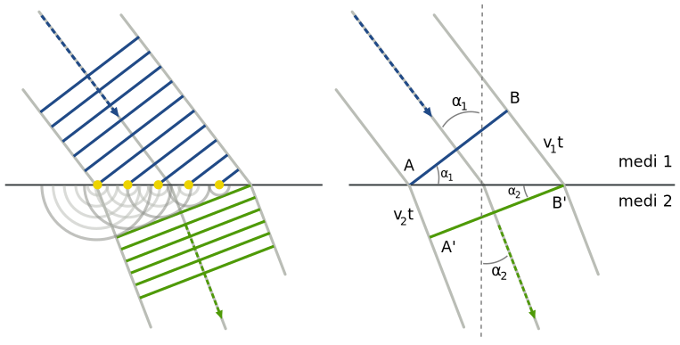
  <figcaption> Refracció de les ones utilitzant la construcció de Huygens. </figcaption>
</figure>

Podem deduir la llei de Snell a partir de l'esquema de la dreta de la figura anterior. Els triangles ABB' i AA'B' tenen en comú el costat AB'. A partir dels dos triangles podem escriure les expressions 

$$\sin(\alpha_{1})=\frac{BB'}{AB'}=\frac{v_{1}t}{AB'}$$

i

$$\sin(\alpha_{2})=\frac{AA'}{AB'}=\frac{v_{2}t}{AB'}$$
 

De les expressions anteriors podem escriure la relació

$$\frac{\sin(\alpha_{1})}{v_{1}}=\frac{\sin(\alpha_{2})}{v_{2}}$$

que és l'expressió de la llei de Snell.
 

### Difracció 

La difracció és el fenomen que es produeix quan les ones troben obstacles com parets, costats o apertures que fan que la propagació de les ones no es produeixi en línia recta. Es tracta d'un fenomen diferent a la reflexió o la refracció. En la figura següent es mostra el fenomen pel cas d'ones planes, però es tracta d'un efecte que succeeix en qualsevol tipus d'unes, encloent-hi les ones de llum.

<figure>
  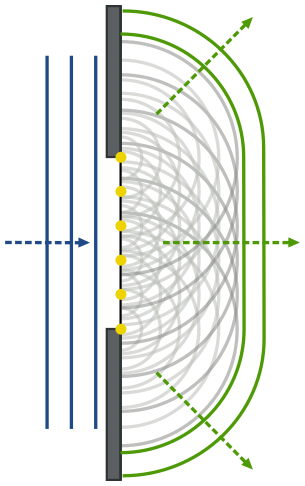
  <figcaption> Difracció d'una ona al passar per una ranura. </figcaption>
</figure>

Si considerem ones lluminoses, quan la llum passa per una apertura gran comparada amb la seva longitud d'ona, l'ombra forma una frontera força ben definida entre la regió de llum i ombra. Però, si es fa passar per una escletxa estreta es veu clarament com la llum es difracta, desapareix aquesta frontera definida entre les regions de llum i ombra i la llum es propaga en forma de ventall formant una zona il·luminada que es va debilitant fins arribar a la foscor, sense fronteres definides (veure figura de sota).

<figure>
  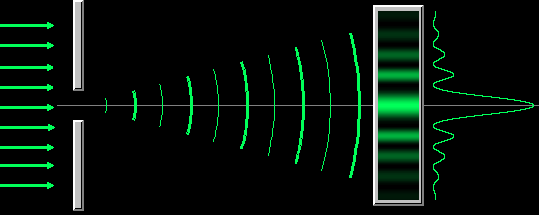
  <figcaption> Difracció per una escletxa. Es pot veure que a més de la banda central de llum hi ha altres bandes, aquestes són el resultat de la interferència que estudiarem a continuació i que és més pronunciada quan hi ha més d'una escletxa.  </figcaption>
</figure>

### Interferència 

A diferència dels objectes materials que, quan ocupen un espai, no el comparteixen amb altres objectes; poden existir més d'una ona o vibració al mateix temps i en el mateix espai. Si deixem caure dos pedres a l'aigua, les ones que produeixen cadascuna d'elles se superposen formant un patró d'interferència con es pot observar a la Figura [mar:interferencia_aigua]. Dintre del patró els efectes ondulatoris poden augmentar, disminuir o, fins i tot, anul·lar-se.

<figure>
  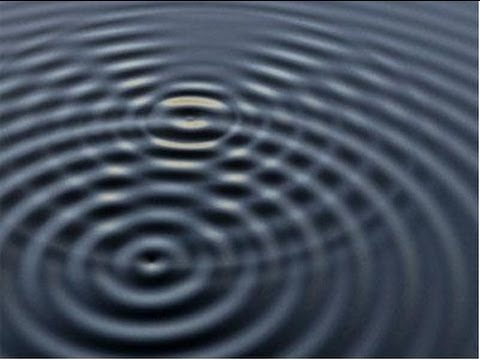
  <figcaption> Patró d'interferència produït per dues pedres al caure a l'aigua. </figcaption>
</figure>

Com ja hem dit, quan més d'una ona ocupa el mateix espai al mateix temps, en cada punt de l'espai se sumen les pertorbacions, fenomen que hem anomenat principi de superposició. D'aquesta manera, quan la cresta d'una ona es superposa amb la cresta d'una altra, els seus efectes individuals se sumen i produeixen una ona d'una amplitud més gran. És el que anomenem interferència constructiva. Si la cresta se superposa amb una vall l'efecte de les dues pertorbacions es contraresten i obtenim una suma nul·la que anomenem interferència destructiva. La interferència és un fenomen típicament ondulatori i es produeix en tot tipus d'ones.

#### L'experiment de Young 

[Thomas Young](https://ca.wikipedia.org/wiki/Thomas_Young), físic anglès, va fer l'any 1801 un experiment que va posar de manifest clarament el comportament ondulatori de la llum. Va fer passar un raig de llum a través de dues escletxes i va projectar la llum sobre una pantalla. Segons el model corpuscular de la llum s'hauria de veure dues ratlles clares sobre la pantalla. En comptes d'això es van veure bandes de llum i ombra intercalades que es podien interpretar com a bandes d'interferència constructiva i destructiva intercalades, la qual cosa demostrava la naturalesa ondulatòria de la llum.

<figure>
  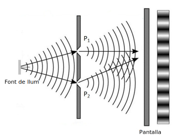
  <figcaption> Experiment de la doble escletxa de Young. La superposició de les ones secundàries creades a les escletxes produeixen sobre la pantalla un patró d'interferència.</figcaption>
</figure>

El tractament matemàtic per a entendre què està passant sobre la pantalla no és difícil. Ens ajudarem amb l'esquema de la Figura següent. Allí podem observar que hi ha dues escletxes A i B separades una distància d. També tenim una pantalla separada una distància L respecte de les escletxes. Veurem quin tipus d'il·luminació tindrem en el punt P que està a una distància y del centre de la pantalla O. Per a fer-lo estudiarem la diferència de fase amb que arribaran les ones al punt P i això està relacionat amb el camí seguit per cada ona. En el cas de l'ona que parteix del punt A el camí seguit fins arribar al punt P està assenyalat com $$r_{1}$$ i en el cas de l'ona que parteix del punt B està assenyalat com camí $$r_{2}$$. Si en comptes de considerar el punt P estiguéssim veient com seria la llum que arriba al punt O la cosa seria fàcil, perquè com que el punt O està just en mig hi ha una total simetria i el camí de les dues ones tindrien les mateixes longituds, per tant, si les ones parteixen en fase des de les escletxes, al recórrer el mateix camí, arribarien al punt O també en fase i això produiria interferència constructiva al punt O.
 
<figure>
  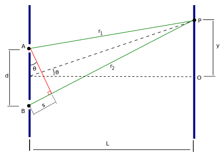
  <figcaption>Esquema de l'experiment de Young on es veu el camí recorregut per cada ona (en color verd) des de que surten de les escletxes A i B fins arribar al punt P.</figcaption>
</figure>

Per tant, hem vist que al punt central ha d'haver-hi llum. Però, es clar, si en movem sobre la pantalla els camins traçats per les ones deixaran de ser de la mateixa longitud i les ones deixaran d'arribar en fase a la pantalla, en alguns punts arribaran en oposició de fase (contrafase) i allí es produirà interferència destructiva. El que veurem aleshores és foscor<a href="#fn5" id="ref5">5</a>. Si ens allunyem una mica més les ones tornen a estar en fase i tornem a tenir interferència constructiva i allí veurem una banda il·luminada, i així el patró s'anirà reproduint. 

Tractarem ara de veure com escriure matemàticament el que hem raonat a dalt. Per començar farem la següent hipòtesi: les ones que surten de les escletxes estan en fase, es a dir la diferència de fase inicial és nul·la.<a href="#fn6" id="ref6">6</a>

Per a saber quin tipus d'interferència tindrem al punt P hem de mirar la diferència de fase amb la que arriben al punt P, i tenint en compte la diferència de camins, la diferència de fase serà

$$\Delta\varphi_{P}=kr_{2}-kr_{1}=k(r_{2}-r_{1})$$

on $$k=2\pi/\lambda$$ és el nombre d'ona i $$\lambda$$ la longitud d'ona. Per a obtenir interferència constructiva (màxim), la diferència de fase ha de ser igual a $$2n\pi$$, on $$n$$ ha de ser un nombre enter, d'aquesta manera les ones estaran en fase i se sumaran constructivament, quedant

$$\Delta\varphi_{P}=\frac{2\pi}{\lambda}(r_{2}-r_{1})=2n\pi\,\,\,\,\,\,\,\,\,\,\,\,\,\,\,n\mathbb{\in Z}$$

o, equivalentment,

$$r_{2}-r_{1}=n\lambda\;\;\;\;n\in\mathbb{Z}\;\;\;\;\;\;(15)$$ 

Es a dir, per tenir interferència constructiva, la diferència de camí entre les ones ha de ser un nombre entre de longituds d'ona. 

Per a trobar la condició d'interferència destructiva hem d'imposar que la diferència de fase sigui un nombre senar de vegades $$\pi$$, d'aquesta manera les ones arribaran al punt P en oposició de fase. Imposant la condició queda:

$$\Delta\varphi_{P}=\frac{2\pi}{\lambda}(r_{2}-r_{1})=(2n+1)\pi\;\;\;\;n\in\mathbb{Z}$$

o, equivalentment,

$$r_{2}-r_{1}=(2n+1)\frac{\lambda}{2}\;\;\;\;n\in\mathbb{Z}\;\;\;\;\;\;(16)$$ 

Les relacions (15) i (16) ens donen les condicions d'interferència constructiva i destructiva respectivament en funció de la diferència de camins, per tant tindrem:

$$r_{2}-r_{1}=\begin{cases}
n\lambda & \,\,\,\,n\in\mathbb{Z\,\,\,\,\mathrm{interfer\grave{e}ncia\,constructiva}}\\
(2n+1)\frac{\lambda}{2} & \,\,\,\,n\in\mathbb{Z}\,\,\,\,\mathrm{interfer\grave{e}ncia\,destructiva}
\end{cases}$$

Ara veurem com obtenir la condició de màxim o mínim depenent de la posició y del punt P sobre la pantalla de la Figura anterior. Si observem la figura, la diferencia de camí 

$$r_{2}-r_{1}=s=d\sin(\theta)$$

i si suposem que la pantalla està prou lluny de les escletxes per a que sigui vàlid que $$y\ll L$$, aleshores, 

$$\sin(\theta)\simeq\tan(\theta)=\frac{y}{L}$$

i

$$\begin{equation}\label{eq:interf}
d\sin(\theta)=d\frac{y}{L}=\begin{cases}
n\lambda & \,\,\,\,n\in\mathbb{Z\,\,\,\,\mathrm{interf.\,constructiva}}\\
(2n+1)\frac{\lambda}{2} & \,\,\,\,n\in\mathbb{Z\,\,\,\,\mathrm{interf.\,destructiva}}
\end{cases}
\end{equation}$$ 

La relació anterior ens dóna les condicions d'interferència constructiva o destructiva depenent de l'angle $$\theta$$ o la distància y de la pantalla.

La interferència és un fenomen que s'ens apareix molt sovint a la vida quotidiana però moltes vegades o el sabem reconèixer. Quan veiem taques d'oli sobre aigua podem apreciar bandes de diferents colors a la llum reflectida sobre l'oli, això també passa amb la bombolles de sabó.

<figure>
  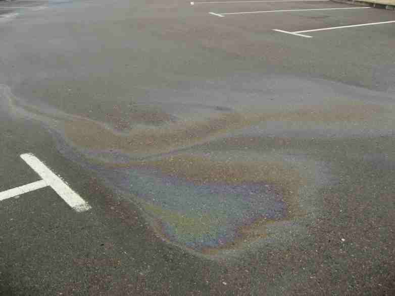
  <figcaption>Bandes d'interferència en capes primes d'oli al carrer.</figcaption>
</figure>

Això es deu a que l'oli forma una capa prima sobre l'aigua i la llum es reflecteix sobre la superfície superior de la capa d'oli i torna a tenir una reflexió a la superfície inferior de la capa d'oli, aquestes dues ones reflectides han tingut una diferència de camí quan surten de l'oli i produeixen interferència que pot ser destructiva per a un color i constructiva per a un altre depenent del gruix de la capa (el gruix és variable i això provoca els canvis de colors). Tot això es pot visualitzar a la figura anterior.

<figure>
  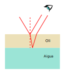
  <figcaption>Interferència per reflexió en capes primes. La llum es reflecteix a la superfície superior i inferior de la capa d'oli i quan arriba a l'ull la seva superposició produeix interferència que, depenent del gruix de la capa i de la longitud d'ona de la llum, pot ser constructiva o destructiva. Es veuen bandes de diferents colors perquè la capa d'oli no és uniforme.</figcaption>
</figure>

### Ones estacionàries 

Fins ara hem estat estudiant ones viatgeres o de propagació, ara veurem que passa quan tenim confinades ones en un recinte sota determinades condicions en els seus extrems (condicions de contorn).

<figure>
  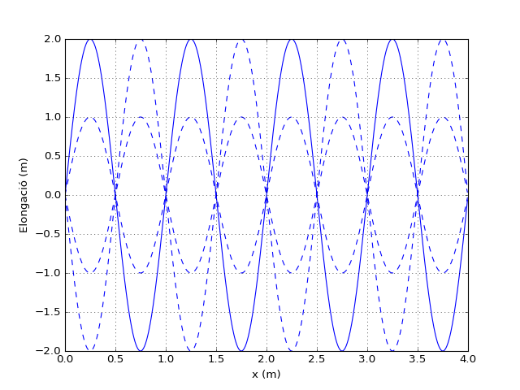
  <figcaption>Ones estacionàries.Quan se superposen dues ones d'igual freqüència que viatgen en sentit contrari es produeixen ones estacionàries. Hi ha punts de l'ona que no es mouen anomenats nodes (x = 0.5, 1.0, 1.5, ...) i d'altres que tenen una gran mobilitat anomenats ventres.</figcaption>
</figure>

### Efecte Doppler 

L'efecte Doppler és un fenomen que es produeix quan un observador rep una ona (so, lum, etc.) produïda per una font en moviment relatiu respecte a l'observador. A la figura de sota es pot apreciar què passa quan una font emissora de so com el cas d'una ambulància es mou. Els fronts d'ona son emesos amb una freqüència determinada $$\lambda_{0}$$ però, com la font s'està movent cap a la dreta, els fronts d'ona de la part dreta comencen a ajuntar-se i als de l'esquerra els hi passa just el contrari, s'allunyen entre ells. L'efecte que es produeix és que l'observador de la dreta sent un so més agut, de longitud d'ona menor (o freqüència menor) que la que sent el conductor de l'ambulància (que es troba en repòs respecte a la font emissora). Un observador ubicat darrere l'ambulància sentirà un so més greu perquè percep una longitud d'ona més llarga (o freqüència més curta). 

<figure>
  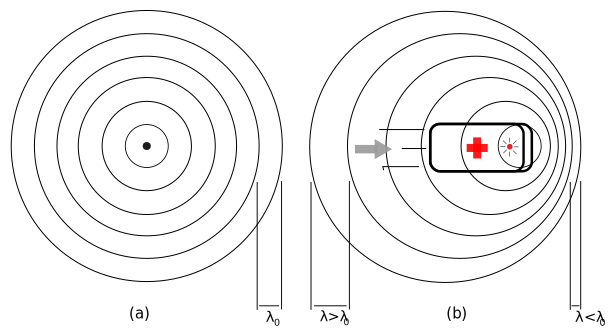
  <figcaption>Efecte Doppler. (a) La font emissora està en repòs respecte a l'observador. (b) Quan la font està en moviment, un observador que vegi apropar-se la font sentirà un so més agut $$(\lambda<\lambda_{0})$$ i un observador que vegi la font allunyar-se sentirà un so més greu $$(\lambda>\lambda_{0})$$.</figcaption>
</figure>

Aquest fenomen es produeix no només amb el so, sinó amb tot tipus d'ones. Per a poder veure l'efecte Doppler amb la llum serà necessari que la font emissora es desplaci a una velocitat molt gran. De fet, l'efecte Doppler de la llum va permetre a l'astrònom [Edwin Hubble](https://ca.wikipedia.org/wiki/Edwin_Hubble) deduir que l'univers es troba en expansió a partir de la llum que ens arriba de les estrelles llunyanes. Quan va observar la llum que ens arriba de les estrelles, va trobar que l'espectre de la llum corresponia al dels elements químics que ja coneixem a la Terra però va trobar que les línies espectrals mostraven un petit desplaçament cap a freqüències més petites (longitud d'ona més llargues), un desplaçament cap al vermell, la qual cosa volia dir que les estrelles s'estaven allunyant de nosaltres. Va observar el mateix efecte en totes les direccions del cel i també va observar que quan més lluny es troba una galàxia, més ràpid s'allunya de nosaltres<a href="#fn7" id="ref7">7</a>. Aquesta observació va establir les bases de la teoria que posteriorment es va desenvolupar sobre l'univers en expansió, coneguda com teoria del Big Bang.

Una altra aplicació de l'efecte Doppler és el seu ús en diagnòstic per imatges en medicina en una tècnica coneguda com [ecografia Doppler](https://ca.wikipedia.org/wiki/Ecografia_Doppler) o eco-Doppler, la qual empra ultrasons i utilitza l'efecte Doppler per a observar el moviment de determinades estructures del cos a partir del so rebotat en elles.

<figure>
  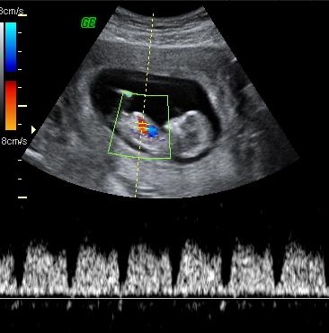
  <figcaption>Imatge de l'ecografia Doppler d'un fetus.</figcaption>
</figure>

### Intensitat d'una ona 

Considerem el cas d'un focus emissor d'ones que emet una certa quantitat d'energia $$\Delta E$$ durant un cert interval de temps $$\Delta t$$, si el medi de propagació de les ones és homogeni i isòtrop, aquestes ones es propagaran en fronts d'una esfèrics degut a que tindrà la mateixa velocitat de propagació en totes les direccions. A mesura que el front d'ona avança en la seva propagació abasta una superfície més gran i l'ona es va atenuant degut a que la mateixa energia s'ha de repartir en una superfície més gran. Per a tenir en consideració aquest efecte definirem una nova magnitud anomenada intensitat d'una ona, $$I$$, i que serà l'energia per unitat de temps i superfície normal al front d'ona. De manera que tindrem

$$I=\frac{\Delta E}{\Delta t.S_{n}}$$
 

Si tenim en compte que l'energia per unitat de temps és la potència 

$$P=\frac{\Delta E}{\Delta t}$$

que es mesura en watts ($$\mathrm{W=J.s^{-1}}$$), la intensitats es pot escriure com

$$I=\frac{P}{S_{n}}$$

i aleshores, la intensitat tindrà per unitats $$\mathrm{W/m^{2}}$$.

La intensitat és una magnitud que ens serveix per a quantificar l'atenuació d'una ona amb la distància. Si considerem una ona generada per un focus emissor de potència P, que es propaga per l'aire de manera isòtropa (amb la mateixa velocitat en totes direccions), els seus fronts d'ona tindran forma esfèrica. L'energia generada per l'ona es va repartint en fronts d'ona cada cop més grans a mesura que avança i això fa que l'ona es vagi atenuant. 

<figure>
  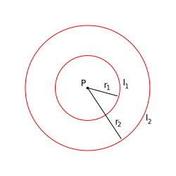
  <figcaption>Les ones esfèriques es van atenuant a mesura que augmenten el seu radi degut a la conservació de l'energia. Degut a l'augment de la superfície, l'energia per unitat de superfície va minvant.</figcaption>
</figure>

Podem veure com varia la intensitat de l'ona a mesura que el front d'ona va augmentat el seu radi. A una distància $$r_{1}$$ del focus emissor la intensitat serà

$$I_{1}=\frac{P}{S}=\frac{P}{4\pi r_{1}^{2}}$$

i, equivalentment, a una distància $$r_{2}$$:

$$I_{2}=\frac{P}{4\pi r_{2}^{2}}$$
 

Com la potència és una propietat del focus emissor i és el mateix focus en els dos casos, s'ha de verificar

$$\frac{I_{1}}{I_{2}}=\bigg(\frac{r_{2}}{r_{1}}\bigg)^{2}$$

Si tenim en compte que l'energia d'una onda és proporcional al quadrat de l'amplitud i que la intensitat és proporcional a l'energia, tindrem que la intensitat és propoorcional al quadrat de l'amplitud, es a dir,

$$I\propto A^{2}$$

Per tant

$$\frac{I_{1}}{I_{2}}=\bigg(\frac{A_{1}}{A_{2}}\bigg)^{2}$$

i tindrem que es verifica la relació

$$\frac{A_{1}}{A_{2}}=\frac{r_{2}}{r_{1}}$$
 

## El so 

### Nivell d'intensitat sonora 

L'oïda humana és capaç de percebre sons d'intensitats que van des de $$10^{-12}\mathrm{Wm^{-2}}$$ fins a $$1\,\mathrm{Wm^{-2}}$$. Aquesta és una escala molt àmplia que abasta 12 ordres de magnitud, a més a més la oïda humana no respon als estímuls sonors de manera proporcional a la intensitat tal com l'hem definida. Encara que la forma amb la que hem definit la intensitat és una manera objectiva, la manera a la que respon l'oïda s'assembla més a una escala logarítmica. Es per això que es defineix el **nivell d'intensitat sonor** com

$$\beta=10\log\bigg(\frac{I}{I_{0}}\bigg)$$

on $$I_{0}=10^{-12}\,\mathrm{Wm^{-2}}$$. Amb aquesta definició $$\beta$$ té unitats de decibels (dB). El nivell mínim de percepció (llindar d'audició) correspon a $$I=I_{0}$$, el que ens dona $$\beta=0\,\mathrm{dB}$$ i el llindar del dolor correspon a $$I=1\,\mathrm{W/m^{2}}$$ que ens dóna $$\beta=120\,\mathrm{dB}$$.
  A la Taula podem observar els nivells sonors corresponents a diferents situacions.

|dB|Situació|
|-|-|
|130|Avió enlairant-se|
|120|Llindar del dolor|
|110|Concert|
|100|Trepant elèctric|
|90|Trànsit vehicular / Baralla|
|80|Tren|
|70|Aspiradora|
|50/60|Aglomeració de gent|
|40|Conversa|
|20|Biblioteca|
|10|Respiració tranquil·la|
|0|	Llindar d'audició|

### Ones estacionàries en instruments musicals 

#### Modes normals de vibració en cordes 

Ja hem vist que les ones estacionàries es produeixen quan l'ona queda confinada sota condicions de contorn. Estudiarem ara quines condicions ha de complir una ona que vibra en una corda subjecta pels seus dos extrems. Aquest és el cas dels instruments de corda. Com la corda ha de tenir els seus dos extrems fixos no totes les freqüències són possibles, només estan permeses les que que tenen nodes en els extrems fixos de la corda. A la figura següent podem veure els primers modes de vibració permesos en una corda amb els seus extrems fixos i longitud L. El primer mode normal de vibració és el que verifica que 

$$L=\frac{\lambda}{2}$$
 

El segon mode:

$$L=\lambda$$
 

El tercer mode:

$$L=\frac{3}{2}\lambda$$
 

El quart mode:

$$L=2\lambda$$

<figure>
  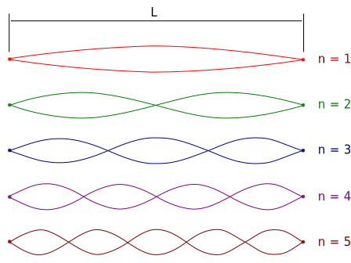
  <figcaption>Modes normals de vibració d'una corda.</figcaption>
</figure>

De les expressions anteriors podem tractar de deduir una única expressió general que pugui servir per a tots els modes normals de vibració:

$$\lambda_{n}=\frac{2L}{n}\,\,\,\,\,\,\,\,\,\,\,\mathrm{amb}\,n\in\mathbb{N}$$

Si tenim en compte que la freqüència està relacionada amb la longitud d'ona a través de la relació $$\lambda\nu=v$$, podem escriure la expressió de la freqüència dels modes normals de vibració d'una corda 

$$\nu_{n}=\frac{v}{\lambda_{n}}=n\frac{v}{2L}=n\nu_{1}\,\,\,\,\,\,\,\,\,\,\,\,\,\mathrm{amb}\,n\in\mathbb{N}$$
 

#### Modes normals de vibració en tubs oberts per un extrem i tancats per l'altre 

Hi ha molts instruments musicals que basen el seu funcionament en produir les ones sonores en l'interior d'un tub, com ser l'òrgan, la flauta o el clarinet. Quan vam analitzar els instruments de corda ens hem fixat en el moviment de la corda, aquest moviment és posteriorment transmès a l'aire i es propaga fins les nostres oïdes. En el cas dels instruments de vent, el moviment ondulatori es produeix directament a l'aire, per tant, hem d'analitzar les ones de l'aire dintre del tub. Hem de tenir en compte que el so és una ona longitudinal, l'oscil·lació de l'aire es produeix en la mateixa direcció del tub, i les sones al seu interior també estan limitades per les condicions de contorn. En el cas d'un tub obert per un extrem i tancat per l'altre, com podria ser el cas d'un clarinet, la condició és que en l'extrem tancat l'aire no es pot desplaçar i en l'extrem obert tindrem un desplaçament màxim (ventre)<a href="#fn8" id="ref8">8</a>. Sota aquestes condicions, si observem la figura de sota podrem veure els cinc primers modes de vibració i verifiquem que l'harmònic fonamental (primer mode normal) es produeix quan

$$L=\frac{\lambda_{1}}{4}$$

on $$L$$ és la longitud del tub. Per tant, 

$$\lambda_{1}=4L$$
 
<figure>
  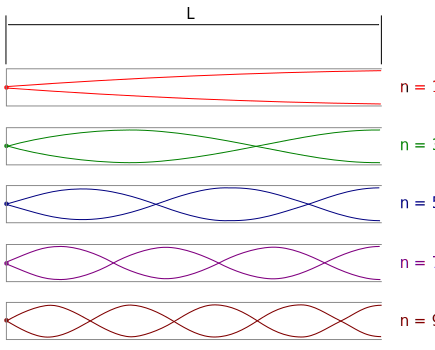
  <figcaption>Modes normals de vibració en tubs obert per un extrem i tancat per l'altre.</figcaption>
</figure>

El segon mode es produeix quan

$$L=\frac{3}{4}\lambda_{2}$$

o, equivalentment,

$$\lambda_{2}=\frac{4L}{3}$$

El tercer mode normal:

$$\lambda_{3}=\frac{4L}{5}$$

Si continuem, podem arribar a una expressió completament general per a la resta de modes:

$$\lambda_{n}=\frac{4L}{2n-1}\,\,\,\,\,\,\,\,\,\,\mathrm{amb\,}n\in\mathbb{N}$$

i la relació corresponent a la freqüència

$$\nu_{n}=(2n-1)\frac{v}{4L}\,\,\,\,\,\,\,\,\,\,\,\,\mathrm{amb}\,n\in\mathbb{N}$$
 

#### Modes normals de vibració en tubs oberts pels dos extrems 

L'altre cas possible és el d'un tub obert pels seus dos extrems, com pot ser el cas d'una flauta travessera. Si observem la figura següent podem veure que les condicions sobre els primers harmònic són: 

$$\lambda_{1}=2L$$

$$\lambda_{2}=L$$

$$\lambda_{3}=\frac{2L}{3}$$
 

Què són les mateixes que teníem per a la corda, per tant l'expressió general en aquest cas serà la mateixa que per a les cordes:

$$\lambda_{n}=\frac{2L}{n}\,\,\,\,\,\,\,\,\,\,\,\mathrm{amb}\,n\in\mathbb{N}$$

i per a les freqüències:

$$\nu_{n}=\frac{v}{\lambda_{n}}=n\frac{v}{2L}=n\nu_{1}\,\,\,\,\,\,\,\,\,\,\,\,\,\mathrm{amb}\,n\in\mathbb{N}$$

<figure>
  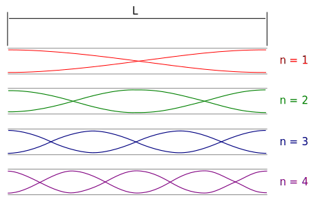
  <figcaption>Modes normals de vibració en tubs oberts pels dos extrems.</figcaption>
</figure>

# Formació d'imatges 

La llum i el seu comportament ha estat un misteri durant molt temps i encara avui, que el seu comportament està molt ben descrit per l'electrodinàmica quàntica, mostra comportaments que costen d'entendre. En aquesta unitat ens dedicarem a entendre el comportament bàsic de la llum per a la formació d'imatges. El primer en fer una descripció satisfactòria del comportament de la llum per ala formació d'imatges ha estat Isaac Newton al seu treball Opticks. Newton va entendre la llum com formada per petits corpuscles, com si estigués formada per boletes diminutes, i això li va permetre explicar el rebot de la llum sobre una superfície plana seguint el mateix comportament que les boles de billar. Aquest model s'anomena model corpuscular de la llum.

<figure>
  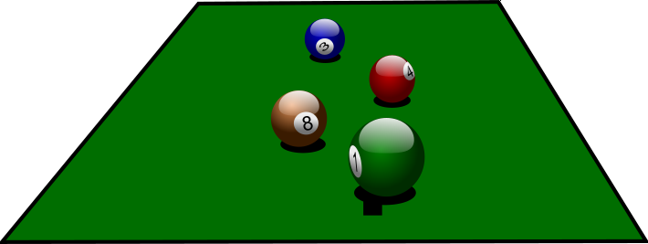
  <figcaption> <strong>La llum es reflecteix sobre una superfície plana de la mateixa manera que reboten les boles a les bandes d'una taula de billar.</strong> </figcaption>
</figure>

Aquest model ha estat molt reeixit per a explicar la formació d'imatges. Posteriorment s'han trobat comportaments de la llum que no es podien explicar amb el model corpuscular i es va proposar que la llum s'havia d'entendre com un fenomen ondulatori. Aquest model va ser proposat pel físic holandès Christian Huygens i el seu model va ser combatut pels seguidors de Newton. Finalment al segle XIX el físic anglès Thomas Young mostra “sense cap dubte” que el comportament de la llum era el d'un ona amb el seu experiment de la doble escletxa. La història no acaba aquí perquè just a començament del segle XX va ser necessari tornar a entendre la llum com a format per partícules anomenats quanta (actualment fotons) per a explicar fenòmens com la radiació de cos negre i l'efecte fotoelèctric.<a href="#fn9" id="ref9">9</a>

Per a l'estudi de la formació d'imatges tindrem en compte un parell de fets ben coneguts:

* La llum es propaga en línia recta en un medi homogeni <a href="#fn10" id="ref10">10</a>. Indicarem la seva trajectòria dibuixant raigs que indicaran el camí traçat per la llum.

* La velocitat de la llum és constant en un medi homogeni. Al buit la velocitat és $$c=3\times10^{8}\,\mathrm{m/s}$$
  i, a efectes pràctics, considerarem que la velocitat a l'aire és la mateixa.

## Llei de la reflexió 

Podem destacar dos tipus de reflexió. Quan la superfície especular és plana tenim reflexió especular i l'exemple més clar és el mirall o una superfície metàl·lica polida i, fins i tot la superfície d'aigua quan està quieta. En cas de tenir una superfície rugosa la reflexió és difusa i no podem formar una imatge. La llei de la reflexió es compleix a nivell local però como l'angle d'incidència de cada raig és diferent respecte a la superfície, els raigs emergents no són pas paral·lels.

<figure>
  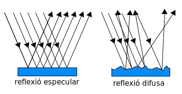
  <figcaption> <strong>Reflexió especular i difusa. La llei de la reflexió es verifica localment en ambdues superfícies però només a la imatge de l'esquerra tots els raigs tenen el mateix angle d'incidència i de reflexió.</strong> </figcaption>
</figure>

La llei de la reflexió sobre superfícies planes estableix que l'angle de reflexió és igual a l'angle d'incidència. Si anomenem $$\alpha_{i}$$ l'angle dels raigs d'incidència i $$\alpha_{r}$$ l'angle format pels raigs reflectits, tenim que la llei de la reflexió s'escriu:

$$\alpha_{r}=\alpha_{i}$$

Els angles d'incidència i reflexió es mesuren respecte de la línia perpendicular a la superfície de reflexió anomenada recta normal, com es veu a la figura següent.

<figure>
  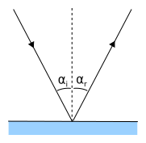
  <figcaption> <strong> Llei de la reflexió. L'angle de reflexió és igual a l'angle d'incidència. Mesurem els alngles respecte de la recta normal.</strong> </figcaption>
</figure>

## Refracció de la llum 

Com ja ho hem dit, la llum es propaga en un medi homogeni a una velocitat constant, però quan la llum passa d'un medi a un altre la seva velocitat de propagació canvia i això pot produir un canvi en la direcció de propagació de la llum. Aquest canvi en la direcció de propagació de la llum l'anomenen refracció de la llum. A la figura inferior es pot veure un raig de llum que incideix des d'una medi 1 amb un angle $$\alpha_{1}$$ respecte a la normal de la superfície de separació dels dos medis. Quan travessa la superfície passa a propagar-se en el medi 2 amb un angle $$\alpha_{2}$$ respecte a la mateixa recta normal. També es pot veure un raig reflectit. Sempre que hi ha una superfície de separació de dos medis hi haurà llum reflectida què, com ja hem vist, segueix la llei de la reflexió $$(\alpha_{1}=\alpha_{1}^{,})$$.

<figure>
  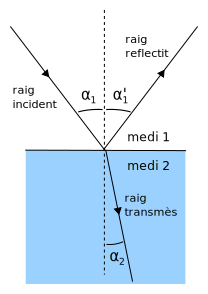
  <figcaption> <strong>Refracció de la llum. La llum es propaga per un medi 1 i passa a un medi 2 amb propietats òptiques diferents, com a conseqüència, la direcció de propagació canvia. La llei que descriu aquest comportament és la llei de Snell.</strong> </figcaption>
</figure>

Els dos angles $$\alpha_{1}$$ i $$\alpha_{2}$$ estan relacionats amb la velocitat de propagació de la llum ens els dos medis, $$v_{1}$$ i $$v_{2}$$ respectivament, a través de la llei de la refracció de la llum o **llei de Snell**:

$$\frac{\sin(\alpha_{1})}{v_{1}}=\frac{\sin(\alpha_{2})}{v_{2}}\;\;\;\;\;\;(17)$$

Podem deduir de la llei que si la llum passa a un segon medi on es propaga a una velocitat més petita, $$(v_{2}<v_{1})$$, l'angle de sortida serà més petit que l'angle d'entrada $$(\alpha_{2}<\alpha_{1})$$. El mateix raonament és valid en cas contrari, si la velocitat del segon medi és més gran, també ho serà l'angle de sortida. Pots dir quin dels dos casos mostra la figura anterior? 

## Índex de refracció 

A la llei de Snell apareixen les velocitats de propagació de la llum. Per a no tenir que treballar amb valors de velocitats tan grans (recordem que la velocitat de la llum al buit és $$c=3\times10^{8}\mathrm{m/s})$$ el que es fa és multiplicar ambdós membres de l'equació (18) per la velocitat de la llum al buit, $$c$$, per a obtenir

$$
\begin{equation}\label{eq:snell}
\frac{c}{v_{1}}\sin(\alpha_{1})=\frac{c}{v_{2}}\sin(\alpha_{2})\;\;\;\;\;\;(18)
\end{equation}
$$

Definirem índex de refracció, $$n$$, d'un medi on la velocitat de propagació és $$v$$ al quocient

$$n=\frac{c}{v}$$

Podem observar que l'índex de refracció és una magnitud adimensional (no porta unitats) i, donat que la velocitat de propagació de la llum en qualsevol medi és sempre inferior a la velocitat de la llum al buit, l'índex de refracció sempre és un nombre superior a 1. Amb aquesta definició podem reescriure la llei de Snell de la següent manera:

$$n_{1}\sin(\alpha_{1})=n_{2}\sin(\alpha_{2})$$

on $$n_{1}$$ i $$n_{2}$$ són, respectivament, els índex de refracció dels medis 1 i 2.

A la taula següent es pot observar el llistat dels índex de refracció d'alguns materials.

|Material   |Índex de refracció|
|-----------|------------------|
|Buit       |1                 |
|Aire       |1,000293          |
|Aigua      |1,333             |
|Etanol     |1,36              |
|Vidre comú |1,46              |
|Vidre crown|1,52              |
|Vidre flint|1,62              |
|Diamant    |2,42              |

## Reflexió total interna 

Ja hem vist que quan la llum travessa una superfície de separació entre dos medis transparents de diferent índex de refracció es produeix un canvi en la direcció de la llum al passar d'un medi a l'altre. 

<figure>
  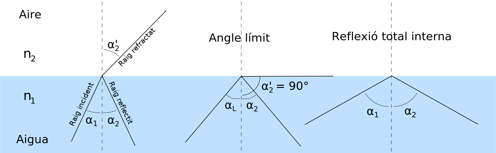
  <figcaption> <strong>Reflexió total interna. Quan la llum passa de l'aigua a l'aire, l'angle de sortida de l'aigua resulta més gran que l'angle d'incidència. Si augmentem l'angle d'incidència arribarà a un valor per al qual l'angle de refracció és rasant (paral·l3l a la superfície de l'aigua. Aquest angle d'incidència es diu angle límit, i a partir d'aquest valor no hi ha raig refractat i només tenim llum reflectida.</strong></figcaption>
</figure>

Aquest fenomen es diu refracció i hem vist que quan la llum passa d'un medi a un altre d'índex de refracció més alt, la llum transmesa surt amb un angle més petit respecte a la normal. Si tenim el cas invers on la llum passa d'un medi d'índex més alt cap a un d'índex més baix, com és el cas de passar d'aigua a l'aire o de vidre a l'aire, la relació d'angles s'inverteix, en aquest cas tenim que $$\alpha_{2}^{,}>\alpha_{1}$$ (veure figura anterior).

Si continuem augmentant l'angle d'incidència trobarem que hi arribarà el moment que per a un angle $$\alpha_{1}<90^{\circ}$$, tindrem un angle de refracció $$\alpha_{2}^{,}=90^{\circ}$$. A aquest angle l'anomenen angle límit $$(\alpha_{L})$$ i, a partir d'aquest angle, només hi haurà llum reflectida. Aquest fenomen es coneix com a reflexió total interna i és el que utilitzen les fibres òptiques per a transmetre informació en forma de polsos lumínics al llarg de grans distàncies sense tenir pèrdues d'energia.

<figure>
  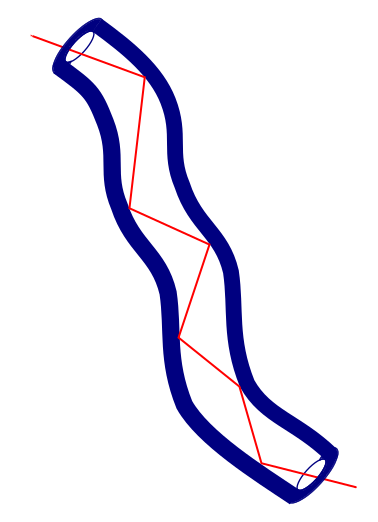
  <figcaption><strong>Les fibres òptiques utilitzen el fenomen de reflexió total per a transmetre informació sense pèrdues.</strong></figcaption>
</figure>

L'angle límit per a la separació de dos medis d'índex de refracció $$n_{1}>n_{2}$$, el podem trobar utilitzant la llei de Snell on imposarem la condició $$\alpha_{2}^{,}=90^{\circ}$$:

$$n_{1}\sin(\alpha_{L})=n_{2}\sin(90^{\circ})$$

i, com $$\sin(90^{\circ})=1$$, obtenim:

$$
\begin{equation}\label{eq:angle_limit}
\sin(\alpha_{L})=\frac{n_{2}}{n_{1}}\;\;\;\;\;\;(19)
\end{equation}
$$

La relació (19) és la condició d'angle límit. A partir d'aquest valor d'angle d'incidència tindrem reflexió total. De la relació (19) podem veure que la condició només es satisfà si el quocient $$n_{2}/n_{1}<1$$, ja que la funció sinus és una funció que sempre és menor a 1. En cas contrari, si el medi 2 tingués un índex de refracció major que el medi 1, no trobaríem solució.

## Miralls esfèrics 

Els miralls esfèrics són superfícies reflectants de forma esfèrica que, per les seves característiques que estudiarem a continuació, es fan servir en diverses aplicacions, com ser els miralls que hi ha en les cantonades on hi ha entrecreuaments de carrers amb poca visibilitat, miralls retrovisors dels cotxes, telescopis reflectors, etc.

<figure>
  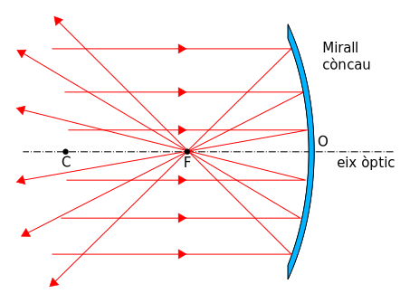
  <figcaption><strong>El punt F correspon al focus del mirall còncau i és per un passen tots els raigs que venen paral·lels a l'eix òptic. L'eix òptic divideix el mirall en dues parts iguals i passa pel punt O anomenat vèrtes del mirall.</strong> </figcaption>
</figure>

La llei de reflexió és una llei local, es a dir es verifica punt a punt i també és vàlida per a miralls esfèrics però, com la superfície del mirall no és plana, un feix de raigs paral·les no incideixen tots amb el mateix angle sobre cada punt de la superfície del mirall i, per tant, els raigs reflectits no sortiran tots paral·lels com en el cas d'un mirall pla, sinó que passaran tots pel mateix punt. Aquest punt l'anomenarem **punt focal** o **focus** del mirall.<a href="#fn11" id="ref11">11</a>. A la figura anterior  podem observar com un feix de raigs paral·lels incideix sobre un mirall esfèric còncau i en reflectir-se passen tots pel focus.

El focus, F, és una característica del mirall i està relacionat amb el **centre de curvatura**, C, del mirall. La distància entre el centre de curvatura C i qualsevol punt del mirall val sempre el mateix i s'anomena **radi de curvatura**, R, del mirall. La distància entre el vèrtex, O, i el punt focal s'anomena distància focal, f, del mirall. La distància focal i el radi del mirall estan relacionats a través de l'expressió

$$f=\frac{R}{2}$$

S'acostuma anomenar els miralls còncaus com **miralls convergents**, ja que fan que un feix de raigs paral·lels tinguin tendència a convergir en un punt.

### Formació d'imatges en miralls còncaus

Per a estudiar la formació d'imatges utilitzarem un mètode gràfic basat en l'estudi del camí seguit pels raigs de llum. Hi ha alguns raigs pels quals nosaltres sabrem la seva trajectòria i que anomenarem **raigs principals**. A partir de la marxa d'aquests raigs podrem saber quina és la posició i mida de la imatge.

Introduirem el mètode per a un mirall còncau amb l'objecte a una distància del mirall més gran que el radi de curvatura, R, del mirall. Per a indicar l'objecte farem servir una fletxa amb la seva cua sobre l'eix òptic i la seva punta a una altura igual a la de l'objecte. Tractarem de trobar la posició i la mida de la imatge i, per fer això, només necessitem trobar la imatge de la punta de la fletxa. Per a trobar la imatge farem servir els raigs principals que es podem veure a la figura següent.

<figure>
  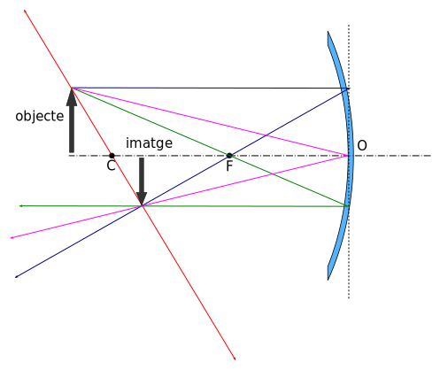
  <figcaption><strong>Marxa de raigs per a un objecte ubicat a una distància més gran que el radi de curvatura del mirall còncau.</strong> </figcaption>
</figure>

La regla per a la construcció de la marxa de raig amb els raigs principals són<a href="#fn12" id="ref12">12</a>:

1. El raig que va paral·lel a l'eix òptic es reflecteix passant pel focus del mirall (raig blau). Això ho sabem de la definició de focus.

2. El raig que passa pel focus es reflecteix sortint paral·lel a l'eix òptic (raig verd). També és per la definició de focus i per la reversibilitat del camí òptic.

3. El raig que passa pel centre de curvatura es reflecteix tornant pel mateix camí (raig vermell), ja que incideix sobre la superfície del mirall en direcció normal (perpendicular a la superfície).

4. El raig que incideix en el vèrtex del mirall es reflecteix amb el mateix angle respecte de l'eix òptic (raig magenta), de manera que l'eix òptic és la bisectriu entre els raigs incident i reflectit.

5. La imatge es forma on es troben els raigs reflectits<a href="#fn13" id="ref13">13</a>. Si posem una pantalla en aquell lloc veurem que es forma sobre ella la imatge, per aquest motiu diem que la imatge és **real**, també veiem que la imatge està **invertida** i que té una mida **menor**.

6. Per a determinar la distància entre el mirall i la imatge hem de mesurar amb un regle i fer servir el factor d'escala utilitzat, el mateix per a determinar l'altura de la imatge. No és necessari fer servir la mateixa escala per a la direcció horitzontal i vertical.

Veurem ara, seguint la mateixa metodologia constructiva com és la imatge quan l'objecte es troba entre el centre de curvatura i el focus. A la figura inferior es pot veure la marxa de raigs. Podem observar que els raigs convergeixen en un punt per a formar la imatge, per aquest motiu la imatge és real. També veiem que és invertida i major.

<figure>
  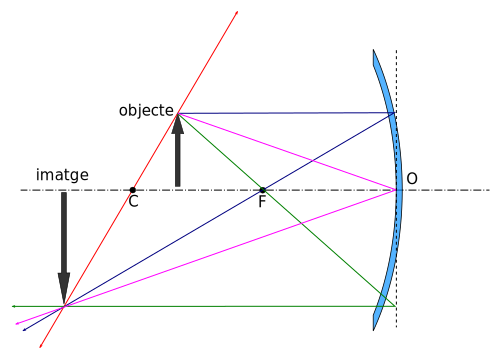
  <figcaption><strong>Formació de la imatge quan l'objecte es troba a una distància entre la focal i el radi del mirall. Les seves característiques són: Real, invertida i major.</strong> </figcaption>
</figure>

Si l'objecte es troba a una distància menor que la distància focal trobem que els raigs reflectits no convergeixen enlloc, sinó que, al contrari divergeixen al sortir del mirall. Per aquest motiu no podem trobar la imatge posant una pantalla perquè hi ha una posició on es pugui formar. Però com és que veiem la imatge si no es forma enlloc? En realitat nosaltres veiem la imatge perquè els nostres ulls formen una imatge real sobre la retina dels nostres ulls que juga el paper de pantalla. Això és possible perquè l'ull forma un sistema convergent que acaba tancant els raigs fins que convergeixen sobre la retina (estudiarem l'ull humà amb cert detall més endavant). I on veurem la imatge? Doncs, la veurem com si vingués de una posició que es troba darrere del mirall, com si estigués en la posició on convergeixen els raig reflectits si els prolonguem cap enrere. Direm en aquest cas que la imatge és virtual, dreta i major.

<figure>
  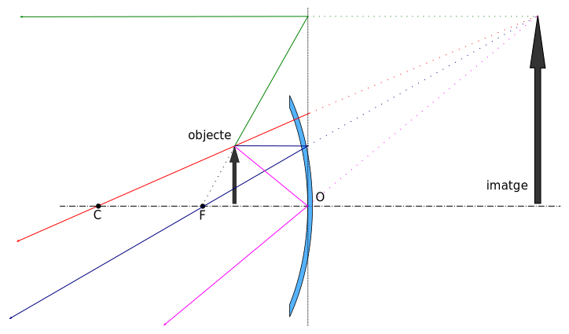
  <figcaption>Marxa de raigs quan l'objecte es troba a una distància és menor a la distància focal. La imatge és <strong>virtual</strong>, <strong>dreta</strong> i <strong>major</strong>.  </figcaption>
</figure>

### Formació d'imatges en miralls convexos

En el cas dels miralls convexos, els raigs que hi arriben paral·lels a a l'eix òptic no convergeixen sinó al contrari, divergeixen i, per aquest motiu, aquests miralls també es coneixem com **miralls divergents**. El focus d'aquests miralls es troba on semblen provenir els raigs paral·lels un cop s'han reflectit al mirall, com es pot observar a la figura inferior.

<figure>
  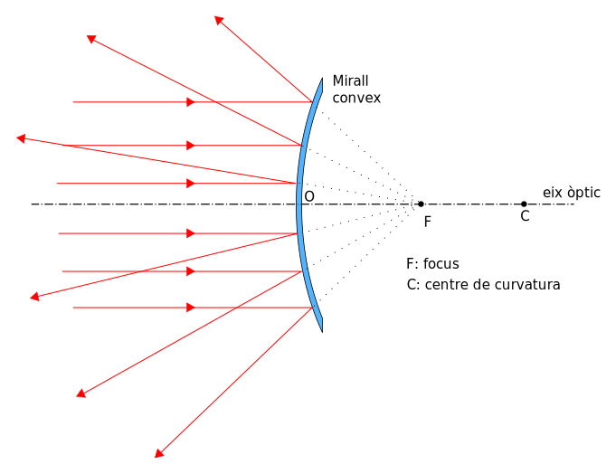
  <figcaption><strong>Definició de focus per a un mirall convex. El focus és el punt d'on semblen procedir un feix de raigs paral·lels després de reflectir-s'hi.</strong></figcaption>
</figure>

Quant a la formació de la imatge d'un objecte veurem que sempre té les mateixes característiques. A la figura següent es poden veure els raigs principals provinents de l'extrem d'un objecte ubicat a una distància més gran que la distància focal. El raig que va paral·lel a l'eix òptic surt reflectit en una direcció, la prolongació de la qual passa pel focus (raig blau). El raig que va en direcció del focus (raig verd), es reflecteix paral·lel a l'eix òptic. El raig que va en direcció del radi de curvatura (raig vermell), surt reflectit en la mateixa direcció, ja que incideix perpendicular a la superfície del mirall. Per últim el raig que incideix en el vèrtex, O, del mirall surt amb el mateix angle respecte a l'eix òptic, ja que l'eix òptic és normal a la superfície en aquell punt. La imatge es forma en el punt on convergeixen la prolongació dels raigs reflectits, darrere el mirall, on la llum no hi arriba. Direm que la imatge és virtual per aquest motiu. També observem que la imatge està dreta i té una mira menor a la del objecte.

<figure>
  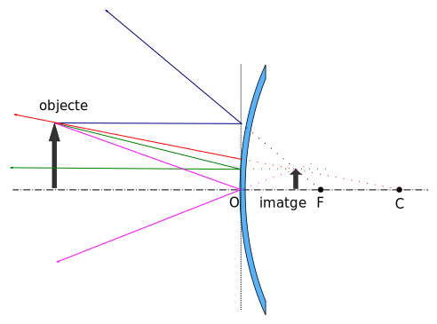
  <figcaption><strong>Mirall convex. Marxa de raigs per a un objecte ubicat a una distància més gran que la distància focal. La imatge formada és virtual, dreta i més petita que l'objecte.</strong></figcaption>
</figure>

El cas on l'objecte es troba a una distància més petita a la distància focal és molt semblant i la marxa de raigs es construeix de la mateixa manera. Podem observar que la imatge té les mateixes característiques (virtual, dreta i menor), però que a mesura que l'objecte s'apropa al mirall la imatge es va fent més gran (Figura següent). 

<figure>
  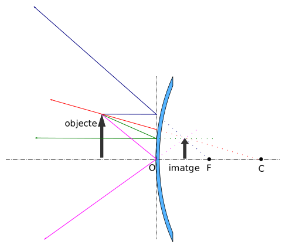
  <figcaption><strong>Mirall convex. Marxa de raigs per a un objecte ubicat a una distància més petita que la distància focal. La imatge formada és virtual, dreta i més petita que l'objecte.</strong></figcaption>
</figure>

## Augment lateral

L'augment lateral, $$m$$, és la relació que hi ha entre la grandària de la imatge, $$y'$$, i la de l'objecte, $$y$$,

$$
\begin{equation}\label{eq:augment}
m=\frac{y'}{y}\;\;\;\;\;\;(20)
\end{equation}
$$

El valor de $$y'$$ serà positiu quan la imatge estigui dreta i negatiu quan la imatge estigui invertida. Per altra banda si la imatge és més gran que l'objecte tindrem que $$\lvert y'\rvert > y$$, i quan la imatge sigui més petita que l'objecte tindrem que $$\lvert y' \rvert < y$$.

## Les matemàtiques dels miralls

Fins ara havíem fet servir la construcció gràfica per a trobar la posició on es formarà la imatge i la seva mida. Ara veurem que també es poden obtenir d'una manera analítica fent servir la següent fórmula:

$$
\begin{equation}\label{eq:formula_miralls}
\frac{1}{s}+\frac{1}{s'}=\frac{1}{f}\;\;\;\;\;\;(21)
\end{equation}
$$

on $$s$$ és la distància objecte, $$s'$$ és la distància imatge i $$f$$ és la distància focal. D'aquesta manera, si coneixem la posició de l'objecte i la distància focal del mirall, podem trobar la posició de la imatge. La diferència entre miralls còncaus i convexos radica en el signe de la distància focal, mentre que pel mirall còncau la distància focal és positiva, pels miralls convexos la distància focal resulta negativa. De fet, tot el que estigui ubicat a la dreta del mirall tindrà posició negativa, així, si obtenim un valor de $$s'$$ negatiu sabrem que la imatge estarà ubicada a la dreta del mirall on la llum no hi arriba i que la imatge és virtual.

Si observem la figura de sota, observem que els dos triangles que queden definits són semblants, ja que els angles d'incidència i reflexió són congruents $$(\theta=\theta')$$ degut a la llei de a reflexió i a que l'eix òptic és normal a la superfície en el punt O.

<figure>
  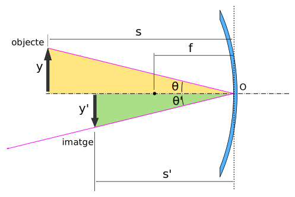
  <figcaption>Degut a que l'angle de reflexió és igual a l'angle d'incidència, tenim que els dos triangles són semblants i, per tant, podem deduir que $$y/s=y'/s'$$.</figcaption>
</figure>

Degut a que els triangles són semblants tenim que es compleix les següent relació:

$$\frac{y}{s}=-\frac{y'}{s'}$$

on el signe negatiu apareix degut a que $$y'$$ resulta negativa per estar la imatge invertida i la resta de quantitats són positives. Per a poder igualar ambdós costats de l'equació, hem de posar el signe negatiu al membra de la dreta. Aquesta relació ens porta a una altra manera de calcular l'augment lateral si reconsiderem l'expressió (20):

$$
\begin{equation}\label{eq:augment2}
m=\frac{y'}{y}=-\frac{s'}{s}\;\;\;\;\;\;(22)
\end{equation}
$$

Les equacions $$\eqref{eq:formula_miralls}$$ i (22) ens permeten obtenir de manera analítica la posició i altura de la imatge a partir de la posició i altura de l'objecte per a un mirall de distància focal coneguda. D'aquesta manera hem obtingut un mètode alternatiu al mètode gràfic per a obtenir la imatge donada per un mirall. <a href="#fn14" id="ref14">14</a>

## Lents 

Les lents són sistemes òptics formades per dues superfícies, una de les quals al menys ha de ser corba. Les dues superfícies refracten els raig de llum que hi incideixen, de manera que la trajectòria dels raigs canvia i formen una imatge que depèn del tipus de lent i de la posició relativa de l'objecte respecte de la lent. Per a estudiar el camí que segueix la llum en travessar les superfícies de la lent s'ha de fer servir la llei de Snell.

A la figura següent es pot veure diferents tipus de lents. Les lents que són més gruixudes al centre són del tipus convergent i les que són més primes a la part central són lents divergents.

<figure>
  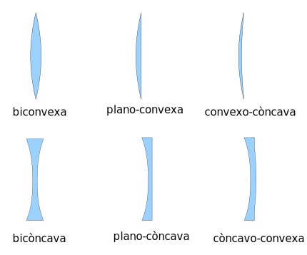
  <figcaption><strong>Diferents tipus de lents. Les lents de la primera fila s'anomenen lents convergent i la fila de sota s'anomenen lents divergents.</strong></figcaption>
</figure>

### Focus d'una lent convergent

De manera anàloga a com hem definit el focus d'un mirall, definirem el focus d'una lent, amb la diferència que en les lents la llum travessa les seves superfícies. En el cas d'una lent convergent, els raigs que hi arriben paral·lels a l'eix òptic, després de travessar la lent, convergeixen tots en un punt al que anomenarem focus principal o focus imatge de la lent (Figura següent). En la pràctica podem trobar el focus posant la lent als raigs del Sol i cercant amb un paper el punt on tots el raigs convergeixen, això és possible perquè els raigs del Sol ens hi arriben paral·lels degut a la gran distància que tenim del Sol.

<figure>
  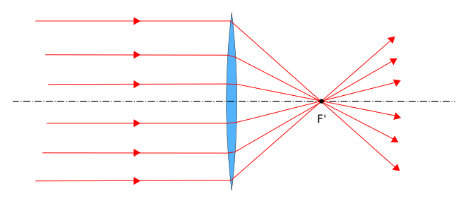
  <figcaption>Definició de focus imatge per a una lent convergent.</figcaption>
</figure>

De la mateixa manera, definirem focus objecte al punt per al qual si posem una font puntual emissora de llum en aquella posició, els raigs que sortirien de la lent anirien paral·lels a l'eix òptic.

<figure>
  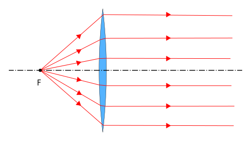
  <figcaption>Definició de focus objecte per a una lent convergent.</figcaption>
</figure>

### Potència d'una lent

La distància que hi ha entre el centre de la lent i el focus s'anomena distància focal de la lent. Podem dir que quant més petita és la distància focal més potent és la lent, ja que té un poder refractiu major al desviar més la trajectòria dels raigs. Definirem com a potència d'una lent a la inversa de la seva distància focal, $$f$$, mesurada en metres,

$$P=\frac{1}{f}$$
 

Calculada d'aquesta manera la potència té unitats de **diòptries** (D)<a href="#fn15" id="ref15">15</a>. D'aquesta manera, una lent que té una distància focal de 50 cm (0,5 m) tindrà una potència $$P=1/0,5=2\mathrm{D}$$. 

### Formació d'imatges per una lent convergent

Per a trobar la imatge formada per una lent convergent farem servir també els raigs principals. Els raigs principals són tres:

* El **raig paral·lel** a l'eix òptic es desvia passant pel focus imatge F' (raig blau a la figura inferior).

* El **raig central**, el que passa pel centre O de la lent (raig magenta a la figura, no es desvia (en realitat pateix una desviació mínima quan es tracta de lents primes degut a la refracció en les dues cares de la lent). 

* El **raig focal**, que passa pel focus objecte F (raig verd la figura, es desvia sortint paral·lel a l'eix òptic.

La imatge es forma en el punt on es creuen els tres raigs principals. 

Les característiques de la imatge dependrà no només del tipus de lent que fem servir, sinó que també dependrà de la ubicació de l'objecte respecte del centre de la lent O.

Per a començar estudiarem el cas d'un objecte ubicat a una distància més gran que el doble de la distància focal, podem veure la formació de la imatge a la figura inferior. En aquest cas la imatge resulta real<a href="#fn16" id="ref16">16</a>, invertida i menor que l'objecte. També podem veure que la imatge es forma a un distància més propera a la lent que la distància de l'objecte.

La reversibilitat del camí òptic fa que si posem l'objecte en la posició on es troba la imatge, veurem que la imatge passa a formar-se en la posició on abans estava l'objecte. Així doncs, podem deduir que si l'objecte es troba a una distància més gran que la distància focal però més petita que dues vegades la distància focal, la imatge també serà real, invertida però, en aquest cas, serà més gran que l'objecte.

<figure>
  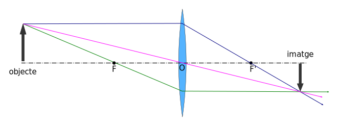
  <figcaption>Marxa de raigs per a un objecte a una distància més gran que dues vegades la distància focal. Les característiques de la imatge són: real, invertida i més petita que l'objecte.</figcaption>
</figure>

Per a confirmar el que acabem de deduir a partir de la reversibilitat del camí òptic, traçarem la marxa de raigs ubicant l'objecte a una distància propera al focus encara que més gran. El resultat es pot veure a la figura inferior.

<figure>
  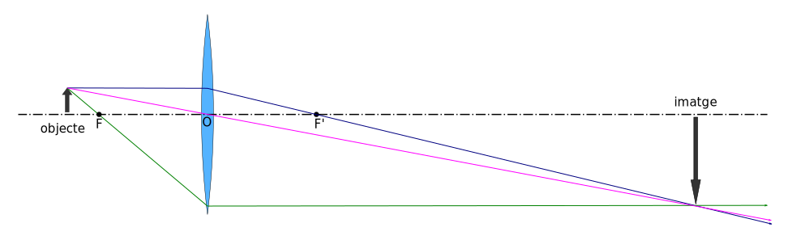
  <figcaption>Marxa de raigs per a un objecte a una distància entre una i dues distàncies focals de la lent. Les característiques de la imatge són: real, invertida i més gran que l'objecte.</figcaption>
</figure>

Un cas diferent el tenim quan l'objecte es troba a una distància més petita que la focal respecte de la lent. Podem veure a la figura inferior la marxa dels raigs principals. En aquest cas els raigs refractats surten divergint de la lent, raó per la qual no es poden trobar per a formar una imatge. La imatge la podem trobar a partir de la prolongació enrere dels raigs refractats. El punt on convergeixen els raigs és el punt on es formarà una imatge virtual, ja que la llum no hi arriba allí però, si posem l'ull a la part dreta de la lent veurem la imatge formada en aquella posició degut a que el nostre cervell està condicionat a pensar que la llum es propaga en línia recta i això ens porta a la posició de la imatge.<a href="#fn17" id="ref17">17</a>

<figure>
  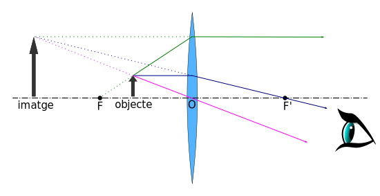
  <figcaption>Marxa de raigs per a un objecte a una distància més petita que la focal. Les característiques de la imatge són: virtual, dreta i més gran que l'objecte. Aquest és el cas d'una lupa.</figcaption>
</figure>

### Focus d'una lent divergent

Les lents divergents tenen el comportament contrari a les lents convergents. En aquest cas els raigs que entren a la lent paral·lels surten d'ella obrint-se de tal manera que si prolonguem els raigs refractats enrere trobem que tots ells es troben un un punt al que anomenarem focus imatge F' com es veu a la figura inferior. 
  
<figure>
  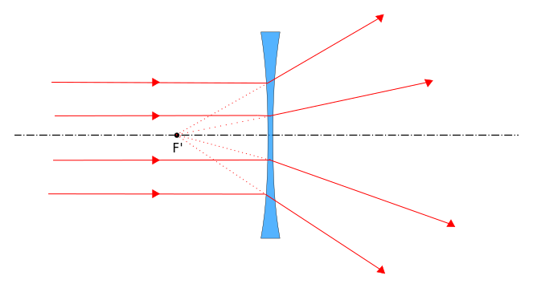
  <figcaption>Focus principal o focus imatge d'una lent divergent.</figcaption>
</figure>

Si tenim en compte la reversibilitat del camí òptic i invertim el cas anterior podem definir el focus objecte. es tracta del punt on hauríem de dirigir un feix de llum per tal de que, quan surtin de la lent ho fessin paral·lels a l'eix òptic, com es veu a la figura següent.

<figure>
  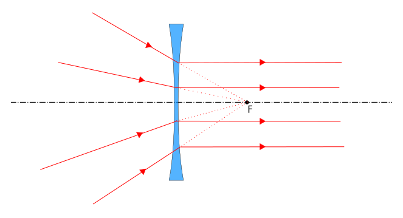
  <figcaption>Focus objecte d'una lent divergent.</figcaption>
</figure>

### Formació d'imatges per una lent divergent

Per a estudiar la formació d'imatges per una lent divergent hem de tenir en compte que els focus imatge i objecte estan intercanviats. Estudiarem primer la formació de la imatge per a un objecte a una distància de la lent més gran que la distància focal (Figura inferior). Traçarem els raigs principals seguint els criteris ja establers:

1. El raig paral·lel a l'eix òptic (blau), es desvia obrint-se i la seva prolongació enrere ha de passar pel focus imatge F'.

2. El raig que passa pel centre O de la lent (magenta) no té desviació.

3. El raig que parteix en direcció al focus objecte (verd), surt paral·lel a l'eix òptic.

4. La imatge es troba en el entrecreuament de les prolongacions enrere dels raigs que han travessat les lents. La imatge que es forma és virtual, dreta i menor com es veu a la figura següent.

<figure>
  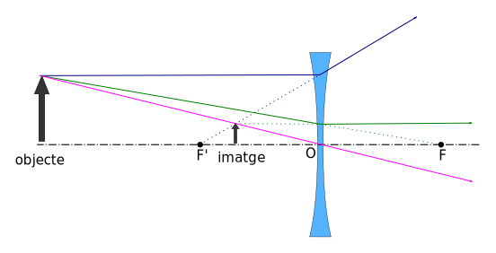
  <figcaption>Marxa de raigs per a un objecte a una distància més gran que la focal. Les característiques de la imatge són: virtual, dreta i més petita que l'objecte.</figcaption>
</figure>

Quan l'objecte es troba a una distància més petita que la focal, com és el cas de la figura inferior, la imatge que es forma té les mateixes característiques que en el cas anterior amb la diferència que, quant més a prop de la lent estigui l'objecte, més gran es veurà la imatge. La construcció de la marxa de raigs és anàloga al cas anterior. 

<figure>
  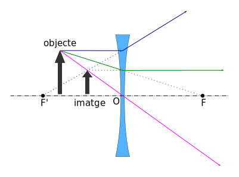
  <figcaption>Marxa de raigs per a un objecte a una distància més petita que la focal. Les característiques de la imatge no canvien, continua sent virtual, dreta i més petita que l'objecte.</figcaption>
</figure>

### Les equacions de les lents

Per a les lents tenim que són vàlides les equacions que hem trobat pels miralls, per tant, pel que fa a les posicions tenim <a href="#fn18" id="ref18">18</a>:

$$\frac{1}{s}+\frac{1}{s'}=\frac{1}{f}$$
 

Per l'augment lateral:

$$m=\frac{y'}{y}=-\frac{s'}{s}$$
 

Resulta important detenir-se en la convenció de signes necessària per a que les relacions anteriors siguin vàlides. Definirem com **espai objecte** l'espai que es troba a l'esquerra de la lent i **espai imatge** l'espai que es troba a la dreta de la lent. Tot el que pertany a l'objecte (posició $$s$$ i distància focal objecte $$f$$) serà positiva si està dintre de l'espai objecte i negativa en cas que estigui a l'espai imatge. De manera anàloga, tot el que pertany a la imatge (posició $$s'$$ i distància focal imatge $$f'$$) serà positiva quan es està dintre de l'espai imatge i negativa en cas contrari. En canvi, pel que fa a l'eix vertical, tot el que estigui per sobre de l'eix òptic el considerarem positiu i si està per dessota el considerarem negatiu. 

Amb la convenció adoptada les lents convergents tenen distància focal positiva (també són conegudes com a lents positives) i les lents divergents tenen distància focal negativa (lents negatives). També passa que les imatges reals tenen una posició positiva i les virtuals tenen una posició negativa. Les imatges que estan dretes tindran una altura positiva i les que estan invertides tindran una altura negativa.

## La visió i l'ull 

L'ull és un dels aparells més meravellosos que es poden trobar a la natura, han estat necessaris milers de milions d'anys d'evolució per a que la natura hagi pogut arribar a un grau de sofisticació tal. Aquí ens interessarem per l'ull com a instrument òptic i deixarem de banda altres aspectes de la visió com ser els biològics o psicològics. Com a instrument òptic podem dir que l'ull és un sistema convergent que acaba formant una imatge real sobre una pantalla que tenim al fons de l'ull anomenada **retina**. La imatge que es forma a la retina és una imatge invertida, però es el nostre cervell qui s'encarrega de que la veiéssim de manera dreta. 

Per arribar a la retina la llum ha de travessar una sèrie de medis refringents que s'encarreguen de desviar els raigs de llum i formar la imatge sobre la retina. Les diferents parts de l'ull humà es poden observar a la figura inferior. El major desviament es produeix quan la llum passa de l'aire a la còrnia, ja que aquí és on tenim el canvi més brusc de índex de refracció. Després la llum travessa l'humor aquós, passa per la pupil·la (furat rodejat per l'iris i que canvia de diàmetre segons la necessitat de l'ull de rebre més o menys llum). Els següent que fa la llum és travessar el cristal·lí, una lent que controlada pels músculs ciliars i que pot canviar el seu gruix i, amb això, la seva distància focal. El cristal·lí és l'encarregat d'enfocar “acomodant” l'ull per veure els objectes que es troben a diferents distàncies. 

<figure>
  
  <figcaption>Ull humà. La llum travessa diferents capes transparents abans d'arribar a formar una imatge real sobre la retina. </figcaption>
</figure>

A continuació la llum travessa l'humor vitri que, com l'humor aquós, és un líquid transparent encarregat de mantenir el globus ocular “inflat” i que transporta els nutrients i les deixalles de les cel·les de les parts transparents de l'ull El fet de que els medis refractius de l'ull hagin de ser transparents impedeix que tinguin capil·lars sanguins per a proveir els nutrients a les cel·les, la qual cosa fa que tingui una forma alternativa de fer arribar els aliments i de desfer-se de les deixalles de les cel·les d'aquests medis.. La imatge, finalment, es forma a la retina on la llum és captada unes cel·les sensibles a la llum anomenades bastons i cons. Els cons són sensibles als colors i n'hi ha de tres tipus, uns especialitzats en el color blau, altres en el vermell i altres en el verd. Es troben fonamentalment en una regió d'aproximadament 1\,\mathrm{mm^{2}}
  anomenada fòvea ubicada on està l'eix òptic de l'ull (allà on va a parar la imatge quan fixem la mirada) i és la regió d'alta resolució de l'ull on podem apreciar detalls fins de la imatge. Més enllà de la fòvea s'ubiquen els cons que no poden percebre els colors i són les que es fan servir amb poca llum (visió nocturna) i ens donen la visió perifèrica. Podem veure a la figura una gràfica amb la densitat de bastons i cons de la retina. 
  
<figure>
  
  <figcaption>Densitat de receptors de la retina. Els cons s'ubiquen fonamentalment a la fòvea i són els responsables de la visió allà on enfoquem la mirada i de la visió dels colors. Els bastons no poden distingir els colors i són responsables de la visió nocturna i perifèrica. </figcaption>
</figure>

Al punt cec no hi ha bastons ni cons i és que allí és d'on surt el nervi òptic portant tota la informació de les cel·les sensores cap al cervell.

### Defectes de la visió

No sempre l'ull produeix una bona imatge sobre la retina i moltes vegades hem de recórrer a l'oftalmòleg per tal de corregir alguns defectes o poder veure bé. Un dels problemes més usuals de la visió és la miopia (Figura següent), que es produeix quan som incapaços de enfocar objectes llunyans. En aquest cas, la imatge es forma abans de la retina. La correcció d'aquest defecte s'aconsegueix amb una lent divergent, de manera que fa disminuir la potència del sistema refractiu de l'ull obrint els raigs per a que acabin formant la imatge a la retina.

<figure>
  
  <figcaption>Miopia. (a) La imatge d'objectes llunyans es forma abans de la retina. (b) La correcció es fa amb lents divergents que obren els raigs. </figcaption>
</figure>

Una altre problema comú és el contrari a la miopia anomenat hipermetropia, en aquest cas la imatge d'objectes propers no es forma a la retina, sinó que es forma darrera la retina i la manera de corregir aquest problema és amb lents convergents que augmentes la potència refractiva de l'ull fent que els raigs es tanquin més com es veu a la figura inferior.

<figure>
  
  <figcaption>Hipermetropia. (a) La imatge d'objectes propers es forma després de la retina. (b) La correcció es fa amb lents convergents que tanquen els raigs. </figcaption>
</figure>

Un tercer defecte molt comú de la visió és l'astigmatisme, aquest defecte es deu a que l'ull no té una simetria axial i desvia els raigs de llum més en una direcció que en altra, per tant quan enfoquem en un eix no podem veure en focus en un altre. La manera de corregir aquest defecte és amb lents cilíndriques o esferotòriques quan hi ha també miopia o hipermetropia associada. Una altra manera de corregir aquests defectes és amb cirurgia refractiva, que consisteix en la utilització de làser per a produir una modificació de la curvatura de la còrnia.

<figure>
  
  <figcaption>Cercle astigmàtic. Quan tenim astigmatisme es resulta impossible enfocar totes les ratlles del cercle alhora.</figcaption>
</figure>

Hi ha defectes de la visió que esdevenen amb l'edat, com ser la presbícia, també coneguda com a vista cansada, i que apareix després dels 40-45 anys d'edat. Aquest problema, del que gairebé ningú pot escapar, consisteix en un enduriment del cristal·lí que ja no pot acomodar-se per fixar la vista a diferents distància i necessita ajuda de lents per a veure de prop. Una altra malaltia del cristal·lí són les cataractes, que consisteix en la opacitat del cristal·lí que no deixa passar la llum per a formar la imatge sobre la retina. Aquesta malaltia és més comú en gent gran. Per a corregir-la és necessari la cirurgia on es reemplaça el cristal·lí per una lent intraocular de distància focal fixa.

El glaucoma és una altra malaltia de l'ull que es produeix al nervi òptic que es produeix, generalment, degut a una pressió intraocular és massa alta. El glaucoma sense tractar pot conduir a un dany irreversible del disc òptic de la retina amb una conseqüent pèrdua de camp de visió, la qual cosa pot convertir-se en una ceguera parcial o total.

#### Notes

1. Els moviments periòdics ens permeten mesurar el temps. El temps que tarda la Terra en fer una volta al voltant del Sol ens permet definir l'any, el temps que tarda la Lluna en envoltar la Terra ens permet definir el mes i el temps que tarda la Terra en donar un gir sobre si mateixa permet definir el dia. <a href="#ref1" title="Tornar al text.">↩</a>

2. A vegades es fa servir l'equació $$\eqref{eq:a_vs_x}$$ com a definició de MHS i, a partir d'ella es dedueix l'equació de moviment $$\eqref{eq:eq_mov_mhs}$$. Qualsevol de les dues aproximacions són equivalents com ja hem demostrat.
<a href="#ref2" title="Tornar al text.">↩</a>

3. Tant la força pes com la recció normal són en aquest cas perpendiculars al moviment, per tant fan un treball nul que no juga cap paper en l'energia del sistema. Podríem també veure'l d'aquesta manera.<a href="#ref3" title="Tornar al text.">↩</a>

4. Un altre nom per a la velocitat de propagació és velocitat de fase.<a href="#ref4" title="Tornar al text.">↩</a>

5. Un fenomen clarament ondulatori és que sumant llum més llum podem obtenir foscor. T'has preguntat on va parar l'energia aleshores?<a href="#ref5" title="Tornar al text.">↩</a>

6. En realitat no necessitem que la diferència de fase de les ones al partir sigui nul·la, només necessitem que sigui constant, però la suposició de que sigui nul·la simplifica l'anàlisi i no invalida la deducció. Quan dues fonts d'ones mantenen la seva diferència de fase constant direm que són fonts coherents.<a href="#ref6" title="Tornar al text.">↩</a>

7. Aquesta observació es coneix ara com a [Llei de Hubble](https://ca.wikipedia.org/wiki/Constant_de_Hubble).<a href="#ref7" title="Tornar al text.">↩</a>

8. En realitat el ventre es produeix una mica més enllà de la boca del tub però, per a simplificar els càlculs, suposarem que el ventre es produeix en la boca del tub.<a href="#ref8" title="Tornar al text.">↩</a>

9. Aquests fenòmens els estudiarem al segon curs de Física. <a href="#ref9" title="Tornar al text.">↩</a>

10. Anomenem medi homogeni a un medi que té les mateixes propietats físiques en tots els seus punts. Per exemple, l'aigua a temperatura ambient és un medi homogeni, mentre que l'aigua bullint no ho és, ja que hi ha bombolles que tenen propietats físiques diferents a les de l'aigua líquida.<a href="#ref10" title="Tornar al text.">↩</a>

11. En realitat, per a que hi hagi un punt focal ben definit la superfície del mirall ha de ser parabòlica. Fer miralls parabòlics és molt més complicat que fer miralls esfèrics, per això s'utilitzen miralls esfèrics. Els errors que es cometen per utilitzar superfícies esfèriques son petits si els raigs viatgen en direccions que no s'aparten massa de l'eix òptic (raigs paraxials). Nosaltres sempre treballarem fent servir l'aproximació paraxial.<a href="#ref11" title="Tornar al text.">↩</a>

12.Per a la construcció de la imatge estudiarem el comportament de raigs que surten de la punta de la fletxa. Si l'objecte no emet llum, la llum serà la que reflecteix a partir d'una il·luminació externa. Els objectes reflecteixen llum en totes direccions, de tots aquests raig estudiarem el camí dels que ens interessen.<a href="#ref12" title="Tornar al text.">↩</a>

13. Observeu que encara que el mirall és esfèric, tracem una línia recta i fem reflectir els raigs sobre aquesta recta, això ho fem per a què la construcció pugui sortir bé quan fem servir l'aproximació paraxial (raigs propers a l'eix òptic).<a href="#ref13" title="Tornar al text.">↩</a>

14. La relació [eq:augment2] que ha estat deduïda utilitzant un mirall còncau també és vàlida per a miralls convexos i la seva deducció és anàloga a la que hem fet aquí.<a href="#ref14" title="Tornar al text.">↩</a>

15. És important no oblidar que per calcular la potència en diòptries és obligatori que la distància focal estigui expressada en metres.<a href="#ref15" title="Tornar al text.">↩</a>

16. Recordem que per a formar una imatge real és necessari que els raigs es tornin a trobar en un punt, ja que són portadors de la informació d'un punt de l'objecte. Si posem una pantalla en la posició on es forma la imatge podrem observar la imatge projectada sobre ella.<a href="#ref16" title="Tornar al text.">↩</a>

17. Nosaltres podem veure les imatges virtuals perquè el nostres ulls acaben formant una imatge real sobre la retina. Els raigs que ingresen al nostre ull com raigs divergents acaben convergint a la nostra retina degut a a que l'ull és un sistema òptic convergent. <a href="#ref17" title="Tornar al text.">↩</a>

18. La deducció de les relacions següents es pot fer de manera anàloga a la que vam fer servir pels miralls, tot es basa en les relacions de triangles semblants, en aquest cas es fa servir el raig que passa pel centre de la lent per a trobar els angles congruents.<a href="#ref18" title="Tornar al text.">↩</a>

