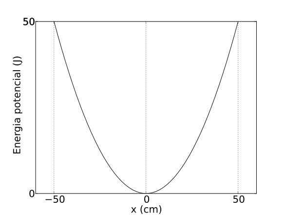
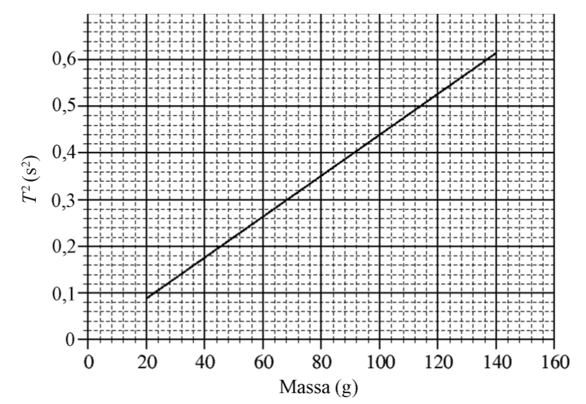
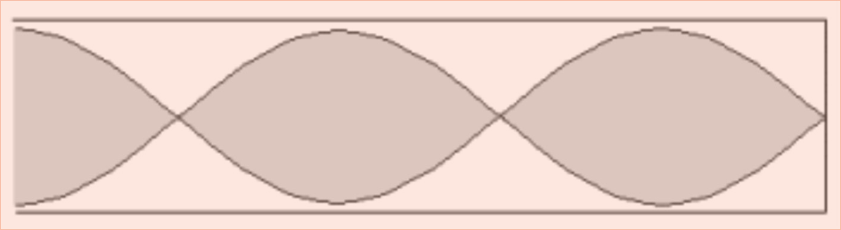

# Problemes Unitat 1: Les ones i el so

Style type="text/css">
    ol ol { list-style-type: lower-alpha; }
    .aligncenter {text-align: center;}
</style>

## Moviment Vibratori Harmònic Simple

1. Sigui un m.v.h.s. amb equació $$x=2\sin\left(4\pi t+\frac{\pi}{4}\right)$$ en què $$x$$ s'expressa en cm i $$t$$ en s. Digues quina de les següents respostes és la correcta: 

    1. La freqüència és $$4\pi\,\mathrm{Hz}$$, l'amplitud és 2 cm i la fase inicial és $$\pi/4$$.
    2. La freqüència angular és 4 rad/s, l'amplitud és 2 cm i la fase inicial és $$\pi/4$$.
    3. La freqüència és 2 Hz, l'amplitud és 2 cm i la fase inicial és $$\pi/4$$.
    4. La freqüència angular és $$4\pi$$, l'amplitud és 2 m i la fase inicial és $$\pi/4$$.
    5. La freqüència és 2 Hz, l'amplitud és 2 cm i la fase inicial $$4\pi$$.
     <a href="sol/prob601.pdf" target="_blank">Solució</a>  

2. En el m.v.h.s. d'equació $$x=12\sin(2\pi t)$$ amb unitats del sistema SI, calcula el valor de l'acceleració quan l'elongació val 8 m.
 <a href="sol/prob602.pdf" target="_blank">Solució</a>  

3. Un mòbil presenta un moviment vibratori harmònic simple amb un període de 0,5 s i una amplitud de 2 mm. 
    1. Escriviu l'equació de l'elongació com funció del temps. 
    2. Quina serà l'equació d'un mòbil que es mou amb la mateixa amplitud i freqüència, però en oposició de fase? 
    3. Quant valen la velocitat màxima i l'acceleració màxima que assoleix el mòbil? 
    4. Trobeu l'expressió dels instants de temps en què el mòbil té velocitat nul·la.
     <a href="sol/prob603.pdf" target="_blank">Solució</a>  

4. La velocitat d'un m.v.h.s. en funció del temps en segons és:
$$v=\frac{4\pi}{3}\cos\left(\frac{\pi}{3}t+\frac{\pi}{2}\right)\,\mathrm{m/s}$$
    1. Determina la freqüència i l'amplitud d'aquest moviment. 
    2. Expressa l'elongació del mòbil en funció del temps. 
    3. Expressa l'acceleració del móbil en funció del temps. 
    4. Digues quant val l'acceleració en l'instant que el mòbil passa pel punt d'equilibri.
     <a href="sol/prob604.pdf" target="_blank">Solució</a>  
    
5. La gràfica següent correspon a un moviment vibratori harmònic simple. Podeu escriure la seva equació de moviment?
    

     <a href="sol/prob605.pdf" target="_blank">Solució</a>  

6. Dues masses $$m_{1}$$ i $$m_{2}$$ tal que $$m_{1}=2m_{2}$$, es pengen dels extrems de dues molles iguals i es deixen oscil·lar, quina serà la relació entre els períodes $$T_{1}$$ i $$T_{2}$$ dels respectius moviments? Justifica la teva resposta. 

	1. $$T_{1}=T_{2}$$
	2. $$T_{1}=2T_{2}$$
	3. $$T_{1}=0,5T_{2}$$
	4. $$T_{1}=1,4T_{2}$$
    
     <a href="sol/prob606.pdf" target="_blank">Solució</a>  
    
7. Tenim dos pèndols de la mateixa massa, però la longitud d'un és el doble de la de l'altre. Aleshores, digues quines d'aquestes afirmacions és correcta (justifica la teva resposta): 
    1. Els períodes són iguals. 
    2. El període d'un és el doble de l'altre. 
    3. El període d'un és $$\sqrt{2}$$ vegades el de l'altre. 
    4. El període d'un és $$2\pi$$ vegades el de l'altre. 
    5. No es pot dir res de la relació entre períodes si no se sap el valor de la massa dels pèndols.
     <a href="sol/prob607.pdf" target="_blank">Solució</a>  

8. Un pèndol està compost per una massa de 10 kg i un fil d’1 m de longitud. ($$\lvert g \rvert=9,8\,\mathrm{m/s^{2}}$$): 
    1. Troba el seu període d’oscil·lació per a petites oscil·lacions. 
    2. Quina constant elàstica hauria de tenir una molla amb la mateixa massa penjada per tenir el mateix període d’oscil·lació? 
    3. Si es dugués el mateix pèndol a un planeta on l’acceleració de la gravetat fos la meitat de la de la Terra, com canviaria el període d’oscil·lació? Si es dugués la mateixa molla del apartat (B) al mateix planeta: canviaria el seu període en la mateixa proporció? Justifica-ho.
     <a href="sol/prob608.pdf" target="_blank">Solució</a>  
 
9. Una partícula descriu un moviment vibratori harmònic d’amplitud A i pulsació $$\omega$$. Si dupliquem alhora l’amplitud i el període del moviment, canviarà l’energia cinètica de la partícula quan passi pel punt central de l’oscil·lació? Justifiqueu la resposta. 
     <a href="sol/prob609.pdf" target="_blank">Solució</a>  

10. La posició d’una partícula puntual de massa 500 g que descriu un moviment vibratori harmònic ve donada, en unitats del SI, per $$x=0,30\sin(20\pi t)$$. Calculeu: 
    1. L’energia cinètica màxima de la partícula. 
    2. La força màxima que actua sobre ella. 
     <a href="sol/prob610.pdf" target="_blank">Solució</a>  

11. Sobre una taula horitzontal hi ha una massa de 380 g lligada a l’extrem d’una molla de constant recuperadora $$k=15\,\mathrm{N/m}$$. L’altre extrem de la molla és fix, i el fregament del conjunt és negligible. Desplacem la massa 10 cm des de la posició d’equilibri, tal com es veu a les figures següents, i la deixem anar.
	  
    

     
    Trobeu: 
    
    1. El període del moviment. 
    2. L’equació del moviment, tenint en compte que quan $$t=0\,\mathrm{s}$$, la molla està a l’elongació màxima positiva, com es veu a la segona figura. 
    3. L’energia cinètica de la massa quan passa per un punt situat 2 cm a la dreta de la posició d’equilibri. 
     <a href="sol/prob611.pdf" target="_blank">Solució</a>  
    
12. Un objecte de massa 3 kg penja d’una molla. Des de la seva posició d’equilibri l’estirem cap avall una distància de 25 cm i, des d’aquest punt i trobant-se inicialment en repòs, el deixem oscil·lar lliurement. El període d’oscil·lació és 
d’1 s. Determineu: 
    1. Les constants A, $$\omega$$, $$\phi$$, en unitats de l’SI, de l’equació $$y=A\cos(\omega t+\phi)$$ que descriu el moviment de l’objecte. 
    2. El valor màxim de l’acceleració de l’objecte, la seva direcció i sentit, i els punts de la trajectòria en què s’assoleix. 
    3. La constant recuperadora de la molla. 
    
     <a href="sol/prob612.pdf" target="_blank">Solució</a>  

13. Un gronxador està format per una cadira d’1,5 kg i una cadena d’1,80 m de longitud i massa negligible. Una nena de 20 kg s’hi gronxa. En el punt més alt de l’oscil·lació, la cadena forma un angle de 40° amb la vertical. Determineu: 
    1. L’acceleració del gronxador i la tensió de la cadena en el punt més alt de l’oscil·lació.
    2. La velocitat del gronxador en el punt més baix de l’oscil·lació.
    3. La tensió màxima de la cadena.
     <a href="sol/prob613.pdf" target="_blank">Solució</a>  
    
14. Un oscil·lador harmònic està format per una molla ideal de massa negligible i una partícula puntual unida a l’extrem de la molla, de massa $$m=40\,\mathrm{g}$$. El període d’oscil·lació és de 2 s.
    1. Si l’amplitud de les oscil·lacions és de 10 cm, quina velocitat màxima adquireix la massa m?
    2. Representeu en un gràfic l’acceleració de l’oscil·lador en funció del temps, i indiqueu en els eixos les escales corresponents.
    3. Quant hauria de valer la massa m perquè la freqüència de l’oscil·lador es multipliqués per dos? 
     <a href="sol/prob614.pdf" target="_blank">Solució</a>  

15. Una molla, situada sobre una taula horitzontal sense fregament, està fixada per un dels extrems a una paret i a l’altre extrem hi ha lligat un cos de 0,5 kg de massa. La molla no està deformada inicialment. Desplacem el cos una distància de 50 cm de la seva posició d’equilibri i el deixem moure lliurement, amb la qual cosa descriu un moviment vibratori harmònic simple. L’energia potencial del sistema en funció del desplaçament es representa amb la paràbola de la gràfica següent. 
	

	
	

    Determineu: 
    
    1. El valor de la constant recuperadora de la molla 
    2. El valor de la velocitat del cos quan té una elongació de 20 cm. 
     <a href="sol/prob615.pdf" target="_blank">Solució</a>  
    
16. L’èmbol d’una màquina de vapor té un recorregut $$D=100\,\mathrm{cm}$$ i comunica a l’eix una velocitat angular de 60 rpm. Si considerem que el moviment de l’èmbol descriu un moviment harmònic simple, deduïu el valor de la velocitat que té quan és a una distància de 20 cm d’un dels extrems del recorregut. 
	

	<a href="sol/prob616.pdf" target="_blank">Solució</a> 

17. Una massa $$m=0,3\,\mathrm{kg}$$, situada en un pla horitzontal sense fricció i unida a una molla horitzontal, descriu un moviment vibratori harmònic. L’energia cinètica màxima de la massa és 15 J. 
    1. Si sabem que entre els dos punts del recorregut en què el cos té una velocitat nul·la hi ha una distància de 50 cm, calculeu l’amplitud, la freqüència i el període del moviment i la constant elàstica de la molla. 
    2. Calculeu la posició, la velocitat i l’acceleració del cos en l’instant $$t=3\,\mathrm{s}$$, considerant que quan $$t=0$$ el cos té l’energia cinètica màxima. 
 <a href="sol/prob617.pdf" target="_blank">Solució</a>  

18. Una molla de constant $$k=125\,\mathrm{N/m}$$ té un extrem fix i, en l’altre, hi ha lligada una massa de 200 g que pot lliscar sobre una superfície horitzontal sense fregament. Desplacem inicialment la massa 12 cm de la posició d’equilibri, tot allargant la molla, i la deixem anar. Determineu: 
    1. El valors màxims de les energies cinètica i potencial assolides durant el moviment i la velocitat màxima de la massa. 
    2. El període i la freqüència del moviment harmònic resultant. Escriviu també l’equació d’aquest moviment prenent t=0 com l’instant en què s’ha deixat anar la massa. 
 <a href="sol/prob618.pdf" target="_blank">Solució</a>  

19. Una massa de 0,5 kg descriu un moviment harmònic unida a l’extrem d’una molla, de massa negligible, sobre una superfície horitzontal sense fregament. En la gràfica següent es relaciona el valor de l’energia mecànica de la molla amb el quadrat de l’amplitud d’oscil·lació del moviment harmònic: 
	

    Calculeu: 
    1. El valor de la freqüència d’oscil·lació.
    2. El valor de la velocitat màxima de la massa quan l’amplitud d’oscil·lació del moviment és 0,141 4 m.
	 <a href="sol/prob619.pdf" target="_blank">Solució</a>  

20. La massa dels astronautes a l’espai es mesura amb un aparell que es basa en el moviment vibratori harmònic. Quan l’astronauta s’hi col·loca, l’aparell inicia un moviment vibratori i en mesura la freqüència. Sabem que per a una massa de 60 kg, la freqüència d’oscil·lació és 0,678 Hz. 
    1. Calculeu la velocitat màxima d’oscil·lació d’aquesta massa si sabem que l’amplitud màxima d’oscil·lació és 20 cm. 
    2. Si la massa d’un astronauta fa oscil·lar l’aparell a una freqüència de 0,6064 Hz, calculeu la constant elàstica de la molla i la massa de l’astronauta. 
	 <a href="sol/prob620.pdf" target="_blank">Solució</a>  

21. Duem a terme l’experiència següent: pengem d’una molla fixada en un suport per un dels seus extrems set masses diferents, i provoquem que aquestes masses facin petites oscil·lacions i realitzin un MVHS. Mesurem amb molta cura el temps que triga a fer deu oscil·lacions cadascuna de les masses i, a partir d’aquí, obtenim els períodes (T) del moviment, el quadrat dels quals es representa en la gràfica. 
    1. Calculeu la constant elàstica de la molla i expliqueu raonadament si depèn de la massa. Indiqueu el període que mesuraríem si provoquéssim les oscil·lacions amb una massa de 32,0 g. 
    2. El MVHS que descriu la massa de 100 g que hem penjat de la molla té una amplitud de 10,0 cm. Calculeu l’elongació i l’acceleració que tindrà la massa quan hauran transcorregut 3,00 s des del moment en què l’hem deixat oscil·lar a partir del punt més baix de la trajectòria. 
	

	<a href="sol/prob621.pdf" target="_blank">Solució</a> 

22. En la vida quotidiana estem sotmesos a moviments vibratoris. Per exemple, en caminar, córrer, viatjar amb algun mitjà de locomoció o estar a prop d’alguna màquina. A l’hora de dissenyar vehicles i màquines, cal fer un estudi d’aquests moviments per tal d’aconseguir que siguin confortables i segurs, ja que els efectes de les vibracions poden anar des de simples molèsties fins al dolor o la mort. Aquests estudis solen utilitzar l’acceleració màxima del moviment vibratori com a variable, per a relacionar-la amb les molèsties que percebem. Se sap que som molt sensibles a un moviment vibratori de 6,0 Hz i que, amb aquesta freqüència, a partir d’una acceleració màxima de $$6,0\,\mathrm{ms^{-2}}$$, les molèsties són tan fortes que ens poden arribar a alarmar. 
    1. Calculeu l’amplitud d’oscil·lació que correspon a un moviment vibratori harmònic de 6,0 Hz i una acceleració màxima de $$6,0\,\mathrm{ms^{-2}}$$. 
    2. Calculeu el valor de la constant elàstica d’una molla per tal que una massa de 85 kg que hi estigui enganxada oscil·li amb una freqüència de 6,0 Hz. 
	 <a href="sol/prob622.pdf" target="_blank">Solució</a>  

23. La gràfica següent representa el moviment d’un cos de 250 g de massa que oscil·la, sense fregament, unit a una molla.
    

    1. Calculeu l’amplitud, la freqüència angular, el període i la fase inicial d’aquest moviment. 
    2. Escriviu l’equació del moviment i calculeu l’energia mecànica total del sistema.
	 <a href="sol/prob623.pdf" target="_blank">Solució</a> 

24. Una partícula de massa 500 g descriu un moviment vibratori harmònic de manera que la seva posició (en unitats del sistema internacional) ve donada per $$x=0,20\sin(10\pi t)$$, on $$t$$ és el temps. Calculeu l’energia cinètica màxima de la partícula i la força màxima que actua sobre ella. Indiqueu en quins punts de l’oscil·lació s’assoleixen aquests valors màxims. 
 <a href="sol/prob624.pdf" target="_blank">Solució</a> 

## Moviment ondulatori

1. Un radar utilitza ones electromagnètiques de freqüència $$5\times10^{11}\,\mathrm{Hz}$$. 
	1. Quantes longituds d’ona hi ha entre l’estació i un avió situat a 25 km de distància? 
	2. Quant de temps transcorre des que s’emet un pols fins que retorna a l’estació, després de rebotar a l’avió?

    Dada: Velocitat de la llum: $$c=3\times10^{8}\,\mathrm{m/s}$$

	<a href="sol/prob6101.pdf" target="_blank">Solució</a> 

2. L'equació d'una ona harmònica és, en unitats de l'SI, 

    $$y=20\cos\pi(20t-4x)$$

    Quina és l'amplitud, la longitud d'ona, la velocitat de propagació i el període?

	<a href="sol/prob6102.pdf" target="_blank">Solució</a> 

3. Una ona sonora de 440 Hz té una longitud d'ona de 77 cm. Quina serà la longitud d'ona d'una ona sonora de 200 Hz que es propagui en el mateix medi?

	<a href="sol/prob6103.pdf" target="_blank">Solució</a> 

4. Una ona elàstica ve descrita per l’equació d’ones $$y(x,t)=0,1\sin2\pi(x-10t)$$, en unitats de l’SI. Determineu: 
	1. La longitud d’ona i el període.
    2. La velocitat de propagació de l’ona.
    
    <a href="sol/prob6104.pdf" target="_blank">Solució</a> 

5. L'elongació en centímetres de les partícules d'una ona harmònica, en funció del temps en segons i de la seva posició en metres, és
    $$y=10\sin\pi(50t-x)$$
	1. Calcula la velocitat de propagació d'aquesta ona.
	2. Quina és la distància mínima entre dos punts de l'ona la diferència de fase de la qual és de $$\pi/2$$ radians? Quant tarda l'ona a propagar-se aquesta distància.

	<a href="sol/prob6105.pdf" target="_blank">Solució</a> 

6. Troba a quina distància es propaga en 1 minut l'ona l'equació de la qual en unitats del SI és:

    $$y=0,05\cos\left[2\pi(120t+3x)\right]$$

	<a href="sol/prob6106.pdf" target="_blank">Solució</a> 

7. La freqüència de les ones del mar durant un temporal és de 0,2 Hz i la longitud d'ona és de 20 metres. Calcula la velocitat de propagació, el nombre d'ona i escriu l'equació d'ona si sabem que l'alçada de les ones és de 5 metres. 

	<a href="sol/prob6107.pdf" target="_blank">Solució</a> 

8. Una ona harmònica de freqüència 550 Hz es propaga a una velocitat de 300 m/s. Quina és la distància mínima entre dos punts que en tot moment es troben en el mateix estat de vibració? 

	<a href="sol/prob6108.pdf" target="_blank">Solució</a> 

9. La Xarxa d’Instruments Oceanogràfics i Meteorològics (XIOM) fa servir boies marines per a estudiar l’onatge. De les estadístiques dels últims deu anys es pot extreure que, de mitjana, l’onatge a la costa catalana té una alçada (distància entre el punt més baix i el més alt de l’onada) de 70 cm i un període de 5 s. Escriviu l’equació del moviment d’una boia que es mou com aquesta onada mitjana. 

	<a href="sol/prob6109.pdf" target="_blank">Solució</a> 

10. Una ona harmònica es propaga per una corda tensa. Trieu la resposta que considereu correcta.
	1. Si la freqüència es redueix a la meitat, 
		1. el període es redueix a la meitat. 
		2. la velocitat de propagació es duplica.
        3. la longitud d’ona es duplica.

	2. Si es tracta d’una ona transversal, 
		1. en un instant donat, tots els punts de la corda vibren amb la mateixa velocitat.
		2. l’ona es propaga a la velocitat constant de 340 m/s.
		3. l’ona vibra en una direcció que és perpendicular a la de propagació.

	<a href="sol/prob6110.pdf" target="_blank">Solució</a> 

11. Un cos de 100 g de massa realitza un moviment vibratori harmònic simple de 20 cm d’amplitud i fa 10 oscil·lacions en 2 s. Deduïu: 
    
	1. El valor de la velocitat del cos quan l’elongació és la meitat de l’amplitud.
	2. El valor de l’energia mecànica del cos.
	3. L’equació de l’ona generada, si es transmet amb una velocitat de 20 m/s.

	<a href="sol/prob6111.pdf" target="_blank">Solució</a> 

12. Una corda està unida per un extrem a una paret i està lliure per l’altre extrem. Fem vibrar l’extrem lliure harmònicament i es genera una ona transversal, descrita per l’equació 

    $$y=4\sin2\pi(t/2-x/4)$$

    en què l'amplitud es mesura en centímetres mentre que el temps, $$t$$, i la distància, $$x$$, es mesuren en unitats del sistema internacional (SI). Calculeu:
    
	1. La velocitat de vibració d’un punt de la corda que dista 5 m de l’extrem lliure, en l’instant $$t=3\,\mathrm{s}$$.
	2. La diferència de fase entre dos punts de la corda que disten 1 m i 3 m de la paret, respectivament, en un mateix instant.
	3. Quant tardaria la vibració a arribar a la paret des de l’extrem lliure en què es genera, si la corda tingués una longitud de 10 m.

	<a href="sol/prob6112.pdf" target="_blank">Solució</a> 

13. Fent servir un diapasó es genera una ona sonora unidimensional de 440 Hz de freqüència i 10 mm d’amplitud, que viatja en direcció radial des del focus emissor. La velocitat de propagació del so en l’aire, en les condicions de l’experiment, és de $$330\,\mathrm{m\cdot s^{-1}}$$. Determineu: 

	1. L’equació del moviment de l’ona generada (en unitats de l’SI).
	2. El desfasament en la vibració de dos punts separats 1,875 m en un mateix instant.
	3. La màxima velocitat de vibració (en unitats de l’SI) d’una molècula d’oxigen de l’aire que fa de transmissor de l’ona, que es troba a 1 m del diapasó.

	<a href="sol/prob6113.pdf" target="_blank">Solució</a> 

14. En una cubeta d’ones es generen ones transversals planes de 10 cm d’amplitud. El generador fa 10 oscil·lacions cada 5 s. La vora de la cubeta es troba a 60 cm de distància, i les ones tarden 1 s a arribar-hi. Determineu: 

	1. L’equació de les ones generades en la superfície de la cubeta (en unitats de l’SI).

    Les ones fan oscil·lar un tap de suro de 5 g que es troba a la cubeta, amb un moviment vibratori harmònic. Calculeu: 
	2. L’energia cinètica del suro quan la seva elongació és de 5 cm.
	3. L’energia mecànica total del suro.

	<a href="sol/prob6114.pdf" target="_blank">Solució</a> 

15. L'oïda d'una persona és sensible als sons de freqüències compreses entre 30 Hz i 16.000 Hz. Quina serà la mínima longitud d'ona sonora en l'aire que serà capaç d'apreciar aquesta persona? Velocitat de propagació del so a l'aire: 340 m/s. 

	<a href="sol/prob6115.pdf" target="_blank">Solució</a> 

16. El focus emissor d'una ona harmònica vibra amb una freqüència de 20 Hz i una amplitud de 2 cm. Si la distància mínima entre dos punts que estan en fase és de 15 cm, quina serà la velocitat de propagació de l’ona? 

	<a href="sol/prob6116.pdf" target="_blank">Solució</a> 

17. L’equació d’una ona harmònica transversal que es propaga en una corda tensa de gran longitud és $$y(x,t)=0,03\sin(2\pi t-\pi x)$$, on $$x$$ i $$y$$ s’expressen en metres i t, en segons. Calculeu: 

	1. La velocitat de propagació de l’ona, el període i la longitud d’ona. 
	2. L’expressió de la velocitat d’oscil·lació de les partícules de la corda i la velocitat màxima d’oscil·lació. 
	3. A l’instant $$t=2,0\,\mathrm{s}$$, el valor del desplaçament i la velocitat d’un punt de la corda situat a $$x=0,75\,\mathrm{m}$$.

	<a href="sol/prob6117.pdf" target="_blank">Solució</a> 

18. La corda del violí, en produir la nota LA, vibra amb una freqüència de 440 Hz, i aquesta vibració es transmet a l’aire com una ona acústica de 5 mm d’amplitud. 
    
	1. L’ona acústica generada per la corda del violí és descrita per l’equació  
		1. $$y=5\times10^{-3}\sin\left(\frac{44\pi}{17}t-880\pi x\right)$$,
		2. $$y=5\times10^{-3}\sin\left(440\pi t-\frac{440}{340}x\right)$$,
		3. $$y=5\times10^{-3}\sin\left(880\pi t-\frac{44\pi}{17}x\right)$$,

		en què la $$y$$ representa el desplaçament en la posició $$x$$. L’amplitud, el desplaçament, $$y$$, i la distància, $$x$$, s’expressen en metres i el temps, $$t$$, en segons.

	2. La distància mínima entre dos punts que estan en fase és de 
		1. 0,773 m.
        2. 0,386 m.
        3. 340 m.
        
    Dades: La velocitat del so en l’aire és de 340 m/s.

	<a href="sol/prob6118.pdf" target="_blank">Solució</a> 

19. Observem que dues boies de senyalització en una zona de bany d’una platja, separades una distància de 2 m, oscil·len de la mateixa manera amb l’onatge de l’aigua del mar. Veiem que la mínima distància en què té lloc aquest fet és, justament, la separació entre les dues boies. Comptem que oscil·len trenta vegades en un minut i observem que pugen fins a una alçada de 20 cm. 

	1. Determineu la freqüència, la longitud d’ona i la velocitat de les ones del mar.
	2. Escriviu l’equació que descriu el moviment de les boies en funció del temps, si comencem a comptar el temps quan les boies són en la posició més alta. Escriviu l’equació de la velocitat de les boies en funció del temps.

	<a href="sol/prob6119.pdf" target="_blank">Solució</a> 

20. Una ona harmònica transversal es propaga per una corda a una velocitat de 6,00 m/s. L’amplitud de l’ona és 20 mm i la distància mínima entre dos punts que estan en fase és 0,40 m. Considereu la direcció de la corda com l’eix x i que l’ona es propaga en el sentit positiu d’aquest eix. 
    
	1. Calculeu la longitud d’ona, el nombre d’ona, la freqüència, el període i la freqüència angular (pulsació).
	2. Escriviu l’equació de l’ona sabent que, en l’instant inicial, l’elongació d’un punt situat a l’origen de coordenades és màxima.
	3. Calculeu l’expressió de la velocitat amb què vibra un punt de la corda situat a una distància de 10 m respecte de l’origen de la vibració. Quina és la velocitat màxima d’aquest punt?

	<a href="sol/prob6120.pdf" target="_blank">Solució</a> 

	<!-- Llei d'Snell-->

21. La velocitat del so a l’aigua és més gran que a l’aire. Quan una ona harmònica de so passa de l’aire a l’aigua: 

	1. La seva freqüència augmenta, disminueix o queda inalterada?
	2. La seva longitud d’ona augmenta, disminueix o queda inalterada? 
    Justifiqueu la resposta. 

	<a href="sol/prob6121.pdf" target="_blank">Solució</a> 

22. Els grills perceben sons de freqüència d’entre 20 Hz i 100 kHz i els saltamartins perceben sons d’entre 15 Hz i 35 kHz de freqüència. Les balenes blanques emeten sons de 20 Hz. Si el so de la balena arriba a la superfície amb un angle de 60° respecte de la normal, calculeu: 

	1. L’angle amb què sortirà el so de la balena a l’aire. Podran sentir aquest so els grills i els saltamartins que són arran de la costa? I dalt d’un penya-segat?
	2. La longitud d’ona, dins i fora de l’aigua, del so produït per la balena.

    Dades: Velocitat del so a l'aire: $$v_{aire}=340\,\mathrm{m/s}$$; velocitat del so a l'aigua $$v_{aigua}=1500\,\mathrm{m/s}$$. 

	<!-- Efecte Doppler -->

23. La membrana d’un altaveu vibra amb una freqüència de 300 Hz i una amplitud de 1,00 mm i produeix un to pur. En les condicions de l’experiment, la velocitat del so és $$340\,\mathrm{ms^{-1}}$$. 

	1. Calculeu la longitud d’ona, la pulsació i el període del so produït.
	2. Indiqueu com seran, qualitativament, la freqüència i la longitud d’ona enregistrades per un observador en cada un dels casos següents, comparades (més gran / més petit / igual) amb la freqüència i la longitud d’ona originals: 

		1. L’altaveu s’acosta ràpidament a l’observador.
		2. El so arriba a l’observador després d’haver-se reflectit en una paret.

	<a href="sol/prob6123.pdf" target="_blank">Solució</a> 

24. A la sèrie televisiva Big Bang Theory, Sheldon Cooper es disfresa d'efecte Doppler (veure imatge) per a anar a una festa. Penny pregunta què és l'efecte Doppler i aleshores Sheldon li explica. Tria l'explicació d'en Sheldon:
    
	1. És la vibració d'una ona en un pla fix de l'espai després de pasar per un doppleritzador.
	2. És un patró de línies clares i fosques que es produeix després de pasar per una escletxa.
    3. És l'aparent canvi de freqüència d'una ona causat pel moviment relatiu de la font amb respecte a l'observador.
	4. És el principi per al qual es pot interpretar qualsevol punt d'un front d'ona com un nou generador d'ones.
    
    
 

    Explica alguna situació de la realitat on es posi en evidència l'efecte Doppler. 

	<!-- Interferència -->

25. Dos focus puntuals situats a 20 cm l'un de l'altre en la superfície de l'aigua emeten ones circulars de la mateixa amplitud, freqüència i fase. La velocitat de propagació de les ones és de 60 cm/s i la seva freqüència de 20 Hz.

    1. Què passarà si les dues ones interfereixen en un punt situat a 20 cm d'un focus i a 12,5 cm de l'altre?
	2. I en un punt situat a 30 cm d'un focus i 24 de l'altre?
	
	<a href="sol/prob6125.pdf" target="_blank">Solució</a> 

26. Cadascun dels extrems d’un diapasó presenta un moviment vibratori harmònic amb una freqüència de 1 000 Hz i una amplitud d’1 mm. Aquest moviment genera en l’aire una ona harmònica de so de la mateixa freqüència. El moviment dels dos extrems està en fase. 

	1. Calculeu, per a un dels extrems del diapasó, l’elongació i la velocitat del seu moviment vibratori quan faci $$3,3\times10^{-4}\,\mathrm{s}$$ que ha començat a vibrar, comptat a partir de la posició que correspon a la màxima amplitud. 
	2. Raoneu si, en l’aire, es produiria el fenomen d’interferència a partir de les ones de so que es generen en els dos extrems del diapasó. Si s’esdevé aquest fenomen, indiqueu en quins punts es produiran els màxims d’interferència.

    Dada: Velocitat del so a l'aire: $$v_{so}=340\,\mathrm{m/s}$$.

	<a href="sol/prob6126.pdf" target="_blank">Solució</a> 

27. Si observem el fons d’una piscina, sembla que sigui menys profunda del que realment és. Raoneu si això és conseqüència: 
    
	1. De l’efecte Doppler. 
	2. De la refracció de la llum. 
	3. D’un fenomen d’interferències.
	4. De la difracció de la llum.

	<!-- ones estacionàries-->

28. En un instrument musical de vent, les freqüències dels tres primers models normals de vibració són 440, 1320, i 2200 Hz. Si prenem 340 m/s com a velocitat del so en l'aire:
    
	1. Com té els extrems aquest tub sonor: oberts, tancats o un de cada?
	2. Calcula la longitud del tub.

	<a href="sol/prob6128.pdf" target="_blank">Solució</a> 

29. Les cordes d’una guitarra tenen una longitud de 78,0 cm. Sabem que una de les cordes, quan vibra en el seu harmònic fonamental, emet un LA, que correspon a una freqüència de 220 Hz. 
    
	1. Dibuixeu el perfil de l’ona quan la corda vibra en l’harmònic fonamental. Quina serà la longitud d’ona del so produït? Quina és la velocitat de propagació de les ones que, per superposició, han format l’ona estacionària de la corda?
	2. Dibuixeu la corda quan vibra i emet un so corresponent al tercer harmònic. Indiqueu, en aquest cas, els nodes i els ventres de l’ona i calculeu-ne les posicions.
	
<a href="sol/prob6129.pdf" target="_blank">Solució</a>

30. En una corda d’1,25 metres de longitud es produeix un so que conté tots els harmònics. Si agafem un valor de 340 m/s per a la velocitat del so, calculeu: 
    
    1. La longitud d’ona i la freqüència del so fonamental. 
    2. Les longituds d’ona i les freqüències corresponents a tots els harmònics. 
	
<a href="sol/prob6130.pdf" target="_blank">Solució</a>

	
	<!-- Intensitat sonora, decibels --> 

31. El clarinet és un instrument de fusta en forma de tub en el qual es generen ones estacionàries. L’instrument es pot assimilar a un tub ple d’aire obert per un extrem i tancat per l’altre. La figura mostra el mode tercer harmònic, on l’aire vibra amb una freqüència de 637 Hz. 
    
 

    
	1. Quina és la llargària del clarinet?
	2. Si la nota es toca amb una intensitat d’$$1,00\times10^{-5}\mathrm{Wm^{-2}}$$ i produeix una intensitat sonora determinada a dos metres de distància, en quants decibels augmenta el nivell de sensació sonora a la mateixa distància si la intensitat es duplica?

    Dada: $$v_{so}=340\,\mathrm{ms^{-1}}$$
	
<a href="sol/prob6131.pdf" target="_blank">Solució</a>

	
32. Alguns instruments musicals, com la flauta, estan formats per un tub en què es produeixen ones estacionàries. Podem imaginar-nos la flauta com un tub ple d’aire, obert pels dos extrems, en què es formen ones estacionàries amb ventres en els dos extrems. Si la llargària del tub és 70,0 cm: 
    
	1. Dibuixeu el perfil de l’ona corresponent a l’harmònic fonamental produït a l’interior del tub de la flauta. Determineu la freqüència de l’harmònic fonamental i la dels dos primers sobretons (segon i tercer harmònics) que es produiran en aquest tub.
	2. Quan fem sonar la flauta, produïm una sensació sonora de 65 dB en un observador situat a 2,0 m. Quina sensació sonora percebrà el mateix observador si en comptes d’una flauta sonen tres flautes idèntiques alhora?

    Dada: $$v_{so}=340\,\mathrm{m/s}$$.
	
<a href="sol/prob6132.pdf" target="_blank">Solució</a>

33. Un cor està format per 40 cantants. Si cada un d'ells emet un so el nivell d'intensitat del qual per a un oient és de 56 dB, quin serà el nivell d'intensitat de tot el cor?
	
<a href="sol/prob6133.pdf" target="_blank">Solució</a>

34. En el campionat mundial futbol de Sud-àfrica, la vuvuzela, un instrument musical d’animació molt sorollós, atesa la forma cònica i acampanada que té, va despertar una gran controvèrsia per les molèsties que causava. Aquest instrument produeix el so a una freqüència de 235 Hz i crea uns harmònics, és a dir, sons múltiples de la freqüència fonamental (235 Hz), d’entre 470 Hz i 1 645 Hz de freqüència. La vuvuzela és molt irritant, perquè els harmònics amb freqüències més altes són els més sensibles per a l’oïda humana. 
    Nota: Considereu que el tub sonor és obert pels dos cantons. 
    
	1. Amb les dades anteriors, calculeu la longitud aproximada d’una vuvuzela.
	2. Un espectador es troba a 1 m d’una vuvuzela i percep 116 dB. Molest pel soroll, s’allunya fins a una distància de 50 m. Quants decibels percep, aleshores?

    Dades: $$v_{so}=340\,\mathrm{m/s}$$; $$I_{0}=10^{-12}\,\mathrm{W/m^{2}}$$. 
    
<a href="sol/prob6134.pdf" target="_blank">Solució</a>

