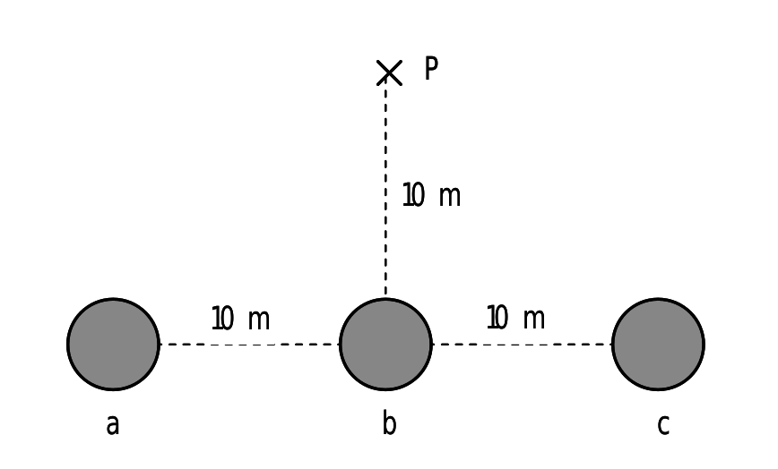
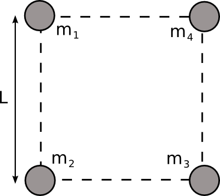
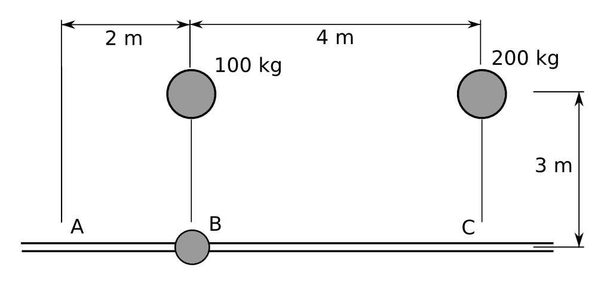
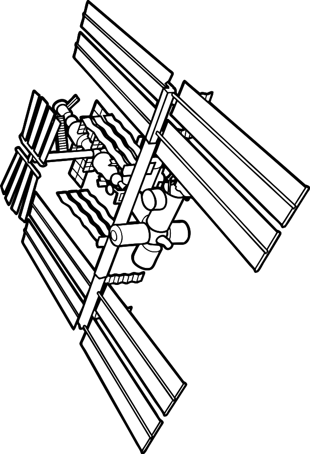
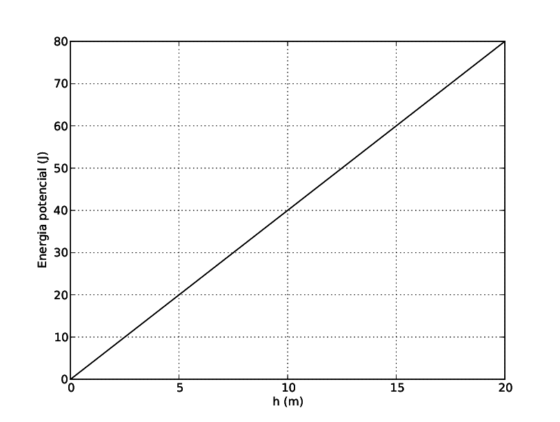
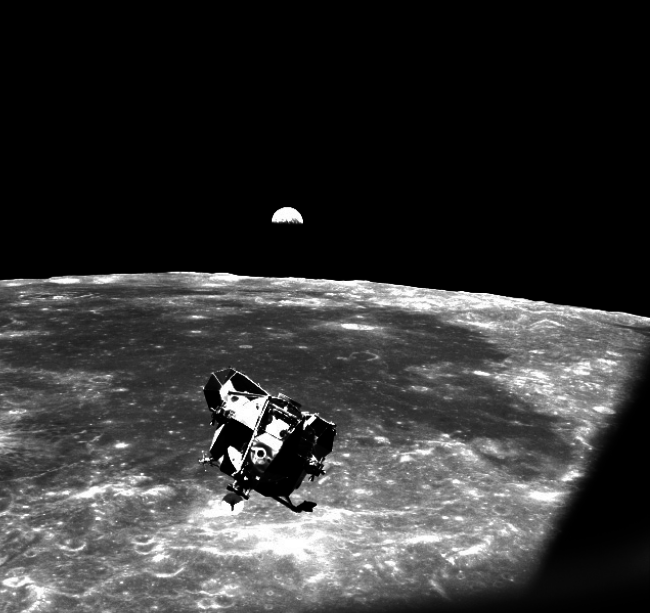

# Problemes Unitat 2: Planetes i satèl·lits

## Lleis de Kepler i de gravitació

1. A partir de les dades de la taula següent, calculeu el radi de l’òrbita del planeta Júpiter. 
    <table>
    <tr>
     <th>Planeta</th>
     <th>Radi d'òrbita (km)</th>
     <th>Període (anys)</th>
    </tr>
    <tr>
     <td>Terra</td> 
     <td>$$148 \times 10^{6}$$</td>
     <td>$$1,0$$</td>
     </tr>
     <tr>
     <td>Júpiter</td>
     <td></td>
     <td>$$11,9$$</td>
     </tr>
     </table>
      
     <a href="sol/prob701.pdf">Solució</a>
2. Mesurem el període orbital del planeta Mart al voltant del Sol i determinem que és de $$687$$ dies. Determina la distància entre Mart i el Sol sabent que la distància entre la Terra i el Sol és de $$1,496\times10^{11}\,\mathrm{m}$$.
      
     <a href="sol/prob702.pdf">Solució</a>

3. El planeta Mart té dues llunes: Fobos i Deimos. La òrbita de Fobos té un radi de 9377 km i tarda 7,66 h a completar-la. Deimos es troba a 23460 km del centre de Mart. Quant tarda Deimos en completar una òrbita al voltant de Mart?
      
     <a href="sol/prob703.pdf">Solució</a>

4. El Meteosat és un satèl·lit geoestacionari, és a dir, que gira en el pla equatorial amb la mateixa velocitat angular que la Terra. A quina distància de la superfície de la Terra es troba?
    Dades: $$M_{T}=5,972\times10^{24}\,\mathrm{kg}$$; $$R_{T}=6,371\times10^{6}\,\mathrm{m}$$.
    (Rta: 36000 km)
      
     <a href="sol/prob704.pdf">Solució</a>

5. Un satèl·lit de massa 250 kg gira en una òrbita geoestacionària. Calculeu:
    1. La velocitat del satèl·lit.
    2. El radi de l'òrbita.
    3. L'angle amb que es veu la Terra des del satèl·lit.

    Dades: $$M_{T}=5,98\times10^{24}\,\mathrm{kg}$$; $$R_{T}=6,38\times10^{6}\,\mathrm{m}$$.
   
    Rta: A. $$3,7\times10^{3}\,\mathrm{m/s}$$; B. $$4,23\times10^{7}\,\mathrm{m}$$; C. $$17,22^{\circ}$$
      
     <a href="sol/prob705.pdf">Solució</a>

6. El 19/02/2011 va aparèixer aquesta notícia al diari EL PAÍS:“Internet se prepara para dar el gran salto a los países pobres. Una red de tecnología avanzada y de envergadura planetaria ofrecerá cobertura de banda ancha a unos 3.000 millones de personas. Bautizado como O3b Networks (Other 3 billion, otros 3.000 millones, la mitad de la población mundial), el proyecto para conseguir un Internet global se basa en el lanzamiento de una constelación de satélites en órbita ecuatorial que llevarán la señal desde Nicaragua hasta Nueva Zelanda, pasando por Brasil, Nigeria, Siria, Etiopía o India.[...] Pero a diferencia de los que se utilizan, por ejemplo, para distribuir canales de televisión en Europa, no estarán situados en órbita geoestacionaria (a 36.000 kilómetros de altura) sino a 8.063, lo que les permitirá ganar en velocidad de transmisión al estar cuatro veces más cerca de la Tierra.”Tenint en compte la informació donada en la nota determineu:
    1. Quina seran les velocitats angular i lineal dels satèl·lits.
    2. Quant de temps es guanyarà en les transmissions d'anada i tornada de la informació comparat amb el cas de satèl·lits geoestacionaris.

    Dades: Radi de la Terra: $$R_{T}=6,38\times10^{6}\,\mathrm{m}$$, velocitat de la llum: $$c=3\times10^{8}\mathrm{m/s}$$
      
     <a href="sol/prob706.pdf">Solució</a>
    
    <h2>Camp gravitatori</h2>
    
7. Tres masses de 1.000 kg cadascuna estan situades en els punts a, b i c (alineats). Calcula quin és el camp gravitatori que crea el conjunt de les tres masses en el punt P. Realitza el càlcul vectorial i després calcula'n el mòdul i la direcció.
    
     
8. Hi ha un punt a l'espai entre la Terra i la Lluna en el qual el camp gravitatori és nul. Determina a quina distància de la Terra està aquest punt.
     
    Dades:  
    Massa de la Terra: $$M_{T}=5,98\times10^{24}\,\mathrm{kg}$$,
    Massa de la Lluna: $$M_{L}=7,35\times10^{22}\,\mathrm{kg}$$,
    Distància Terra-Lluna: $$d_{TL}=384000\,\mathrm{km}$$,
    Constant de gravitació universal: $$G=6,673\times10^{-11}\,\mathrm{Nm^{2}/kg^{2}}$$
     
    <a href="sol/prob708.pdf">Solució</a>
     
9. Un hipotètic planeta té la mateixa massa que la Terra i un radi doble.
        1. Quant val la gravetat a la superfície d’aquest planeta?
        2. Si traslladem al planeta un rellotge de pèndol que a la Terra estava perfectament ajustat, s’avança o s’endarrereix? Per què?
     
    <a href="sol/prob709.pdf">Solució</a>
     
10. Quatre masses puntuals estan situades als vèrtexs d’un quadrat, tal com es veu a la figura. Determina: 
    1. El mòdul, direcció i sentit del camp gravitatori creat per les quatre masses en el centre del quadrat.
    2.El potencial gravitatori en aquest mateix punt.
    3.Si col·loquem una massa $$M=300\,\mathrm{kg}$$ en el centre del quadrat, quant valdrà la força sobre aquesta massa deguda a l’atracció gravitatòria del sistema format per les 4 masses? Indica quines són les components horitzontal i vertical d’aquesta força.
     
    Dades: $$m_{1}=m_{2}=m_{3}=100\,\mathrm{kg}$$; $$m_{4}=200\,\mathrm{kg}$$; $$L=3\,\mathrm{m}$$;  
        $$G=6,67\times10^{-11}\,\mathrm{Nm^{2}/kg^{2}}$$  
    
     
    <a href="sol/prob710.pdf">Solució</a>
     
11. Tres masses puntuals, $$m_{1}=1\,\mathrm{kg}$$, $$m_{2}=2\,\mathrm{kg}$$ i $$m_{3}=3\,\mathrm{kg}$$, estan situades als vèrtexs d’un triangle equilàter de costat $$a=\sqrt{3}\,\mathrm{m}$$, en una regió de l’espai on no hi ha cap altre camp gravitatori que el creat per les tres masses. Determineu: 
    1. El treball que s’ha fet per portar les masses des de l’infinit fins a la seva configuració actual (aquest treball correspon a l’energia potencial gravitatòria de la configuració).
    2. El potencial gravitatori en el punt mitjà del segment que uneix $$m_{1}$$ i $$m_{3}$$.
    3. El mòdul de la força d’atracció gravitatòria que experimenta la massa $$m_{1}$$.
     
    Dada: $$G=6,67\times10^{-11}\,\mathrm{Nm^{2}/kg^{2}}$$.
     
    <a href="sol/prob711.pdf">Solució</a>

    ## Energia

12. Tenim una massa de 10 kg en repòs sobre la superfície terrestre. Quin treball cal fer per pujar-la fins a una altura de 10 m? I fins a una altura de 630 km? 
     
    Dades:  
    $$G=6,67\times10^{-11}\,\mathrm{Nm^{2}kg^{-2}}$$;  
    $$M_{T}=5,98\times10^{24}\,\mathrm{kg}$$;  
    $$R_{T}=6,37\times10^{6}\,\mathrm{m}$$.  
    <a href="sol/prob712.pdf">Solució</a>
     
13. Dos satèl·lits A i B tenen la mateixa massa i giren al voltant de la Terra en òrbites circulars, de manera que el radi de l’òrbita d’A és més petit que el radi de l’òrbita de B.
    1. Quin dels dos satèl·lits té més energia cinètica?
    2. Quin dels dos satèl·lits té més energia mecànica?
     
    <a href="sol/prob713.pdf">Solució</a>
     
14. L'any 1910 el cometa Halley es movia amb una velocitat de 55 km/s quan era a $$8,8\times10^{7}\,\mathrm{km}$$  del centre del Sol. La seva velocitat era de 42 km/s quan era a la mateixa distància al Sol que la Terra: $$1,5\times10^{8}\,\mathrm{km}$$. Aplicant la conservació de l'energia mecànica, calcula la massa del Sol.
     
    <a href="sol/prob714.pdf">Solució</a>
     
15. Deixem anar lliurement una massa de 4 kg des del punt B. Només pot circular (sense fricció) pel carril (veure figura).
    
    1. Anirà cap a la dreta o cap a l'esquerra? Per què?
    2. Amb quina velocitat arribarà als punts A i C, tenint en compte la resposta anterior?
     
    Rta: (b) $$4,2\times10^{-5}\,\mathrm{m/s}$$.
     
    <a href="sol/prob715.pdf">Solució</a>
     
16. Un satèl·lit de massa 350 kg descriu òrbites circulars entorn de la Terra a una altura de 630 km. 
    1. Quant val la intensitat del camp gravitatori creat per la Terra a aquesta altura?
    2. Quant val l’acceleració centrípeta del satèl·lit?
    3. Quant val l’energia mecànica del satèl·lit?
     
    <a href="sol/prob716.pdf">Solució</a>
     
17. Des d’un lloc de la Terra es pot observar el pas de l'Estació Espacial Internacional (ISS) cada 90 minuts. Si segueix una òrbita circular, calculeu:
    
    1. La seva alçada sobre la superfície terrestre en km.
    2. La seva velocitat orbital.
     
    <a href="sol/prob717.pdf">Solució</a>
     
18. La massa de Saturn és de $$5,69\times10^{26}\,\mathrm{kg}$$. Un dels seus satèl·lits, Mimas, té una massa de $$3,8\times10^{19}\,\mathrm{kg}$$ i un radi d’$$1,96\times10^{5}\,\mathrm{m}$$, i descriu una òrbita pràcticament circular al voltant de Saturn de radi $$1,86\times10^{8}\,\mathrm{m}$$. Determineu: 
    1. El període de revolució de Mimas al voltant de Saturn.
    2. El valor de l’acceleració de la gravetat a la superfície de Mimas. 
    3. La velocitat d’escapament de la superfície de Mimas.
    Dada: $$G=6,67\times10^{-11}\,\mathrm{Nm^{2}kg^{-2}}$$
     
    <a href="sol/prob718.pdf">Solució</a>
     
19. El gràfic adjunt mostra com varia l’energia potencial gravitatòria d’un cos de massa 2 kg, en un planeta de radi $$R=5000\,\mathrm{km}$$, amb la distància $$h$$ a la superfície del planeta (suposant que $$h$$ és molt més petita que $$R$$). 
    
    1. L’acceleració de la gravetat a la superfície del planeta esmentat.
    2. La massa del planeta.
    3. La velocitat d’escapament en el planeta.
     
    Dada:  
    $$G=6,67\times10^{-11}\,\mathrm{Nm^{2}/kg^{2}}$$.
     
    <a href="sol/prob719.pdf">Solució</a>
     
20. Els satèl·lits GPS (global positioning system, ‘sistema de posicionament global’) descriuen òrbites circulars al voltant de la Terra. El conjunt dels satèl·lits permet que en qualsevol punt de la Terra una persona amb un receptor GPS pugui determinar la posició on es troba amb una precisió de pocs metres. Tots els satèl·lits GPS estan a la mateixa altura i fan dues voltes a la Terra cada 24 hores. Sabent que els satèl·lits tenen una massa de 150 kg, calculeu: 
    1. La velocitat angular dels satèl·lits i l’altura de la seva òrbita, mesurada sobre la superfície de la Terra.
    2. L’energia mecànica i la velocitat lineal que té un d’aquests satèl·lits GPS en la seva òrbita.
    3. La nova velocitat i el temps que trigaria a fer una volta a la Terra, si féssim orbitar un d’aquests satèl·lits a una altura doble.
     
    Dades:  
    $$G=6,67\times10^{-11}\,\mathrm{Nm^{2}kg^{-2}}$$;  
    $$M_{T}=5,98\times10^{24}\mathrm{kg}$$;  
    $$R_{T}=6380\,\mathrm{km}$$. 
    <a href="sol/prob720.pdf">Solució</a>
     
21. L’any 1969, el mòdul de comandament Columbia, de la missió Apollo 11, tripulada per l’astronauta Michael Collins, orbitava a 100 km d’altura sobre la superfície de la Lluna amb un període de 118 minuts. Mentrestant, Neil Armstrong i Edwin Aldrin, els altres dos tripulants, caminaven sobre la Lluna. 
     
    
     
    Calculeu: 
    1. La massa de la Lluna i la intensitat del camp gravitatori a la superfície lunar.
    2. La velocitat d’escapament des de la superfície lunar.
     
    Dades:  
    $$G=6,67\times10^{-11}\,\mathrm{Nm^{2}kg^{-2}}$$;  
    $$R_{\mathrm{Lluna}}=1,74\times10^{3}\,\mathrm{km}$$. 
    <a href="sol/prob721.pdf">Solució</a>
