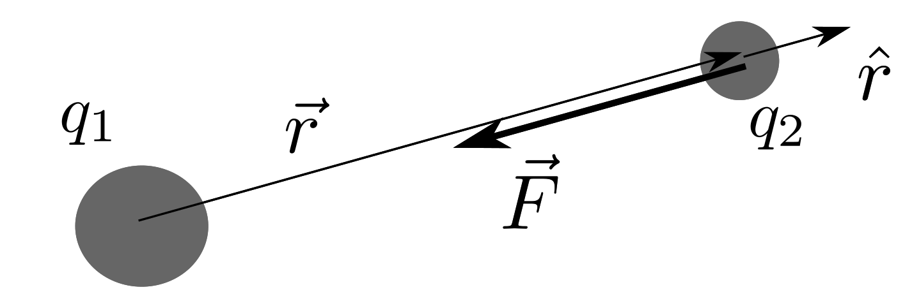
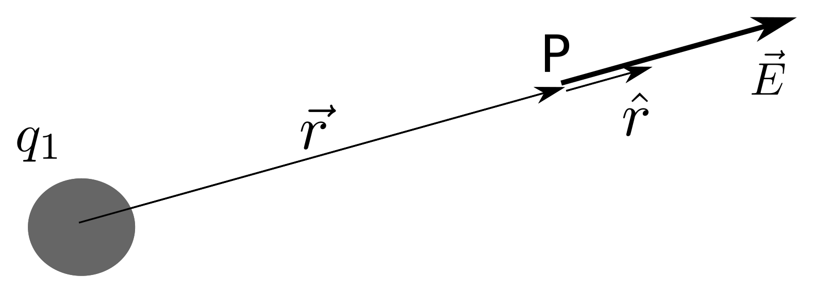
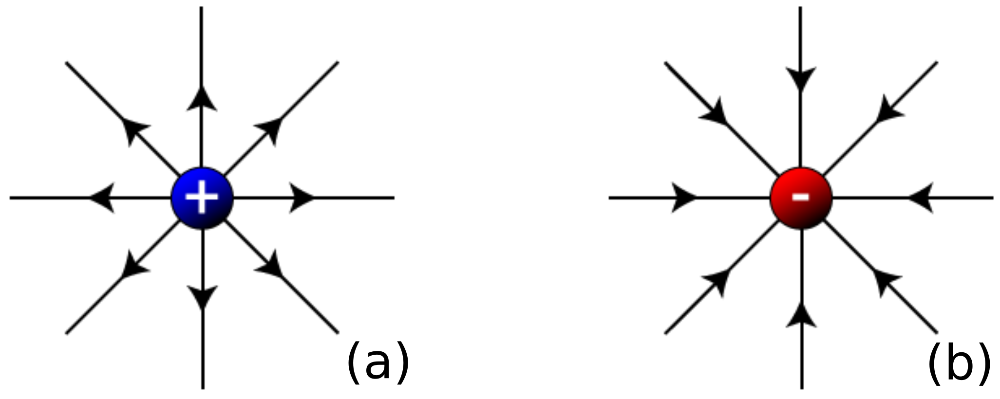
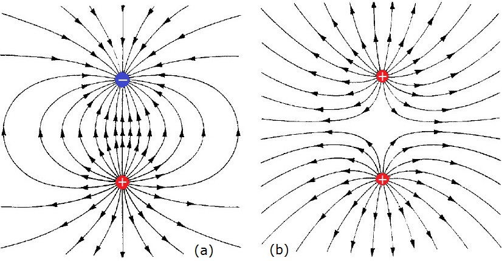
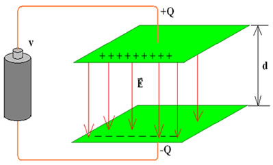

# Camp elèctric

La interacció electromagnètica és una de les quatre interaccions que hi ha a la natura. Nosaltres ja hem parlat de les ones electromagnètiques. Des del segle XIX sabem que la electricitat i el magnetisme estan relacionats entre sí gràcies als treballs d'en [Hans Ørsted](https://ca.wikipedia.org/wiki/Hans_Christian_%C3%98rsted), en [Michael Faraday](https://ca.wikipedia.org/wiki/Michael_Faraday) i en [James Maxwell](https://ca.wikipedia.org/wiki/James_Clerk_Maxwell). Aquest últim va ser l'artífex de la unificació de l'electricitat i el magnetisme amb una teoria que descriu tot l'electromagnetisme amb només quatre equacions anomenades, és clar, [equacions de Maxwell](https://ca.wikipedia.org/wiki/Equacions_de_Maxwell). En aquest capítol ens dedicarem a entendre la interacció electrostàtica i avançarem més en la comprensió de l'electromagnetisme en el capítol següent on estudiarem el camp magnètic i la inducció electromagnètica.

La interacció elèctrica ha estat coneguda des de l'antiguitat pels grecs.<a href="#fn1" id="ref1">1</a> 

## Càrrega elèctrica

La propietat de la matèria portadora de la interacció electrostàtica s'anomena càrrega elèctrica. Per a indicar aquesta propietat utilitzarem la lletra $$q$$ o $$Q$$ i la quantitat de càrrega la mesurarem en una unitat anomenada **coulomb**, per a la que utilitzarem la lletra C.

La càrrega elèctrica pot tenir signe positiu o negatiu i això fa que la interacció electrostàtica pugui ser atractiva o repulsiva. Càrregues d'igual signe experimenten una repulsió entre elles i càrregues de signe diferent s'atrauen mútuament. Això marca una diferència amb la interacció gravitatòria que només pot ser atractiva al no existir masses negatives.

## Llei de Coulomb

La força entre càrregues ve donada per l'expressió matemàtica següent i que es coneix com llei de Coulomb:

$$\begin{equation}\label{eq:coulomb}
\vec{F}=k\frac{q_{1}q_{2}}{r^{2}}\hat{r}
\end{equation}$$

on $$k$$ és la constant elèctrica o de Coulomb i el seu valor depèn del medi on es troben les càrregues. Si les càrregues estan en el buit<a href="#fn2" id="ref2">2</a> tenim que 

$$k=9\times10^{9}\mathrm{Nm^{2}C^{-2}}$$

La constant de Coulomb s'acostuma a expressar en funció d'altra constant anomenada **permitivitat** del medi o constant dielèctrica, $$\varepsilon$$, que es relaciona amb la constant de Coulomb a través de l'expressió: 

$$k=\frac{1}{4\pi\varepsilon}$$

i $$\varepsilon$$ és la permitivitat dielèctrica. 

Habitualment s'acostuma utilitzar el valor de la permitivitat del buit $$(\varepsilon_{0}=8,8541878176\times10^{-12}\mathrm{C^{2}N^{-1}m^{-2}})$$ i referir la permitivitat d'altres medis mitjançant una permitivitat relativa $$(\varepsilon_{r})$$, de manera que la permitivitat del medi s'expressa:

$$\varepsilon=\varepsilon_{r}\varepsilon_{0}$$

La llei de Coulomb estableix que la força entre dues càrregues $$q_{1}$$ i $$q_{2}$$ és inversament proporcional al quadrat de la distància que les separa i, per tant, és una llei matemàticament equivalent a la de gravitació de Newton amb la diferència que en el cas electrostàtic la força pot ser atractiva o repulsiva mentre que en el cas gravitatori només resulta atractiva. 

A la figura inferior es pot apreciar el significat de cada factor de la llei de Coulomb. El vector unitari $$\hat{r}$$ és el vector que té el sentit que va de la càrrega que fa la força fins la que la rep.

<figure>
  
  <figcaption>La força de Coulomb entre dues càrregues té la direcció que uneix les dues càrregues però el sentit ve donat per el signe de les càrregues: càrregues d'igual signe es repel·leixen i càrregues d'igual signe s'atrauen (és el cas de la figura on només està indicada la força sobre la càrrega $q_{2}$).</figcaption>
</figure>
 
## Camp elèctric

El concepte de camp va ser creat per Michael Faraday i resulta una eina útil per entendre les interaccions. Podem dir que una càrrega $q_{1}$ produeix una “modificació” a l'espai que l'envolta. Aquesta modificació l'anomenem camp elèctric $$\vec{E}$$ i és un vector que donat per l'expressió de l'equació següent

$$\begin{equation}\label{eq:camp}
\vec{E}=k\frac{q_{1}}{r^{2}}\hat{r}
\end{equation}$$
 
on $$r$$ és la distància entre la càrrega i el punt on es mesura el camp elèctric i la convenció és la mateixa que hem fet servir per a la llei de Coulomb. A la figura de sota podem veure el vector camp elèctric creat al punt P per la càrrega $$q_{1}$$, a qualsevol punt de l'espai hi ha un vector camp elèctric donat per la expressió anterior.

<figure>
  
  <figcaption>Camp elèctric creat per una càrrega $$q_{1}>0$$ en el punt P. Podem observar que el camp té sentit de la càrrega cap a fora. Si en el punt P posem una altra càrrega positiva apareixeria sobre aquesta una força repulsiva (amb el mateix sentit que el camp) però si posem una càrrega negativa hi apareix una força atractiva amb el sentit oposat al del camp elèctric.</figcaption>
</figure>

Tant l'expressió de la força com la del camp elèctric presentades són vàlides per a càrregues puntuals o per a càrregues volumètriques amb una distribució de simetria esfèrica. La relació que sempre resulta vàlida independentment de la distribució de càrrega és la expressió que lliga el camp amb la força electrostàtica:

$$\begin{equation}\label{eq:força_camp}
\vec{F}=q\vec{E}
\end{equation}$$

 podem dir que l'expressió anterior és una llei de cause i efecte a l'igual que la 2a llei de Newton. La causa de la interacció és el camp elèctric $$\vec{E}$$ i l'efecte sobre la càrrega $$q$$ és la força $$\vec{F}$$. 

De la expressió anterior podem extreure que les unitats amb les que s'expressa el camp elèctric són N/C (newton/coulomb).

Una forma gràfica de visualitzar el camp és utilitzant les línies de camp que tenen la característica de que el vector camp elèctric en un punt donat resulta tangent a la línia de camp en aquest punt. A la Figura es poden veure les línies de camp elèctric creades per una càrrega positiva (a) i per una negativa (b). Es pot apreciar que les línies de camp surten de les càrregues positives i es dirigeixen cap a les càrregues negatives. Per altra banda, quan més allunyades estan dues línies adjacents, menys intens resulta el camp en aquella regió de l'espai. A la figura es pot apreciar que a mesura que ens allunyem de les càrregues més separades estan les línies seguint el patró de que el camp disminueix amb el quadrat de la distància.

<figure>
  
  <figcaption>Línies de camp elèctric creades per carregues puntuals (a) positiva i (b) negativa.</figcaption>
</figure>

Les línies de camp es modifiquen per la presència d'altres càrregues ja que el camp resultant és la suma vectorial dels camps creats per cada càrrega (principi de superposició). En el cas de dues càrregues de diferent signe tenim un dipol elèctric i les línies del camp resultant són les que es veuen a la figura de sota, en el cas (a), en canvi, quan les càrregues són del mateix signe les línies de camp són com es mostren al cas (b).

<figure>
  
  <figcaption>Línies de camp elèctric creades per un parell de càrregues (a) quan les càrregues són diferents formant un dipol elèctric i (b) quan les càrregues són del mateix signe.</figcaption>
</figure>

## Energia potencial electrostàtica

El fet de que la forma funcional de la força electrostàtica tingui les mateixes característiques que la força gravitatòria permet que puguem dir que la força electrostàtica és una força conservativa i, a més a més, la forma funcional de l'energia potencial electrostàtica entre dues càrregues puntuals (o de simetria esfèrica) serà del tipus 

$$U=k\frac{q_{1}q_{2}}{r}$$

essent nul·la a l'infinit igual que l'energia potencial gravitatòria. Però, a diferència de l'energia potencial electrostàtica, pot ser positiva o negativa depenent del signe de les càrregues que interactuen. Dues càrregues del mateix signe tindran una energia potencial positiva per a qualsevol separació finita entre elles, en canvi, dues càrregues de diferent signe tindran una energia potencial negativa. 

### Energia potencial d'una configuració de càrregues

Per a una configuració de més càrregues l'energia potencial de la configuració serà la suma dels termes d'energia potencial de cada parell de càrregues que es poden comptabilitzar, es a dir, cada interacció aporta un terme d'energia a l'energia potencial de la configuració, de manera que si tenim una configuració amb tres càrregues:

$$U=k\frac{q_{1}q_{2}}{r_{12}}+k\frac{q_{1}q_{3}}{r_{13}}+k\frac{q_{2}q_{3}}{r_{23}}$$
 
## Potencial elèctric

El potencial elèctric es defineix com l'energia potencial per unitat de càrrega. A diferència del camp elèctric, que és un camp vectorial, el potencial elèctric és un camp escalar (a cada punt de l'espai li correspon un valor escalar), que en el cas d'una càrrega puntual podem escriure com

$$V=\frac{U}{q_{2}}=k\frac{q_{1}}{r}$$

El potencial té unitats d'energia per unitat de càrrega, que en l'SI correspon a J/s. Com aquestes unitats són molt utilitzades tenen un nom propi: volt i el símbol corresponent: V.

## Treball produït per la força electrostàtica

Sabem que quan un cos està sotmès a una força conservativa, el treball produït per la força conservativa és igual a la variació de l'energia potencial canviada de signe. En el cas de que la força sigui electrostàtica tindríem que el treball electrostàtic $W_{e}$ serà:

$$W_{e}=-\Delta U=-q\cdotp\Delta V$$

Suposem que volem calcular el treball que necessitem fer per moure una càrrega d'una posició A a una posició B sota l'acció d'un camp elèctric. En aquest cas les forces a les que està sotmès la càrrega són dues, la força electrostàtica (conservativa) i la que fem nosaltres (força externa no conservativa). En aquest cas, si la càrrega estava inicialment en repòs i la deixem en repòs en la seva posició final, podem fer servir el teorema que estableix que el treball de la força total (força electrostàtica més força externa) sobre un cos és igual a la variació de la seva energia cinètica

$$W_{ext}+W_{e}=\Delta E_{c}=0$$
 

En aquest cas no hi ha variació d'energia cinètica, per tant tenim que el treball que hem de fer serà

$$W_{ext}=-W_{e}=q(V_{B}-V_{A})$$
 

## Camp a l'interior d'una esfera conductora

Els materials conductors acostumen ser metalls que tenen la característica de que els electrons es poden moure amb llibertat pel seu interior degut a que els àtoms dels metalls tenen electrons que estan molt poc lligats i amb molt poca energia es poden moure. Amb aquest comportament en ment analitzarem com és el camp elèctric dintre d'un conductor en condicions electrostàtiques.

Suposem que tenim una esfera conductora carregada amb una càrrega $Q$ i que les càrregues han tingut temps per a distribuir-se dintre del conductor fins assolir una situació d'equilibri. Sota aquestes condicions podem assegurar que el camp elèctric a l'interior de l'esfera conductora ha de ser nul. Això és degut a que si no fos així, si hi hagués un camp no nul a l'interior del conductor, els electrons estarien sotmesos a una força que els obligaria a moure's i, aleshores no estaríem en condicions d'equilibri com havíem suposat al començament del nostre raonament. Per tant **el camp elèctric dintre d'un conductor sota condicions electrostàtiques ha de ser nul**. Això ens porta a que el potencial d'un conductor ha de ser constant o, dit d'una altra manera, ha de ser un equipotencial. De no ser així, si movem una càrrega de prova dintre del conductor des d'un punt fins a altre que tingui un potencial de diferent valor, la càrrega rebria un treball equivalent a la seva càrrega per la diferència de potencial però havíem dit que el camp era nul i, per tant, també ha de ser nul el treball el que ens fa arribar a una contradicció. L'error ha estat en suposar que el potencial varia dintre del conductor. Per tant, **dintre d'un conductor el potencial és constant** en condicions electrostàtiques. 

El que passa quan carreguem un conductor és que durant un interval de temps molt curt les càrregues, que tenen llibertat de moviment, es redistribueixen fins adoptar una configuració que fa nul el camp al seu interior. En una esfera conductora queda clar que les càrregues s'ubiquen totes a la part més superficial de l'esfera i això ho podem entendre perquè les càrregues volen estar totes el més lluny possible de les altres per a fer que la configuració tingui la menor energia possible. Una altra manera de veure-ho és pensar que com les càrregues d'igual signe es repel·leixen, aquestes intentaran anar el mes lluny unes de les altres la qual cosa porta a que vagin totes a parar a la superfície de l'esfera.

## Camp elèctric entre plaques metàl·liques paral·leles

Una manera de crear un camp elèctric uniforme és posant un parell de plaques metàl·liques paral·leles carregades amb càrregues iguals però de signe diferent tal com es veu a la figura inferior. Un dispositiu com aquest es coneix com a **capacitor** o **condensador** de plaques paral·leles. Per a carregar les plaques s'aplica a les plaques, que estan separades una distància $d$, una diferència de potencial $V$. Apareix aleshores un corrent elèctric que fa que les plaques es vagin carregant fins que entre les plaques hi ha un potencial igual a la del generador. Com que les plaques estan carregades, en l'espai entre elles hi haurà un camp elèctric. 

<figure>
  
  <figcaption>Condensador de plaques paral·leles.</figcaption>
</figure>

El camp elèctric entre les plaques ha de tenir la direcció perpendicular a les plaques senzillament per una raó de simetria. No hauria d'haver una direcció privilegiada més que la direcció perpendicular a les plaques. també per una raó de simetria podem concloure que la intensitat del camp ha de ser uniforme (el mateix valor en tots els punts de l'espai entre les plaques)<a href="#fn3" id="ref3">3</a>  en tot l'espai interior entre les plaques, ja que el valor de les càrregues de cada placa són iguals en magnitud però contraries en signe. Si el camp fos més gran en la proximitat a una de les plaques trencaria la situació de simetria que hi ha en la configuració la qual cosa ens porta a concloure que el camp entre les plaques ha de ser uniforme.

Intentarem ara determinar el valor del camp elèctric a l'interior del condensador. Suposem que tenim una càrrega $q$ positiva molt a prop de la placa carregada positivament i que la deixem lliure. Sabem que la càrrega es mourà en la direcció del camp cap a la placa negativa. Per una banda sabem que el treball fet pel camp elèctric constant serà

$$\begin{equation}\label{eq:treball_cond_1}
W=\vec{F}\cdotp\Delta\vec{r}=qEd
\end{equation}$$

ja que $$\vec{F}=q\vec{E}$$, el desplaçament és igual a la separació entre les plaques i tant la força com el desplaçament són paral·lels.

Per altra banda sabem que el treball serà igual al valor de la càrrega per la diferència de potencial entre les plaques canviat de signe, per tant,

$$\begin{equation}\label{eq:treball_cond_2}
W=-q(V_{-}-V_{+})=-q\Delta V
\end{equation}$$

Igualant les dues expressions podem obtenir l'expressió que dona el valor del camp elèctric entre les plaques del condensador

$$E=-\frac{\Delta V}{d}$$

on $$\Delta V$$ és la diferència de potencial entre les plaques i $$d$$ és la separació entre les plaques.

### Notes

1. L'any 600 AC Tales de Milet va observar que fregant ambre amb un tros de llana o pell d'animal el material adquiria la capacitat d'atraure petits objectes i si es fregava durant molt de temps es podia produir una guspira. El nom que els grecs donaven a l'ambre era $$\varepsilon\lambda\varepsilon\kappa\tau\rho o\nu$$ (elektron), que és l'origen del nom amb el que coneixem aquest tipus d'interacció. Per a conèixer més sobre la història de l'electricitat podeu consultar: [https://ca.wikipedia.org/wiki/Història_de_l'electricitat].<a href="#ref1" title="Tornar al text.">↩</a>

2. A efectes pràctics considerarem que el valor de la constant de l'aire és igual a la del buit.<a href="#ref2" title="Tornar al text.">↩</a>

3. Sempre hi haurà “efectes de borde” en els extrem de les plaques però nosaltres suposarem que les plaques tenen uns costats molt llargs comparats amb la distància de separació entre plaques com per a poder negligir aquests efectes.<a href="#ref3" title="Tornar al text.">↩</a>
