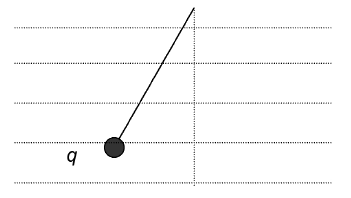
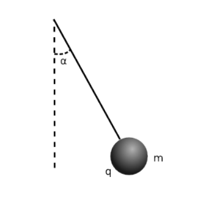
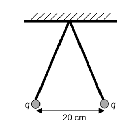
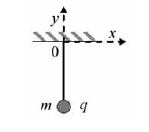
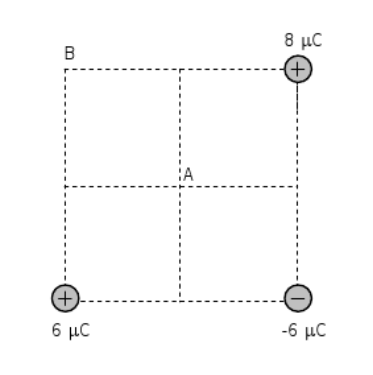
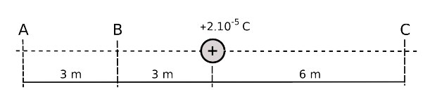
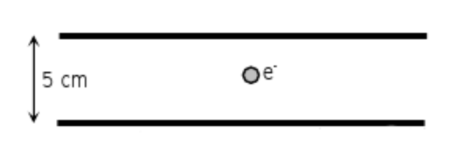
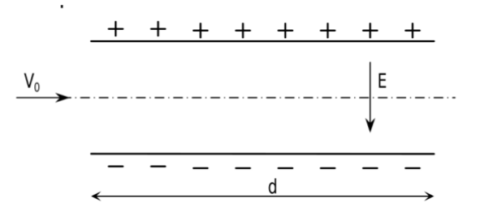
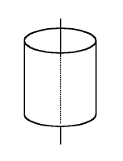

# Problemes Unitat 4: Camp elèctric

1. 1. Dues càrregues puntuals de $$100\,\mathrm{\mu C}$$ i $$-500\,\mathrm{\mu C}$$ estan separades una distància de $$5\,\mathrm{cm}$$. Quin és el mòdul de la força que actua sobre les dues càrregues quan el medi és: 
    1. El buit. 
    2. L’aigua $$(\varepsilon_{aigua}=81\,\varepsilon_{0}).$$ 
     <a href="sol/prob901.pdf">Solució</a>

2. Tenim dues càrregues puntuals fixes, $$Q_{1}=10\,\mu\mathrm{C}$$ i $$Q_{2}=-10\,\mu\mathrm{C}$$, situades respectivament a l’origen de coordenades i en el punt (3, 0). Col·loquem en el punt (3, 4) una altra càrrega puntual, $$q=1\mu\mathrm{C}$$. Calculeu: 
    1. L’expressió vectorial de la força a què està sotmesa la càrrega $$q$$. 
    2. En quant canviarien els resultats de l'apartat anterior si les càrregues, en lloc de trobar-se en el buit, estiguessin submergides en aigua. 

    **Dades**: $$k=1/(4\pi\varepsilon_{0})=9\times10^{9}\,\mathrm{N\cdot m^{2}\cdot C^{-2}}$$; la constant dielèctrica relativa de l’aigua val 81; les distàncies es mesuren en m. 
     <a href="sol/prob902.pdf">Solució</a>

3. Una partícula de massa m, carregada elèctricament i lligada a l’extrem d’una corda, es manté en equilibri dins d’un camp elèctric horitzontal uniforme. 

    
    
    Si assignem els nombres: 
    
    1: la càrrega és positiva 
    
    2: la càrrega és negativa 
    
    3: el camp elèctric apunta cap a l’esquerra 
    
    4: el camp elèctric apunta cap a la dreta trieu, de les possibilitats següents, la que correspongui a la situació representada en la figura: 

    1. 1 i 4 
    2. 2 i 3
    3. 1 i 3
    4. 2 i 4 

    Justifiqueu la resposta.
     <a href="sol/prob903.pdf">Solució</a>

4. Una petita esfera de massa $$m=0,5\,\mathrm{g}$$ i càrrega elèctrica negativa $$q=3,6\times10^{-6}\,\mathrm{C}$$ penja d’un fil. Com que l’esfera està situada en una regió on hi ha un camp elèctric horitzontal d’intensitat $$E=800\,\mathrm{N/C}$$, el fil forma un angle $$\alpha$$ respecte de la vertical. 

    1. Feu un esquema amb totes les forces que actuen sobre l’esfera. Raoneu quin ha de ser el sentit del camp elèctric. 
    2. Quant val l’angle $$\alpha$$? 
    3. Si es trenca el fil, quant valdran els components horitzontal i vertical de l’acceleració de l’esfera? Quina serà la velocitat de l’esfera al cap de $$2\,\mathrm{s}$$ de trencar-se el fil? 

    
     <a href="sol/prob904.pdf">Solució</a>

5. Una esfera metàl·lica de $$10\,\mathrm{cm}$$ de radi es carrega amb una càrrega positiva de $$10^{-5}\,\mathrm{C}$$. A continuació es connecta a una altra esfera metàl·lica, de $$20\,\mathrm{cm}$$ de radi, inicialment descarregada, i seguidament es desconnecta d’ella. Calcula la càrrega de cada esfera a la situació final.
	 <a href="sol/prob905.pdf">Solució</a>

6. Pengem del sostre dos fils de 50 cm de longitud. Cada fil du al seu extrem una càrrega positiva de valor $$q=1,2\times10^{-8}\,\mathrm{C}$$. Quan s’arriba a l’equilibri, les càrregues estan separades per una distància de 20 cm, tal com mostra la figura. Calculeu: 
    1. La tensió de les cordes. 
    2. El camp elèctric que creen en el punt d’unió dels fils amb el sostre. 

    
     <a href="sol/prob906.pdf">Solució</a>
    
7. Una esfera petita de massa 250 g i càrrega q penja verticalment d’un fil. Apliquem un camp elèctric constant de 103 N/C dirigit al sentit negatiu de l’eix d’abscisses i observem que la càrrega es desvia cap a la dreta i que queda en repòs quan el fil forma un angle de 37° amb la vertical. 
    1. Dibuixeu l’esquema corresponent a les forces que actuen sobre la càrrega q en aquesta posició d’equilibri. Quin signe té la càrrega q? 
    2. Calculeu la tensió del fil. 
    3. Determineu el valor de la càrrega q.    

    
     <a href="sol/prob907.pdf">Solució</a>

8. Tres càrregues són situades a tres dels vèrtexs d'un quadrat de 2 m de costat. Calcula: 
    1. El vector camp elèctric en el punt A situat al centre del quadrat. 
    2. El treball necessari per traslladar una càrrega de 6 C des de l'infinit fins al punt A. 
    3. El treball necessari per traslladar aquesta mateixa càrrega des d'A fins a B. 

    
     <a href="sol/prob908.pdf">Solució</a>

9. Calcula el treball necessari per traslladar una càrrega de $$3\times10^{-5}\,\mathrm{C}$$ en els següents casos:
    1. Des d'A fins a B.
    2. Des d'B fins a C. 
    3. Des de C fins a A. 

    
     <a href="sol/prob909.pdf">Solució</a>

10. Dues càrregues puntuals fixes $$Q$$ i $$-Q$$ estan separades una distància $$D$$. Digueu si les afirmacions següents són certes o falses i justifiqueu la resposta.
    1. En la línia que uneix les dues càrregues només hi ha un punt (a distància finita) en què el potencial elèctric és nul. 
    2. No hi ha cap punt de l’espai (a distància finita) en què el camp elèctric sigui nul. 
     <a href="sol/prob910.pdf">Solució</a>

11. El potencial d'una càrrega puntual en un punt A és 500 V i el camp elèctric 200 N/C.
    1. A quina distància es troba A de la càrrega?
    2. Quin és el valor de la càrrega?
    3. Quin treball cal fer per portar una càrrega de 500 mC des de A fins a 3 cm de la cárrega?
     <a href="sol/prob911.pdf">Solució</a>
    
12. Tres càrregues elèctriques puntuals, positives, de $$10^{-4}\,\mathrm{C}$$ cadascuna, estan situades als vèrtexs d’un triangle equilàter de $$\sqrt{3}\,\mathrm{m}$$ de costat. Calculeu:
    1. El valor de la força electrostàtica que actua sobre cada càrrega per efecte de les altres dues.
    2. El potencial elèctric en el punt mitjà d’un costat qualsevol del triangle.
    3. L’energia potencial electrostàtica emmagatzemada en el sistema de càrregues. 

    **Dada**: $$k=1/(4\pi\varepsilon_{0})=9\times10^{9}\,\mathrm{N\cdot m^{2}/C^{2}}$$.
     <a href="sol/prob912.pdf">Solució</a>
    
13. Un electró inicialment en repòs es deixa lliure en un punt de l’espai, en presència del camp elèctric creat per una càrrega puntual positiva. Trieu la resposta que considereu correcta.
    1. Quan l’electró es desplaça en el camp elèctric: 
        i. Augmenta la seva energia potencial electrostàtica. 
        ii. Segueix el sentit de les línies de camp. 
        iii. Es mou en la direcció de potencial elèctric creixent. 
    2. Quan l’electró es desplaça entre dos punts del camp que tenen una diferència de potencial de 1.000 V:
        i. La seva energia cinètica augmenta en 1.000 J. 
        ii. La seva energia cinètica augmenta en 1.000 eV. 
        iii. La seva energia mecànica augmenta en 1.000 eV. 
     <a href="sol/prob913.pdf">Solució</a>
        
14. Dues càrregues elèctriques puntuals de $$+3\,\mu\mathrm{C}$$ i $$-7\,\mu\mathrm{C}$$ es troben situades, respectivament, en els punts (0, 3) i (0, -5) d'un pla. Calculeu:
    1. El camp elèctric que creen aquestes càrregues en el punt P(4, 0).
    2. La diferència de potencial V(O)-V(P), on O és el punt (0, 0).
    3. El treball que cal fer per a traslladar una càrrega de $$+5\,\mu\mathrm{C}$$ des del punt O(0, 0) fins al P(4, 0). Interpreteu el signe del resultat.
    **Nota**: Les coordenades dels punts s'expressen en metres.
    **Dada**: $$k=1/(4\pi\varepsilon_{0})=9\times10^{9}\,\mathrm{Nm^{2}C^{-2}}$$.
     <a href="sol/prob914.pdf">Solució</a>

15. Una càrrega elèctrica puntual $$Q=+2\times10^{-8}\,\mathrm{C}$$ està fixa en el punt A, de coordenades (–4,0). Una segona càrrega idèntica a l’anterior està fixa en el punt B, de coordenades (4,0). Les distàncies estan donades en m. Determineu: 
    1. El mòdul, la direcció i el sentit del camp elèctric a l’origen de coordenades (O) i en el punt P, de coordenades (0,3). 
    2. El potencial elèctric en aquests mateixos punts.
    3. Suposeu que una càrrega positiva q es mou des de P fins a O seguint l’eix y. Analitzeu com es modifica la velocitat de q (augmenta, disminueix o es manté constant) a causa de la interacció amb les càrregues fixes. Raoneu la resposta.  
    **Dada**: $$k=1/(4\pi\varepsilon_{0})=9\times10^{9}\,\mathrm{N\cdot m^{2}/C^{2}}$$.
     <a href="sol/prob915.pdf">Solució</a>

16. Considereu dues càrregues iguals, cadascuna de valor $$Q=10^{-5}\,\mathrm{C}$$, fixes en els punts (0,2) i (0,–2). Les distàncies es mesuren en m i la constant de Coulomb val $$k=1/(4\pi\varepsilon_{0})=9\times10^{9}\,\mathrm{N\cdot m^{2}/C^{2}}$$.
    1. Calculeu el camp elèctric en el punt (2,0). Determineu la força elèctrica total que experimentaria una petita càrrega $$q=10^{-6}\,\mathrm{C}$$ situada en aquest punt.
    2. Determineu el treball elèctric que un agent extern ha hagut de fer sobre la càrrega q per portar-la des de l’infinit fins al punt (2,0) sense modificar la seva energia cinètica.
    3. Suposeu que la càrrega q té una massa de 3 g i es troba en repòs en el punt (2,0). Calculeu la velocitat amb què arriba al punt (3,0). 
     <a href="sol/prob916.pdf">Solució</a>
    
17. Una esfera conductora de radi 2 cm té una càrrega de $$-3\,\mu\mathrm{C}$$. 
    1. Quant val el potencial elèctric creat per l’esfera en un punt que dista 3 cm del centre de l’esfera?
    2. Quant val el camp elèctric creat per l’esfera en un punt que dista 1 cm del centre de l’esfera?  
    **Dada**: $$k=1/(4\pi\varepsilon_{0})=9\times10^{9}\,\mathrm{Nm^{2}/C^{2}}$$.
     <a href="sol/prob917.pdf">Solució</a>
    
18. Dues esferes metàl·liques de 10 cm i 5 cm de radi carregades elèctricament es troben tan distanciades, que pràcticament no existeix influència entre les seves càrregues. Els potencials de les seves superfícies són de 400 i 1000 V, respectivament. En connectar-les mitjançant un fil conductor, la càrrega es reparteix entre aquestes, de manera que les dues esferes adquireixen el mateix potencial. Calculeu el valor d'aquest potencial comú.
	 <a href="sol/prob918.pdf">Solució</a>

19. Al laboratori tenim dues plaques metàl·liques de gran superfície col·locades en forma horitzontal i paral·leles. Les plaques estan separades 5 cm i tenen càrregues iguals però de signe contrari. El camp elèctric a l'espai entre les plaques es pot suposar constant. Si en col·locar un electró $$(m_{e}=9,1\times10^{-31}\,\mathrm{kg}$$, $$q_{e}=-1,6\times10^{-19}\,\mathrm{C})$$ al centre, aquest resta en repòs: 
    1. Dibuixa les forces que actuen sobre l'electró i indica'n l'origen. Raona quin serà el signe de la càrrega elèctrica de la placa superior. 
    2. Quant val el camp elèctric en el punt on està situat l'electró? Fes un dibuix i indica'n la direcció i el sentit del camp elèctric. 
    3. Quina és la diferència de potencial elèctric entre les plaques? 
    
    
     <a href="sol/prob919.pdf">Solució</a>
    
20. Una partícula amb càrrega igual a $$q=20\,\mu\mathrm{C}$$ i amb massa $$m=10\mu\mathrm{g}$$ es troba entre les plaques d’un condensador pla, que estan separades 2 cm. Si la partícula es troba sota la influència de la gravetat: 
    1. Trobeu la diferència de potencial que haurien de tenir les plaques per que la força produïda pel camp elèctric sobre la partícula equilibri al seu pes. 
    2. Si la diferència de potencial trobada en l'apartat anterior s’augmentés al doble, quina serà l’acceleració de la partícula?
     <a href="sol/prob920.pdf">Solució</a>

21. Un electró entra amb una velocitat $$v_{0}=8\times10^{5}\,\mathrm{m/s}$$ en una zona de l'espai on hi ha un camp elèctric vertical $$E=10\,\mathrm{N/C}$$ creat per les armadures d'un condensador de longitud $$d=10\,\mathrm{mm}$$. Un cop l'electró es troba a dins del condensador:

    
    
    Quines són les forces que actuen sobre l'electró i quines direccions i quins sentits tenen? Fes-ne una estimació i valora si té sentit negligir els efectes de la gravetat. 
    1. Quin moviment descriurà l'electró? Escriu l'equació de la seva trajectòria tot considerant com a origen de coordenades el punt A d'entrada al condensador. 
    2. Quant de temps trigarà l'electró a sortir de l'espai interior del condensador? Quines seran les coordenades x i y del punt de sortida?
     <a href="sol/prob921.pdf">Solució</a>
    
22. Un microscopi electrònic utilitza electrons accelerats a través d'una diferència de potencial de 40.000 V. 
    1. Calcula l'energia subministrada a cada electró. 
    2. Quina serà la velocitat de xoc dels electrons? 
    3. Determina el poder de resolució suposant que és igual a la longitud d'ona de De Broglie associada als electrons.
     <a href="sol/prob922.pdf">Solució</a>
    
23. Un filament incandescent, que es troba a un potencial elèctric de 0 V, emet un electró inicialment en repòs. L’electró és recollit per un cilindre coaxial, metàllic, que es troba a un potencial de 1.000 V. Determineu l’energia amb què impacta l’electró en el cilindre. Expresseu el resultat en eV. 

    **Dades**: $$q_{e}=-1,602\times10^{-19}\,\mathrm{C}$$; $$1\,\mathrm{eV=1,602\times10^{-19}\,J}$$.
    
     <a href="sol/prob923.pdf">Solució</a>
