# Màquines electromagnètiques

## Els imants permanents

El magnetisme ja era conegut pels antics grecs i el nom de magnetisme es deu a que les primeres roques magnètiques es van trobar a la ciutat de Magnèsia a l'Àsia Menor. Nosaltres estem més familiaritzats amb el magnetisme que amb les forces elèctriques, ja que els imants són molt comuns mentre que la matèria es troba generalment en un estat neutre a la natura.

Els imants permanents permanents són materials que habitualment estan composats per ferro, níquel, cobalt o aliatges que li donen la propietat d'atreure o repel·lir altres imants o materials ferrosos. Els imants sempre es presenten amb dos pols coneguts com pol Nord i pol Sud degut a que la Terra és un gran imant amb els pols magnètics molt a prop dels pols geogràfics. A la figura podem veure dues barres imantades amb els seus pols indicats. El pol Nord és atret pel pol Sud d'un altre imant, en canvi els pols iguals es repel·leixen.

<figure>
  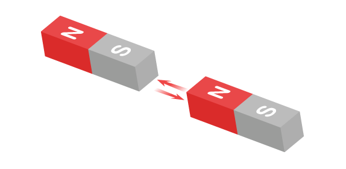
  <figcaption>Barres magnètiques. Pols d'igual denominació es repel·leixen i pols de diferent denominació s'atrauen.</figcaption>
</figure>

Una de les característiques dels imants és que sempre es presenten amb dos pols, si tallem un imant en dues parts obtindrem dos imants, cadascú amb el seu pol Nord i el seu pol Sud.

## Camp magnètic

La força magnètica, igual que la gravitatòria o l'elèctrica, són interaccions que actuen a distància. Per entendre aquesta interacció podem interpretar que els imants produeixen una modificació a l'espai que l'envolta al que anomenarem **inducció magnètica**, **vector inducció magnètica** o directament **inducció**. Podem observar la direcció d'aquest vector en cada punt de l'espai que envolta a l'imant si posem llimadures de ferro com s'indica a la figura de sota (superior). També podem veure la direcció de la inducció utilitzant brúixoles escampades pel voltant de l'imant, en aquest cas les agulles imantades s'orienten seguint la direcció del vector inducció i, en aquest cas, també podem veure el sentit del vector, que correspon al sentit sud-nord de l'agulla (Figura inferior).

<figure>
  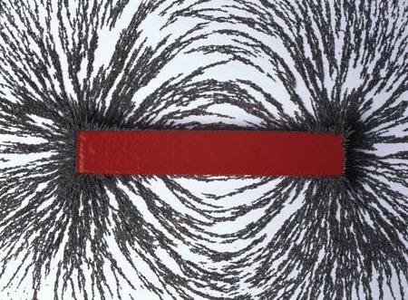
  <figcaption>Línies d'inducció magnètica. Es poden veure les línies formades per l'orientació de llimadures de ferro.</figcaption>
</figure>

<figure>
  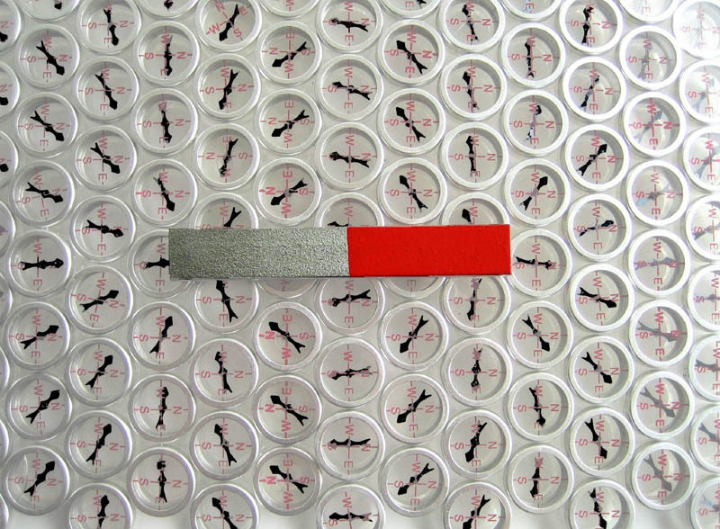
  <figcaption>Línies de camp magnètic indicades per les agulles imantades de les brúixoles. Les línies de camp sempre són tancades, van del pol Nord fins al Sud per fora de l'imant i de Sud a Nord per dintre de l'imant.</figcaption>
</figure>

## El magnetisme terrestre

La rotació de la terra produeix a l'interior corrents elèctriques que són les causants de la formació d'un gran camp magnètic. Si pengem un imant d'un fil just pel seu centre de gravetat veurem com l'imant s'orienta en la direcció nord-sud, aquesta és la direcció de les línies del camp magnètic terrestre. A la figura de sota es poden veure les línies del camp magnètic de la Terra, funciona com una gran barra imantada que té el seu pol Nord magnètic prop del pol sud geogràfic i a l'inrevés amb l'altre pol. Per aquest motiu el pol nord de les brúixoles indica cap al pol Nord terrestre. En realitat ells pols magnètics estan desviats respecte dels geogràfics uns $14^{\circ}$. Aquest desviament s'anomena declinació magnètica. El camp magnètic terrestre juga un paper molt important per a la salut de les persones, ja que desvia cap als pols les partícules carregades que venen del Sol anomenades raigs còsmics i que són ionitzants i poden provocar danys a les cèl·lules del cos. L'acceleració d'aquestes partícules carregades prop dels pols provoquen l'emissió de llum que es pot veure en forma d'aurores polars.

<figure>
  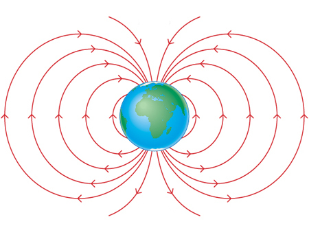
  <figcaption>Línies de camp magnètic de la Terra. El pol Nord magnètic es troba a prop del pol Sud geogràfic i viceversa. Per aquest motiu el pol Nord de la brúixola apunta al pol Nord geogràfic, que correspon al sud magnètic.</figcaption>
</figure>

## Relació entre electricitat i magnetisme

El magnetisme està íntimament relacionat amb l'electricitat i, de fet, formen part d'una mateixa descripció anomenada **electromagnetisme**. El camp magnètic no té cap influència sobre càrregues estàtiques i aquestes tampoc influeixen els imants. Però les càrregues en moviment produeixen camps magnètics i interactuen amb els imants. 

Va ser el físic danès [Hans Christian Øersted](https://ca.wikipedia.org/wiki/Hans_Christian_%C3%98rsted) l'any 1819 va ser el primer en descobrir aquesta relació quan va observar que quan connectava un circuit elèctric prop d'una brúixola, aquesta canviava la seva orientació. D'aquesta manera va quedar clar que els corrents elèctric produeixen camps magnètics i va quedar establerta la relació entre el magnetisme i l'electricitat. 

La pregunta que va quedar plantejada va ser si, de la mateixa manera que el corrent elèctric produeix un camp magnètic, el camp magnètic podria produir un corrent elèctric? Aquesta pregunta va trobar resposta en els experiments d'en [Michael Faraday](https://ca.wikipedia.org/wiki/Michael_Faraday) i [Joseph Henry](https://ca.wikipedia.org/wiki/Joseph_Henry) als anys 30 del segle XIX. Posteriorment, l'any 1875, [James Clerk Maxwell](https://ca.wikipedia.org/wiki/James_Clerk_Maxwell) va construir la teoria electromagnètica que estableix la base teòrica de l'electromagnetisme. 

## Força d'un camp magnètic sobre una càrrega mòbil

Sigui $\vec{B}$ el vector inducció magnètica i $\vec{v}$ la velocitat d'una càrrega $q$. Pel fet de moure's en l'interior d'un camp magnètic la càrrega rebrà una força que vindrà donada per l'expressió:

$$\begin{equation}\label{eq:força_magnetica}
\vec{F}=q\vec{v}\times\vec{B}
\end{equation}$$

A l'expressió $\eqref{eq:força_magnetica}$ el producte que apareix és un producte vectorial, per tant, la direcció de la força serà perpendicular al pla format pels vectors $\vec{v}$ i $\vec{B}$ i el sentit es pot determinar fent servir la regla de la mà dreta (veure següent figura). El mòdul de la força és 

$$\left|\vec{F}\right|=\left|q\right|\left|\vec{v}\right|\left|\vec{B}\right|\sin\alpha$$

on $\alpha$ correspon a l'angle format entre el vector velocitat $\vec{v}$ i inducció magnètica $\vec{B}$. Podem veure que la força $\vec{F}$ té les següents característiques que es desprenen de les propietats del producte vectorial:

* Si la càrrega es mou en la direcció del camp magnètic $(\vec{v}\parallel\vec{B})$ la força resulta nul·la i la càrrega segueix un MRU encara que estigui dintre d'un camp magnètic.
* Si la càrrega es mu en direcció perpendicular al camp magnètic $(\vec{v}\perp\vec{B})$, la força resulta màxima, ja que $\sin\alpha=1$, i el seu valor és $F=qvB$.

Les unitats d'inducció magnètica corresponen a $[B]=\mathrm{(N.s)/(C.m)=T}$ que anomenem **tesla** en honor al gran inventor servi [Nikola Tesla](https://ca.wikipedia.org/wiki/Nikola_Tesla). La unitat tesla és una unitat molt gran, per tant, els camps magnètic més corrents acostumen a estar indicats en submúltiples de tesla.

<figure>
  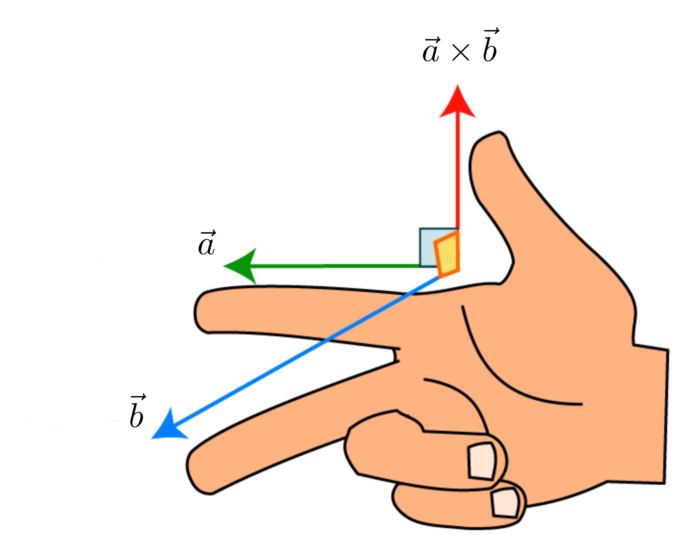
  <figcaption>Regla de la mà dreta. Amb aquesta regla es pot determinar la direcció i sentit del resultat d'un producte vectorial.</figcaption>
</figure>

## Trajectòria d'una càrrega en un camp magnètic

Hem vist que la força que apareix sobre una càrrega en moviment dintre d'un camp magnètic té una direcció perpendicular a la velocitat de la càrrega, això té com a conseqüència que la força magnètica no modifica el mòdul de la velocitat sinó que només canvia la direcció de la trajectòria. Per aquest motiu la força magnètica no fa treball, ja que la força és perpendicular al desplaçament i no modifica l'energia cinètica de les partícules.

Estudiem primer el cas de una partícula que es mou dintre d'un camp magnètic uniforme (té el mateix valor en tots els punts de l'espai) y en direcció perpendicular al camp. A la figura següent es pot veure una partícula amb càrrega positiva que es mou dintre d'un camp magnètic perpendicular entrant al full de paper (les cues de les fletxes que indiquen el vector es veuen com a creus). La força magnètica, al ser perpendicular tant al camp magnètic com a la velocitat, resulta dintre del pla del paper però perpendicular a la velocitat i, per tant, descriu una trajectòria circular amb la força magnètica en el paper de força centrípeta.

<figure>
  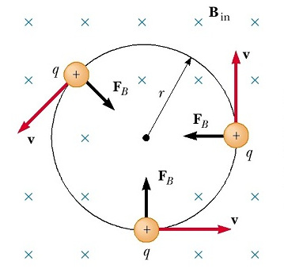
  <figcaption>Moviment d'una càrrega positiva dintre d'un camp magnètic uniforme entrant a la superfície del paper. La velocitat de la partícula té direcció perpendicular al vector inducció en tot moments. Podem observar que la força magnètica modifica la trajectòria de la càrrega actuant com a força centrípeta sobre la partícula.</figcaption>
</figure>

Per a conèixer el radi de la trajectòria podem igualar el mòdul de la força magnètica a l'expressió del mòdul de la força centrípeta:

$$m\frac{v^{2}}{r}=|q|vB$$

i, aïllant el radi obtenim:

$$r=\frac{mv}{|q|B}$$

Com la força no canvia el mòdul de la velocitat el moviment resultant serà un moviment circular uniforme. També podem observar que un augment de la velocitat fa que el radi sigui més gran i que un augment de la inducció magnètica fa que el radi sigui més petit.

En el cas de que la partícula es mogui en direcció paral·lela al camp magnètic ja hem vist que no hi ha cap força magnètica i que la partícula descriu un moviment uniforme.

Podem ara intentar entendre com serà la trajectòria d'una partícula dintre d'un camp magnètic uniforme quan la partícula té una velocitat qualsevol. En aquest cas la velocitat de la partícula es podria descompondre en una component paral·lela al camp i una altre perpendicular. La component paral·lela no es veuria afectada per la força magnètica seguint un MRU en aquesta direcció. En canvi, en la direcció perpendicular, la partícula es mouria seguint una trajectòria circular. Si fem la composició dels dos moviments obtenim que el moviment resultant és un moviment helicoïdal com es veu a la figura següent:

<figure>
  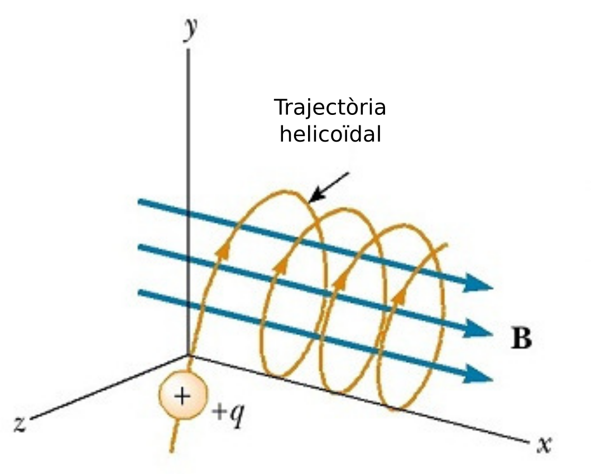
  <figcaption>Moviment d'una partícula carregada dintre d'un camp magnètic uniforme. El moviment més general és una helicoide.</figcaption>
</figure>

Si el camp magnètic no és uniforme la trajectòria es modifica com es pot veure a la figura següent:

<figure>
  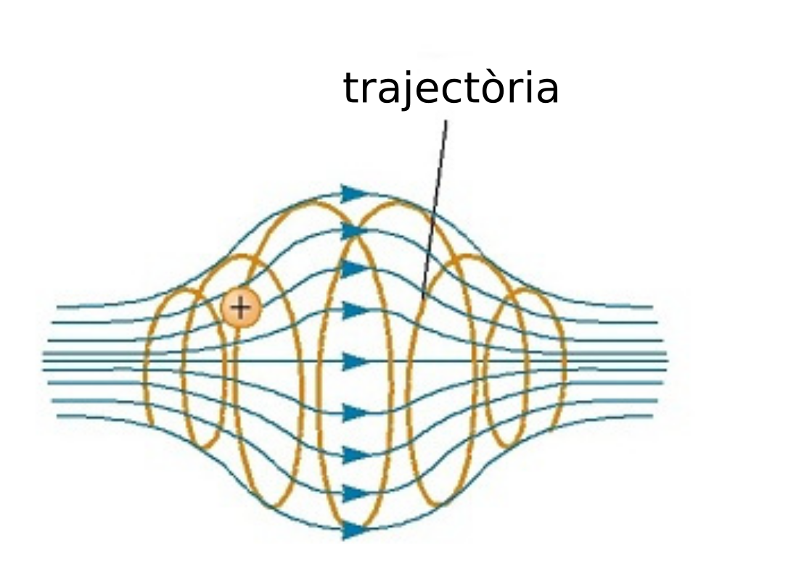
  <figcaption>Trajectòria d'una partícula dintre d'un camp magnètic no uniforme.</figcaption>
</figure>

## Forces electromagnètiques sobre càrregues

Si una càrrega està en moviment dintre d'un camp elèctric i d'un camp magnètic la força que experimentarà serà la suma de les forces creades per cada camp (principi de superposició), de manera que la força neta es pot escriure:

$$\vec{F}=\vec{F}_{e}+\vec{F}_{m}=q\vec{E}+q\vec{v}\times\vec{B}=q(\vec{E}+\vec{v}\times\vec{B})$$

Aquesta expressió és coneguda com força de Lorentz.

### Selector de velocitats

El selector de velocitats és una màquina electromagnètica que permet seleccionar partícules per la seva velocitat. Es tracta d'enviar un feix de partícules entre les paques d'un condensador i amb un camp magnètic perpendicular al camp elèctric tal com es veu en la figura següent. Les forces magnètica i elèctrica tenen la mateixa direcció i sentits oposats. Si les intensitats dels camps s'ajusten es pot aconseguir que les forces siguin iguals en mòdul per a partícules de determinada velocitat, d'aquesta manera, les partícules tindran una trajectòria rectilínia sense desviar-se. 

Imposarem la condició de que les forces tinguin igual mòdul:

$$F_{e}=F_{m}$$
 
$$qE=qvB$$

per tant,

$$\begin{equation}\label{eq:velocitat_selector}
v=\frac{E}{B}
\end{equation}$$

Les partícules que tinguin la velocitat donada per l'expressió $\eqref{eq:velocitat_selector}$ continuaran recte, les que tinguin una velocitat més gran $(F_{m}>F_{e})$ xocaran amb l'armadura superior del condensador i les que tinguin una velocitat més petita $(F_{e}>F_{m})$ xocaran amb l'armadura inferior. Si a l'extrem final del condensador es posa una ranura central que permeti sortir només a les partícules centrals sabrem que totes porten la mateixa velocitat.

Si les armadures estan separades una distància $d$ i tenen aplicada una diferència de potencial $\Delta V$, el camp elèctric es pot escriure $E=\Delta V/d$, amb la qual cosa l'expressió $\eqref{eq:velocitat_selector}$ es pot reescriure:

$$\begin{equation}\label{eq:selector_2}
v=\frac{\Delta V}{Bd}
\end{equation}$$

<figure>
  
  <figcaption>Selector de velocitats. Un feix de partícules carregades amb diferents velocitats entren en una regió amb camps elèctric i magnètic creuats. Només les partícules amb una determinada velocitat no resulten desviades i continuen amb una trajectòria rectilínia.</figcaption>
</figure>

### Espectròmetre de masses

L'espectròmetre de masses és una màquina electromagnètica que permet mesurar la massa de partícules carregades (ions). El dispositiu consisteix en una primera cambra amb un selector de velocitats i una segona on només hi ha camp magnètic com es pot apreciar a la figura següents. Al sortir del selector de velocitats les partícules porten totes la velocitat donada per l'expressió $\eqref{eq:velocitat_selector}$, 

$$\begin{equation}\label{eq:espectrom_1}
v=\frac{\Delta V}{B'd}
\end{equation}$$

on $B'$ és la inducció magnètica del selector de velocitats.

Una vegada les partícules passen a la segona cambra segueixen una trajectòria semicircular el radi de la qual ve donada per l'expressió

$$\begin{equation}\label{eq:espectrom_2}
r=\frac{mv}{qB}
\end{equation}$$

on $B$ és el la inducció de la segona cambra. 

La relació càrrega-massa dels ions ve donada per l'expressió

$$\begin{equation}\label{eq:espectrom_3}
\frac{q}{m}=\frac{v}{rB}
\end{equation}$$

Si introduïm l'expressió $\eqref{eq:espectrom_1}$ dintre de la $\eqref{eq:espectrom_3}$ ens queda:

$$\begin{equation}\label{eq:espectrom_4}
\frac{q}{m}=\frac{\Delta V}{r.B'.d.B}
\end{equation}$$

  
<figure>
  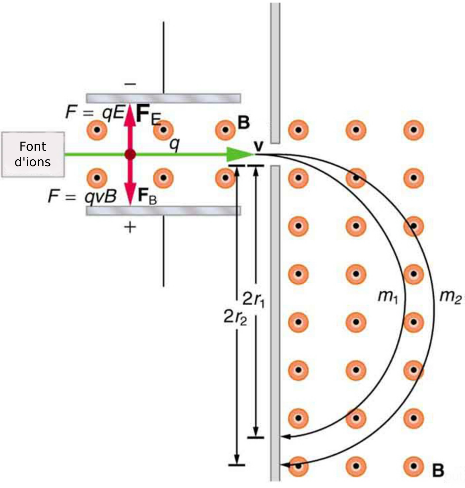
  <figcaption>Espectròmetre de masses.</figcaption>
</figure>

### Ciclotró

El ciclotró és un accelerador de partícules carregades com per exemple protons o partícules $\alpha$. Va ser inventat per [E. O. Lawrence](https://en.wikipedia.org/wiki/Ernest_Lawrence) i [M. S. Livingston](https://en.wikipedia.org/wiki/M._Stanley_Livingston) el 1934 i es tracta del primer accelerador de partícules circular. El seu aspecte és com el que es veu a la figura sigüent. Es tracta de dues cambres semicirculars anomenades D i un espai entre elles que les separa.

<figure>
  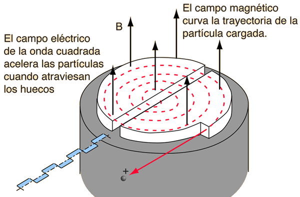
  <figcaption>Espectròmetre de masses.</figcaption>
</figure>

El mecanisme és molt enginyós, ja que les partícules s'introdueixen a la part central del ciclotró i són accelerades per un camp elèctric que hi ha en la regió de separació de les D, com es veu a la figura inferior. Quan la partícula entra en la D troba un camp magnètic que fa que la partícula descrigui una mitja circumferència para passar a la regió entre les D un altre cop però, ara amb la particularitat de que el camp ha invertit de direcció i la partícula és accelerada un altre cop pel camp elèctric fins arribar a l'altre D on la partícula descriu una altra semicircumferència però de radi més gran ja què hi arriba amb una velocitat més alta. Aquest mateix procés es repeteix moltes vagades guanyant energia cinètica cada cop que passa entre les D. Finalment la partícula surt del ciclotró amb una molt alta velocitat i es pot fer servir per a xocar amb una mostra per a estudiar el resultat de la col·lisió o per a produir una reacció nuclear determinada.

<figure>
  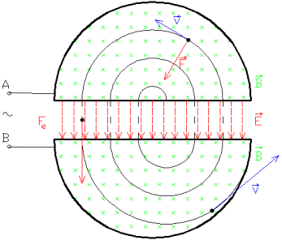
  <figcaption>Vista superior d'un ciclotró.</figcaption>
</figure>

La freqüència de ciclotró que ve donada per 

$$\begin{equation}\label{eq:freq_ciclotro}
\nu=\frac{\omega}{2\pi}=\frac{v}{2\pi r}=\frac{qB}{2\pi m}
\end{equation}$$

on hem fer servir que

$$\nu=\frac{qB}{rm}$$

L'expressió $\eqref{eq:freq_ciclotro}$ resulta molt rellevant pel funcionament d'aquesta màquina, ja que, com hem comprovat, resulta independent del radi de la trajectòria. Això permet poder tenir una freqüència fixa per a canviar la direcció del camp elèctric, la qual cosa permet que la màquina sigui possible.

La velocitat amb la que sortiran les partícules serà

$$v=\frac{qBr}{m}$$

i l'energia cinètica

$$E_{c}=\frac{1}{2}mv^{2}=\frac{(qBr)^{2}}{2m}$$

## Acció d'un camp magnètic sobre un corrent elèctric

Considerem un conductor llarg de longitud $L$ pel que circula una intensitat de corrent $I$.<a href="#fn1" id="ref1">1</a>  Si ubiquem el conductor dintre d'un camp magnètic apareixerà una força sobre el conductor, ja que es tracta de càrregues en moviment dintre d'un camp magnètic. A la Figura inferior tenim una imatge del conductor on les càrregues es mouen amb una velocitat mitjana $\vec{v}$. En comptes de considerar càrregues individuals considerarem la càrrega un element molt petit del conductor de longitud $dL$ . Aquest element tindrà una càrrega 

$$dQ=Idt$$

ja que $I$ és la càrrega per unitat de temps que hi circula i $dt$ és el temps que tarda la càrrega $dQ$ en travessar la distància $dL$. La velocitat de moviment de les càrregues serà

$$v=\frac{dL}{dt}$$

<figure>
  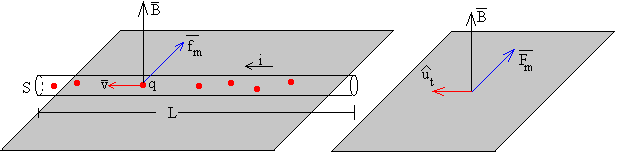
  <figcaption>Força sobre un conductor rectilini.</figcaption>
</figure>

La força sobre un element de càrrega $dQ$ serà

$$dF=vB\sin\alpha dQ$$

Si substituim $v$ i $dQ$ per les expressions anteriors obtenim

$$dF=\frac{dL}{dt}BI\sin\alpha dt$$
 
$$dF=BI\sin\alpha dL$$

L'expressió de la força sobre tot el conductor s'aconsegueix integrant l'última expressió per a tota la longitud:

$$F=\int_{0}^{L}BI\sin\alpha dL$$

$$F=BI\sin\alpha\int_{0}^{L}dL=BLI\sin\alpha$$

que ens dona l'expressió del mòdul de la força magnètica sobre el conductor. Si volem escriure l'expressió de forma vectorial la podem generalitzar de la forma: 

$$\begin{equation}\label{eq:força_conductor}
\vec{F}=I(\vec{L}\times\vec{B})
\end{equation}$$

## Acció d'un camp magnètic sobre una espira. Motor elèctric.

Veurem ara com és la força que fa un camp magnètic sobre una espira. Per a simplificar considerarem una espira de forma rectangular per la que hi circula un corrent I
  com es veu a la figura inferior. Si apliquem la regla de la mà dreta podem veure que apareix un parell de forçes, sobre el costat enfrontat al pol sud magnètic la força és cap amunt i en el costat enfrontat al pol nord la força és cap avall. Els altres dos costats no reben forces ja que per en ells el corrent és paral·lel al camp magnètic.
  
<figure>
  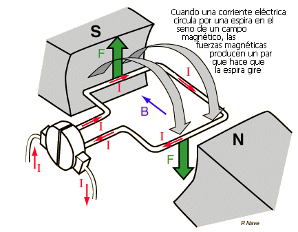
  <figcaption>Força d'un camp magnètic sobre una espira.</figcaption>
</figure>

Si l'espira està muntada sobre un eix, aquest parell de forces la farà fer mig gir sobre l'eix. Si podem evitar que al cap de mitja volta l'espira s'aturi i continuï girant tindrem un motor elèctric. Si observem el sistema de connexió de l'espira al corrent elèctric veurem una mena de cilindre tallat pel mig que s'anomena col·lector i que quan l'espira gira mitja volta també canvia de polaritat i per tant la força continua fent girar l'espira en el mateix sentit i l'espira no s'atura. Els terminals que fan contacte amb el col·lector es diuen escombretes. Aquest és el principi de funcionament del motor de corrent continuu. És clar que els motors, per a poder tenir més força, tenen més espires formant un bobinat. 

## Fonts de camp magnètic

### Camp magnètic creat per un conductor rectilini

Si considerem un conductor prou llarg com a per a no tenir que preocupar-nos pels efectes dels extrems i si per ell circula un corrent elèctric $I$, apareixerà un camp magnètic al seu voltant com el que mostra la figura inferior. Això ho podem comprovar experimentalment posant una brúixola al costat del cable i observant que l'agulla sempre resulta tangent als cercles creats per les línies de camp.
 
<figure>
  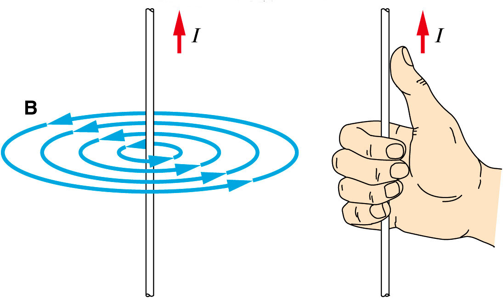
  <figcaption>Camp magnètic creat per un conductor rectilini. Les línies de camp formen cercles al voltant del fil conductor i el sentit de les línies de camp es pot determinar fent servir la regla de la mà dreta: si apuntem amb el dit polze en el sentit del corrent, els altres dits ens donaran el sentit de les línies de camp.</figcaption>
</figure>

El mòdul de la inducció magnètica serà directament proporcional a la intensitat de corrent i inversament proporcional a la distància $r$ al fil i ve donada per l'expressió <a href="#fn2" id="ref2">2</a>

$$B=\frac{\mu I}{2\pi r}$$
 
on la constant $\mu$ es coneix com permeabilitat magnètica i es pot interpretar com la capacitat del medi per a transmetre el camp magnètic a través del l'espai que envolta al fil conductor. Si l'espai al voltant del fil és aire o el buit la constant s'indica com $\mu_{0}$ i el valor que pren és

$$\mu_{0}=4\pi\times10^{-7}\,\mathrm{T.m}/A$$

El valor de la permeabilitat magnètica dependrà del medi on estigui immers el fil.

### Camp magnètic creat per una espira

Si un corrent elèctric $I$ circula per una espira circular crearà un camp magnètic, les línies del qual s'assemblaran a les creades per un imant permanent i direm que tenim un dipol magnètic. La figura inferior mostra les línies de camp creades per una espira circular.

<figure>
  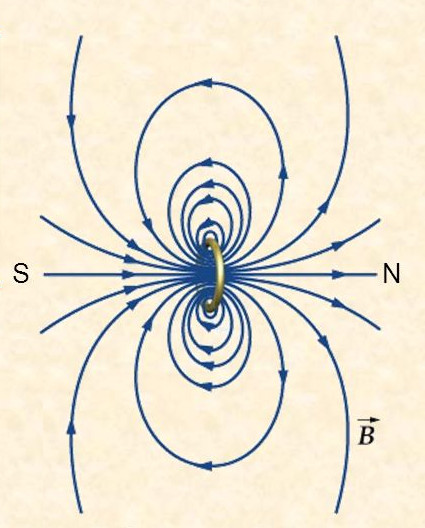
  <figcaption>Camp magnètic creat per una espira circular. També es coneix com a dipol magnètic. Per a saber la direcció del camp fem servir la regla de la mà dreta, en aquest cas si amb els quatre dits de la mà dreta que no són el polze seguim el camí del corrent el dit polze ens donarà el sentit de les línies de camp al centre de l'espira.</figcaption>
</figure>

La inducció magnètica al centre de l'espira tindrà un valor que ve donat per l'expressió

$$B=\frac{\mu I}{2r}$$

on $r$ correspon al radi de l'espira. El sentit de les línies de camp ve donat per la regla de la mà dreta.

<figure>
  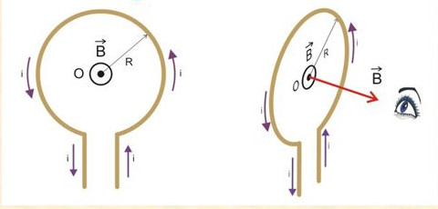
  <figcaption>Camp magnètic al centre de l'espira circular.</figcaption>
</figure>

### Camp magnètic creat per un solenoide o bobina

Anomenarem solenoide o bobina a un conjunt de $N$ espires disposades una al costat de l'altre per les que circula un únic corrent elèctric tal com apareix a la figura inferior. Les línies de camp s'assemblen a les d'un imant permanent i, de fet, podem considerar al solenoide com l'equivalent artificial dels imants naturals, per aquest motiu també se'ls anomenen **electroimants**. Per a determinar el sentit de les línies de camp actuem igual que en el cas d'una espira fent servir la regla de la mà dreta.

<figure>
  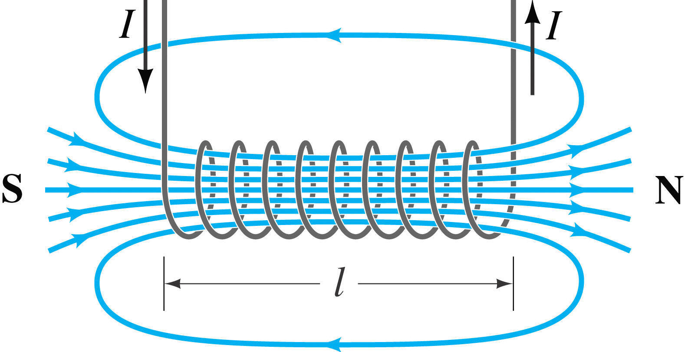
  <figcaption>Solenoide.</figcaption>
</figure>

El valor de la inducció magnètica a l'interior del solenoide serà

$$B=\mu nI$$

on $n=N/L$ és la quantitat d'espires per unitat de longitud $l$ o densitat d'espires i $\mu$, la permeabilitat magnètica depèn del medi sobre el que estigui enrotllat el fil, anomenat nucli de la bobina. Per augmentar el camp magnètic dels electroimants el que es fa servir és un nucli d'alta permeabilitat com el ferro dolç. 

## Interacció entre dos corrents paral·lels

Considerem ara dos conductors rectilinis paral·lels i prou llargs com per a poder negligir els efectes dels extrems. El corrent de cada fil crearà un camp magnètic que exercirà una força sobre l'altre conductor. Podem considerar dues situacions: els corrents tenen el mateix sentit o els corrents tenen sentits oposats. Les dues situacions estan analitzades a la figura següent on podem veure els camps creats per cada corrent i utilitzant la regla de la mà dreta podem determinar el sentit de les forces. 

<figure>
  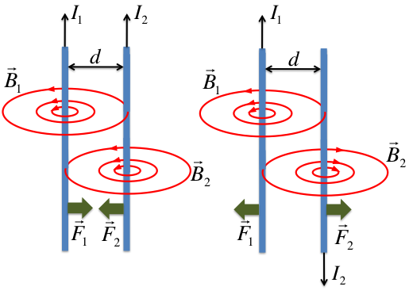
  <figcaption>Força entre dos fils conductors paral·lels.</figcaption>
</figure>

D'aquesta manera obtenim que si els corrents tenen el mateix sentit las forces que apareixen sobre els conductors són atractives i en cas de tenir corrents oposats, les forces són repulsives.

Intentarem ara determinar el valor d'aquestes forces fent servir el que ja hem après. La inducció magnètica creada pel corrent $I_{1}$ ve donada per l'expressió

$$\begin{equation}\label{eq:camp_cond1}
B_{1}=\frac{\mu_{0}I_{1}}{2\pi d}
\end{equation}$$

on $d$ és la distància de separació entre els conductors. Si apliquem la $\eqref{eq:força_conductor}$ per a calcular la força que fa el camp creat pel conductor 1 sobre el conductor 2, tindrem que el mòdul d'aquesta força serà: 

$$\begin{equation}\label{eq:força_cond2}
F_{2}=I_{2}LB_{1}\sin90^{\circ}
\end{equation}$$

i, si reemplacem $\eqref{eq:camp_cond1}$ en $\eqref{eq:camp_cond2}$ obtenim: 

$$F_{2}=\frac{I_{2}L\mu_{0}I_{1}}{2\pi d}=\frac{\mu_{0}I_{1}I_{2}L}{2\pi d}$$
 

Ara farem el mateix però considerant l'altre conductor. El camp creat pel conductor 2 en la posició del conductor 1 serà: 

$$\begin{equation}\label{eq:camp_cond2}
B_{2}=\frac{\mu_{0}I_{2}}{2\pi d}
\end{equation}$$

i la força que exerceix el camp $B_{2}$ sobre el conductor 1 serà:

$$\begin{equation}\label{eq:força_cond1}
F_{1}=I_{1}LB_{2}
\end{equation}$$

Reemplaçant $\eqref{eq:camp_cond2}$ en $\eqref{eq:força_cond1}$ obtenim:

$$F_{1}=\frac{I_{1}L\mu_{0}I_{2}}{2\pi d}=\frac{\mu_{0}I_{1}I_{2}L}{2\pi d}$$

on podem comprovar que les dues forces tenen el mateix valor i ja havíem vist que tenen la mateixa direcció i sentits oposats. Amb això hem verificat que es verifica una de les lleis fonamentals de la mecànica aquí també: la 3a llei de Newton, el principi d'acció i reacció.

L'expressió de la força entre conductors rectilinis es fa servir per a definir la unitat de corrent elèctric, l'ampere. El que es fa és disposar un parell de conductors rectilinis i paral·lels separats una distància d'un metre i es fa circular corrents d'igual intensitat a tots dos. Quan la força per unitat de longitud entre els dos conductor sigui de $2\times10^{-7}\,\mathrm{N/m}$ direm que per cada conductor circula un corrent d'un ampere:

$$\frac{F_{1}}{l}=\frac{F_{2}}{l}=\frac{\mu_{0}I_{1}I_{2}}{2\pi d}=\frac{\mathrm{4\pi\times10^{-7}\times1A\times1A}}{2\pi\times1\mathrm{m}}=2\times10^{-7}\mathrm{N/m}$$
 

## Inducció electromagnètica

El descobriment de la inducció electromagnètica és potser el que ha tingut les conseqüències tecnològiques més importants per a configurar la nostra societat actual. Gràcies a aquest fenomen podem tenir corrent elèctric a tot arreu però en el moment del seu descobriment ningú pensava que hi arribaria el moment pel qual aquest fenomen jugaria un paper tan protagonista. En aquesta part estudiarem aquest fenomen i les màquines que el fan servir.

### Flux magnètic

Una magnitud física important per a l'estudi de la inducció electromagnètica és el flux magnètic que definirem de la segünt manera: Si tenim un camp magnètic uniforme $\vec{B}$ que travessa una superfície $\vec{S}$ com el producte escalar:

$$\begin{equation}\label{eq:flux}
\Phi=\vec{B}\cdotp\vec{S}
\end{equation}$$

on definim el vector superfície com un vector que té un mòdul igual al valor de la superfície i la direcció perpendicular al pla de la superfície (Figura següent).

<figure>
  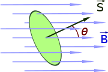
  <figcaption>Línies d'inducció magnètica $\vec{B}$ travessen la superfície $\vec{S}$ amb un angle entre ells igual a $\theta$. El valor del flux magnètic vindrà donat per l'expressió $\eqref{eq:flux2}$.</figcaption>
</figure>

Aplicant la definició de producte escalar l'expressió $\eqref{eq:flux}$ queda:

$$\begin{equation}\label{eq:flux2}
\Phi=BS\cos\theta
\end{equation}$$

on $\theta$ és l'angle format entre el vector inducció i el vector superfície. D'aquesta última expressió podem deduir que si la superfície és perpendicular a les línies de camp $(\vec{S}\parallel\vec{B})$ el flux és màxim ja que $\cos0^{\circ}=1$ i $\Phi=BS$ i resulta en el nombre més alt de línies de camp travessant la superfície. El cas oposat és quan el pla de la superfície és paral·lel a les línies de camp $(\vec{S\perp\vec{B}})$ i el flux resulta nul, ja que $\cos90^{\circ}=0$ i $\Phi=0$. En aquest cas cap línia de camp travessa la superfície.

La unitat de mesura del flux en el SI és el **weber** (Wb) que correspon a $1\mathrm{T.m^{2}}$.

En cas de no tenir un camp magnètic uniforme, per a calcular el flux magnètic hem d'utilitzar el càlcul integral:

$$\Phi=\int\vec{B}\cdotp\vec{dS}=\int BdS\cos\theta$$

## Llei de Faraday-Lenz

Ja hem vist que els corrents elèctric generen camps magnètics. Ara estudiarem el fenomen contrari, camps magnètics que generen corrents elèctrics. Per a observar aquest fenomen només hem de comptar amb una espira a la que hem de connectar un amperímetre per a verificar que s'ha creat un corrent elèctric. Observem ho següent:

1. Si apropem un imant a l'espira observarem que l'amperímetre indica el pas d'un corrent elèctric.

2. Si allunyem l'imant el corrent circula en sentit contrari (el signe de la lectura de l'amperímetre s'inverteix).

3. Si l'imant no es mou, no s'indueix corrent a l'espira (l'amperímetre indica 0).

El primer en estudiar aquest fenomen ha estat Michael Faraday i per Heinrich Lenz de manera independent. Ells van observar que el voltatge que es genera als extrems de l'espira, anomenat **força electromotriu induïda** o **fem induïda**, $\varepsilon$, depenia de la variació del flux magnètic que travessava l'espira. L'expressió matemàtica que dona el valor de la fem induïda és coneguda com a llei de Faraday-Lenz:

$$\varepsilon=-\frac{d\Phi}{dt}$$

que ens diu que la fem induïda és igual a la derivada del flux magnètic respecte del temps. El signe negatiu de l'expressió indica que la fem induïda genera un corrent que té un sentit que provoca un efecte que s'oposa a la causa que el produeix.

<figure>
  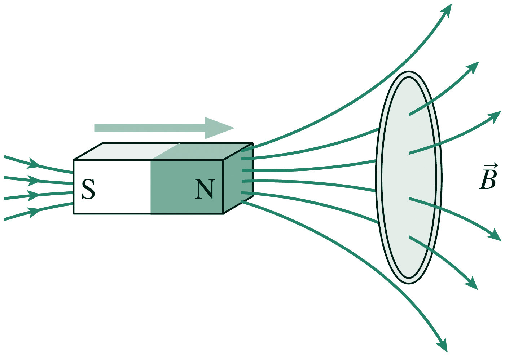
  <figcaption>Quan apropem un imant a l'espira el nombre de línies de camp que travessen l'espira augmenta i, per tant, augmenta el flux magnètic. El sentit del corrent induït serà aquell que produeixi una inducció magnètica contraria a la del imant per tal de fer minvar el flux magnètic intentant tornar a la situació original. D'aquesta manera hem d'interpretar el signe negatiu de la llei de Faraday-Lenz quan diem que el sentit del corrent provoca un efecte que s'oposa a la causa que el produeix.</figcaption>
</figure>

Per entendre una mica més intuïtivament la llei de Faraday farem un anàlisi amb una configuració senzilla i veurem els fenòmens pas a pas.

Començarem observant què passa quan una barra conductora es mou en el si d'un camp magnètic. Per a simplificar suposarem que el camp magnètic és uniforme i movem una barra amb una velocitat $\vec{v}$ constant com es veu a la figura inferior. Sobre una càrrega positiva apareixerà una força de Lorentz cap amunt $F_{B}=qvB$. L'acumulació de càrregues positives a la part superior i de càrregues negatives a la part inferior dona origen a una força electromotriu entre els extrems de la barra.

<figure>
  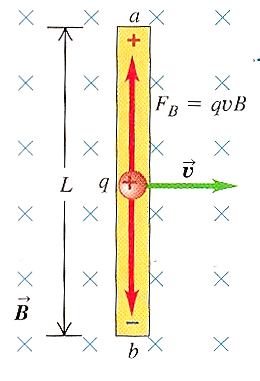
  <figcaption>Quan movem una barra conductora en el si d'un camp magnètic apareix una força sobre les càrregues que que tenen llibertat per moure's. les càrregues positives s'acumulen a la part superior i les negatives a la inferior donant origen a una força electromotriu entre els extrems de la barra.</figcaption>
</figure>

L'equilibri en l'acumulació de càrregues s'assoleix quan la força d'atracció electrostàtica de les càrregues iguala a la força de repulsió magnètica:

$$\vec{F}_{e}+\vec{F}_{m}=0$$

per tant, els mòduls han de ser iguals

$$F_{e}=F_{m}$$

per tant, 

$$qE=qvB$$

Quan el camp elèctric assoleix el valor $E=vB$ el conductor arriba a un equilibri entre la força elèctrica i magnètica. Si recordem que la diferència de potencial entre els extrems del conductor tindrà un valor constant donat per $\Delta V=E.L$ i substituïm el valor del camp en l'expressió anterior tindrem

$$\Delta V=vBL$$

que ens mostra que el valor de la diferència de potencial entre els extrems del conductor serà directament proporcional a la velocitat de la barra. 

<figure>
  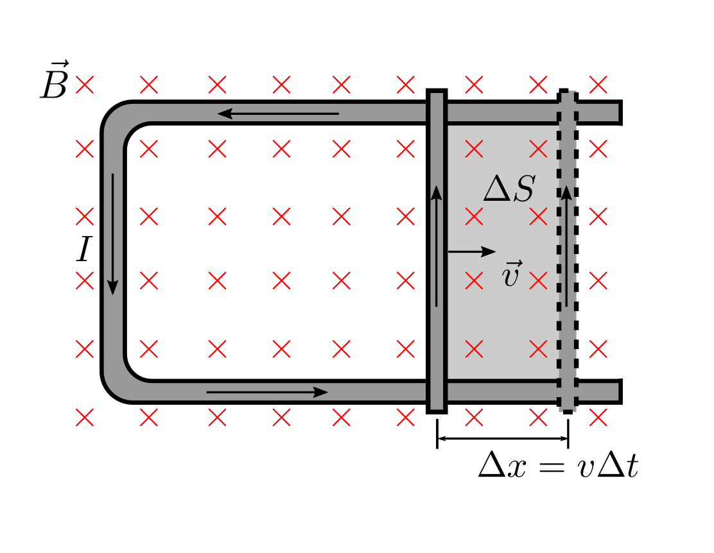
  <figcaption>Una barra conductora es mou en contacte amb un conductor en forma d'U. Quan la barra conductora es mou apareix una diferència de potencial en els seus extrems com ja hem vist i, com el circuit es tanca a través del conductor en forma d'U, apareix un corrent elèctric.</figcaption>
</figure>

El corrent vindrà donat per la llei d'Ohm

$$I=\frac{\Delta V}{R}$$

on $R$ és la resistència que troba el corrent a través del circuit, es a dir, del conductor en forma d'U i la barra conductora. Per tant:

$$I=\frac{vBL}{R}$$

Si ara analitzem quina ha estat la variació del flux que travessa el circuit podrem deduir la llei de Faraday. Quan el conductor es desplaça una distància $\Delta x=v\Delta t$, la superfície augmenta en una quantitat $\Delta S=\Delta xL=v\Delta tL$.

La variació de flux serà

$$\Delta\Phi=B\Delta S\cos0^{\circ}=B\Delta S=Bv\Delta tL$$

Si dividim l'expressió anterior per $\Delta t$ obtindrem la llei de Faraday:

$$\Delta V=\frac{Bv\Delta tL}{\Delta t}=vBL$$

que és l'expressió a la que havíem arribat abans per a la diferència de potencial (ddp) de la barra. D'aquesta manera hem vist que un camp magnètic variable crea un camp elèctric com estableix la llei de Faraday-Lenz.

Quan movem la barra cap a la dreta augmenta la superfície del circuit i el flux magnètic que el travessa creant una fem induïda que estableix un corrent elèctric. Aquest moviment de càrregues fa que aparegui sobre la barra en moviment una força magnètica $\vec{F}_{m}$ que, segons la llei de la mà dreta, tindrà el sentit oposat al moviment de la barra com es veu a la figura inferior. D'aquesta manera, per a mantenir una velocitat constant hem de fer una força per a contrarestar la força magnètica, la qual cosa resulta raonable: per a generar energia elèctrica hem de fer un treball mecànic.

<figure>
  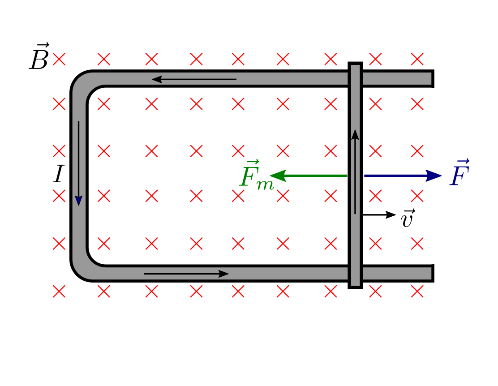
  <figcaption>La llei de Faraday fa que per moure la barra cap a la dreta s'hagi de fer una força igual o més gran que la força magnètica. D'aquesta manera per a generar corrent elèctric és necessari fer un treball mecànic. En cas contrai podríem crear energia del no res! </figcaption>
</figure>

Vàrem dir que el sentit del corrent induït és aquell que produeix un efecte que s'oposa a la causa que l'origina i podem veure que la força magnètica té el sentit que intenta fer disminuir la superfície del circuit per a que baixi el flux magnètic ja que la causa del corrent és l'augment de la superfície (i amb això també del flux). També podem veure que el sentit del corrent genera un camp magnètic de sentit cap a fora del paper (contrari al camp extern) que també té l'efecte de fer disminuir el flux magnètic. 

## Corrents de Foucault

Quan tenim un metall dintre d'un camp magnètic variable, sobre el metall, que és conductor, s'indueixen petits remolins de corrent que el que fan és escalfar el metall degut a l'efecte Joule, aquests corrent s'anomenen corrents de Foucault i, a vegades se'ls diu corrents paràsites, degut a que moltes vegades són corrents no desitjables perquè produeixen pèrdues d'energia. 

Hi ha cassos en que els corrents de Foucault són desitjables, com és el cas de les cuines d'inducció. En aquest cas un camp magnètic variable es fa servir per a induir corrents en una cassola metàl·lica per a escalfar-la. Els trens també fan servir un fre magnètic basat en els corrents de Foucault.

## Generadors de corrent altern

Ja hem vist que per a generar electricitat només necessitem fer variar el flux magnètic que travessa un circuit conductor. Si observem l'expressió del flux magnètic següent:

$$\Phi=BS\cos\theta$$

podem fer variar el flux magnètic que travessa un circuit de tres maneres:

1. Canviant la intensitat de camp magnètic $B$
 

2. Canviant la superfície del circuit $S$
 

3. Canviant l'orientació del circuit, es a dir, variant l'angle $\theta$ entre la inducció magnètica i la superfície.

De les tres opcions plantejades la tercera és la que resulta més senzilla d'aconseguir i és la solució que es persegueix en la construcció de generadors elèctrics. A la figura següent hi ha l'esquema d'un generador de corrent altern o **alternador**. 

<figure>
  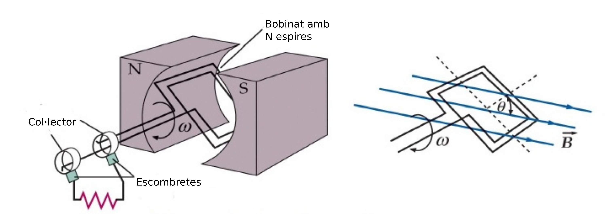
  <figcaption>Circuit esquemàtic d'un alternador. </figcaption>
</figure>

El generador està constituït per una part estàtica anomenada **estator** formada per un imant permanent que crea un camp magnètic constant i una part mòbil formada per un bobinat anomenat **rotor** que pot girar al voltant d'un eix. Els fils que formen la bobina tenen un nombre N de voltes i acaben un unes anelles anomenades **col·lectores** que estan en contacte amb uns connectors anomenats **escombretes** que es connecten als receptors als que volem alimentar.

Si fem girar la bobina amb un moviment circular uniforme de velocitat angular $\omega$ tindrem que l'angle que forma la superfície respecte de la inducció magnètica variarà amb el temps segons l'equació $\theta=\omega t$, per tant el flux magnètic també variarà amb el temps seguint l'equació

$$\Phi=BS\cos\theta=BS\cos\omega t$$
 

Al haver-hi una variació del flux magnètic amb el temps apareixerà als extrems de la bobina segons la llei de Faraday-Lenz

$$\varepsilon=-\frac{d\Phi}{dt}=BS\sin\omega t=\hat{\varepsilon}\sin\omega t$$

on $\hat{\varepsilon}=BS$ és el valor màxim de la fem induïda. L'electricitat amb aquest comportament s'anomena corrent altern (C.A.) i és la que fem servir les nostres llars i a la indústria.

La figura següent mostra la gràfica d'una tensió alterna de valor màxim de 20 V i un període d'1 s.

<figure>
  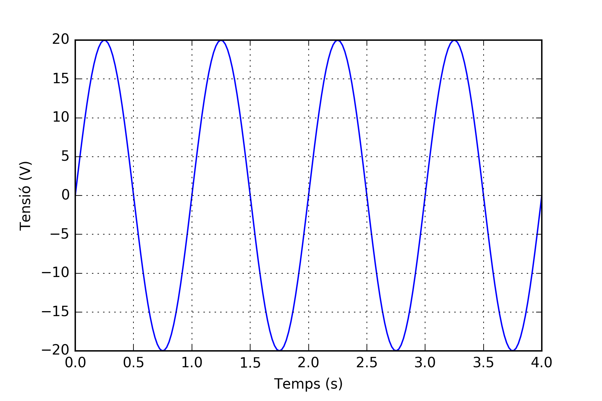
  <figcaption>El corrent altern no té un valor constant sinó que va variant en el temps. </figcaption>
</figure>

## Valor eficaç

El valor de tensió que tenim a les nostres llars és de 220V però, com pot ser si el corrent altern no té un valor constant? de quin valor estem parlant? És el valor màxim? En realitat el valor de 220 V correspon al valor eficaç. El valor eficaç del corrent altern és igual al valor de corrent continu (C.C.) que produeix el mateix efecte calorífic en el mateix temps que el corrent altern.

Per trobar el valor de tensió eficaç intentarem trobar el valor de tensió contínua que produeixi la mateixa energia que l'alterna. La potència del corrent altern es pot escriure

$$\begin{equation}\label{eq:potencia_ca}
P=\varepsilon.I=\frac{\varepsilon^{2}}{R}=\frac{\hat{\varepsilon}^{2}}{R}\sin^{2}\omega t
\end{equation}$$

 on hem fet servir la llei d'Ohm $I=\varepsilon/R$. La figura inferior conté la gràfica de la potència expressada per la expressió $\eqref{eq:potencia_ca}$ que dona la potència com a funció del temps. Podem veure de la gràfica que el valor equivalent de potència de corrent contínua correspon just a la meitat del màxim de potència de corrent alterna, ja que l'àrea pintada de color cian resulta igual a la part groga que sobresurt del nivell mitjà. 

<figure>
  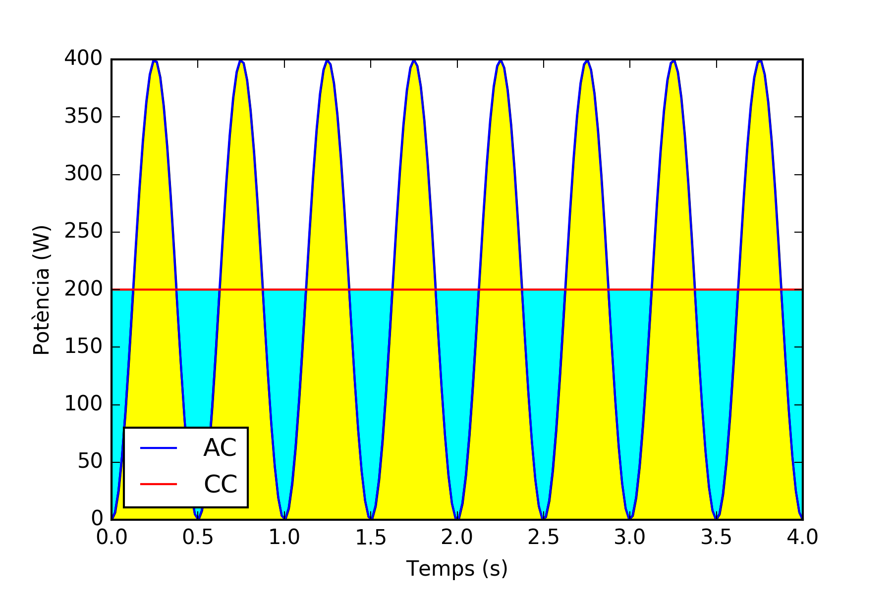
  <figcaption>Gràfic de la potència de corrent alterna i de corrent contínua equivalent. L'energia dissipada (superfície sota la gràfica) pel C.A. (en color groc) és igual a la dissipada pel C.C.  </figcaption>
</figure>

Per tant, la potència mitjana és

$$P_{m}=\frac{1}{2}\frac{\hat{\varepsilon}^{2}}{R}$$

però, per l'altra banda, per definició de tensió eficaç tenim que

$$P_{m}=\frac{\varepsilon_{ef}^{2}}{R}$$

per tant, el valor eficaç és

$$\varepsilon_{ef}=\frac{\hat{\varepsilon}}{\sqrt{2}}$$

La mateixa relació tenim per a la intensitat de corrent eficaç

$$I_{ef}=\frac{\hat{I}}{\sqrt{2}}$$

## Transformadors

Els transformadors són maquines elèctriques que canvien la tensió del corrent altern. Hi ha transformadors elevadors que el que fan és augmentar el voltatge com fan els de les centrals elèctriques i també hi ha transformadors reductors que disminueixen el voltatge com fan en les estacions distribuïdores per a enviar a les cases per a fer funcionar els electrodomèstics. La raó per la qual convé transportar l'energia elèctrica en alta tensió és que d'aquesta manera es redueixen molt les pèrdues per efecte Joule (en forma de calor) durant el transport.

Un transformador està composat de dos debanaments, el debanament o bobinat primari amb un nombre d'espires $N_{1}$ i el bobinat secundari amb un nombre d'espires $N_{2}$. Tots dos estan debanats sobre un nucli de ferro de forma toroïdal com es pot veure a la figura de abajo. En un transformador ideal no hi ha pèrdues d'energia, es a dir que el flux creat pel bobinat primari arriba al bobinat secundari i el travessa i, com que aquest flux és variable perquè ha estat creat per un corrent que varia en el temps, induirà una fem en el bobinat secundari. La tensió del bobinat secundari dependrà de si aquest té més o menys espires que el secundari. Si el bobinat secundari té un nombre més petit que el primari, la fem induïda serà més petita que la del primari i tenim un transformador reductor. 

<figure>
  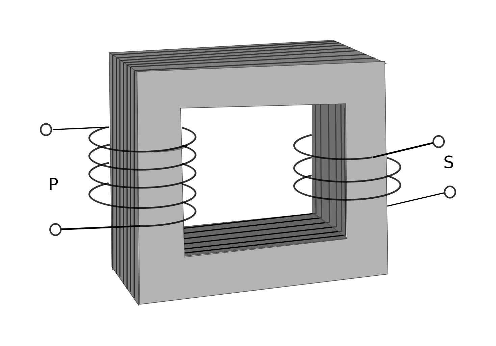
  <figcaption>Transformador. </figcaption>
</figure>

Per veure com es relaciona la tensió de sortida del transformador amb la tensió d'entrada partirem de la suposició de que el flux que travessa el bobinat primari és igual al que travessa el secundari

$$\Phi_{1}=\Phi_{2}$$

per tant, també seran igual les seves derivades

$$\frac{d\Phi_{1}}{dt}=\frac{d\Phi_{2}}{dt}$$
 

Segons la llei de Faraday

$$\varepsilon=-N\frac{d\Phi}{dt}$$
 

Per tant,

$$\frac{\varepsilon_{1}}{N_{1}}=\frac{\varepsilon_{2}}{N_{2}}$$

o

$$\frac{\varepsilon_{1}}{\varepsilon_{2}}=\frac{N_{1}}{N_{2}}$$

Aquesta última relació es coneix com relació de transformació i és la que permet al fabricant de transformadors saber quantes voltes ha de posar a un transformador per a obtenir la tensió de sortida desitjada. 

Com que la potència d'entrada i de sortida són iguals (menyspreant les pèrdues), i com la potència es pot calcular com $P=\varepsilon.I$ , tindrem que 

$$\varepsilon_{1}.I_{1}=\varepsilon_{2}.I_{2}$$

i també tendrem una relació de transformació per la intensitat de corrent:

$$\frac{\varepsilon_{1}}{\varepsilon_{2}}=\frac{I_{2}}{I_{1}}=\frac{N_{1}}{N_{2}}$$
 

Veiem que si en el bobinat secundari tenim una tensió més petita, la intensitat de corrent serà més gran en la mateixa proporció.

Per a obtenir la relació de transformació hem suposat que no hi ha pèrdues d'energia però, encara que els transformadors són màquines que tenen un alt rendiment, sempre hi haurà pèrdues d'energia. Les pèrdues d'energia en un transformador es produeixen per dues raons fonamentals:

1. Dissipació de calor en els conductors de coure per efecte Joule.

2. Dissipació de calor en el nucli degut als corrents paràsites o de Foucault. Per reduir els corrents paràsits en el ferro el que es fa és tractar de reduir el camí que puguin trobar aquests corrents i fent que , d'aquesta manera els corrents siguin més petits. Per aquest motiu els nuclis no es fan d'una sola peça, sinó que es lamina i cada làmina s'envernissa per a que les làmines quedin aïllades elèctricament les unes de les altres i, d'aquesta manera presentin un camí més curt pels corrents paràsits. 

### Notes

1. El corrent elèctric és defineix com $I=\frac{dQ}{dt}$, és a dir, la taxa de canvi de la càrrega amb el temps. La seva unitat de mesura en el SI és l'ampere que equival a 1 coulomb/segon.<a href="#ref1" title="Tornar al text.">↩</a>

2. L'expressió de la inducció aquí donada es dedueix fent servir la llei d'Ampère que no veurem aquí perquè va més enllà dels objectius del curs.<a href="#ref2" title="Tornar al text.">↩</a>
