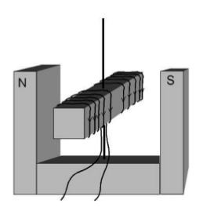

# Problemes Unitat 5: Màquines electromagnètiques

## Camp magnètic

1. Un electró que es mou a una velocitat de $3\times10^{4}\,\mathrm{m/s}$ entra perpendicularment en un camp magnètic uniforme de $0,1 T$. Determineu: 
    1. El valor de la força magnètica que actua sobre aquest. 
    2. El radi de l’òrbita descrita. 
    3. El temps que triga en recórrer una circumferència completa.
    4. Perquè es pot menysprear l’efecte de la gravetat? Justifica-ho.
     <a href="sol/prob1001.pdf">Solució</a>  

2. Dues partícules amb la mateixa càrrega $q$ i amb masses $m_{1}$ i $m_{2}$ penetren en el punt A com s'indica a la figura, totes dues a la mateixa velocitat, $v$, en un camp magnètic uniforme i perpendicular al pla del paper, B. Després de descriure mitja circumferència, la primera incideix al punt B i la segona al punt C. Calcula la separació final que hi ha entre les partícules (distància BC) (has de donar el resultat en funció dels paràmetres donats pel problema).

    
     <a href="sol/prob1002.pdf">Solució</a>  
    
3. L’espectròmetre de masses fa entrar partícules carregades, com per exemple ions, dins un camp magnètic uniforme. Quan les partícules carregades i amb una velocitat coneguda entren dins del camp magnètic constant, a partir de la trajectòria, en podem calcular la massa. Un feix de ions compost per $\mathrm{^{20}Ne^{+}}$ i $\mathrm{^{22}Ne^{+}}$ (que foren els primers isòtops naturals trobats) entra en l’espectròmetre de masses de la figura. La velocitat dels ions és $1,00\times10^{5}\,\mathrm{ms^{-1}}$ i el camp magnètic de l’espectròmetre de $0,23\,T$, perpendicular al paper. 
    

    1. Expliqueu raonadament quin tipus de trajectòria descriu cada un dels ions dins del camp. Quin treball realitzarà la força que exerceix el camp magnètic en aquesta trajectòria? 
    2. Calculeu a quina distància del punt d’entrada impactarà cada un dels ions. 
    **Dades**: 
    $m(\mathrm{i\acute{o}}\mathrm{^{22}Ne^{+}})=22,0\,\mathrm{u}$; 
    $m(\mathrm{i\acute{o}}\mathrm{^{20}Ne^{+}})=20,0\,\mathrm{u}$; 
    $Q(\mathrm{i\acute{o}}\mathrm{^{22}Ne^{+}})=Q(\mathrm{i\acute{o}}\mathrm{^{20}Ne^{+}})=1,60\times10^{-19}\mathrm{C}$; 
    $1\mathrm{u=1,66\times10^{-27}\,\mathrm{kg}}$.
     <a href="sol/prob1003.pdf">Solució</a>  
    
4. Un electró entra amb una velocitat de $3,00\times10^{5}\,\mathrm{ms^{-1}}$ en una regió de l’espai on hi ha un camp magnètic uniforme d’1,20 T perpendicular a la velocitat de l’electró i en sentit perpendicular al paper, tal com indica la figura, i queda confinat en aquesta regió de l’espai. 

    
    
    1. Dibuixeu i justifiqueu la trajectòria que descriu l’electró dins del camp indicant el sentit de gir i calculeu el valor de la freqüència (en GHz). 
    2. Perquè l’electró travessi el camp magnètic sense desviar-se, cal aplicar un camp elèctric uniforme en aquesta mateixa regió. Dibuixeu el vector camp elèctric que permetria que això fos possible (justifiqueu-ne la direcció i el sentit) i calculeu-ne el mòdul. 
    **Dades**: $m_{e}=9,11\times10^{-31}\mathrm{kg}$; $Q_{e}=1,60\times10^{-19}\mathrm{C}$.
     <a href="sol/prob1004.pdf">Solució</a>  
    
5. Un espectròmetre de masses consta d’un selector de velocitats i d’un recinte semicircular. En el selector de velocitats hi ha un camp elèctric i un camp magnètic, perpendiculars entre si i en la direcció de la velocitat dels ions. En entrar al selector, els ions d’una velocitat determinada no es desvien i entren a la zona semicircular, on només hi ha el camp magnètic perpendicular a la velocitat, que els fa descriure una trajectòria circular.

    

    1. Si el camp elèctric del selector té un valor $E=20,0\,\mathrm{NC^{-1}}$ i el valor de la inducció magnètica és $B=2,50\times10^{-3}\,\mathrm{T}$, calculeu el valor del mòdul de la velocitat dels ions que NO es desvien. Feu l’esquema corresponent dels vectors següents: velocitat, força elèctrica, camp magnètic i força magnètica. 
    2. Calculeu la distància, $d$, a què impactaran els ions de triti, que són isòtops de l’hidrogen i tenen una massa $m=3\,\mathrm{u}$. 

    **Dades**: $1\mathrm{u=1,66\times10^{-27}\,\mathrm{kg}}$; $Q_{\mathrm{prot\acute{o}}}=1,60\times10^{-19}\,\mathrm{C}$.
     <a href="sol/prob1005.pdf">Solució</a>  
    
6. Dos ions positius A i B de càrrega elèctrica igual $(1,60\times10^{-19}\,\mathrm{C})$ es mouen, separats, amb la mateixa velocitat $(3,00\times10^{5}\mathrm{ms^{-1}})$, tal com indica la figura, i entren en una regió on hi ha un camp magnètic de mòdul 0,42 T dirigit cap avall. La massa de l’ió A és el doble que la de l’ió B.

    

    1. Calculeu la força magnètica que actua sobre cada un dels dos ions, i especifiqueu-ne la direcció i el sentit. 
    2. Indiqueu la relació que hi ha entre els radis de les trajectòries descrites pels ions A i B, és a dir, $r_{A}/r_{B}$.
     <a href="sol/prob1006.pdf">Solució</a>  
    
7. La imatge següent representa una cambra d’ionització en què s’observa l’aparició d’un electró i d’un positró que tenen la mateixa energia. El camp magnètic que hi ha a la cambra d’ionització és de $2\times10^{-4}\,\mathrm{T}$ i està dirigit cap a l’interior del paper.

    
    
    1. Indiqueu la trajectòria del positró i la de l’electró i justifiqueu la resposta. Si les dues trajectòries tenen un radi equivalent de 5,80 m, determineu la velocitat de les partícules. 
    2. Quina és l’energia en repòs d’un electró? Quina energia mínima ha de tenir un fotó per a materialitzar-se en un parell electró-positró? Quines són la freqüència i la longitud d’ona corresponents a aquesta energia? 

    **Dades**: 
    $q_{\mathrm{positr\acute{o}}}=1,60\times10^{-19}\,\mathrm{C}$; 
    $q_{\mathrm{electr\acute{o}}}=-1,60\times10^{-19}\,\mathrm{C}$; 
    $m_{\mathrm{electr\acute{o}}}=m_{\mathrm{positr\acute{o}}}=9,11\times10^{-31}\mathrm{kg}$;
    $h=6,62\times10^{-34}\mathrm{Js}$; 
    $c=3\times10^{8}\,\mathrm{m/s}$.
     <a href="sol/prob1007.pdf">Solució</a>  
    
8. Un protó i un electró, amb la mateixa velocitat, entren en una regió de l’espai on hi ha un camp magnètic uniforme dirigit cap a l’interior del paper, tal com indica la figura següent:

    

    1. Dibuixeu les forces que actuen sobre cada partícula en l’instant en què entren a la regió on hi ha el camp. Són iguals els mòduls d’aquestes forces? Descriviu i justifiqueu el moviment que seguirà cadascuna de les partícules. 

    Imagineu-vos que en aquesta regió, en comptes d’un camp magnètic, hi ha un camp elèctric uniforme dirigit cap a la dreta, tal com indica la figura següent:

    

    2. Dibuixeu les forces que actuen sobre cada partícula en l’instant en què entren a la regió on hi ha el camp. Són iguals els mòduls d’aquestes forces? Descriviu i justifiqueu el moviment que seguirà cadascuna de les partícules.
     <a href="sol/prob1008.pdf">Solució</a>  

9. Un ciclotró que accelera protons té un camp magnètic de $9,00\times10^{-3}\mathrm{T}$, perpendicular a la velocitat dels protons, que descriuen una trajectòria circular de 0,50 m de radi. Calculeu: 
    1. La freqüència del moviment circular dels protons en el ciclotró. 
    2. L’energia cinètica dels protons accelerats i la longitud d’ona de De Broglie que tenen associada. 

    **Dades**: 
    $Q_{\mathrm{prot\acute{o}}}=1,60\times10^{-19}\,\mathrm{C}$; 
    $m_{\mathrm{prot\acute{o}}}=1,67\times10^{-27}\mathrm{kg}$; 
    $h=6,62\times10^{-34}\mathrm{Js}$.
     <a href="sol/prob1009.pdf">Solució</a>  
    
10. Un dispositiu llança, al mateix temps, en la mateixa direcció i en sentits oposats, un protó i un electró. És a dir: $\vec{v}(\mathrm{prot\acute{o}})=-v\hat{j}$, $\vec{v}(\mathrm{electr\acute{o}})=+v\hat{j}$. 
    1. Quan aquest dispositiu es col·loca dins un camp magnètic $\vec{B}=+B\hat{i}$: 
    
        i. Sobre el protó actua una força $\vec{F}=+qvB\hat{k}$ i, sobre l’electró, $\vec{F}=-qvB\hat{k}$.
        
        ii. Sobre el protó actua una força $\vec{F}=-qvB\hat{k}$ i, sobre l’electró, $\vec{F}=+qvB\hat{k}$.
        
        iii. Sobre el protó actua una força $\vec{F}=+qvB\hat{k}$ i, sobre l’electró, $\vec{F}=+qvB\hat{k}$.
        
    2. Quan el dispositiu es col·loca dins un camp elèctric $\vec{E}=+E\hat{j}$:
        
        i. Sobre el protó actua una força $\vec{F}=+qE\hat{j}$ i, sobre l’electró, $\vec{F}=-qE\hat{j}$. 
        
        ii. Sobre el protó actua una força $\vec{F}=-qE\hat{j}$ i, sobre l’electró, $\vec{F}=+qE\hat{j}$.
        
        iii. Sobre el protó actua una força $\vec{F}=-qE\hat{j}$ i, sobre l’electró, $\vec{F}=-qE\hat{j}$. 

    **Nota**: $q$ representa el valor absolut de la càrrega de l’electró i la del protó.
     <a href="sol/prob1010.pdf">Solució</a>  

11. Per dos conductors elèctrics rectilinis molt llargs i paral·lels circulen corrents de la mateixa intensitat. La figura representa les quatre configuracions possibles, atenent el sentit del corrent en cada conductor, representat per les fletxes. Digueu en quins casos el camp magnètic induït en el punt X, equidistant dels dos fils, serà zero:
    1. 1 i 2
    2. 1 i 4
    3. 2 i 3
    4. 3 i 4 
    
    Justifiqueu la resposta.
    
    

12. Quatre fils conductors idèntics, A, B, C i D, perpendiculars al pla del paper, tallen el paper en els vèrtexs d’un quadrat tal com indica la figura. Per tots els fils circulen corrents elèctrics iguals i en el mateix sentit. Indiqueu la direcció i el sentit de la força resultant exercida sobre el conductor A per la resta de conductors. 

    

13. Els axons són una part de les neurones i transmeten l’impuls nerviós. El corrent elèctric que circula per l’axó produeix un camp magnètic que podem considerar igual al que produiria un fil conductor rectilini infinitament llarg. Per dos axons paral·lels, representats en la figura següent, circula un corrent de $0,66\times10^{-6}\mathrm{A}$ en el mateix sentit:

    

    1. Indiqueu la direcció i el sentit del camp magnètic que produeix cada axó en la posició que ocupa l’altre. Dibuixeu la força que actua sobre cada axó causada pel corrent que circula per l’altre. 
    2. Calculeu el mòdul de la força que actua sobre 2 cm de l’axó 2 si el mòdul del camp magnètic que produeix l’axó 1 en la posició de l’axó 2 és $1,1\times10^{-10}\mathrm{T}$.

14. Es col·loca per sobre d’una balança un imant amb els pols N i S enfrontats. Tal com veiem en les figures, entre aquests dos pols passa un fil conductor horitzontal que no toca l’imant. El fil elèctric s’aguanta mitjançant dos suports aïllants que recolzen sobre el plat de la balança. En absència de corrent elèctric pel fil, la balança indica un pes de 2,400 N. Quan circula corrent elèctric pel fil conductor, la balança indica pesos aparents més petits, que depenen de la intensitat del corrent, a causa de l’aparició d’una força magnètica cap amunt.

    
    
    

    S’han fet circular pel fil diverses intensitats i s’han obtingut els resultats que es mostren en la gràfica següent, en què F és el pes aparent registrat per la balança i I és la intensitat del corrent que circula pel fil conductor.
    
    
    
    1. Determineu l’equació que relaciona la força amb la intensitat. Calculeu la força magnètica que actua sobre el fil elèctric quan la intensitat del corrent és 2,0 A i quan és 2,5 A. 
    2. Considereu que el tram de fil situat entre els pols de l’imant té una longitud de 6 cm i que el camp magnètic és uniforme (constant) dins d’aquesta zona i nul a fora. Calculeu el camp magnètic entre els pols de l’imant. En quin sentit circula el corrent elèctric?

   <a href="sol/prob1014.pdf">Solució</a>

## Inducció electromagnètica

1. Disposem d'un fil indefinit pel qual circula un corrent d'intensitat constant. Movem una petita espira circular per les proximitats del fil indefinit en les formes (a, b, c i d) indicades en la figura. Indica en quins casos apareixeran corrents induïts i quin serà aleshores el sentit del corrent.

    
    
2. Una resistència de $0,2\,\Omega$ uneix dos rails paral·lels que disten 5 cm i són en un camp magnètic uniforme de 0,1 T. Un conductor es desplaça recolzat als rails en direcció perpendicular a aquests i al camp a una velocitat de 20 cm/s. Calcula: 
    1. La força electromotriu induïda als extrems del conductor. 
    2. La intensitat del corrent induït al circuit.
    
    

3. Considereu un camp magnètic uniforme, perpendicular a la superfície plana delimitada per un fil metàl·lic un forma de $\subset$, i una barra metàl·lica que es mou sobre el fil a velocitat constant i en el sentit indicat en la figura. El símbol $\times$ indica que el camp apunta cap a dins del paper.
    1. En quin sentit circula el corrent induït en el circuit? Justifiqueu la resposta.
    2. Quin moviment hauria de descriure la barra perquè el corrent induït fos altern? Per què?

    

4. En aquest gràfic es representa la variació del flux magnètic amb el temps en un circuit.

    
    
    El valor de la força electromotriu induïda serà

    1. 20 V
    2. 50 V
    3. 100 V
    4. 500 V

    Trieu la resposta que considereu correcta i justifiqueu-la.
     <a href="sol/prob1104.pdf">Solució</a>  
    
5. Una espira circular de 4,0 cm de radi es troba en repòs en un camp magnètic constant de 0,50 T que forma un angle de 60° respecte de la normal a l’espira.

    1. Calculeu el flux magnètic que travessa l’espira. S’indueix una força electromotriu en l’espira dins el camp magnètic? Justifiqueu la resposta. 
    2. En un moment determinat el camp magnètic disminueix tal com mostra la figura. Calculeu la força electromotriu induïda en l’espira.
    
     <a href="sol/prob1105.pdf">Solució</a>  
    
6. Una espira triangular de $l=4,0\,\mathrm{m}$ de costat com la de la figura es troba inicialment $(t=0,0)$ situada a una distància de $6,0\,\mathrm{m}$ d’una regió on hi ha un camp magnètic B perpendicular al pla del paper i cap endins.

    

    1. Indiqueu l’expressió de la FEM induïda a l’espira quan aquesta s’endinsa a la regió on hi ha el camp magnètic. Determineu el valor de B sabent que, per a $t=4,0\,\mathrm{s}$, la FEM induïda és $\varepsilon=160\,\mathrm{V}$. 
    2. Representeu gràficament la FEM induïda $\varepsilon=\varepsilon(t)$ entre $t=0,0$ i $t=8,0\,\mathrm{s}$. Indiqueu en cada instant el sentit del corrent induït a l’espira.
     <a href="sol/prob1106.pdf">Solució</a>  
    
7. Una espira rectangular es troba prop d’un fil conductor rectilini infinit pel qual circula una intensitat de corrent $I$ cap avall, tal com mostra la figura. 

    

    1. Si la intensitat de corrent I és constant, dibuixeu el camp magnètic creat pel fil conductor en la regió on es troba l’espira. Es tracta d’un camp magnètic constant? Justifiqueu la resposta. 
    2. Si el conductor i l’espira no es mouen, però la intensitat de corrent que circula pel conductor varia amb el temps tal com indica el gràfic, expliqueu raonadament si s’indueix o no corrent en l’espira en els intervals de temps següents: de 0 a 20 s, de 20 a 80 s i de 80 a 120 s. En quin dels tres intervals de temps el corrent induït és més gran? Justifiqueu la resposta.

    
    
     <a href="sol/prob1107.pdf">Solució</a>  
    
8. Calculeu, dins d’un camp magnètic $\vec{B}=0,2\hat{j}$, expressat en T: 

    1. La força (mòdul, direcció i sentit) que actua sobre una càrrega positiva $Q=3,2\times10^{-19}\mathrm{C}$ que es mou a una velocitat $\vec{v}=2\hat{k}$, expressada en m/s. 
    2. La força electromotriu induïda en funció del temps quan una espira quadrada de $0,01\,\mathrm{m^{2}}$ de superfície gira, a una velocitat angular constant de 30 rad/s, al voltant d’un eix fix (l’eix x de la figura) que passa per la meitat de dos dels seus costats oposats, tal com s’indica en la figura.

    
     <a href="sol/prob1108.pdf">Solució</a>  
    
9. Una espira de radi $r=25\,\mathrm{cm}$ està sotmesa a un camp magnètic que és perpendicular a la superfície que delimita l’espira i de sentit entrant. En la gràfica següent es mostra el valor de la inducció magnètica $\vec{B}$ en funció del temps:

    
    

    1. Expliqueu raonadament si circula corrent elèctric per l’espira en cadascun dels intervals de temps indicats i determineu-ne, si s’escau, el sentit de circulació. 
    2. Calculeu la intensitat de corrent elèctric en cada interval de temps, si la resistència de l’espira és $5\,\Omega$. Recordeu que la llei d’Ohm estableix que $I=\Delta V/R$.
     <a href="sol/prob1109.pdf">Solució</a>  
    
10. En la figura es mostra un dispositiu format per una barra de ferro que pot girar lliurement al voltant d’un eix vertical entre els pols d’un imant permanent de ferradura. Un fil elèctric aïllat envolta la barra. 

    

    1. Fem circular un corrent continu pel fil elèctric en el sentit indicat en la figura. Dibuixeu les línies del camp magnètic generat per l’electroimant i expliqueu raonadament com es mourà la barra. 
    2. Si fem girar la barra sense fer circular cap corrent elèctric, tenim un generador. En la gràfica es mostra la variació del flux magnètic $(\varPhi)$ a través de la bobina en funció del temps quan la barra gira. Expliqueu raonadament en quins moments hi ha força electromotriu (FEM) induïda en les espires.
    
     <a href="sol/prob1110.pdf">Solució</a>  

11. Un timbre funciona a 12,0 V de tensió i 0,200 A d’intensitat. Per tal de poder-lo connectar a la xarxa elèctrica i que funcioni correctament, disposa d’un transformador ideal que té 20 espires en el secundari. 
    1. Connectem el primari del transformador a un corrent altern de 220 V. Calculeu quantes espires té el primari i quina intensitat de corrent hi circula. 
    2. Si connectem el primari d’aquest transformador a un corrent continu de 24 V, quina intensitat de corrent circularà pel timbre? Justifiqueu la resposta.
     <a href="sol/prob1111.pdf">Solució</a>  
    
12. Un imant penja d’una molla sobre una bobina conductora, fixada a terra, i un vol- tímetre tanca el circuit de la bobina, tal com mostra la figura següent:

    

    Quan es produeix un terratrèmol, l’imant es manté immòbil, mentre que la bobina puja i baixa seguint els moviments del terra. 

    1. Expliqueu què indicarà el voltímetre en les tres situacions següents: 

        i. El terra puja. 

        ii. El terra baixa. 

        iii. No hi ha cap terratrèmol (i el terra no es mou). 

    2. Si retirem el voltímetre i apliquem un corrent elèctric altern a la bobina, quin efecte es produirà en l’imant suspès a sobre? Justifiqueu la resposta.
     <a href="sol/prob1112.pdf">Solució</a>  
    
13. En una regió àmplia de l’espai hi ha un camp magnètic dirigit en la direcció de l’eix y, de mòdul $5,0\times10^{-5}\mathrm{T}$, tal com mostra la figura següent. Calculeu:

    

    1. El mòdul i el sentit que ha de tenir la velocitat d’un electró que es mou en la direcció de l’eix x, perquè la força magnètica sigui vertical (eix z), de mòdul igual que el pes de l’electró i de sentit contrari. 
    2. Una espira quadrada de $0,025\,\mathrm{m^{2}}$ de superfície gira, en la regió on hi ha el camp magnètic anterior, amb una velocitat angular constant de $100\pi\,\mathrm{rad/s}$, al voltant d’un eix fix que passa per la meitat de dos dels seus costats oposats, tal com s’indica en la figura. Calculeu l’expressió de la força electromotriu induïda en funció del temps.

    

    **Dades**: 
    $m_{e}=9,11\times10^{-31}\mathrm{kg}$; 
    $Q_{e}=1,60\times10^{-19}\mathrm{C}$; 
    $g=9,80\,\mathrm{m/s^{2}}$.
     <a href="sol/prob1113.pdf">Solució</a>  
    
14. En un circuit de $50\,\mathrm{cm^{2}}$ de superfície, hi apliquem un camp magnètic perpendicular al pla que defineix el circuit. El seu mòdul varia amb el temps, tal com es representa en la gràfica.

    

    1. Determineu l’equació amb què s’obté la variació del camp magnètic en funció del temps. 
    2. Calculeu el valor de la força electromotriu induïda en el circuit.
     <a href="sol/prob1114.pdf">Solució</a>  
