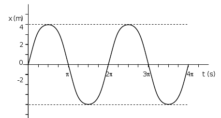
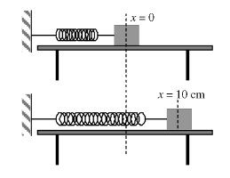
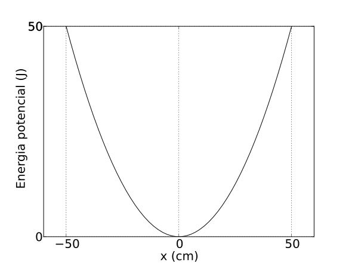
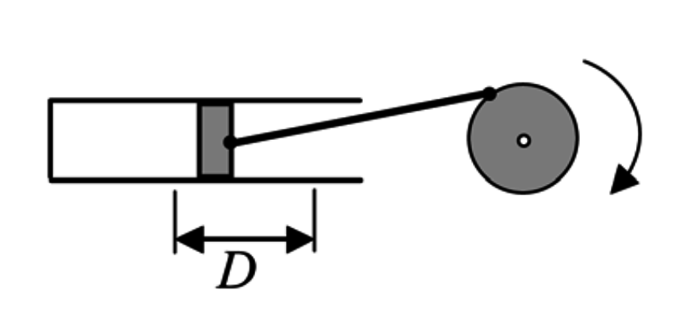
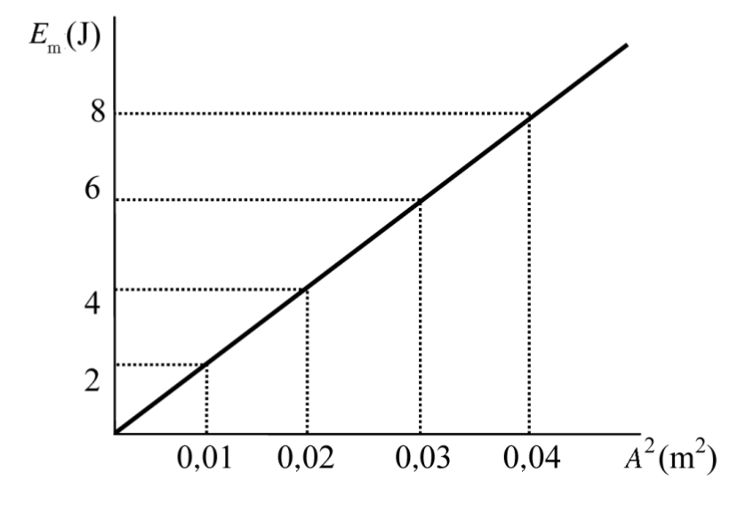
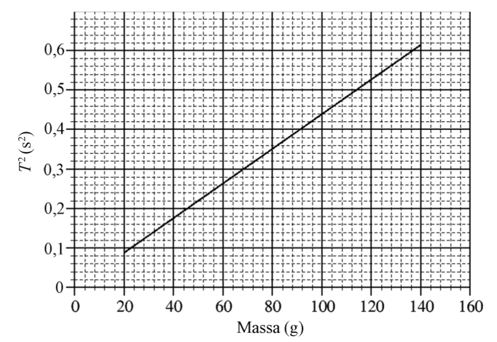
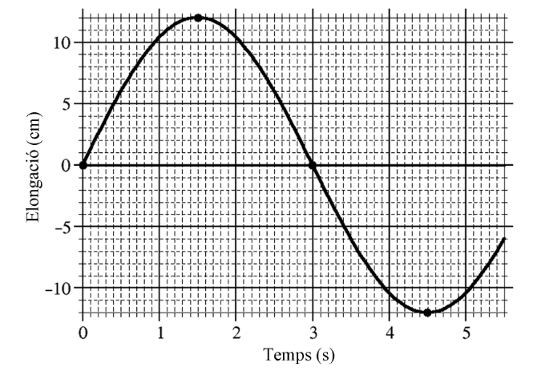

# Problemes Unitat 1: Les ones i el so

## Moviment Vibratori Harmònic Simple

1. Sigui un m.v.h.s. amb equació $x=2\sin\left(4\pi t+\frac{\pi}{4}\right)$ en què $x$ s'expressa en cm i $t$ en s. Digues quina de les següents respostes és la correcta: 

    1. La freqüència és $4\pi\,\mathrm{Hz}$, l'amplitud és 2 cm i la fase inicial és $\pi/4$.
    2. La freqüència angular és 4 rad/s, l'amplitud és 2 cm i la fase inicial és $\pi/4$.
    3. La freqüència és 2 Hz, l'amplitud és 2 cm i la fase inicial és $\pi/4$.
    4. La freqüència angular és $4\pi$, l'amplitud és 2 m i la fase inicial és $\pi/4$.
    5. La freqüència és 2 Hz, l'amplitud és 2 cm i la fase inicial $4\pi$.

2. En el m.v.h.s. d'equació $x=12\sin(2\pi t)$ amb unitats del sistema SI, calcula el valor de l'acceleració quan l'elongació val 8 m.

3. Un mòbil presenta un moviment vibratori harmònic simple amb un període de 0,5 s i una amplitud de 2 mm. 
    1. Escriviu l'equació de l'elongació com funció del temps. 
    2. Quina serà l'equació d'un mòbil que es mou amb la mateixa amplitud i freqüència, però en oposició de fase? 
    3. Quant valen la velocitat màxima i l'acceleració màxima que assoleix el mòbil? 
    4. Trobeu l'expressió dels instants de temps en què el mòbil té velocitat nul·la.

4. La velocitat d'un m.v.h.s. en funció del temps en segons és:
$$v=\frac{4\pi}{3}\cos\left(\frac{\pi}{3}t+\frac{\pi}{2}\right)\,\mathrm{m/s}$$
    1. Determina la freqüència i l'amplitud d'aquest moviment. 
    2. Expressa l'elongació del mòbil en funció del temps. 
    3. Expressa l'acceleració del móbil en funció del temps. 
    4. Digues quant val l'acceleració en l'instant que el mòbil passa pel punt d'equilibri.
    
5. La gràfica següent correspon a un moviment vibratori harmònic simple. Podeu escriure la seva equació de moviment?

6. Dues masses $m_{1}$ i $m_{2}$ tal que $m_{1}=2m_{2}$, es pengen dels extrems de dues molles iguals i es deixen oscil·lar, quina serà la relació entre els períodes $T_{1}$ i $T_{2}$ dels respectius moviments? Justifica la teva resposta. 
    1. $T_{1}=T_{2}$
    2. $T_{1}=2T_{2}$
    3. $T_{1}=0,5T_{2}$
    4. $T_{1}=1,4T_{2}$

7. Tenim dos pèndols de la mateixa massa, però la longitud d'un és el doble de la de l'altre. Aleshores, digues quines d'aquestes afirmacions és correcta (justifica la teva resposta): 
    1. Els períodes són iguals. 
    2. El període d'un és el doble de l'altre. 
    3. El període d'un és $\sqrt{2}$ vegades el de l'altre. 
    4. El període d'un és $2\pi$ vegades el de l'altre. 
    5. No es pot dir res de la relació entre períodes si no se sap el valor de la massa dels pèndols.

8. Un pèndol està composat per una massa de 10 kg i un fil d’1 m de longitud. ($\lvert g \rvert=9,8\,\mathrm{m/s^{2}}$): 
    1. Troba el seu període d’oscil·lació per a petites oscil·lacions. 
    2. Quina constant elàstica hauria de tenir una molla amb la mateixa massa penjada per tenir el mateix període d’oscil·lació? 
    3. Si es dugués el mateix pèndol a un planeta on l’acceleració de la gravetat fos la meitat de la de la Terra, com canviaria el període d’oscil·lació? Si es dugués la mateixa molla del apartat (B) al mateix planeta: canviaria el seu període en la mateixa proporció? Justifica-ho.
 
9. Una partícula descriu un moviment vibratori harmònic d’amplitud A i pulsació $\omega$. Si dupliquem alhora l’amplitud i el període del moviment, canviarà l’energia cinètica de la partícula quan passi pel punt central de l’oscil·lació? Justifiqueu la resposta. 

10. La posició d’una partícula puntual de massa 500 g que descriu un moviment vibratori harmònic ve donada, en unitats del SI, per $x=0,30\sin(20\pi t)$. Calculeu: 
    1. L’energia cinètica màxima de la partícula. 
    2. La força màxima que actua sobre ella. 

11. Sobre una taula horitzontal hi ha una massa de 380 g lligada a l’extrem d’una molla de constant recuperadora $k=15\,\mathrm{N/m}$. L’altre extrem de la molla és fix, i el fregament del conjunt és negligible. Desplacem la massa 10 cm des de la posició d’equilibri, tal com es veu a les figures següents, i la deixem anar. 

    Trobeu: 
    1. El període del moviment. 
    2. L’equació del moviment, tenint en compte que quan $t=0\,\mathrm{s}$, la molla està a l’elongació màxima positiva, com es veu a la segona figura. 
    3. L’energia cinètica de la massa quan passa per un punt situat 2 cm a la dreta de la posició d’equilibri. 
    
12. Un objecte de massa 3 kg penja d’una molla. Des de la seva posició d’equilibri l’estirem cap avall una distància de 25 cm i, des d’aquest punt i trobant-se inicialment en repòs, el deixem oscil·lar lliurement. El període d’oscil·lació és 
d’1 s. Determineu: 
    1. Les constants A, $\omega$, $\phi$, en unitats de l’SI, de l’equació $y=A\cos(\omega t+\phi)$ que descriu el moviment de l’objecte. 
    2. El valor màxim de l’acceleració de l’objecte, la seva direcció i sentit, i els punts de la trajectòria en què s’assoleix. 
    3. La constant recuperadora de la molla. 

13. Un gronxador està format per una cadira d’1,5 kg i una cadena d’1,80 m de longitud i massa negligible. Una nena de 20 kg s’hi gronxa. En el punt més alt de l’oscil·lació, la cadena forma un angle de 40° amb la vertical. Determineu: 
    1. L’acceleració del gronxador i la tensió de la cadena en el punt més alt de l’oscil·lació.
    2. La velocitat del gronxador en el punt més baix de l’oscil·lació.
    3. La tensió màxima de la cadena.
    
14. Un oscil·lador harmònic està format per una molla ideal de massa negligible i una partícula puntual unida a l’extrem de la molla, de massa $m=40\,\mathrm{g}$. El període d’oscil·lació és de 2 s.
    1. Si l’amplitud de les oscil·lacions és de 10 cm, quina velocitat màxima adquireix la massa m?
    2. Representeu en un gràfic l’acceleració de l’oscil·lador en funció del temps, i indiqueu en els eixos les escales corresponents.
    3. Quant hauria de valer la massa m perquè la freqüència de l’oscil·lador es multipliqués per dos? 

15. Una molla, situada sobre una taula horitzontal sense fregament, està fixada per un dels extrems a una paret i a l’altre extrem hi ha lligat un cos de 0,5 kg de massa. La molla no està deformada inicialment. Desplacem el cos una distància de 50 cm de la seva posició d’equilibri i el deixem moure lliurement, amb la qual cosa descriu un moviment vibratori harmònic simple. L’energia potencial del sistema en funció del desplaçament es representa amb la paràbola de la gràfica següent. 

    Determineu: 
    1. El valor de la constant recuperadora de la molla 
    2. El valor de la velocitat del cos quan té una elongació de 20 cm. 

16. L’èmbol d’una màquina de vapor té un recorregut $D=100\,\mathrm{cm}$ i comunica a l’eix una velocitat angular de 60 rpm. Si considerem que el moviment de l’èmbol descriu un moviment harmònic simple, deduïu el valor de la velocitat que té quan és a una distància de 20 cm d’un dels extrems del recorregut. 

17. Una massa $m=0,3\,\mathrm{kg}$, situada en un pla horitzontal sense fricció i unida a una molla horitzontal, descriu un moviment vibratori harmònic. L’energia cinètica màxima de la massa és 15 J. 
    1. Si sabem que entre els dos punts del recorregut en què el cos té una velocitat nul·la hi ha una distància de 50 cm, calculeu l’amplitud, la freqüència i el període del moviment i la constant elàstica de la molla. 
    2. Calculeu la posició, la velocitat i l’acceleració del cos en l’instant $t=3\,\mathrm{s}$, considerant que quan $t=0$ el cos té l’energia cinètica màxima. 

18. Una molla de constant $k=125\,\mathrm{N/m}$ té un extrem fix i, en l’altre, hi ha lligada una massa de 200 g que pot lliscar sobre una superfície horitzontal sense fregament. Desplacem inicialment la massa 12 cm de la posició d’equilibri, tot allargant la molla, i la deixem anar. Determineu: 
    1. El valors màxims de les energies cinètica i potencial assolides durant el moviment i la velocitat màxima de la massa. 
    2. El període i la freqüència del moviment harmònic resultant. Escriviu també l’equació d’aquest moviment prenent t=0
  com l’instant en què s’ha deixat anar la massa. 

19. Una massa de 0,5 kg descriu un moviment harmònic unida a l’extrem d’una molla, de massa negligible, sobre una superfície horitzontal sense fregament. En la gràfica següent es relaciona el valor de l’energia mecànica de la molla amb el quadrat de l’amplitud d’oscil·lació del moviment harmònic: 

    Calculeu: 
    1. El valor de la freqüència d’oscil·lació.
    2. El valor de la velocitat màxima de la massa quan l’amplitud d’oscil·lació del moviment és 0,141 4 m.
    
20. La massa dels astronautes a l’espai es mesura amb un aparell que es basa en el moviment vibratori harmònic. Quan l’astronauta s’hi col·loca, l’aparell inicia un moviment vibratori i en mesura la freqüència. Sabem que per a una massa de 60 kg, la freqüència d’oscil·lació és 0,678 Hz. 
    1. Calculeu la velocitat màxima d’oscil·lació d’aquesta massa si sabem que l’amplitud màxima d’oscil·lació és 20 cm. 
    2. Si la massa d’un astronauta fa oscil·lar l’aparell a una freqüència de 0,6064 Hz, calculeu la constant elàstica de la molla i la massa de l’astronauta. 

21. Duem a terme l’experiència següent: pengem d’una molla fixada en un suport per un dels seus extrems set masses diferents, i provoquem que aquestes masses facin petites oscil·lacions i realitzin un MVHS. Mesurem amb molta cura el temps que triga a fer deu oscil·lacions cadascuna de les masses i, a partir d’aquí, obtenim els períodes (T) del moviment, el quadrat dels quals es representa en la gràfica. 
    1. Calculeu la constant elàstica de la molla i expliqueu raonadament si depèn de la massa. Indiqueu el període que mesuraríem si provoquéssim les oscil·lacions amb una massa de 32,0 g. 
    2. El MVHS que descriu la massa de 100 g que hem penjat de la molla té una amplitud de 10,0 cm. Calculeu l’elongació i l’acceleració que tindrà la massa quan hauran transcorregut 3,00 s des del moment en què l’hem deixat oscil·lar a partir del punt més baix de la trajectòria. 

22. En la vida quotidiana estem sotmesos a moviments vibratoris. Per exemple, en caminar, córrer, viatjar amb algun mitjà de locomoció o estar a prop d’alguna màquina. A l’hora de dissenyar vehicles i màquines, cal fer un estudi d’aquests moviments per tal d’aconseguir que siguin confortables i segurs, ja que els efectes de les vibracions poden anar des de simples molèsties fins al dolor o la mort. Aquests estudis solen utilitzar l’acceleració màxima del moviment vibratori com a variable, per a relacionar-la amb les molèsties que percebem. Se sap que som molt sensibles a un moviment vibratori de 6,0 Hz i que, amb aquesta freqüència, a partir d’una acceleració màxima de $6,0\,\mathrm{ms^{-2}}$, les molèsties són tan fortes que ens poden arribar a alarmar. 
    1. Calculeu l’amplitud d’oscil·lació que correspon a un moviment vibratori harmònic de 6,0 Hz i una acceleració màxima de $6,0\,\mathrm{ms^{-2}}$. 
    2. Calculeu el valor de la constant elàstica d’una molla per tal que una massa de 85 kg que hi estigui enganxada oscil·li amb una freqüència de 6,0 Hz. 

23. La gràfica següent representa el moviment d’un cos de 250 g de massa que oscil·la, sense fregament, unit a una molla.
    
    1. Calculeu l’amplitud, la freqüència angular, el període i la fase inicial d’aquest moviment. 
    2. Escriviu l’equació del moviment i calculeu l’energia mecànica total del sistema.

